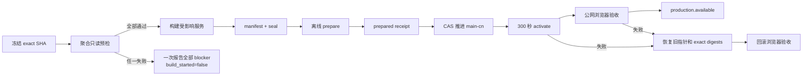
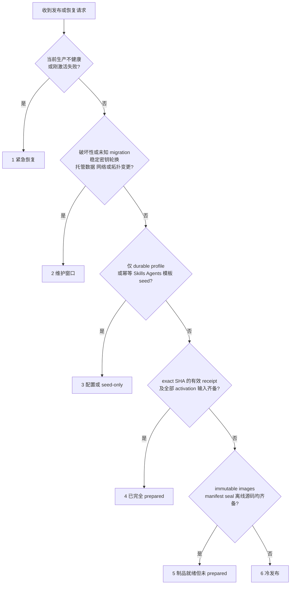

# WorkspaceX 中国生产发布 SOP

## 1. 完成定义

一次发布完成必须同时满足：目标 SHA 已在 Devapp 通过 required gates；生产 manifest、seal、prepared receipt、`main-cn`、`config.release` 和四个应用运行体身份一致；canonical provision 8/8 通过；公网浏览器关键旅程通过；失败时旧版本浏览器恢复证明通过；T0–T9 时间线写入权威事件记录。

`healthz=200`、容器 running、镜像已推送或 GitHub workflow success 都不能单独代表上线完成。

## 2. 发布状态机

## 3. Step 0：创建 attempt 并冻结身份

立即记录 `requested_at`、`attempt_id`、Devapp candidate SHA、当前生产 SHA、`origin/main` SHA 和 `origin/main-cn` SHA。发布对象一经确定不可替换；main 新提交不会改变本 attempt。

输入：

- `source_sha`：40 位 SHA，已包含在冻结时的 `origin/main`；
- `release`：唯一版本名；
- `baseline_sha`：当前生产运行体证明的 SHA；
- Devapp required gates 与浏览器验收 evidence hash；
- 当前生产 manifest、容器 digest、Nginx hash 和 `main-cn` 指针。

### 3.1 第一条命中场景决策树

每个 attempt 从上到下判断，命中第一条后停止分类。网络或 GitHub 不可达是该场景的 Plan B 分支，不创建新的场景，也不能借此降低验收标准。

所有时长从 `promotion.requested_at` 计到 `production.available_at`。在同一场景累计至少 20 个成功样本前，下表中的 P50/P95 是**规划预算**，不是统计分位数；每次仍须报告 T0–T9 实测并在样本达到门槛后重算。

| 第一条命中场景 | 适用边界 | 发布前应持续准备的证据 | 发布时只重检的漂移项 | 规划 P50 / P95 | Plan B / 回滚触发 |
|---|---|---|---|---:|---|
| 1. 紧急恢复 | 当前生产不健康，或候选刚激活失败 | baseline exact digests、旧 Nginx/Compose 指针、回滚浏览器账号与脚本 | 当前故障面、baseline artifact 可用性、回滚目标身份、release lock | 2m / 5m | 立即恢复旧指针和 exact digests；旧版浏览器未通过则升级为事故响应，不尝试下一个候选 |
| 2. 维护窗口 | 破坏性/未知 migration、12 个稳定密钥轮换、RDS/Redis/网络/拓扑变更 | 已演练 runbook、备份/恢复证明、兼容矩阵、停机公告与回退检查点 | 备份新鲜度、连接/任务 drain、审批窗口、容量与依赖健康 | 60m / 120m | 任一不可逆检查点前置条件失败即取消窗口；越过检查点后按专用恢复 runbook 执行，不走普通 300 秒 activate |
| 3. 配置或 seed-only | OCI 代码与 schema 均无变化；仅 durable profile，或可重复执行的 Skills/Agents/模板 seed | 配置 schema、幂等导入反证、导出快照、作用域/计数、浏览器目标清单 | baseline 身份、配置 diff、目标数据版本、导入锁、凭据引用有效性 | 5m / 10m | 导入或浏览器契约失败即恢复配置快照/撤销本批 seed；不得夹带代码或 schema 变化 |
| 4. 已完全 prepared 的常规 exact-SHA | 有效 receipt 已绑定 exact SHA、manifest/seal、stable secrets、baseline 与浏览器运行时 | immutable images、离线 source、receipt、候选影子验收、baseline 回滚闭包 | receipt TTL、baseline fingerprint、CAS、lock、临时 IAM、drain、外部依赖 | 3m / 5m | 漂移即停止并回到场景 5；activate/browser 失败自动恢复 baseline 并验收 |
| 5. 制品就绪但 host 未 prepared 或 receipt 失效 | images、manifest/seal、离线 source 已齐备，但主机 prepare 未完成或 receipt 失效 | ACR digest 重拉证明、OSS source hash、stable-secret continuity、工具链闭包 | 主机容量/运行时、managed-data Describe、baseline、依赖网络、receipt 输入 | 8m / 15m | GitHub 不通改走 OSS/ACR；prepare 失败保持旧服务并一次报告全部 blocker，不进入 activate |
| 6. 冷发布 | 尚需 affected 计算、构建/推送/重拉 digest、manifest/seal 和离线 prepare | Devapp required gates、完整 source closure、构建缓存、ACR/OSS 通道、baseline 闭包 | candidate/main 祖先关系、affected diff、缓存命中、registry 凭据、所有聚合预检项 | 20m / 30m | 公网依赖失败切私有 OSS/ACR 离线闭包；构建或预检失败保持生产不变，修复后从聚合预检重跑 |

`prepared` 不是人工判断：只有 receipt 未过期、全部绑定 hash 仍一致、候选影子验收已通过，且发布时的漂移重检全绿，才可进入场景 4。任何发布中新发现的高风险变更都要终止当前 attempt，重新按决策树归类，不能在原场景扩大范围。

### 3.2 预准备与发布时重检

发布前可异步完成 immutable build、ACR 重拉校验、离线 source 上传与闭包校验、manifest/seal、stable-secret continuity、bootstrap compatibility、影子 canonical 8/8、候选浏览器验收、baseline exact digest/入口快照和回滚演练。证据必须绑定 exact SHA、输入 hash、生成时间和 TTL。

正式发布时不重做未漂移的昂贵工作，只重检会随时间变化的事实：production baseline fingerprint、receipt TTL、`main-cn` CAS、release lock/孤儿、活跃任务 drain、临时 IAM 的真实 Describe、外部依赖可达性、凭据剩余寿命和候选/回滚浏览器运行时。任一重检失败都不得复用旧的“绿色”静态记录。

### 3.3 可用性边界

当前 activate 会先关闭新的 CopilotKit POST 并等待在途任务 drain，因此属于受控的短暂停写，不能宣称零中断。真正零中断需要蓝绿双栈、旧流连接排空、数据库 expand/contract 兼容、候选影子浏览器验收、原子流量切换，并保留旧栈直到回滚窗口结束；在这些能力全部落地并被故障演练证明前，对外只报告实测停写时长。

## 4. Step 1：一次性聚合预检

所有 probe 尽量并行，但只由一个控制器汇总。控制器先持有唯一 release lock，再执行 probe。任一 probe 失败都继续收集其它结果，最后一次输出全部 blocker。此阶段不构建、不推镜像、不改数据库、不切流。

必须包含以下检查：

| ID | 通过条件 | 本次事故对应的防线 |
|---|---|---|
| `source.exact_sha` | 请求 SHA、Devapp SHA、冻结 SHA 一致且在 `origin/main` | main 漂移 |
| `source.complete_artifact` | 完整离线 source artifact 可解包，commit/tree/必要 blobs 与 SHA/hash 校验通过 | partial clone 缺 promisor object |
| `source.offline_plan_b` | 不访问 GitHub 也能从私有 OSS/ACR 重建 prepare 输入 | 中国到 GitHub 中断 |
| `toolchain.package_manager` | `package.json` 声明与实际执行均为 `pnpm@9.15.0` | `ERR_PNPM_BAD_PM_VERSION` |
| `toolchain.pnpm_cli_protocol` | 对真实命令验证 `pnpm --filter ... <script> -- <args>` 的参数转发 | 多余/缺失 `--` |
| `toolchain.stdout_protocol` | 机器命令 stdout 恰好一个带前缀 JSON 记录；其它诊断只去 stderr | pnpm 噪声破坏 JSON 解析 |
| `toolchain.browser_runtime` | 依次用 `command -v chromium-browser`、`chromium`、`google-chrome` 解析绝对可执行路径，从候选 release tree 运行 `CN_BROWSER_EXECUTABLE_PATH=... node .harness/scripts/vm/cn-release-browser-smoke.mjs --preflight`，证明 Node 可从 `apps/api` workspace 解析 Playwright、系统 Chromium 可启动并打开页面 | 激活后才发现模块或浏览器运行时缺失 |
| `registry.acr_auth` | 临时 `DOCKER_CONFIG` 登录后可鉴权读取目标 registry；凭据剩余有效期覆盖发布预算 | ACR token 过期 |
| `runtime.release_lock` | 唯一锁由本 attempt 持有 | 并发发布 |
| `runtime.no_orphans` | 无旧 publish/buildx/deploy 子进程持锁或写同一目录 | StopInvocation 留孤儿 |
| `config.release_manifest` | `config.release`、manifest、seal、source SHA、release 和六镜像映射一致 | 配置/manifest 漂移 |
| `config.durable_profiles` | ASR、GitHub issue、平台超级管理员等必需引用存在；只输出布尔值 | 存量生产配置漏键 |
| `config.secret_serialization` | 每个 `file:` secret 权限/类型合规且无 CR/LF/NUL；对 API/Web/Agent/Migration/Bootstrap env map 使用生产序列化器预演 | token 尾随换行导致 secrets 阶段失败 |
| `cloud.managed_data_permissions` | ECS 身份真实完成六项 RDS/Redis Describe；临时策略带绝对到期并登记清理动作 | prepare 时有权限、activate 时权限已撤销 |
| `database.drain_read_access` | `app_diag_ro` 可只读查询 `agent_runs` 三种活跃状态并得到结构化计数 | activate drain 无权限 |
| `bootstrap.compatibility` | 目标 API 镜像、bootstrap 输入、已迁移 schema、运行账号权限、现有管理员状态和三个 Agent seed 闭包在强制只读事务中兼容 | migrate 通过后 bootstrap 才失败 |
| `secrets.stable_continuity` | 候选版逐项复用当前生产的 12 个环境级稳定密钥；稳定目录不含 revision，值只在内存比较，公开 evidence 只有计数/布尔值 | 每个 revision 的 runtime secrets 静默换钥 |
| `build.affected_services` | diff 由冻结 baseline→source 计算，列出 Web/API/Agent/Sandbox 受影响集合 | 不必要全量重建 |
| `deploy.trusted_copy` | `/usr/local/bin` 入口与目标 SHA 仓库脚本 hash 一致 | 特权脚本副本漂移 |
| `network.dependencies` | ACR、OSS、RDS、Redis 和必要国内镜像源均在预算内可达 | 构建中才发现网络阻塞 |

ACR 检查使用 ECS RAM 角色和 IMDSv2 获取短期凭据，在节点内完成，凭据不离开节点。用临时 `DOCKER_CONFIG`，trap 中 logout 并删除目录。不要把 token 放入 argv、日志、OSS 或本地项目文件。

用 `scripts/validate_preflight.py` 验证汇总结果。失败输出必须包含稳定 `code`，但不得包含密钥和原始 provider 返回。

`bootstrap.compatibility` 的执行书和 failure code 映射见 [bootstrap-compatibility.md](bootstrap-compatibility.md)。它必须在 prepare receipt 生成前运行；失败时不得进入 canonical provision，因此不会出现“migration 已写入、bootstrap 才发现不兼容”的半程状态。

`secrets.stable_continuity` 的执行书、修复与回滚见 [stable-secret-continuity.md](stable-secret-continuity.md)。它在 runtime bundle 写入前运行；任何缺失或变化都退出常规发布通道。

## 5. Step 2：构建与发布制品

优先 build once：由 candidate 工作流构建 immutable OCI digest，Devapp 和生产晋级同一 digest。过渡期若生产仍需构建，只构建 diff 判定受影响的服务；未受影响服务必须有机械证明，且 manifest 仍满足当前 exact revision 校验。

构建前记录 `build_started_at`。并行服务必须各有 watchdog、最大无进展时间、独立日志和退出状态。一个失败后先终止整个 process group，再确认没有 docker/buildx/uv/pnpm 孤儿并释放锁；禁止只停止外层远程 invocation。

每个镜像在推送后从 ACR 重新 pull，并校验 digest、平台和 revision label。manifest 生成后只允许 create-once 或 byte-identical reuse，再生成 seal。

## 6. Step 3：离线 prepare

prepare 使用完整 source artifact，不在中国生产运行 `git fetch`、partial clone 补对象或公网包安装。依赖、镜像和脚本都在准备窗口完成。

依赖安装后、生成 prepare receipt 前，必须从候选 release tree 执行浏览器运行时预检。系统浏览器只按 `chromium-browser` → `chromium` → `google-chrome` 顺序用 `command -v` 解析；结果必须是绝对、可执行路径，并通过 `CN_BROWSER_EXECUTABLE_PATH` 同时传给 prepare preflight 与实际 smoke，禁止悄悄回退到 Playwright bundled revision。预检同时证明 `playwright` 按生产 Node 模块解析规则可加载、系统 Chromium 可启动、动态库齐全且 headless 实例能打开页面；只检查包目录或 executable path 不算通过。root 运行时只给 Chromium launch 添加 `--no-sandbox`，不得改变 Node 或整个发布进程的权限参数。失败使用稳定码 `BROWSER_RUNTIME_UNAVAILABLE`，不进入激活，并在准备窗口补齐候选制品或主机运行时后从聚合预检重跑。

prepare receipt 至少绑定：source SHA、release、manifest SHA-256、六镜像 digest、迁移风险、RDS backup evidence、canonical config assertions、shadow readiness/business evidence、baseline 容器 digest、Compose file、Nginx hash、trusted entrypoint hash、创建时间和过期时间。

若有破坏性 migration，退出本通道，进入维护窗口。普通通道不得 waiver `product` 或 `unknown` 失败。

## 7. Step 4：晋级与 300 秒 activate

只有 prepared receipt 有效才以 compare-and-swap 推进 `main-cn`：old SHA 必须等于 attempt 冻结值，new SHA 必须等于 source SHA。冲突即停止，不 force 覆盖。

activate 前重新计算 baseline fingerprint；漂移即停止并重新 prepare。activate 内只允许：关闭新 Agent POST、读取 `app_diag_ro` drain 计数、等待清零、安装已准备的 ingress/runtime、执行 canonical 8/8、运行浏览器 smoke。不得构建、下载源码、安装依赖或生成配置。

canonical 8/8 的每一阶段必须有稳定失败码和耗时。`bootstrap` 在 Devapp 与候选影子环境中至少连续执行两次，第二次必须是无害收敛；生产执行仍保留幂等语义。失败诊断只能输出阶段名、稳定错误码和布尔断言，不能导出数据库行、用户内容或 provider 原文。

超过 300 秒或任一检查失败，自动恢复旧 Nginx、Compose 指针和四个 exact image IDs。回滚也必须跑同一套浏览器 smoke；只有 `recovery.browser_passed_at` 写入后才能宣布恢复。

## 8. Step 5：公网浏览器验收

在 `https://www.boardx.com.cn` 的真实浏览器、真实生产账号上验证：

1. 登录、刷新和平台管理员页面；
2. 同源 API，无 `boardx.com.cn`↔`www.boardx.com.cn` 重定向 CORS；
3. 最简单 Chat 有首 token 增量、连续 streaming、终态和刷新恢复；
4. 21 个当前 Skills、Agent 目录、工具调用；
5. 25 个当前画布模板至少逐项完成加载/预览契约，再对代表模板执行“使用”；
6. 文件上传、生成和下载，独立验证文件格式/hash；
7. Chat 与 Feedback 的 ASR；
8. Feedback→GitHub readiness/提交链；
9. 页面、API、四容器和 manifest 的 release identity 一致。

关键旅程失败就回滚，不在生产现场尝试无门控热改。

## 9. 时间线与 SLO

记录 UTC ISO-8601 和 epoch milliseconds：

- T0 `candidate.sealed_at`
- T1 `promotion.requested_at`
- T2 `promotion.approved_at`
- T3 `runner.started_at`
- T4 `prepare.completed_at`
- T5 `activation.started_at`
- T6 `runtime.ready_at`
- T7 `browser.started_at`
- T8 `production.available_at`
- T9 `production.stable_at`

默认对用户报告 `T8-T0` calendar lead time，并拆出 approval、queue、preflight、build、prepare、activate、browser 和 remediation。prepared activation 的硬预算是 300 秒；它不等于 Devapp→生产整体时间。

在有 20 个成功样本前逐次报告，不声称 P95。阶段目标：Devapp→生产 system P50≤20m、P95≤30m；稳定目标 P50≤15m、P95≤25m。若 candidate 已预构建且 prepared，目标是 5 分钟内 activate 并完成关键 browser gate。

## 10. Plan B

Plan B 必须在发布开始前就准备好：私有 OSS 上有 exact SHA 的完整 source artifact，ACR 中有当前 baseline exact digests，旧 Nginx/Compose 指针已抓取，离线脚本和固定 pnpm 可用。

出现 GitHub/公网依赖失败时，继续使用已校验的 OSS/ACR 离线闭包；出现产品 gate、CAS 冲突、baseline 漂移或数据库迁移风险时保持旧版本服务，不绕过。Plan B 不是放宽判据。

## 11. 事故回流

每个新的 failure code 在同一修复 PR 中完成四件事：根因证据、发布前 probe、破坏该条件时必红的反证测试、本表新行。不得只写文档。

| 日期 | failure code | 机械防线 |
|---|---|---|
| 2026-09-15 | `ACR_AUTH_EXPIRED` | 临时凭据 + registry 鉴权 probe + 到期预算 |
| 2026-09-15 | `RELEASE_LOCK_ORPHANED` | process-group 终止后枚举后代、确认 lock free |
| 2026-09-15 | `PARTIAL_SOURCE_OBJECT_MISSING` | 完整离线 source artifact 和 object closure 校验 |
| 2026-09-15 | `PNPM_VERSION_MISMATCH` | 从 packageManager 固定进程级 pnpm 并在预检执行 |
| 2026-09-15 | `PNPM_ARGUMENT_PROTOCOL_DRIFT` | 真实 CLI 参数转发反证测试 |
| 2026-09-15 | `MACHINE_STDOUT_CONTAMINATED` | 唯一前缀 JSON stdout 契约测试 |
| 2026-09-15 | `RELEASE_IDENTITY_DRIFT` | exact SHA 冻结 + manifest/config/CAS 一致性 |
| 2026-09-15 | `DRAIN_READ_DENIED` | `app_diag_ro` 对 active `agent_runs` 只读 probe |
| 2026-09-15 | `MANAGED_DATA_NOT_PREPARED` | ECS 角色真实调用六项 Describe；临时策略带绝对过期并在结束时清理 |
| 2026-09-15 | `SECRET_ENV_NEWLINE` | 所有 secret 的 CR/LF/NUL 扫描 + 每个服务 env map 的生产序列化预演 |
| 2026-09-15 | `BOOTSTRAP_STAGE_FAILED` | Devapp/影子环境连续两次幂等 bootstrap + 生产稳定阶段码 |
| 2026-09-15 | `BROWSER_RUNTIME_UNAVAILABLE` | prepare 与 smoke 重新解析同一系统 Chromium 路径，从候选 release tree 真实加载 Playwright 并启动该浏览器 |
| 2026-09-15 | `SESSION_TOKEN_MISSING` | 登录完成后必须从 localStorage 取得 bearer，不允许退化为 cookie-only probe |
| 2026-09-15 | `NOTIFICATIONS_HTTP_FAILED` | 使用显式 Authorization 的同源通知请求必须返回 200 |
| 2026-09-15 | `NOTIFICATIONS_CONTRACT_DRIFT` | 通知响应必须包含 notifications array 与非负整数 unreadCount |

## 12. 发布后清理

删除临时 Docker credentials、一次性 CMS key、临时 checkout、临时 pnpm wrapper 和失败 build 容器；确认 release lock free、无孤儿、生产容器 restart=0。保留不可变 manifest、receipt、事件时间线、验收证据和回滚基线。敏感文件权限保持 root 0600。
