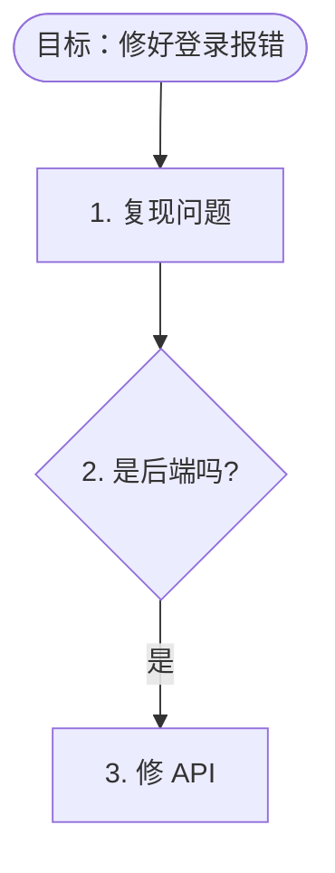

# 执行计划可视化 · 程序员使用说明

> 目标读者：**人类程序员**——给 AI 派活、看 AI 进度、review AI 的 PR、或者要改这套机制的人。
> 规则原文（状态语义、推进规则、写法约定、各环节放哪）只在
> `.harness/instructions/execution-plan-visualization.md`；本文是它的**操作手册**，
> 讲「你怎么用」，不重复定义规则。两者冲突时以规范为准。

## 0. 一分钟理解

你给 AI 一个目标，AI 在动手前先回你两样东西：

1. **我理解的目标**：目标 / 完成判据 / 不做什么 / 假设与待确认；
2. **一张 Mermaid 流程图**：每个节点是一步，颜色是这一步的进度。

| 颜色 | 状态 id | 你该怎么读 |
|---|---|---|
| 灰 | `todo` | 还没碰 |
| 黄 | `doing` | AI 此刻正在做 |
| 绿 | `done` | **写完了，但没验证**——不是「好了」 |
| 紫 | `tested` | 验证命令跑过且退出 0，图里写着证据 |
| 红 | `blocked` | 卡住了，图里写着卡在哪、需要谁做什么 |

之后每推进一步 AI 会更新颜色。**你只需要盯两件事：有没有红、是不是全紫。**

## 1. 你什么都不用装

| 你用的 AI | 怎么启用 |
|---|---|
| 本仓的 Claude Code | 自动。`execution-plan` skill 在你布置目标时触发（`.claude/skills/execution-plan` 软链到 `.agents/skills/execution-plan`）。没触发就说「先给我执行计划」或输入 `/execution-plan` |
| 本仓的其他 agent（Codex 等） | 根 `AGENTS.md` 开工流程第 4 步要求它画；没画就提醒它读 `.harness/instructions/execution-plan-visualization.md` |
| 仓外任何 AI（ChatGPT / Gemini / 网页版 Claude…） | 复制规范末尾「通用提示词」代码块，贴进系统提示 / 自定义指令 / 第一条消息 |

图在哪能看：GitHub issue / PR / Markdown 文件原生渲染；VS Code 装 Mermaid 预览插件；
或粘到 <https://mermaid.live>。

## 2. 三种日常场景

### 2.1 对话里交办一件事

```
你：把登录页的报错修一下
AI：【我理解的目标】……【执行计划】（一张图，G 与 S1 黄色）
    有会改变计划的疑问会在这里先问你
你：确认 / 纠正理解
AI：……每到一个里程碑回一张新图……最后给最终着色图 + 一行汇总
```

**最值钱的时刻是第一张图**：理解偏了在这里纠正，比做完再返工便宜得多。
看「不做什么」那一行——范围蔓延最常从这里漏出来。

### 2.2 sprint feature（走 harness 正规流程）

计划是入库文件，路径固定：

```
phases/<phase>/sprints/<sprint>/plans/<feature-id>.plan.md
```

AI 开工时从 `.harness/templates/execution-plan.template.md` 复制，同时把图贴到该 feature
的 issue 评论里。你在 issue 里就能看到最新进度，不用 clone。

### 2.3 直接交办的改动（ad-hoc PR）

不要求入库文件：计划贴在对应的轻量 issue 评论里，**PR 描述里附最终着色图**
（见 `.harness/instructions/ad-hoc-fix-pr-sop.md` 第 5 条）。

## 3. 读图与介入

| 你看到 | 含义 | 你该做 |
|---|---|---|
| 有红色节点 | AI 卡住了 | 读图里 `%% blocked <节点>: …` 那行，按它说的做（给决策 / 给权限 / 给依赖） |
| 很久都是同一个黄 | 可能在原地打转 | 问一句「S3 卡在哪？」——该红却没红，本身就是问题 |
| 一片绿、没有紫 | 写完了没验证 | **不能算完成**，让它跑验证 |
| 全紫 | 每步都有证据 | 抽查几条 `%% evidence` 能否复现，再合 PR |
| 节点被标「（作废）」 | 计划中途变了 | 看进度日志里写的原因是否合理 |

Review PR 时：**PR 声称完成但计划里还有灰 / 黄 / 红 ⇒ 按「证据不足」退回**。
反过来，全紫不等于 feature `passing`——`passing` 只有 `pnpm harness verify` 能给。

## 4. 命令行参考

脚本：`.harness/scripts/execution-plan.mjs`（纯 Node，无依赖，不需要 `pnpm install`）。

```bash
S=.harness/scripts/execution-plan.mjs
P=phases/<phase>/sprints/<sprint>/plans/F03.plan.md

node $S set $P S2 doing                         # 灰 → 黄
node $S set $P S2 done                          # 黄 → 绿
node $S set $P S3 blocked --note "等 #1234 选 A/B"                     # 红，--note 写原因
node $S set $P S4 tested  --note "pnpm harness verify --sprint 05/02 --feature F03 → evidence/F03.verify.log"  # 紫，--note 写证据
node $S summary $P                              # 一行汇总 + 红色原因，贴 issue / progress.md 用
node $S check $P                                # 校验单个文件
node $S check                                   # 校验全部默认位置（= pnpm run lint:execution-plan）
```

| 子命令 | 行为 | 退出码 |
|---|---|---|
| `set <file> <node> <status> [--note "…"]` | 只改该节点的那一行 `class`；`--note` 只能配 `blocked` / `tested`，写入或替换对应 `%%` 注释；**离开** blocked / tested 时自动删掉旧注释 | 改完后计划合规 0，否则 1（照样写盘，并打印缺什么） |
| `summary <file>` | 例：`共 7 步：灰·未开始 0 / 黄·已开始 1 / 绿·已完成 1 / 紫·已测试 5 / 红·被堵塞 0` | 计划合规 0，否则 1 |
| `check [file…]` | 不带参数时扫描 skill 入口、规范、模板、`phases/**/*.plan.md` | 全部合规 0，否则 1 |

路径可以是相对仓库根的路径，也可以是绝对路径。

## 5. 计划文件格式（手写或修改时）

最小骨架（五行 `classDef` **从模板原样复制**，这里省略）：

````markdown

````

要点：

- 一份计划**只有一个** mermaid 块，首行 `flowchart TD`（或 `LR`）。
- 节点必须带形状括号和文字：`S1[…]`、`G([…])`、`D1{…}`。只在连线里出现的裸标识符不算节点。
- **每个节点恰好一行** `class <节点> <状态>`；不要用 `S1:::done` 简写。
- 颜色**不要改**：lint 会逐字比对调色板。

## 6. CI 会拦什么、怎么修

`pnpm run lint:execution-plan` 在 `harness-verify.yml` 与 `verify:harness:raw` 里跑。典型报错：

| 报错片段 | 原因 | 修法 |
|---|---|---|
| `必须有且只有一个 ```mermaid 块` | 没有图或放了两张 | 合并成一张 |
| `必须是流程图` | 用了 sequenceDiagram 等 | 改成 `flowchart TD` |
| `缺少状态 X 的 classDef` / `颜色与调色板不一致` | classDef 缺行或被改 | 从模板重新复制五行 |
| `节点「S5」…没有状态` | 新加的节点忘了着色 | `node $S set <file> S5 todo` |
| `有多条状态` | 同一节点写了两行 class | 删掉多余的，或直接用 `set` |
| `未知状态「wip」` | 状态 id 拼错 | 只有 `todo/doing/done/tested/blocked` |
| `标了 blocked（红）却没写原因` | 缺 `%% blocked` | `set … blocked --note "…"` |
| `标了 tested（紫）却没有证据` | 缺 `%% evidence` | 先真的跑验证，再 `set … tested --note "…"` |
| `不许用 节点:::状态 简写` | 用了 `:::` | 改成 `class` 行 |
| `skill 入口…复述了调色板` | 有人把色值抄进了 SKILL.md | 删掉，改成引用规范 |

**lint 管不到的**（review 时靠人）：AI 在对话 / issue 评论里有没有画图；`%% evidence` 写的
证据是不是真的。

## 7. 要改这套机制时

| 你想… | 改哪里 | 还要做 |
|---|---|---|
| 改颜色 | `execution-plan.mjs` 的 `PLAN_STATUSES`（**唯一**定义处） | 同步模板与规范「通用提示词」里的 classDef 行；现有 `*.plan.md` 用 `check` 找出后逐个更新；跑 `pnpm run lint:execution-plan` |
| 加 / 改状态 | 同上 + 规范的状态表 | 同上；`execution-plan.test.ts` 里的计数断言要跟着改 |
| 改规则（如粒度、推进规则） | 只改规范 `execution-plan-visualization.md` | skill 与本文只引用，一般不用动 |
| 加新的校验 | `checkPlan()`（纯函数） | 在 `execution-plan.test.ts` 先写**会红**的反证用例，再写实现 |

代码结构（全部是纯函数 + 一个 `run()` 入口，便于单测）：

| 函数 | 作用 |
|---|---|
| `extractMermaidBlocks` | 取出 ```mermaid 块 |
| `parseFlowchart` | 解析节点、`class` 行、`classDef`、`%% blocked/evidence` 注释 |
| `checkPlan` / `checkClassDefs` / `checkSkillEntry` | 各项判定，返回 `failures[]` |
| `setNodeStatus` | 改状态并维护注释（合并写法 `class A,B x` 会被拆成一节点一行） |
| `summarize` | 生成汇总文本 |

测试：

```bash
pnpm exec vitest run --config .harness/vitest.config.ts --dir .harness execution-plan
```

## 8. FAQ

**问：小改动也要画图吗？** 要，但可以很小。只有纯问答（没有执行步骤）不用画。
粒度建议 5–12 个节点（见规范）。

**问：计划中途变了怎么办？** 加节点（灰），在进度日志写一句原因；已完成的节点不删，
作废的改标签为「（作废）…」。

**问：为什么要把「绿」和「紫」分开？** AI 最常见的虚报就是把「写完了」说成「好了」。
分开之后，没验证的步骤在图上一眼可见。

**问：计划文件会不会和 `feature_list.json` 冲突？** 不会。`feature_list.json` 是状态权威，
计划图只是它的可视化投影；计划图不参与 `passing` 判定。
