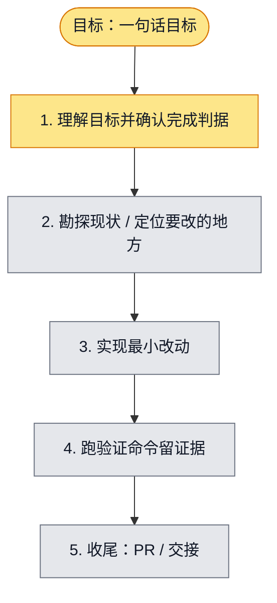

# 执行计划 — {{GOAL_TITLE}}

> 规范：`.harness/instructions/execution-plan-visualization.md`。
> 改状态用 `node .harness/scripts/execution-plan.mjs set <本文件> <节点> <状态>`，
> 改完 `check` 一遍；不要手改 classDef 颜色。

## 我理解的目标
- **目标**：<一句话复述人类要的结果，用人类能验收的话说>
- **完成判据**：<怎样算做完——可执行的验证命令 / 可观察的行为>
- **不做什么**：<范围边界，防止顺手扩张>
- **假设与待确认**：<理解里拿不准的点；有会改变计划的疑问先问人>

## 执行计划

图例：⬜ 灰=未开始 · 🟨 黄=已开始 · 🟩 绿=已完成 · 🟪 紫=已测试（有证据） · 🟥 红=被堵塞

## 进度日志（append-only，每次改颜色追加一行）
| 时间 | 节点 | 状态变化 | 依据（命令 / 证据 / 堵塞原因） |
|---|---|---|---|
| {{CREATED_AT}} | G, S1 | todo → doing | 接到目标，开始理解 |
