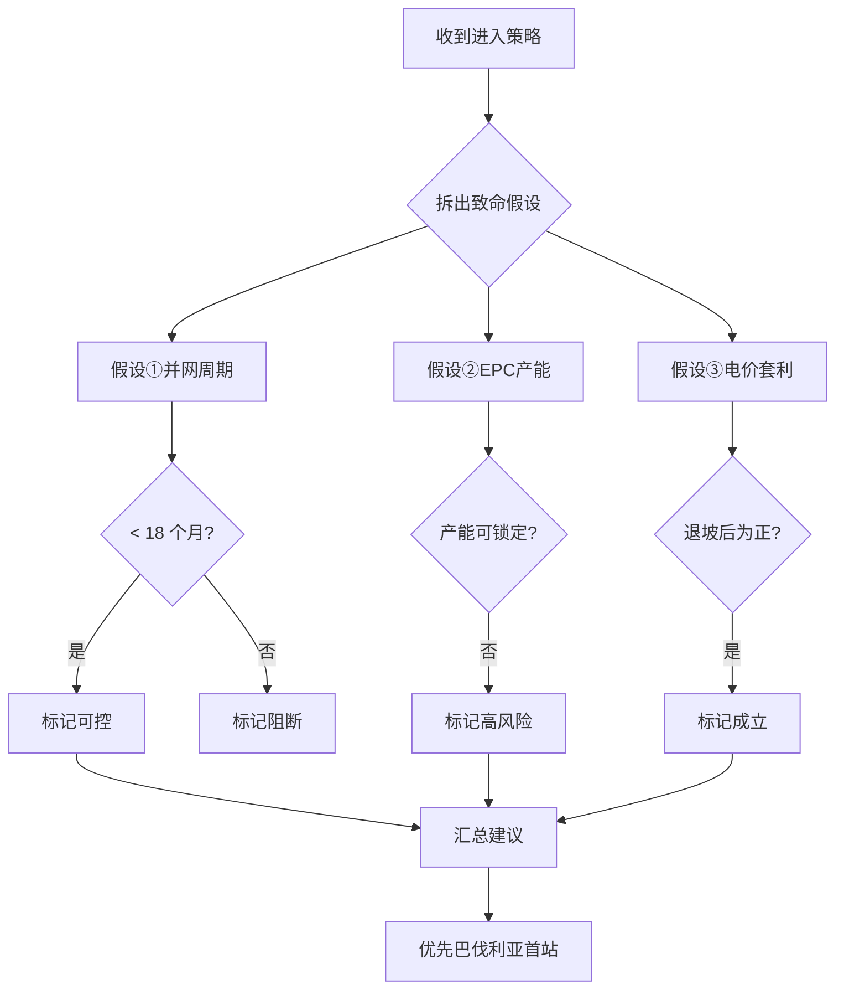

## 假设核查的决策路径

下面这张图是我核查三条致命假设时走的判定流程，供董事会评审时对齐口径：

```mermaid
flowchart TD
  A[收到进入策略] --> B{拆出致命假设}
  B --> C1[假设①并网周期]
  B --> C2[假设②EPC产能]
  B --> C3[假设③电价套利]
  C1 --> D1{< 18 个月?}
  D1 -- 是 --> E1[标记可控]
  D1 -- 否 --> F1[标记阻断]
  C2 --> D2{产能可锁定?}
  D2 -- 否 --> F2[标记高风险]
  C3 --> D3{退坡后为正?}
  D3 -- 是 --> E3[标记成立]
  E1 --> G[汇总建议]
  F2 --> G
  E3 --> G
  G --> H[优先巴伐利亚首站]
```

如需改判定阈值，我可以就地重跑。
