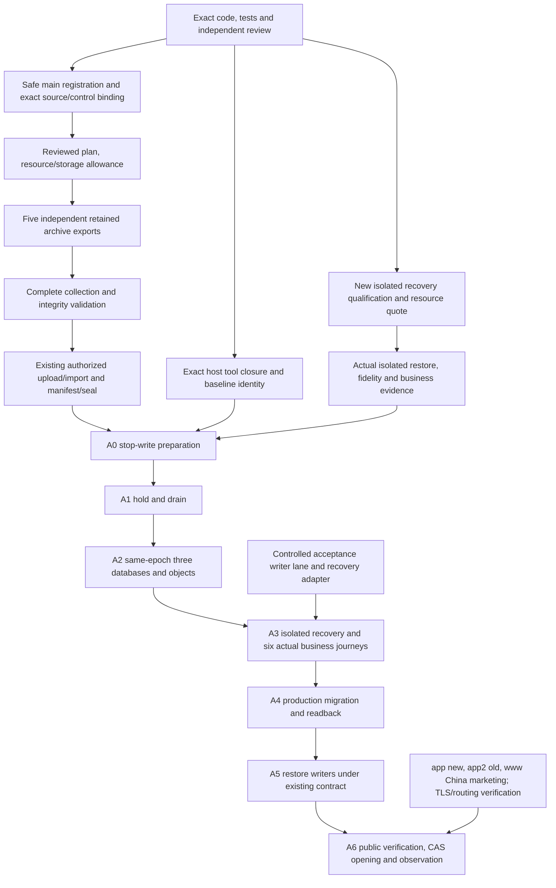

# Exact-source archive export and activation dependencies

This corrects the execution plan; it is not a production acceptance receipt.
`cloud-build-only.yml` remains a disposable size/disk measurement lane. Its JSON
and image IDs are not retained Docker archives and cannot enter the importer.
Measurement is optional; it does not authorize a larger runner or weaken budgets.

`export-cn-image-archives.yml` reuses the existing formal producer. A manual main
run freezes one reviewed plan and its raw SHA256. Five standard `ubuntu-24.04`
jobs independently retain one normalized archive and a hash-bound fragment each;
collection rechecks all five archives, identities, the whole-set budget and the
original expiry, then emits the existing `cn-image-archive-set-v1` contract.
The producer remains main-ancestry bound, credential-free and non-production.
All `ready`, `prepared` and `productionActivated` flags remain false.

Each service reserves `4 * maxArchiveBytes + storageMarginBytes`; collection
reserves `maxTotalBytes + storageMarginBytes` before archive download. These are
fail-closed admission bounds, not measured peak usage or guaranteed runner space.
The accepted whole-set budget does not shrink to a per-service measurement cap.
Over-budget, insufficient space/inodes, mixed attempts, missing services,
changed bytes, unsafe paths and expired fragments fail without an accepted set.
A retry reruns the entire workflow: artifacts are scoped to run ID and attempt.
Collection cannot refresh an old fragment's one-hour TTL.

The workflow retains five service artifacts plus small plan/collection metadata;
it does not upload a second copy of the five payloads. Public standard runner
compute is free, but archive storage/download allowance must be established
before dispatch. This PR neither purchases resources nor dispatches a build.

## Consume the retained collection with the existing importer

Download the five **same run and attempt** service artifacts into a private
absolute directory with exactly the children `api`, `web`, `agent`, `sandbox`,
`postgres`. Each child contains `<service>.tar`, `archive-fragment.json` and
`build-plan.json`. Keep the immutable input plan and its recorded raw SHA256.
Download published collection metadata to a separate comparison directory.
Do not mix attempts or flatten the fragments by overwriting their metadata.

Use the exact clean control checkout recorded by the plan, with existing Python:

```bash
python3 -I -B scripts/export-cn-image-archives.py \
  --plan "$reviewed_plan" --plan-sha256 "$reviewed_raw_plan_sha256" \
  --collect "$private_fragments" --output "$new_private_flat_bundle"
```

The output must not exist and must share a filesystem with the fragments. After
full validation the collector renames, rather than copies, the five archives
into the standard flat layout: `api.tar`, `web.tar`, `agent.tar`, `sandbox.tar`,
`postgres.tar`, `build-plan.json`, `archive-set.json`. Their original inode/content
identity is preserved. Metadata/write/move failure attempts to restore moved archives and
remove only the new output; filesystem cleanup failure retains the primary error
and requires operator reconciliation. Compare the reproduced metadata bytes/hash to the
published collection before handing the flat bundle to the existing
`cn_archive_oss.Transfer` pinned-file snapshot/authorized upload/import flow. This command itself
does not upload, authenticate, publish a registry tag, migrate or activate.

## Shortest dependency order



Recovery, host remediation and TLS/routing are switching gates, not blanket
prerequisites for offline archive export. Code/CI can progress now. Default-main
workflow registration requires a safe integration step; branch source cannot
make the dispatcher registered. Source ancestry must be rechecked against actual
main after integration; a squash merge does not make the pre-merge PR HEAD an
ancestor. Do not silently substitute the merge SHA for the frozen candidate. This task does not merge, mark Ready, enable
workflows or dispatch. Main integration can invoke existing DevApp migrations
and restarts; its side effects and independent authorization must be addressed
before that integration step.

Current production metadata proves only an old `a1cb...-newdb-20261006` API
container is running. Installed tools bind old `8d0`; deploy differs from the
application candidate `fdfed850`. Old recovery-named containers and untyped
activation/preview files are not restore proof. Stop directory guessing: use a
new exact isolation identity and the existing rehearsal executor. It currently
requires a separate fresh RDS target, encrypted three-database backup/receipt
binding, protected decryption material, provider/peer/TLS identity and an exact
cleanup capability. It does not create that target; old failed clone attempts
are not automatically retried. Resource quote, storage/traffic cap and ownership
must be fixed before any paid target or restore mutation. Current new-spend
cap is zero. Restoration writes only the isolated target, records fidelity and
cleanup results, and reconciles uncertain outcomes instead of blind retries.

The existing maintenance contract rejects
`MAINTENANCE_ACCEPTANCE_WRITER_LANE_NOT_IMPLEMENTED`. That controlled writer lane
and the production recovery adapter remain real switching work; an archive set,
fixture, health GET or isolated restore cannot bypass them. Preserve all seven
business acceptance steps and their same-epoch data/rollback requirements.
