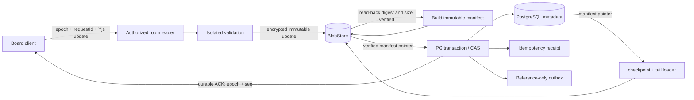

# ADR-114: Board content bytes live in file storage

- 状态: Accepted（2026-09-24，人类明确决定「Board 内容数据保存在文件系统，元数据保存在 PostgreSQL」）
- 适用层：项目实现（专属）
- 日期: 2026-09-24
- 关联：issues #4039、#4040；ADR-112（Yjs 只承载协作文档内容，不替代关系存储）

## 背景

Board 的便利贴、文字、形状、连线、自由绘图和 Yjs 删除集都属于同一个协作文档。当前实现把
完整 `snapshot` 和每次 `update` 作为 `bytea` 写入 `whiteboard_documents` /
`whiteboard_updates`：一次接受写既追加 update，又重写完整 snapshot。随着持续编辑，这会同时放大
PostgreSQL 主表/TOAST、WAL、备份和复制流量；update 也不会因为 Yjs 合并而自动回收墓碑。

Board 仍需要关系数据库擅长的事务语义：租户和 ACL、单调 epoch/seq、fencing、幂等接纳、工作流
状态、审计与 outbox。内容字节则需要便宜、可分层、可独立备份的持久文件存储。Hosted 与自托管
必须使用同一应用端口；不能让业务层分别理解 S3、R2、OSS、MinIO 或本机路径。

约束如下：

- durable ACK 之后，进程崩溃、重试或领导者切换不能丢已接纳更新；旧 epoch 不能继续写。
- 现有 PG `bytea` Board 必须在线、无损迁移，并在删掉旧字节前保留可验证的回滚窗口。
- 内容跨租户不可读；备份恢复、删除、legal hold 和孤儿回收必须覆盖 PG 与 Blob 两个平面。
- 所有容量、时间窗、重试和 GC 阈值只在运行时配置契约中定义。本文只规定不变量，不复制数值。
- 容器临时盘不构成持久存储；多副本部署也不能假设各实例的本地目录彼此可见。

## 决策

### 1. 存储所有权

**Board/Yjs 内容字节的唯一事实源是 `BlobStore`；PostgreSQL 是内容寻址和控制状态的事实源。**

内容字节包括 Yjs baseline/checkpoint、增量 update segment、导入原包、导出包，以及将来由 Board
直接拥有的附件。它们以不可变 blob 写入。PostgreSQL 不再永久保存这些内容的 `bytea`、large
object 或 base64 副本，只保存：

- Board 资源元数据、租户、ACL、删除/legal-hold 状态；
- 当前 `epoch`、`headSeq`、checkpoint 水位、fencing token 和 schema/protocol version；
- 当前 content manifest 的 blob key、digest、size、加密 key version 和生成状态；
- request/update 幂等 receipt、状态机、审计及只含引用的 transactional outbox。

PG 逻辑 schema 如下；实现可以在兼容迁移中调整物理表名，但不能删减租户键、CAS 水位或完整性
字段，也不能把内容字节塞回这些列：

| 关系 | 主键/唯一键 | 允许保存的权威字段 |
|---|---|---|
| `whiteboard_content_heads` | `(org_id, board_id)` | `epoch`、`head_seq`、`checkpoint_seq`、`manifest_key`、`manifest_digest`、`manifest_size_bytes`、`tenant_key_version`、`schema_version`、`protocol_version`、`fencing_token`、`content_state`、时间戳 |
| `whiteboard_content_receipts` | `(org_id, board_id, epoch, actor_id, update_id)` | `request_digest`、`accepted_seq`、`manifest_digest`、终态/错误码、时间戳；不保存 update body |
| `whiteboard_content_migrations` | `(org_id, board_id)` | 迁移状态、source/candidate epoch 和 seq 水位、candidate manifest 指针/digest/size、job id、错误码、时间戳 |
| `whiteboard_content_outbox` | `(org_id, event_id)` | board、epoch/seq、manifest pointer/digest、事件类型、投递状态与 attempt；不保存 Yjs body |
| `whiteboard_blob_retention_roots` | `(org_id, board_id, root_kind, reference_id)` | backup/legal-hold 的 manifest pointer/digest/size/key version、保留与释放时间；不保存内容字节 |
| `whiteboard_blob_gc_runs` | `(org_id, board_id)` | 最近 sweep 的开始/完成时间、耗时、计数器与有界分页游标；不保存内容字节 |

以上关系全部受 tenant RLS/tenant-scoped repository 约束；Board 资源和成员 ACL 继续由既有
`whiteboards` / `whiteboard_members` 关系管理，不在这里复制一份授权模型。

搜索索引、缩略图和对象投影均为可重建派生物，不得成为第三个内容写入口。Awareness 仍是易失
状态，不进入 PG 或 Blob。

Hosted 的 `BlobStore` 适配器使用持久共享对象存储（S3、R2 或阿里云 OSS）。自托管复用同一端口，
可使用 MinIO，或使用管理员明确挂载、备份的持久 filesystem。filesystem 适配器必须执行
put-if-absent、写临时文件、fsync 与原子 rename；多副本环境只有在共享文件系统能满足同一耐久和
一致性契约时才可启用。生产配置若解析到容器临时目录，启动就失败，不能静默降级。

### 2. BlobStore 与 manifest 契约

领域层依赖窄端口，不依赖云 SDK：

```ts
interface BoardBlobStore {
  putImmutable(input: {
    tenantId: string;
    key: string;
    ciphertext: Uint8Array;
    cipherDigest: string;
    sizeBytes: number;
    contentType: "application/octet-stream";
  }): Promise<"created" | "already-present-same-content">;
  getVerified(input: {
    tenantId: string;
    key: string;
    expectedCipherDigest: string;
    expectedSizeBytes: number;
    expectedContentType: "application/octet-stream";
  }): Promise<Uint8Array>;
  head(input: { tenantId: string; key: string }): Promise<{
    cipherDigest: string;
    sizeBytes: number;
    contentType: "application/octet-stream";
  } | null>;
}
```

物理回收走单独的 `BoardBlobPurgeStore`：按 `tenantId + boardId + createdBefore` 有界分页列举候选，
并用 key、digest、size、MIME、创建时间组成不可变水位执行条件删除。普通写路径只注入
`BoardBlobStore`。GC 在持有与写路径相同的 Board 行锁期间遍历当前 head、迁移 candidate 与完整
`parentManifest` 历史，再次比对候选后才调用 purge；旧 manifest 若只有 parent digest 而没有完整
指针则失败关闭，不猜测历史可达性。

普通 Board 写路径没有 delete 权限。删除只能由单独的 retention/physical-purge capability 执行，且
执行前再次读取 legal hold。key 是租户命名空间内不可变的内容地址；同 key 不同内容必须硬失败，
不能覆盖。实现可以复用现有对象存储基础设施，但 Board 端口保留 tenant、校验和与密文语义，避免
把通用 `ObjectStore` 的较弱假设误当成完整契约。

每个 manifest 本身也是加密、不可变、可校验的 blob，逻辑内容为：

```text
manifestVersion, boardId, epoch, headSeq, schemaVersion
checkpoint: { key, plainDigest, cipherDigest, sizeBytes, throughSeq }
tail[]:     { key, plainDigest, cipherDigest, sizeBytes, fromSeq, throughSeq }
parentManifestDigest, parentManifest: { key, plainDigest, cipherDigest, sizeBytes, tenantKeyVersion },
tenantKeyVersion, createdAt
```

PG head 只指向一个已 read-after-write 校验成功的 manifest。manifest 中的 seq 范围必须连续、不重叠，
checkpoint + tail 必须恰好重建 `headSeq`。内容 digest 用于端到端完整性，cipher digest 用于读取对象
时先验校验；两者的算法和格式由版本化契约单一定义，不能散落在适配器中。



写入顺序固定为“blob 先落地并校验，PG 再原子发布指针”。PG 事务以 board head + fencing token 做
CAS，同时写 head、幂等 receipt、审计/outbox 引用。PG 提交失败会留下不可达 blob，由孤儿 GC
处理；blob 写失败则不能推进 PG 或发送 ACK。相同 requestId 只返回原 receipt；相同内容地址重复
put 必须幂等。任何 outbox payload 都只携带 board/epoch/seq/manifest 引用，不携带 Yjs 字节。

### 3. checkpoint、epoch 与重连

读取权威文档时先加载 manifest 指向的 checkpoint，再按序应用 tail；任一对象缺失、digest/size
错误、解密失败或 seq 不连续都使该版本不可发布，并触发完整性告警。manifest 及其引用在切换前
全部验证，不允许“先推进 head，稍后再上传”。

压缩 worker 在持有 board leader lease/fencing token 时，从当前 manifest 重建干净 Y.Doc，生成新
checkpoint，再用 PG CAS 发布新 epoch 的 manifest。并发到达的写要么在旧 epoch 的已封闭水位内，
要么进入新 epoch，不得落在两者之间。客户端携带旧 epoch 提交时稳定收到 `STALE_EPOCH`，丢弃被
污染的权威副本，从新 checkpoint 全量同步，再按 requestId 重放尚未 ACK 的本地意图。

```mermaid
stateDiagram-v2
  [*] --> Active
  Active --> BuildingCheckpoint: retention policy requests compaction
  BuildingCheckpoint --> Active: upload / rebuild failed
  BuildingCheckpoint --> Verifying: immutable checkpoint and manifest uploaded
  Verifying --> Active: digest / semantic / continuity check failed
  Verifying --> Switching: all referenced blobs verified
  Switching --> Active: PG CAS lost; new blobs become GC candidates
  Switching --> NewEpoch: PG head CAS commits
  NewEpoch --> Active: clients resync; old epoch becomes retained
  NewEpoch --> Held: legal hold applies
  Held --> NewEpoch: hold released
```



触发压缩、tail 上限、旧 epoch 保留期和重试策略只从 `BoardContentRetentionPolicy` 配置单一事实源
读取；ADR、Issue 和适配器不得各复制一组数字。

### 4. 现有 PG bytea 的无损迁移

迁移按 Board 独立推进，状态记录在 PG。正常协作不依赖一次全库停机：

```mermaid
stateDiagram-v2
  [*] --> LegacyPg
  LegacyPg --> DualWrite: migration enrolled
  DualWrite --> LegacyPg: blob path unhealthy / operator rollback
  DualWrite --> Verifying: outbox caught up to fenced watermark
  Verifying --> DualWrite: byte or Yjs semantic mismatch
  Verifying --> BlobPrimary: manifest CAS at verified watermark
  BlobPrimary --> DualWrite: rollback window; PG mirror retained
  BlobPrimary --> Retired: rollback window passed and backup verified
  Retired --> [*]: PG bytea columns removed in later schema migration
```



1. **盘点与围栏**：在 board 行锁/leader fencing 下读取现有 snapshot、按 `(epoch, seq)` 排序的
   updates 和迁移水位；先拒绝重复、缺口或跨租户记录。
2. **建档**：从 snapshot + tail 重建 Y.Doc，上传租户加密的 checkpoint/update blobs 与 manifest，
   read-after-write 校验后记录候选指针。该步骤不改变读主路径。
3. **双写追赶**：Legacy PG 仍为读取事实源；新写继续走原 bytea 事务，并由同事务 outbox 可靠地把
   已接纳 seq 投影到 blob。worker 崩溃、重复任务和乱序领取都以 board/epoch/seq/requestId 幂等恢复。
4. **等价验证**：追到 fenced watermark 后，对 PG 文档与 checkpoint + tail 做双向 Yjs state-vector
   diff；双方 diff 均为空才算语义相等。另验证 manifest 连续性、每个 blob 的 digest/size/tenant
   key。仅比较序列化字节 hash 不足以证明 Yjs 语义相等。
5. **原子切换**：短暂围栏该 Board 的新提交，在一个 PG 事务中 CAS 发布 manifest pointer、epoch/head
   和迁移状态；解除围栏后 Blob 成为唯一读取事实源，旧客户端按 `STALE_EPOCH` 重连。
6. **回滚与退役**：回滚窗口内临时维护 PG mirror；若 Blob 主路径出现问题，围栏后验证 mirror
   watermark，再 CAS 回 `DualWrite`。窗口通过且 PG/Blob 联合备份恢复演练成功后，先停止 mirror，
   再分批清空旧 bytea，最后用独立 schema migration 删除列。进入 `Retired` 后不承诺把内容重新塞回
   PG；运行时回滚应切换 BlobStore 适配器或从受验证备份恢复。

任何状态转换都以 request/job id 幂等。未知、失败或超时状态默认保留旧事实源和 blob，不做破坏性
清理。迁移报告记录数量、seq 水位和 digest，不记录内容明文。

### 5. 加密、隔离、备份与生命周期

- 每个租户使用独立 data-encryption key；密钥由 KMS/密钥服务包封和轮换，PG/manifest 只保存 key
  version，不保存明文 key。blob key 和内容地址做租户域隔离，禁止跨租户全局去重造成存在性侧信道。
- 服务端先用认证主体和 PG ACL 授权，再解析 manifest；知道 blob key 不能换取下载权限。对象存储
  凭证按部署/租户前缀最小授权，Hosted bucket 开启版本化、静态加密和必要的 object lock。
- 备份是一个联合恢复点：PG PITR/元数据快照记录恢复水位，对象存储保留该水位可达的不可变对象与
  manifest。恢复演练必须从 manifest 重建 Y.Doc，验证 digest/size、epoch/seq 和 ACL，而不只验证
  “对象存在”。RPO/RTO 和保留数值仍由运维配置单一事实源定义。
- 逻辑删除先把 Board 置为 tombstoned；legal hold 会冻结所有 checkpoint、tail、import/export 和附件
  的物理删除。解除 hold 后仍按 retention 状态机处理，普通请求不能绕过。
- orphan GC 只删除“未被任一有效 PG head、保留 epoch、未完成迁移/job、备份集合或 legal hold
  引用”的 blob。采用 mark-and-sweep：先生成带水位的候选清单，经过配置的安全窗后再次标记确认，
  再由专用 purge capability 删除。PG 不可用、引用扫描不完整或租户不确定时一律不删。

生产运行入口是受限的 `pnpm --filter api board:gc-content -- --tenant-id … --board-id …`。它只接受一个
租户和一个 Board，不接受调用方覆盖删除水位或 batch；安全窗、最小执行间隔和 batch 分别由
`WORKSPACEX_BOARD_BLOB_GC_GRACE_MS`、`WORKSPACEX_BOARD_BLOB_GC_MIN_INTERVAL_MS`、
`WORKSPACEX_BOARD_BLOB_GC_BATCH_SIZE` 的同一运行时策略解析。每个 Board 由 PG transaction advisory
lease 串行执行，重启从 `whiteboard_blob_gc_runs.next_cursor` 继续，并把 examined/deleted/retained/
changed 与耗时写回该表和结构化 CLI 输出。filesystem 适配器在发布 blob 前持久化固定长度候选索引，
分页按字节游标最多扫描配置 batch 的固定倍数，不递归收集或排序整个 Board 目录。

## 后果

### 正面

- Board 的增长从 PostgreSQL/TOAST/WAL 移到更适合不可变大对象的存储；PG 备份和复制压力不再随
  每次协作字节线性膨胀。
- Hosted 与自托管共享领域端口和契约测试；云对象存储、MinIO、持久 filesystem 可以替换，而 Yjs
  协作和 API 不感知供应商。
- 不可变内容、digest、manifest 和 PG CAS 给出可审计的 durable ACK、失败恢复和迁移边界；PG 仍
  保留 ACL、幂等和状态机所需的事务能力。
- checkpoint + bounded tail 让加载成本有界，并给离线客户端明确的 epoch 重同步协议。

### 负面

- 一次写跨 Blob 与 PG，无法依赖单库事务；必须维护“先写 blob、后发布指针”、幂等、孤儿 GC 和
  完整性告警，运行复杂度高于纯 PG。
- 每次 head 变更至少产生不可变 update/manifest 对象，带来对象请求成本和小对象管理压力；需要在
  配置策略下合并 segment、压缩 checkpoint，而不能无限细粒度保存。
- filesystem 版本需要运维者自己保证持久挂载、容量、备份和单/多副本一致性；它不天然具备云对象
  存储的版本化、object lock 与跨可用区耐久。
- 租户密钥轮换、legal hold、联合备份和双平面恢复扩大了值班与合规面；只备份 PG 将不再足够。
- 迁移期间存在临时双写成本。只有在等价验证和联合恢复演练后才能释放旧 bytea 空间，数据库体积
  不会在功能上线瞬间下降。

## 备选方案

### 继续把 snapshot/update bytea 全部保存在 PostgreSQL

否决。实现最简单且单事务清晰，但 update append + 完整 snapshot 重写会持续放大 PG、WAL、复制和
备份；分区/TOAST 调优只能延后问题，不能改变内容字节与关系事务负载耦合。

### PostgreSQL 只保留短期热 update bytea，checkpoint 放 Blob

否决为长期架构。它仍让 PG 承担随编辑速率增长的内容字节，并产生“两种内容事实源”的边界争议。
热 tail 可以在进程内作有界缓存，但 durable 内容仍写 Blob；PG 只发布引用和水位。

### 只保存定期完整 checkpoint，不保存 update tail

否决。checkpoint 间隔内崩溃会丢已 ACK 编辑，或者迫使每次输入重写完整文档；两者都不满足可靠
协作。不可变 checkpoint + 有界 tail 才能同时覆盖恢复和压缩。

### 将每个 Board 保存成一个可覆盖的文件

否决。覆盖写在进程崩溃、并发 leader 和对象存储最终行为下难以证明原子，历史与回滚也不可审计。
采用不可变 blob + PG manifest pointer CAS 后，未发布文件只会成为可安全回收的孤儿。

### filesystem 作为 Hosted 的默认存储

否决。容器实例盘会随重启/调度丢失，多副本也没有统一可见性。filesystem 只作为明确配置的
自托管持久适配器；Hosted 使用共享对象存储。
