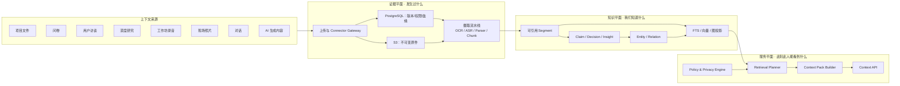

# Context Engine 架构

> 2026-07-28 定稿。取代此前「文件 + 向量库」的朴素设想。
> **核心立场**：Context Engine 不是 RAG，是
> **以不可变原件为证据、以版本/片段/锚点/血缘为基础、以 Claim 连接图谱、
> 以权限约束检索、以 Context Pack 向 AI 交付可引用上下文**的一套系统。
>
> ⚠ 与 `knowledge-ontology.md` 的分工：那份文档建的是 **harness 自己的元本体**
> （developer / agent / feature / sprint / ADR / evidence，服务于开发过程）；
> **本文建的是产品域的 Context Engine**（项目文件 / 问卷 / 访谈 / 工作坊 / 照片 / 对话）。
> 两者是不同层的两套模型，**不共用表、不共用 ID 空间**。

---

## 一、三个平面

职责必须分开，混在一起就会出现「摘要覆盖证据」「权限靠调用方自觉」这类结构性问题。



| 平面 | 职责 | 可变性 |
|---|---|---|
| **证据** | 保存「发生过什么」 | **不可变、可审计**。原件写入后永不覆盖 |
| **知识** | 保存「我们从证据中知道什么」 | **可被推翻、修订、并存冲突** |
| **服务** | 决定「当前用户、当前任务、当前时刻能看到什么」 | 每次请求重新判定 |

**「组织大脑」不是一个不断增长的大摘要**，而是经过审核、带有效期、可追溯到证据的
**Claim 网络**。这与需求侧 `14-brain` 的知识五态机（候选→已验证→已批准→生效→待复核）
是同一件事的两种表述——五态机是业务视图，Claim 生命周期是数据视图。

---

## 二、统一上下文模型：Artifact → Version → Segment → Anchor

### 2.0 file-first 原则（贯穿全系统的硬约束）

> **能保存成文件的数据，一律保存成文件；且必须能在项目文件浏览器里看到、能下载。**

这不是「顺便导出」，是 Context Engine 的**存储契约**：

1. **每个 Artifact 版本在对象存储里都有一个真实的、可下载的文件**——
   不存在「只活在数据库表里」的上下文。
2. **非文件来源必须物化为文件**：问卷 → `responses.csv` + `schema.json`；
   对话 → `messages.jsonl`；访谈 → 音频 + `transcript.jsonl` + `notes.md`；
   工作坊 → 音频 + `transcript.jsonl` + 白板照片；深度研究 → 网页快照 + `citations.json`；
   AI 生成 → 内容文件 + `provenance.json`。
3. **文件浏览器是证据平面的用户界面**——用户在那里看到的目录树，就是
   `artifacts / artifact_versions` 的投影，不是另一套存储。
4. **派生物同样是文件且可见**：OCR 结果、转录稿、摘要各自是独立文件，
   带 `derived_from` 指回原件版本，**不覆盖原件**。
5. **可见性沿用同一套 ACL**——文件浏览器不是权限旁路，
   `acl_bindings` 对浏览器与检索一视同仁。

**为什么值得付这个代价**：
- 客户与合规方要的是「把材料交给我」，不是「让我查你的库」——可下载是交付前提。
- 撤回与删除要能**演示**：`17-gov` 的五步撤回，删除后文件浏览器里那份必须真的消失。
- 排查「AI 为什么这么答」时，能直接打开那个文件，比读数据库行有效得多。
- 灾备与迁移：对象存储里那棵树本身就是一份可离线打开的完整交付物。

**代价与边界**（需明确接受）：
- 存储成本上升（原件 + 派生物多份）；靠生命周期策略与去重（`content_hash`）控制。
- 高频小对象（如每条消息）**不单独成文件**——以**会话/场次**为文件粒度，
  `messages.jsonl` 一个文件承载整段；Segment 仍精确到消息，靠 anchor 定位。
- 文件命名与目录结构一旦对外可见就是**契约**，改名要走迁移，不能随手重构。

> 对应需求侧：本原则需要一个**项目文件模块**承载（见 `phases/requirements` 的 22-files），
> 原型侧已有钩子——蓝本第 9 项「项目材料」、第 10 项「分组打印素材」、
> 项目筹备的「材料准备 9 份」、对话右栏的「材料 12」。

### 2.1 Artifact 的来源标准化

任何来源最终都标准化为 Artifact。**非文件来源也必须生成开放、可归档的 evidence bundle**
（JSONL / JSON / CSV / 音频 / 图片），不能只活在某张业务表里。

| 来源 | Artifact 表示 |
|---|---|
| Word / PDF / PPT | 原文件 + 解析结果 |
| 问卷 | 问卷版本 + response JSON/CSV |
| 用户访谈 | 音视频 + 转录 + 研究笔记 |
| 工作坊 | 录音 + diarization transcript + 白板照片 |
| 现场观察 | 照片/视频 + observation note + 时间地点 |
| 对话 | conversation + message JSONL |
| 深度研究 | research run + 网页快照 + 引用清单 |
| AI 生成内容 | 内容 + prompt/model/run/**provenance manifest** |

### 核心表

| 表 | 职责 |
|---|---|
| `artifacts` | 逻辑对象、来源、类型、所属项目 |
| `artifact_versions` | **不可变版本**、对象存储 key、SHA-256、MIME、版本号 |
| `segments` | 文本/消息/回答/音频时间段等**最小检索单元** |
| `anchors` | 页码、bbox、时间码、消息 ID、问卷题号、图片区域 |
| `derived_representations` | OCR / ASR / 摘要 / embedding / 视觉描述及其**生成版本** |
| `claims` | 洞察、事实、假设、决定、风险、行动项 |
| `claim_evidence` | Claim ↔ Segment 的**支持 / 反驳**关系 |
| `ontology_objects` / `ontology_edges` | 人、项目、研究对象、需求、决策等实体关系 |
| `provenance_events` | 摄取/转换/生成/人工编辑的 **append-only** 血缘 |
| `acl_bindings` | 用户/组/项目/Artifact/Segment 的访问范围 |
| `ingestion_runs` / `ingestion_jobs` | 摄取状态、重试、错误、pipeline 版本 |
| `context_packs` | **某次 AI 请求实际获得了哪些上下文** |
| `agent_runs` / `agent_steps` | Agent 运行、工具调用、检查点和引用 |

### `claims` 的必备字段

```
status         proposed / reviewed / accepted / contested / superseded
confidence     数值
valid_from     生效时间
valid_to       失效时间（支持「过去成立、现在失效」）
created_by     human / model / import
reviewed_by    审核人
supersedes_claim_id  被本条取代的旧 Claim
```

没有这几个字段，组织知识就只能存「一个最新版摘要」，**表达不了「两个研究结论冲突」
和「当时对、现在错」**——而这两件事恰恰是需求侧 `14-brain` 反例库与冲突成对召回的基础。

### 与需求文档的对应

| 架构概念 | 需求侧对应 |
|---|---|
| Artifact / Version / 固定快照 | `00-core/uc-0-1` 三模式绑定（草稿/实时关联/**固定快照**） |
| Context Pack | `00-core/uc-0-2` |
| Claim 生命周期 | `14-brain` 知识五态机（UC-14.5） |
| claim_evidence 支持/反驳 | `09-kg` 事实关系屏的关系五类 + 「反对证据必须留」 |
| provenance_events | `17-gov` 全链路审计（UC-17.1）四类事件 |
| acl_bindings | `00-core/uc-0-3` 两层角色模型 |
| context_packs 表 | `14-brain` 检索可审查（UC-14.6）的「AI 读到了什么」 |

---

## 三、摄取流水线：可重放、幂等的异步状态机

```
RECEIVED → QUARANTINED → SCANNED → STORED → EXTRACTED
        → SEGMENTED → ENRICHED → INDEXED → REVIEW_PENDING / READY
```

**硬规则**

- 原始文件写入对象存储后**永不覆盖**，更新通过新 `artifact_version`。
- 幂等键 = `content_hash + pipeline_version + parser_version`。
- OCR / 转录 / 摘要 / embedding **都记录模型与版本**。
- 每个 Segment 必须能回到原件的**页码、时间码、消息或图片区域**。
- 重跑摄取**只生成新派生版本**，不修改旧结果。
- 先写 PG 元数据与 **transactional outbox**，再由 worker 消费。
- **文档内容是不可信数据**——不得被 Agent 当作系统指令（知识库 prompt injection 防线）。
- 上传需恶意文件扫描、MIME 嗅探、大小与解压炸弹限制。

**各模态必须保留的结构**（不许拼成一段纯文本）

| 模态 | 必须保留 |
|---|---|
| 问卷 | 问卷版本、题号、选项、受访者、回答（对应 `12-survey` 的题目↔报告章节双向映射） |
| 工作坊 | speaker、时间码、议题、决定、**反对意见**、行动项 |
| 图片 | 原图、EXIF、使用授权、OCR、**区域坐标**、视觉描述 |
| 对话 | 消息顺序、回复关系、参与者、工具调用、附件 |
| 深度研究 | 网页快照、访问时间、作者、发布日期、引用锚点 |
| 生成内容 | 醒目标记为 **synthesized**，不得在下一次检索中伪装成一手证据 |

> 最后一条与需求侧 `16-persona` 的「虚拟结论不能作为强洞察、不进决策依据」
> 是同一条约束的两端：那边是业务规则，这里是数据标记。

---

## 四、检索：query-planned hybrid，不是 graph-first

**推翻原 `knowledge-ontology.md` 的「graph-first, vector-second」**。
它适合「谁决定了什么」这类结构查询，但**对刚上传、尚未完成实体链接的新材料会直接漏召回**。

### 查询上下文

```typescript
type QueryContext = {
  tenantId: string;
  principalId: string;
  projectIds: string[];
  task: "search" | "answer" | "research" | "decision-support";
  query: string;
  timeRange?: { from?: string; to?: string };
  allowedSensitivity: string[];
  tokenBudget: number;
  freshnessRequirement?: string;
  evidencePolicy: "primary-only" | "reviewed" | "all";
};
```

### 流程

1. **权限与租户过滤**（在 SQL/RLS 层，不在应用层）
2. Query 分类、时间范围识别、实体解析
3. **并行召回**四路：
   - **PostgreSQL FTS**——名称、原话、编号、术语（图和向量都不擅长精确匹配）
   - **pgvector**——语义召回
   - **图关系**——人/研究/项目/决策/需求之间的路径
   - **元数据**——项目、来源、时间、研究方法、受访者群体
   - **Claim 检索**——已审核的洞察与决策
4. RRF 或加权融合
5. Cross-encoder / LLM rerank
6. **去重、来源多样性、支持/反驳平衡**
7. Context Pack Builder 按 token budget 压缩
8. 返回文本 **+ 引用锚点 + 遗漏说明**

**PostgreSQL FTS 必须是一等检索通道**，不能只有向量和图。

**pgvector 的过滤召回率必须单独评测**：近似索引在叠加权限/租户/项目过滤时，
可能先近似召回再过滤，导致返回不足。需使用过滤列索引、分区或 iterative scans，
并建立**带权限过滤的 recall 测试集**。

### Context Pack 输出

不是字符串数组，而是：

```typescript
type ContextPack = {
  packId: string;
  query: QueryContext;
  items: Array<{
    segmentId: string;
    content: string;
    sourceType: string;
    artifactVersionId: string;
    anchor: {
      page?: number; bbox?: number[];
      startMs?: number; endMs?: number;
      messageId?: string; surveyQuestionId?: string;
    };
    retrievalReasons: string[];
    score: number;
    permissionDecisionId: string;
  }>;
  claims: Array<{
    statement: string;
    status: string;
    supportingSegmentIds: string[];
    contradictingSegmentIds: string[];
  }>;
  omissions: string[];
};
```

`retrievalReasons` 与 `omissions` 是需求侧 `uc-0-2` 五种筛选动作
（召回/降权/排除/成对/线索）与「被丢弃清单可审查」的落地载体。
`permissionDecisionId` 让「为什么这条能给你看」可回溯。

---

## 五、权限、隐私与研究伦理

这是最需要补强的一层。

- **租户与项目隔离在 SQL/RLS 层强制**，不能只靠 Context API 的代码过滤。
- **Artifact 权限必须传播**到 Segment、embedding、图节点、缓存和 Context Pack。
- **交集生成内容取所有来源权限的最严格结果**——避免摘要造成越权信息洗白。
- 用户研究增加 **consent purpose、允许用途、保留期限、匿名化状态**
  （对应 `06-itv/uc-6-3` 的四项独立同意）。
- **删除原始材料时级联失效** OCR、embedding、图边、摘要、缓存
  （对应 `17-gov/uc-17-2` 五步撤回流）。
- 支持 legal hold、retention policy、导出与审计。
- 模型调用前**再执行一次脱敏与策略检查**。
- ⚠ **数据库连接不得使用表 owner 身份**——PostgreSQL 中表 owner 默认不受 RLS 限制，
  用 owner 连接等于 RLS 形同虚设。应用连接必须是受 RLS 约束的非 owner 角色。

---

## 六、对既有选型的修正

| 原选型 | 问题 | 修正 |
|---|---|---|
| PostgreSQL canonical | 与「对象存储保存工件本体」表述冲突；PG 无法从指针恢复丢失的文件 | **PG 元数据/状态 canonical + S3 原件 canonical**；灾备必须同时恢复 PG、对象存储、事件日志 |
| **Next.js API routes 作后台** | 适合 BFF/短请求，**不适合长时 OCR/ASR/批量导入/深度研究** | **改用 NestJS**（见 `architecture.md`）；Next.js 只留前端与轻 BFF；新增独立 ingestion worker / research worker / scheduler |
| Redis 缓存+队列 | 「可丢失」与摄取不可丢失矛盾 | **缓存与队列拆开**；MVP 用 **PG outbox + job table**，规模扩大后换 NATS JetStream / Kafka / 托管持久队列 |
| LangGraph | 容易被误用为文件摄取或通用任务队列 | **只用于深度研究、人工确认、多阶段生成**；摄取流水线用持久任务系统 |
| LangGraph interrupt | 原文偏向 `interrupt_before/after` | 改用**动态 `interrupt()`** 做 HITL；节点恢复时**副作用必须幂等** |
| Apache AGE 默认启用 | 部署兼容性与托管支持风险高 | **阶段一不启用**：先用 `ontology_edges + recursive CTE`；确有复杂路径性能需求再上。若坚持 AGE，必须锁定兼容 PG 版本并维护自建镜像 |
| graph-first 固定策略 | 新内容未实体链接时漏召回 | 改为**基于 Query 类型的并行 hybrid retrieval** |
| pgvector | 无 embedding 版本、维度迁移与权限过滤策略 | embedding 表**按 model/version 分区**；双写迁移；建立**带权限过滤的 recall 测试** |
| CopilotKit + AG-UI | 只解决 UI 事件协议，不解决任务持久化/幂等/背压/权限 | 继续用，但**仅作 presentation protocol**；**服务端 run/event 才是权威** |
| AI gateway | 只有 provider 抽象 | 增加 **model registry、用途策略、成本预算、prompt version、PII policy、trace、fallback、结果 schema**（对应 `20-model` 模块） |
| 四张本体核心表 | 粒度过粗，无法表达版本/引用/推导 | 增加 **Artifact / Version / Segment / Anchor / Claim / Provenance / ACL / ContextPack** |
| 缺少搜索层 | 图与向量都不擅长精确原话/编号/姓名/术语 | **加 PostgreSQL FTS**；中文需明确分词方案与中英混合检索评测 |
| 缺少评测 | 无法证明比普通 RAG 更好 | 建立 **retrieval / citation / 权限泄漏 / 时效性 / 矛盾发现**测试集 |

**一句话**：Apache AGE、LangGraph、CopilotKit 各自降回本位——
**图投影、执行编排、UI 协议**，它们都不是 Context Engine 本身。

---

## 七、落地顺序

| 阶段 | 内容 |
|---|---|
| **P1 证据底座** | Artifact/Version/Segment/Anchor/ACL/Provenance；S3 版本化+哈希+授权；PG outbox + 持久摄取任务；PDF/Office/Chat/Survey 四类 adapter；全文搜索 |
| **P2 多模态与混合检索** | OCR/ASR/图片区域锚点；pgvector + embedding version；lexical+vector+metadata 融合；Context Pack API；**每个回答必须有可打开的原始引用** |
| **P3 知识与图谱** | Entity/Claim/ClaimEvidence；人工审核工作台；accepted/contested/superseded 生命周期；关系表递归查询，**用真实性能数据决定是否启用 AGE** |
| **P4 Agent 工作流** | 深度研究/工作坊总结/研究综合用 LangGraph；每个 run 保存计划、工具调用、checkpoint、Context Pack；高影响操作用动态 interrupt 审批；AG-UI 负责实时呈现与恢复 |
| **P5 组织大脑** | 跨项目 Claim 聚合；决策沿革、矛盾发现、知识有效期；用户反馈反哺检索排序但**不直接修改事实**；retention、删除传播与知识失效 |

### 首批完成门槛（可机器验证）

1. **100% AI 引用可定位**到原文件页码、时间码或消息
2. **跨 tenant / 项目泄漏测试为零**
3. 同一文件、同一 pipeline 版本**重复摄取不产生重复 Segment**
4. 删除材料后，其 embedding、图边、摘要、缓存**可验证失效**
5. 检索测试**同时覆盖**精确词、语义、关系、时间、反证
6. 每次 Agent 运行**能重放当时使用的 Context Pack**

> 这六条与需求侧的对应：①=`uc-0-2` AC1 引用完整性；②=`uc-0-3` V4 权限矩阵；
> ③=摄取幂等；④=`uc-17-2` 五步撤回；⑤=检索评测集；⑥=`uc-14-6` 检索可审查。

---

## 八、推荐的核心组合

```
S3 immutable evidence
+ PostgreSQL metadata / ACL / provenance（RLS 强制）
+ durable ingestion workers（NestJS，PG outbox 起步）
+ FTS / pgvector / optional graph projection
+ Claim–Evidence model
+ Context Planner
+ citation-first Context Pack
```
