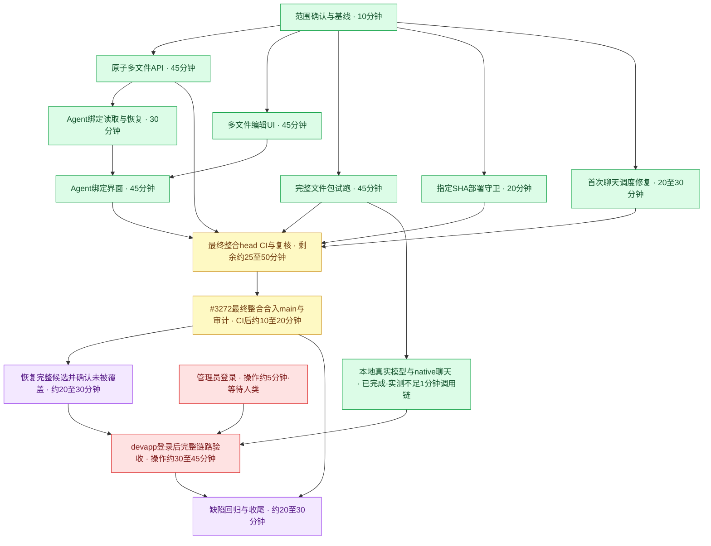

# 五小时多文件真实测试版

开始：2026-09-09T18:48:55Z；截止：2026-09-09T23:48:55Z（上海时间02:48:55–07:48:55）。不得因故障重置计时。

用户决定原文：
> 1，不接受，必须可以多文件编辑；2，交付到devapp；3，允许。
> 确认。

批准后的范围：公开GitHub标准Skill导入，真实多文件查看/新建/修改/删除，一次原子保存为新不可变版本，刷新可恢复，旧版本保留，真实试运行，显式Agent pin与聊天使用、恢复旧pin。部署devapp；允许现有测试模型/只读MCP及隔离测试数据。费用没有数字上限，限必要验证，不采购额度/切换昂贵配置。开发和部署授权不等于全绿或完成。

实现工作树 /private/tmp/workspacex-studio-live，自main f08cbe1ea开始。设计#3239由其他执行者合入，只提供设计材料，不表示产品已工作。

| 工单 | owner | 文件所有权 |
|---|---|---|
| #3249 原子多文件保存 | credential_guard | skill-file-edit契约、API controller/application/PG及专属测试 |
| #3250 真实后台多文件接线 | source_connections | 新SkillMultiFileEditor、lib薄封装、既有Skill编辑接线及UI测试 |
| #3253 固定版本完整包试跑 | 主任务 | execute-trial-run、sandbox输入路径/写入、专属测试 |
| 跨项整合与交付 | 主任务 | contracts index、kernel.module注册、提交/PR/CI与交付记录 |
| 独立验收 | history_content | 只读审计、devapp/模型环境探针、独立真实链路测试证据 |

## 当前交付状态（截至22:14Z）

首轮固定候选 c3e1cb929 于21:46Z部署成功；随后恢复部署 attempt 2 也成功，但22:14Z的只读SSH核对显示共享devapp已经被main `f95a1fadf7eb2046ad8e9a6f1bf99a5c49a70f7a` 覆盖，API/Web启动时间为06:11:42 CST（22:11:42Z）。**当前不能声称完整候选在devapp稳定运行**。服务active只说明服务状态，不能替代候选身份或完整功能验收。

#3273于22:07:41Z合入API集成分支（合并提交前缀 `2cf975`），并非直接合入main。#3272是唯一最终整合PR，已更新为 `ab859a6976ce4e421068fd3a04bf7aa84523fcd8`（main修复及全部UI/API/pins），已推送且独立复核通过。仍须等待该head的CI与main合并，再确认实际部署。人工管理员登录仍阻塞；本地真实模型和浏览器证据不能替代devapp登录后验收。

## 动态记录

18:49–18:58Z：3个worker恢复执行。新工作树init快速验证通过；readiness读取3/10（含过期track，不作为本功能验收）。身份注册#3235已合并，自己coord token仍不存在；tick明确受阻，不借用其他身份。GitHub工单已建立，实施按直接交办任务SOP走独立PR，不伪造feature passing。

发现原编辑逐文件发布/版本读可能混合、旧SKILL.md-only写入会丢附件；采用固定版本完整快照GET与CAS原子mutationsPOST，复用实际runtime表。Skill试跑虽读到完整包却只使用正文，#3253补真实inputFiles挂载。

独立环境探针：devapp runner在线，历史真实模型lane缺测试账号配置，当前待fresh验证；现有候选部署仅白名单他人分支，未擅改。磁盘余量约6.7GiB，测试栈限流，避免并发多套Next/Docker构建。

## 验收硬线

19:33Z：API真实数据库/HTTP验证7/7与契约3/3通过；UI回归14项、web完整类型检查及定向lint通过。完整包输入及stdout返回2/2标准隔离测试通过；sandbox定向7/7和类型检查通过。完整Office sandbox测试曾因本机磁盘耗尽失败，不记为通过。API类型检查133条DOM错误经同依赖main源码逐条比对一致，正验证修复方案。

新增#3260：Agent当前真实pins缺少读侧，新增管理员快照读取与保留其他绑定的UI，支持恢复空绑定。#3256指定分支/SHA候选部署守卫独立3项测试通过。devapp登录、真实模型、部署与CI尚未完成。

估时是工作量估计，并行节点不相加；CI排队、人工登录及共享环境被其他部署覆盖的等待不在操作估时内，因此不能保证原截止前全部完成。绿色=已验证完成该节点，黄色=进行中，红色=阻塞，紫色=待前置完成；局部绿色不代表产品交付完成。

20:16Z：正式PR为#3271（类型基线）、#3272（文件API）、#3273（编辑器）、#3274（完整包试跑）、#3275（指定SHA部署）、#3276（Agent绑定与验证）。独立审查的身份切换及结果不确定问题已修；权限结构检查经20项反证通过。新增浏览器runner隔离与JSON结果校验通过15项反证，禁止把skip或旧日志当通过。

20:40Z：真实native Agent/chat完成，精确固定Skill、read_file调用与持久化回答匹配reference-only随机值；保留Linux network:none/nonroot/只读rootfs等限制，证据见docs/testing/evidence/skill-real-model-2026-09-10。默认init退出0、锁文件不变、无业务diff。#3273旧编辑器E2E选择器已改为验证真实snapshot和已保存版本试跑，单spec真实5/5通过。#3274红在既有HITL首次SSE超时，相关trial8+2在CI已绿，定向复验16/16绿；仍等待允许重跑的workflow结束。#3275聊天烟测两次queued，新增独立#3278以真实DB复现标题行锁让单次claim跳过后滞留的机制，正在修有界补唤醒。main对照的相同注册聊天case通过6675ms，不宣称main稳定同case失败，也不将机制复现说成还原CI唯一时序。旧候选run34400296064已请求取消，最终部署将统一包含首聊修复，避免发布已知排队风险。

20:54Z：首次聊天修复 d87a1c527 已经独立审查，8项真实HTTP/DB测试、API类型检查、原注册聊天浏览器用例1/1通过（3.731秒，原20秒断言）；独立PR #3279，证据已入库。真实模型及native聊天证据提交289627c32。本地浏览器证据与模型证据分列，不冒充devapp验收。

#3271与#3275被其他执行者合入main；删除#3271基线分支导致#3272/#3274自动关闭，已恢复原SHA分支、重新打开两个PR并将base改为main，未改写提交。#3276的control-plane门发现独立Skill E2E未接CI，正在新增真实CI lane并验证；两项smoke失败是已修正的旧编辑器selector，已同步修复到绑定分支。候选已合入最新main，仍等待最终CI接线验证后统一部署。Mac解锁和devapp管理员登录仍待人类完成。

三文件样例SKILL.md、references/value.txt、scripts/helper.js；marker只放reference。新建/修改/删除统一保存，刷新重读同一version，旧版字节不变，CAS409保留本地编辑，Agent实际pin新版本并读取新reference。不同组织/非管理员反证。真实模型/MCP不可用必须报失败，不能用loopback假成功。人类测试需实际devapp地址与SHA，main合并仍需CI全绿/独立review。

21:04Z：最终候选 c3e1cb929e33ed45db8d84ce14ba133683de0c2d 已正常推送，pre-push13/13绿。编辑器响应关联修补经独立审查、11条离线反例和原浏览器5/5通过。Skill专用CI run34404294806首次真实执行成功；相同最终候选另启动run34404790395。devapp固定SHA部署门禁run34404778064已启动，尚未部署成功。旧候选两run均确认cancelled。Mac fresh检查仍锁定，管理员登录待人类。

21:53Z现场快照：devapp仍为c3e1cb929e33ed45db8d84ce14ba133683de0c2d；部署run34404778064全部门禁通过，21:46Z完成。API/Web自05:46:07CST active/running，deep-agent镜像c3e1cb92运行，健康trustworthy/rlsForced为true、appRoleIsOwner为false，HTTPS登录200。冻结业务候选之外仅补E2E测试代理7d945：run34407301634真实79pass/0failed/0flaky/1既有inboxfixme，Skill audit5case全部执行通过。证据已准备；Mac仍锁定，devapp登录后验收未执行。

合并边界：#3274已进入main；#3276仅合到编辑器集成分支de461cd6，不能算main。#3272通过普通merge最新main刷新为712d01837以避免旧取消检查继续阻塞，核心API/权限检查器blobs不变，独立delta审查通过，新CI在跑。#3273当前head已受集成合并更新，须继续跟到main。部分外部合并记录存在全栈红/历史取消检查聚合差异，不将“已合并”自动记为仓库严格passing。#3283独立E2E代理修复PR在跑，未改生产路由。已在#3234记录共享devapp后续main部署可能覆盖候选，交付前须再核对版本。

22:14Z状态校正：21:46首部署与21:53候选快照保留为历史成功证据，不能继续当成当前部署状态。恢复attempt 2虽成功，随后main `f95a1fadf7eb2046ad8e9a6f1bf99a5c49a70f7a` 再次覆盖；API/Web active时间06:11:42 CST。当前交付路径收敛为#3272最终整合head（已推送 `ab859a6976ce4e421068fd3a04bf7aa84523fcd8`）→CI/独立复核→main→部署后再次核对实际版本→管理员登录后验收。#3273于22:07:41Z只合到API分支 `2cf975`，不把中间分支合并记为main完成。Mermaid中CI与最终整合保持黄色，待合入后的候选部署为紫色，登录和devapp验收保持红色；没有将已被覆盖的候选标为当前绿色完成。

22:20Z：最终整合head ab859a6976ce4e421068fd3a04bf7aa84523fcd8 已推送，pre-push13/13和独立blob复核通过。CI在运行，validate出现/me请求ECONNRESET（23通过、3跳过）后原head单次重跑；专用Skill lane失败正在分诊，不将旧候选绿算作最终head绿。
