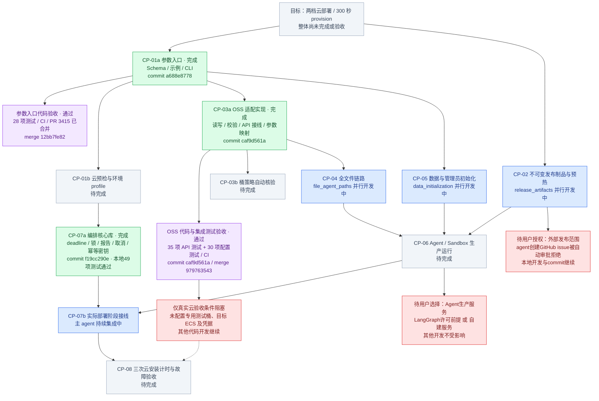

# 云部署 P0/P1 进度与验收

核验日期：2026-09-11。目标不变：Starter 和 production 两档，初始化前提满足后 300 秒 provision。所有状态均按下述具体范围判断，子项完成不代表整个 CP 交付包完成。

## 颜色规则

- **绿色＝完成**：该节点描述的实现已完成、验证通过并提交；必须附 commit。
- **紫色＝验收通过**：必须注明验收层级、证据和被验收 commit。代码/CI 验收不等于真实云交付验收。
- **红色＝阻塞或需用户确认**：列出具体原因和影响范围；不因一个云验收阻塞而停止其他开发。
- 灰色＝待完成；蓝色＝开发中。没有提交的工作不能标绿。

## 可核验证据

| 节点 | 实现 commit | 合并与验收 | 尚不代表 |
|---|---|---|---|
| CP-01a | `a688e8778` | [PR #3415](https://github.com/boardx/workspacex/pull/3415)，合并 `12bb7fe82`；28 项配置测试与 CI 通过 | 云资源预检完成 |
| CP-03a | `caf9d561a`（包含 `ec129ed73` 和 `9bab3b970`） | [PR #3419](https://github.com/boardx/workspacex/pull/3419)，已合并 `979763543`；35 项 API 存储/契约测试、30 项部署配置测试及 CI 通过 | 真实 OSS 桶验收、完整文件生命周期或生产验收 |
| CP-07a | `f19cc290e`，本地提交 | [Issue #3424](https://github.com/boardx/workspacex/issues/3424)；本地部署包 49 项测试通过，含 19 项编排/子进程/密钥测试，类型/lint 通过；待 PR/CI | 已接通实际部署命令，或五分钟目标达成 |

上轮 CI 的契约单一来源失败已由 `caf9d561a` 修复，不再列为红色。跳过的 CI 项不算通过。

**整体判断：8 个交付包尚未全部完成，真实云交付验收尚未通过，不能把整图涂绿或涂紫。** 云条件只影响对应真实验收；不等待这些条件，持续完成可独立开发与验证的工作。
