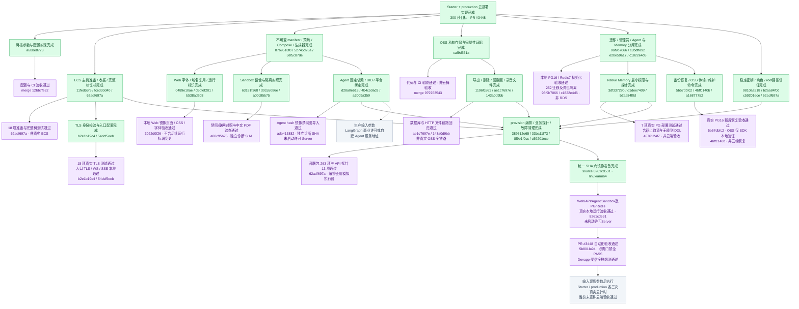

# 云部署 P0/P1 进度与验收

核验日期：2026-09-11。目标：Starter / production 两档云部署，前提满足后 300 秒内 provision。代码、自动化验收与 Devapp 升级链已通过；真实云端计时验收在输入现场参数后执行。

绿色＝子项实现已提交；紫色＝节点注明范围的验收通过；红色＝阻塞或需要确认；蓝色＝开发/集成中；灰色＝待验收。子分支已完成不等于父分支已集成，本地验收不等于真实云验收。

主机准备、收据与完整发布树复核、Memory、Sandbox、Agent 固定依赖、业务编排、生成密钥、root 路径信任和统一 SHA 本地镜像构建均为绿色。部署包 263 项、API 探针 13 项、统一 linux/arm64 镜像运行验收，以及 PR #3448 的必需门禁均为紫色；它们仍不代表真实云验收。

统一镜像证据绑定源码 `8261cd531aef0b0114d83c2c9fc035be3200934b`：Web/API/Agent/Sandbox 的 OCI revision 一致，固定 PG16/vector 与 Redis7 也通过运行检查。PR #3448 的最新提交 `5b801fa94c1456240667564d99d3c83a38368927` 已通过 `backend-required`、`verify-control-plane`、`verify-affected`、`verify-full-compile`、`merge-gate`、全栈烟测和全部后端测试分片。镜像尚未发布到受批准 registry，因此没有伪造 release manifest；两档真实云端安装、业务链路、恢复与 300 秒墙钟计时将在输入目标环境参数后验收。

| 执行者 | 当前状态 |
|---|---|
| release_artifacts | 8261cd531 统一 linux/arm64 镜像构建和本地运行验收完成；registry 发布待授权 |
| data_initialization | 参数/验收矩阵与 prepare→provision 交界复验完成 |
| file_agent_paths | Memory、取消清理、凭据和 root 路径信任审查完成 |
| 主 agent | PR #3448 已提交且必需门禁全绿；真实云验收在输入前提参数后执行 |

当前没有红色节点。灰色节点是部署时必须提供的目标环境输入或尚未执行的真实云现场验收，不表示代码阻塞，也不冒充已经完成的云端验收。
