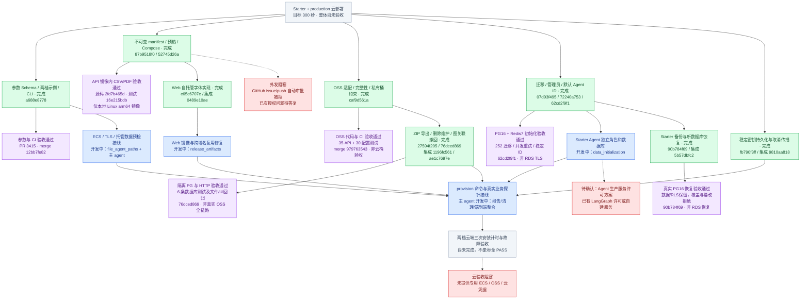

# 云部署 P0/P1 进度与验收

核验：2026-09-11，本次更新对应用户要求“更新 Mermaid”。三个子 agent 均在运行，主 agent 持续集成。目标是 Starter / production 两档云部署，前提满足后五分钟 provision。

颜色：绿色＝该子项实现完成、已验证并提交；紫色＝注明范围的验收通过；红色＝真实阻塞或需确认；蓝色＝开发中；灰色＝尚未完成。代码/本地验收不等于真实云验收；图中每个绿色和紫色节点均附被核验 commit。

## 本轮新增事实

- 文件链路：`76dced869` 已完成真实图关联撤回、归属校验和导出按钮回归；父分支已集成为 `ae1c7697e`。
- 备份恢复：`90b784f69` 已完成真实 PostgreSQL 16 新库恢复、强制 RLS 保留、覆盖/同源/篡改拒绝；父分支集成为 `5b57dbfc2`。独立 PR 为 #3433；不把 PR 创建等同 CI/云验收通过。
- 稳定密钥：`fb790f3ff` 的目录 fsync 和取消传播已集成为 `9810aa818`；Starter Agent 新密钥/独立数据库的扩展仍在开发。
- Web 自托管字体已提交 `c65c6707e`，父集成为 `0489e10ae`；最终镜像构建、域名无关 API 地址与 WebSocket 回归仍在做，因此不标镜像验收紫色。
- 主 agent 的真实 Agent 回复与沙箱取消探针 9 条测试通过；编排接线 3 条 mock 测试通过。尚未提交的接线只标蓝色，不凭测试数字标绿色或真实云 PASS。
- API 镜像、原始 Compose env 与数据库验收均为各自注明的源 commit；最终整合 SHA 必须重新构建和验证。

## 并行开发分工

| 执行者 | 当前工作 |
|---|---|
| release_artifacts | Web 不依赖外网字体、跨域名复用同一镜像、真实构建与页面/字体验收 |
| data_initialization | Starter Agent 独立数据库/角色及幂等测试；跟进数据与备份 PR |
| file_agent_paths | TLS 参数与真实证书预检；只读审查父 provision 取消和协议边界 |
| 主 agent | provision CLI、服务隔离配置、真实业务探针、阶段报告、取消清理、持续集成和文档 |

编译受本机内存限制时错峰，其他代码与测试仍并行。红色条件只影响对应的外发或真实验收，不停止可独立开发的工作。
