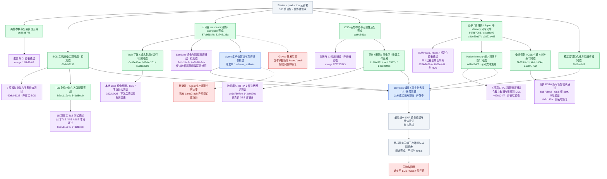

# 云部署 P0/P1 进度与验收

核验日期：2026-09-11。目标：Starter / production 两档云部署，前提满足后 300 秒内 provision。整体尚未验收通过。

绿色＝子项实现已提交；紫色＝节点注明范围的验收通过；红色＝阻塞或需要确认；蓝色＝开发/集成中；灰色＝待验收。子分支已完成不等于父分支已集成，本地验收不等于真实云验收。

本次纠正：Starter Agent 分库、Memory 分库、TLS、Nginx、Web 域名复用、录音文件与 OSS 备份维护已从开发中改为已提交完成。主机准备、Memory 部署及 Sandbox 新增工作已在子分支提交，明确标注待集成。父分支尚未提交的编排接线继续保持蓝色。

紫色证据来自各节点对应提交的测试记录；不同源码版本的测试不能合并为最终整套产品验收。最终统一 SHA 的镜像仍需重建，两档真实云端安装、业务链路、恢复与 300 秒墙钟计时尚未通过。

| 执行者 | 当前状态 |
|---|---|
| release_artifacts | Agent 生产依赖锁与真实镜像构建进行中；Web 与 Sandbox 本地验证完成 |
| data_initialization | 主机准备已提交 60de93136，等待父分支集成 |
| file_agent_paths | Memory 部署与真实 PG 验证已提交 4676124f7，等待父分支集成 |
| 主 agent | 持续集成、编排接线、业务探针、取消清理、测试及文档 |

红色条件只阻塞对应外发或真实云验收，不阻止其他开发。GitHub issue/push 曾被自动审批拒绝，原因是向外部仓库发送实现信息的授权未获确认；未通过其他工具绕过。
