# 云部署 P0/P1 进度与验收

核验日期：2026-09-11。目标：Starter / production 两档云部署，前提满足后 300 秒内 provision。整体尚未验收通过。

绿色＝子项实现已提交；紫色＝节点注明范围的验收通过；红色＝阻塞或需要确认；蓝色＝开发/集成中；灰色＝待验收。子分支已完成不等于父分支已集成，本地验收不等于真实云验收。

```mermaid
flowchart TD
    T["Starter + production 云部署<br/>300 秒目标 · 整体待验收"]
    T --> CFG["两档参数与配置实现完成<br/>a688e8778"]
    CFG --> CFGV["配置与 CI 验收通过<br/>merge 12bb7fe82"]
    T --> PRE["ECS 主机准备 / 收据 / 完整树复核完成<br/>11fed55f5 / fce330d40 / 62adf697a"]
    PRE --> PREV["18 项准备与完整树测试通过<br/>62adf697a · 非真实 ECS"]
    PRE --> TLS["TLS 身份校验与入口配置完成<br/>b2e1b19c4 / 54dcf5eeb"]
    TLS --> TLSV["15 项真实 TLS 测试通过<br/>入口 TLS / WS / SSE 本地通过<br/>b2e1b19c4 / 54dcf5eeb"]
    T --> REL["不可变 manifest / 预热 / Compose / 生成器完成<br/>87b9518f0 / 52745d26a / 3ef5c87de"]
    REL --> WEB["Web 字体 / 域名复用 / 运行标识完成<br/>0489e10ae / d6dfef201 / b538ad208"]
    WEB --> WEBV["本地 Web 镜像页面 / CSS / 字体验收通过<br/>3022d0f26 · 不含后续运行标识变更"]
    REL --> SAND["Sandbox 镜像与隔离实现完成<br/>63181f368 / d0c55086e / a00c95b75"]
    SAND --> SANDV["禁网/联网对照与中文 PDF 验收通过<br/>a00c95b75 · 独立诊断 SHA"]
    REL --> IMG["Agent 固定依赖 / UID / 平台绑定完成<br/>d28a0e618 / 4b4c50ad3 / a3009a359"]
    IMG --> IMGV["Agent hash 镜像禁网图导入通过<br/>adb413882 · 独立诊断 SHA<br/>未启动许可 Server"]
    T --> OSS["OSS 私有存储与完整性适配完成<br/>caf9d561a"]
    OSS --> OSSV["代码与 CI 验收通过 · 非云桶验收<br/>merge 979763543"]
    OSS --> FILE["导出 / 删除 / 图撤回 / 录音文件完成<br/>1196fc561 / ae1c7697e / 143a0d9bb"]
    FILE --> FILEV["数据库与 HTTP 文件链路回归通过<br/>ae1c7697e / 143a0d9bb<br/>非真实 OSS 全链路"]
    T --> DB["迁移 / 管理员 / Agent 与 Memory 分库完成<br/>96f9b7066 / c8bdffe92<br/>e2be59a17 / c1822e4d6"]
    DB --> DBV["本地 PG16 / Redis7 初始化验收通过<br/>252 迁移及角色隔离<br/>96f9b7066 / c1822e4d6 · 非 RDS"]
    DB --> MEM["Native Memory 最小权限与探针完成<br/>3df33729b / d1dee7409 / b2aa84f0d"]
    MEM --> MEMV["7 项真实 PG 部署测试通过<br/>含截止取消与无晚到 DDL<br/>4676124f7 · 非云端验收"]
    DB --> BACK["备份恢复 / OSS 传输 / 维护命令完成<br/>5b57dbfc2 / 4bffc140b / a16877752"]
    BACK --> BACKV["真实 PG16 新库恢复验收通过<br/>5b57dbfc2 · OSS 仅 SDK 本地验证<br/>4bffc140b · 非云端恢复"]
    T --> SEC["稳定密钥 / 角色 / root路径信任完成<br/>9810aa818 / b2aa84f0d<br/>c59201ece / 62adf697a"]
    PRE --> RUN["provision 编排 / 业务探针 / 故障清理完成<br/>389512e65 / 33ba11f73 / 8f9e1f0cc / c59201ece"]
    MEM --> RUN
    IMG --> RUN
    SEC --> RUN
    FILE --> RUN
    RUN --> RUNV["部署包 263 项与 API 探针 13 项通过<br/>62adf697a · 编排使用模拟执行器"]
    RUN --> FINAL["最终统一 SHA 镜像重建与整体验证<br/>开发中：release_artifacts"]
    FINAL --> CLOUD["两档真实云端三次计时与故障验收<br/>尚未完成 · 不标全 PASS"]
    CLOUD -.-> BLOCK["云验收阻塞<br/>缺专用 ECS / OSS / 云凭据"]
    IMG -.-> LICENSE["待确认：Agent 生产服务许可方案<br/>已有 LangGraph 许可或自建服务"]
    REL -.-> GH["GitHub 外发阻塞<br/>自动审批拒绝 issue / push<br/>授权问题待答复"]
    classDef done fill:#dcfce7,stroke:#16a34a,color:#14532d;
    classDef accepted fill:#f3e8ff,stroke:#9333ea,color:#581c87;
    classDef blocked fill:#fee2e2,stroke:#dc2626,color:#7f1d1d;
    classDef active fill:#dbeafe,stroke:#2563eb,color:#1e3a8a;
    classDef pending fill:#f1f5f9,stroke:#94a3b8,color:#334155;
    class CFG,PRE,TLS,REL,WEB,SAND,IMG,OSS,FILE,DB,MEM,BACK,SEC,RUN done;
    class CFGV,PREV,TLSV,WEBV,SANDV,IMGV,OSSV,FILEV,DBV,MEMV,BACKV,RUNV accepted;
    class FINAL active;
    class BLOCK,LICENSE,GH blocked;
    class T,CLOUD pending;
```

本次更新已把主机准备、收据与完整发布树复核、Memory、Sandbox、Agent 固定依赖、业务编排、生成密钥和 root 路径信任的父分支提交改为绿色。部署包 263 项、API 探针 13 项及各节点注明的真实本地测试改为紫色；它们仍不代表真实云验收。

紫色证据来自各节点对应提交的测试记录；不同源码版本的测试不能合并为最终整套产品验收。最终统一 SHA 的镜像仍需重建，两档真实云端安装、业务链路、恢复与 300 秒墙钟计时尚未通过。

| 执行者 | 当前状态 |
|---|---|
| release_artifacts | 独立诊断镜像已通过；等待最终源码 SHA 后重建统一镜像 |
| data_initialization | 参数/验收矩阵与 prepare→provision 交界复验完成 |
| file_agent_paths | Memory、取消清理、凭据和 root 路径信任审查完成 |
| 主 agent | 冻结统一源码、最终回归、进度与交付文档 |

红色条件只阻塞对应外发或真实云验收，不阻止其他开发。GitHub issue/push 曾被自动审批拒绝，原因是向外部仓库发送实现信息的授权未获确认；未通过其他工具绕过。
