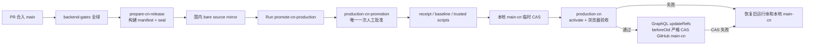

# 通过 GitHub 发布 WorkspaceX 中国生产环境

中国生产只晋级 **exact 40 位 commit SHA**。GitHub Actions 是日常发布入口；生产主机不在运行时从 GitHub 补对象。



## 一次性治理

1. `production-cn-build` 只允许 `main`。
2. `production-cn-promotion` 只允许 `main`，并配置 required reviewer。这是唯一人工批准。
3. `production-cn` 允许 `main` 和 `main-cn`，不配置 reviewer。它保留可审计的生产 deployment 记录，不产生第二次批准。
4. `main-cn` ruleset 要求目标 commit 已成功部署到 `production-cn-promotion`，并禁止删除 ref。正常发布始终用 GraphQL `updateRefs(beforeOid, afterOid, force:false)`；ruleset 不禁止所有 non-fast-forward，因为经独立审批的紧急回退必须能把指针恢复到已有成功生产记录的旧 SHA。
5. 自托管 runner 必须带 `self-hosted`、`linux`、`workspacex-cn-production`，以 `ghrunner` 运行。`/opt/workspacex-cn/release-origin-cache.git` 是 runner 可写的国内 bare mirror；生产 repository 的 `origin` 必须精确指向它。
6. `/usr/local/bin` 与 `/usr/local/lib/workspacex-cn` 的特权入口只能由受控 root bootstrap 从已 review、已合入 `main` 的代码安装。workflow 逐字节核对，绝不从 PR checkout 自动安装特权脚本。

正式通道只使用 GitHub 内建的短期 `GITHUB_TOKEN`，workflow 权限固定为 `contents:write` 和 `actions:write`。不保存开发者本机 OAuth token、个人 PAT、长期 fine-grained PAT 或静态 GitHub App installation token。`main-cn` 的安全边界由 Environment deployment 证明、ruleset 和 GraphQL `beforeOid` CAS 共同形成。

首次启用或特权脚本更新后，通过独立、可审计的阿里云 root 变更执行：

```bash
cd /opt/workspacex-cn/repository
git fetch origin main
git checkout --detach origin/main
bash .harness/scripts/vm/bootstrap-cn-production.sh
```

## 日常发布

1. 在 Devapp 验收目标版本，确认它已合入 `main`，记录 exact SHA。正式晋级要求 `release_sha` 等于启动 workflow 时捕获的 `GITHUB_SHA`；若要恢复旧版本，走独立 rollback 通道。
2. 等待该 SHA 的 required gates 和 `prepare-cn-release` 成功。每次尝试使用独立 `attemptId`，prebuild、preactivate、build、prepare 和 activate 必须绑定同一个 attempt。
3. 读取当前 `main-cn` exact SHA，作为 CAS baseline：

   ```bash
   git ls-remote https://github.com/boardx/workspacex.git refs/heads/main-cn
   ```

4. 在 GitHub → Actions → **promote-cn-production** → **Run workflow**，从 `main` 运行并填写 `release_sha` 与 `expected_main_cn_sha`。
5. 在 `production-cn-promotion` 复核新旧 SHA 后批准一次。
6. workflow 验证 GitHub 治理、trusted script hash、manifest、seal、预检/prepare receipt、live baseline 和 fast-forward 关系。若 receipt 缺失但输入仍可安全准备，只执行 `--prepare`，不会切流。
7. workflow 临时把国内 bare mirror 的 `main-cn` 从旧 SHA CAS 到候选，执行受信 `workspacex-cn-deploy`。只有 canonical activation 与公网浏览器验收都成功，才以 GraphQL `updateRefs` 把 GitHub `main-cn` 从 `beforeOid` 严格 CAS 到 `afterOid`。
8. 以 `production_available` event、浏览器验收和 GitHub `main-cn` 三者一致作为完成证据。

CLI 入口与页面按钮执行的是同一 workflow：

```bash
gh workflow run promote-cn-production.yml \
  --repo boardx/workspacex \
  --ref main \
  -f release_sha=<40位候选SHA> \
  -f expected_main_cn_sha=<40位当前main-cn SHA>
```

## 重试与失败收敛

- **approval/prepare/activation 前失败**：生产和 GitHub `main-cn` 不变；本地临时 ref 由 trap 恢复。
- **activation 或浏览器失败**：trusted deploy 自动恢复旧 Nginx、Compose 指针和 exact image digests，并做回滚浏览器验收；GitHub `main-cn` 未变化。
- **生产成功但 GitHub GraphQL CAS 失败**：workflow 调用受信 `--rollback`，验证旧版浏览器可用，再把国内 mirror 恢复到旧 SHA。禁止留下“生产新版本、GitHub 旧指针”的分裂状态。
- **GitHub `main-cn` 已是目标 SHA**：不重复切流；`--verify-active` 核对当前运行体并重新跑浏览器验收，成功后幂等结束。
- **GitHub `main-cn` 是第三个 SHA**：CAS 红退。重新读取 baseline 并重新批准，绝不覆盖并发更新。
- **同 SHA receipt 过期或失败重试**：创建新的 `attemptId` 和独立证据目录；旧 attempt 保留审计，不能覆盖或复用过期证据。
- **紧急回退**：只能回到已有成功生产 deployment 记录的 SHA，并走独立 rollback workflow 与审批。不得从正常 promotion workflow 使用 force。
- **trusted script drift**：先走上述受控 bootstrap。workflow 不自行提权修复。

## 时间口径

- 候选已经 build、seal、prepare：目标日历时间 3–5 分钟；
- 镜像就绪但需要 prepare：执行时间 8–15 分钟；
- 需要完整构建：日历时间 20–30 分钟。

每次仍按 T0–T9 报告 runner 排队、唯一 Environment 审批、prepare、activation、浏览器验收及补救的实测时间。


## 2026-09-30 aggregate controller boundary

Each candidate run uses `gha-<run-id>-<run-attempt>`; retries use a new attempt,
so expired immutable evidence never blocks a fresh attempt for the same SHA.
Prebuild and preactivate evidence bind the same attempt, source, production baseline,
and release. Only root collects live probes while the canonical release lock is held.
The collector checks the candidate dependency lock offline, real pnpm forwarding,
ASR/feedback/admin runtime maps, six managed-data Describe results, actual baseline
identity consumers, and full read-only bootstrap identity/schema/permission/Agent seed
compatibility. Static imports or three table names never substitute for this result.

Production currently lacks columns required by the candidate bootstrap repositories.
The collector intentionally rejects that candidate before building or migrating.
Schema-changing release preparation needs a separately reviewed lane: exact pending
migration ledger, destructive/additive classification and old-runtime compatibility,
isolated target-schema rehearsal, baseline identity proof, then a full target bootstrap
probe after migration and before service switching. This change does not implement or
approve that lane, and no production release is claimed ready from these local tests.

Promotion uses one approved Environment admission, accepts the production runtime and
browser journey, then performs a strict GraphQL ref CAS. Local ref compensation is
registered before the first local mirror mutation. If failure occurs before a remote
CAS attempt, the runtime and mirror are restored. If a CAS response or its confirming
read is lost, the accepted runtime and mirror are retained: the remote outcome is
unknown and must be reconciled using a live GitHub ref read and `--verify-active`.
Never blindly roll back an already committed GitHub ref or repeat activation against
an unknown baseline. A run with an ambiguous CAS outcome remains failed, not green.

`deploy-cn-production` is now a manual verification entry for an already accepted
SHA/attempt. It does not activate again on `main-cn` push: the canonical promotion
workflow has already activated that SHA before it writes the ref.


## Attempt-owned candidate configuration (#4765)

The build controller holds the canonical release lock and copies the active config
into `/etc/workspacex-cn/candidate-configs/<SHA>/<attempt>/deployment.json`.
Only `provision.release` changes; all durable profile references and stable identity
inputs remain unchanged. Root-private baseline and candidate hashes bind the receipt.
A protected state receipt distinguishes prepared and accepted same-version re-publication
when config bytes are identical. Config rename precedes state rename; unequal-byte
crash recovery derives the real config and reconciles the marker on retry. An equal-byte
marker failure stays unaccepted until the commit succeeds.
The collector, host preparation and canonical provision consume this same candidate.
Preparation never replaces the active `/etc/workspacex-cn/deployment.json`.
After runtime readiness and real browser acceptance, activation atomically commits
that candidate using a byte-for-byte baseline compare-and-swap. Runtime rollback also
restores the configuration using compare-and-swap; independent operator edits are
rejected rather than overwritten. A lost GitHub CAS response retains the already
accepted runtime/config pair until the remote ref is reconciled.

This closes release-identity staging, but does not authorize or bypass the separate
schema-changing release gate tracked in #4763.
