# 通过 GitHub 发布 WorkspaceX 中国生产环境

中国生产发布采用两个 GitHub Actions 工作流，版本身份始终是 **exact 40 位 commit SHA**：

```mermaid
flowchart LR
  A[PR 合入 main] --> B[backend-gates 全绿]
  B --> C[prepare-cn-release\n从 GitHub checkout exact SHA]
  C --> D[国内镜像源缓存]
  D --> E[构建 OCI 镜像\nmanifest + seal]
  E --> F[Run promote-cn-production]
  F --> G[production-cn\nEnvironment 人工批准]
  G --> H[验证 trusted scripts\nmanifest / seal / prepared receipt / live baseline]
  H --> I[CAS fast-forward main-cn]
  I --> J[dispatch deploy-cn-production]
  J --> K[300 秒 activate + 浏览器验收]
  K -->|失败| R[自动恢复旧运行体]
```



## 一次性配置

1. GitHub Environment `production-cn-build` 供候选构建使用；`production-cn` 必须配置至少一名 required reviewer，并把 deployment branches 设为 **Protected branches only**。正式晋级只允许从受保护的 `main` dispatch。工作流会通过 GitHub API 读取并机械验证这些规则；只有 Environment 名称而没有 protection rule 会红退。
2. 自托管 runner 带有 `self-hosted`、`linux`、`workspacex-cn-production` 标签，以 `ghrunner` 运行。
3. `/opt/workspacex-cn/release-origin-cache.git` 是 runner 可写的国内 bare mirror；生产 repository 的 `origin` 必须精确指向它。
4. `/usr/local/bin` 和 `/usr/local/lib/workspacex-cn` 中的特权入口必须通过受控 root bootstrap 安装。工作流只做逐字节校验，绝不自行安装 root 脚本。
5. prebuild、preactivate 和 preparation 输入由生产预检控制器以 root 私有文件提供；缺失、过期或内容漂移时工作流红退。
6. 为 `main-cn` 配置 GitHub branch protection 的 push restrictions：普通用户、管理员和常规 token 都不能直接 push，仅允许专用 CN Release GitHub App 身份写入。把该 App 的 token 保存为 `production-cn` Environment secret `CN_RELEASE_GITHUB_TOKEN`；App 只授予该仓库 Contents write、Actions write、Environments read 和 branch-protection read 所需的最小权限。工作流会验证 required reviewers 与 push restrictions，仓库当前未配置这些规则时不会发布。

首次启用本流程，或 PR 修改了任一 CN 特权脚本时，先在阿里云 Cloud Assistant 中以 root 从已 review、已合入 `main` 的仓库执行：

```bash
cd /opt/workspacex-cn/repository
git fetch origin main
git checkout --detach origin/main
bash .harness/scripts/vm/bootstrap-cn-production.sh
```

这一步是独立的特权变更，不属于 production activation。完成后重跑 GitHub 工作流。不得从 PR 分支、runner 工作目录或下载的临时文件安装 root 脚本。

## 日常发布

1. 在 Devapp 验收目标版本，确认对应 PR 已合入 `main`，并记录 exact SHA。
2. 等待该 SHA 的 `backend-gates` 和 `prepare-cn-release` 成功。候选工作流从 GitHub checkout exact SHA，再写入国内 source mirror；生产主机不从 GitHub 补 Git object。
3. 读取当前 `main-cn` exact SHA，作为 CAS baseline：

   ```bash
   git ls-remote https://github.com/boardx/workspacex.git refs/heads/main-cn
   ```

4. 在 GitHub → Actions → **promote-cn-production** → **Run workflow** 填写：
   - `release_sha`：准备好的 exact SHA；
   - `expected_main_cn_sha`：第 3 步读到的 SHA。
5. 在 `production-cn` Environment 审批页面复核两个 SHA 后批准。
6. 晋级工作流验证 GitHub Environment 审批规则、`main-cn` 写入限制、trusted script 版本、候选 manifest/seal、准备收据 TTL、live baseline 和 fast-forward 关系。只有全部通过才重新读取远端 ref，并以 GitHub API `force=false` 推进 `main-cn`；随后以同一组旧/新 SHA 对国内 bare mirror 执行本地 CAS，并确认生产 repository 已读取到相同 `origin/main-cn`。
7. 晋级成功后，工作流显式 dispatch 已有 `deploy-cn-production`。这是唯一 activation 路径；晋级工作流本身不切流。
8. 以 `deploy-cn-production` 的浏览器验收和 `production_available` 事件作为发布完成证据。`main-cn` 已变化或 workflow success 均不能单独代表上线完成。

也可以用 GitHub CLI 触发同一条路径：

```bash
gh workflow run promote-cn-production.yml \
  --repo boardx/workspacex \
  --ref main \
  -f release_sha=<40位候选SHA> \
  -f expected_main_cn_sha=<40位当前main-cn SHA>
```

## 重试与失败处理

- **工作流在 CAS 前失败**：生产流量和 `main-cn` 不变。修复报错后用相同两个 SHA 重跑。
- **prepare 已完成但 CAS 前中断**：重跑会验证已存在的同一份不可变 receipt，不会重建或覆盖。
- **`main-cn` 已等于目标 SHA**：视为幂等重试，跳过 push，并重新 dispatch activation。
- **`main-cn` 变成第三个 SHA**：CAS 红退。重新读取 baseline、确认新版本关系，再发起新的 Environment 审批。
- **trusted entrypoint drift/missing**：通过上述受控 bootstrap 更新，不能在 workflow 中自动提权安装。
- **receipt、baseline、manifest 或 seal 漂移**：保持旧生产版本，重新 prepare。不得跳过门禁或 force 覆盖 `main-cn`。
- **activation 或浏览器验收失败**：`deploy-cn-production` 恢复旧 Nginx、Compose 指针和 exact image digests；以回滚浏览器验收为恢复证明。

工作流在晋级前重新从 GitHub API 读取 `main-cn`，要求它仍精确等于审批时填写的 `expected_main_cn_sha`，并机械证明它是目标 SHA 的祖先。随后使用 GitHub API `force=false` 更新，没有 force overwrite。`main-cn` 同时限制为只有专用 release identity 可写，且同一时间只有一个 promotion/deploy concurrency group；审批后的第三方写入会使本次晋级红退，而不会覆盖未知版本。

## 时间口径

- 候选已经 build、seal、prepare：目标日历时间 3–5 分钟；
- 镜像已就绪但需要 prepare：执行时间 8–15 分钟；
- 需要从 GitHub checkout 并完整构建：日历时间 20–30 分钟。

每次仍以 release event 中的 T0–T9 实测为准，分别报告 runner 排队、Environment 审批、prepare、activation 和浏览器验收时间。
