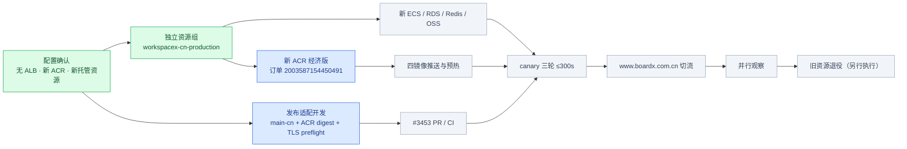

# 中国生产环境发布与初始化前提

状态日期：2026-09-12。目标域名：`www.boardx.com.cn`。本文件记录已确认的生产配置和现场实施证据；通用配置接口仍以 `cloud-provision-guide.md` 为准。

## 已确认架构

- 地域：华东 2（上海，`cn-shanghai`），减少现有上海数据迁移的跨地域流量。
- 隔离：新资源全部进入资源组 `workspacex-cn-production`，不复用现有 ACR、ALB、Redis 或 OSS。
- 入口：不使用 ALB。新 ECS 绑定独立公网 IP/EIP，Caddy/Nginx 仅开放 HTTPS 入口并反代本机 Web/API。
- 镜像：全新 ACR 企业版经济型实例 `workspacex-cn-prod`；私有 namespace `workspacex-prod`；Web、API、Deep Agent、Skill Sandbox 四个应用镜像固定到 digest。
- 数据：全新 RDS PostgreSQL 16 Serverless HA、Redis 7 HA/TLS 和私有 OSS ZRS；仅允许新 ECS 的 VPC 身份访问。
- 并行期：现有 Devapp 和旧生产继续运行。新系统通过 canary、业务探针和观察期后，另行执行旧资源退役。

## `main-cn` 发布分支

`main-cn` 是中国生产环境的发布指针，不承载日常开发。代码仍通过 PR 合入 `main`；发布时只允许把已经进入 `main` 的指定提交 fast-forward 到 `main-cn`。push 会触发 `deploy-cn-production`，同一时间只运行一个部署。

流水线在目标机验证以下条件后才调用 root 拥有的受信部署入口：

1. 发布 SHA 是当前 `main-cn` tip，并且属于 `origin/main` 历史。
2. canonical release manifest 的 `sourceRevision` 等于发布 SHA。
3. 四个应用镜像位于 `CN_ACR_REPOSITORY_PREFIX` 指定的新 ACR namespace，全部固定为 `@sha256` digest。
4. PostgreSQL/Redis 基础镜像仍在 canonical manifest 中固定 digest，但 production 使用托管 RDS/Redis，不要求将它们复制进 ACR。
5. runner 使用独立标签 `workspacex-cn-production`，GitHub Environment 固定为 `production-cn`；当前 Devapp workflow 不被触发。

## 五分钟 provision 之前必须完成

以下动作属于 prepare，不计入 300 秒：

- 新 ECS、VPC/vSwitch、安全组、EIP、RAM 实例角色、RDS、Redis、OSS 和 ACR 已创建并处于可用状态。
- 域名已备案；证书已签发并放入受保护引用；DNS 在 canary 阶段尚不替换旧记录。
- 四个应用镜像已构建、扫描并推入新 ACR，manifest 已解析到 digest；目标 ECS 已按 manifest 平台预拉镜像并校验 OCI source revision。
- RDS 开启 PostgreSQL `verify-full` 所需 TLS，应用、诊断、迁移、Graph、Memory runtime、Memory owner 身份和密码相互隔离。
- Redis 关闭 VPC 免密，启用 AUTH 与 TLS；OSS 桶为私有、ZRS、从未启用版本控制，ECS RAM role 只获得所需 prefix 权限。
- 目标主机已安装 Docker/Compose、AppArmor、反向代理和受信部署脚本；完整 release checkout/driver 已预置并验证。
- `adminEmail`、模型 endpoint/model id/key 引用、LangGraph 生产许可或生产 Agent 服务地址已提供。

计时内只允许：复核 profile/资源身份/缓存 digest，读取秘密引用，空库迁移和 bootstrap，启动服务，执行 HTTPS 登录、真实模型、OSS 文件和 Sandbox 业务探针。不得 clone/fetch、安装依赖、构建或冷拉应用镜像。

## 当前成本基线

| 新资源 | 月度估算 |
|---|---:|
| ECS + 系统盘 + 公网入口 | ¥391.66 |
| RDS PostgreSQL 16 Serverless HA | ¥380.00 |
| Redis 7 HA/TLS 1 GiB | ¥170.00 |
| OSS ZRS + 请求/流量预留 | ¥88.25 |
| 备份、日志、DNS/证书预留 | ¥200.00 |
| ACR 企业版经济型 | ¥117.00 |
| **合计** | **¥1,346.91/月** |

年化约 ¥16,162.92。该数额不含模型 token、公网超额流量、超额备份、税费和价格/优惠变化。ACR 现场下单价已于 2026-09-12 在上海区确认：¥117/月。

## 现场进度

绿色表示已完成，紫色表示有验收证据，蓝色表示正在执行，灰色表示尚未执行。只有云端业务探针和三轮墙钟证据通过后，canary 才能标紫；创建了资源本身不等于验收通过。
