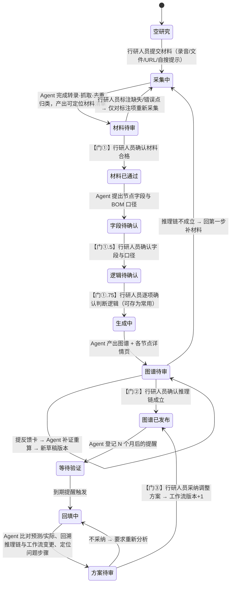

# Team3 活动图 → 完整需求分析（工作流状态机）

> 依据：需求文档 `agent-team3-frontier-track-research-2026-09-15.md` §4 的活动/时序图
> （原件为人类提供的三方时序图：领域专家（人）· 行研人员（人）· Web 应用（Agent））。
> 目的：把那张图**逐箭头**拆成可实现、可验证的状态机——因为活动图的本质不是"有哪些功能"，
> 而是"**什么状态下允许做什么**"。此前几轮实现补的是能力（能对话、能画图、能存版本），
> 没有补这张图真正在描述的东西：**一条带三道人工硬门的阶段流程**。

## 一、活动图读出来的核心结构

图里有三类信息，此前只实现了第①类：

| # | 信息类型 | 例子 | 现状 |
|---|---|---|---|
| ① | **动作**（谁做什么） | 上传录音、转录、去重归类、生成图谱 | 大部分已有能力 |
| ② | **状态**（流程走到哪） | 材料待审 / 材料通过 / 图谱待审 / 等待数月 | **完全没有** |
| ③ | **门**（不满足不许前进） | 三次「人工确认」 | **完全没有** |

需求文档 §4 图下那句话是本分析的判据原文：
> 三次人工确认是硬门：① 材料是否符合要求 ② 推理链是否成立 ③ 验证回填后的调整方案是否采纳。
> **任何一门不过，Agent 不得自动进入下一步，也不得自动发布图谱新版本。**

「不得」是约束，不是建议。约束必须由系统执行；写在 Agent 的 instructions 里只是请求——
模型可以不照做，而且**没有任何东西会发现它没照做**。这是本轮分析最重要的结论。

## 二、状态机（活动图的等价形式）

### 每个状态必须持有的数据

| 状态 | 必须持有 | 为什么（没有它这个状态就无法判定） |
|---|---|---|
| 采集中 | 每条材料的来源、类型、采集尝试次数 | 「仅对标注项重新采集」「两次失败即停」都要按条计数 |
| 材料待审 | 每条材料的三态（待审/缺失/错误）+ 审核意见 | 门①的判据本身 |
| 材料已通过 | 通过时间、通过人 | 后续图谱要能回答「基于哪一批材料」 |
| 字段/逻辑待确认 | 字段方案版本、判断逻辑模板版本 | 图谱结论必须能指回「按哪版逻辑算的」 |
| 图谱待审 | 草稿版本号、与上一发布版的差异 | 门②审的是差异，不是全图 |
| 图谱已发布 | 发布版本号、发布时间、依据的材料批次与逻辑版本 | 三个月后回溯根因要靠这三样 |
| 等待验证 | 到期时间、提醒次数 | 「最多三次后标逾期」 |
| 回填中 | 每条预测的实际值、判定（一致/部分/不一致） | 比对表是它的投影 |
| 方案待审 | 根因分类（框架性/执行性）、调整项清单 | 门③逐项采纳 |

## 三、逐箭头对照：活动图 vs 当前实现

> 现状截至 PR #3692（图谱版本化 + 内嵌 chat）。✅ 真的有；🟡 有能力但无状态/无门；❌ 没有。

| # | 活动图箭头 | 现状 | 差距说明 |
|---|---|---|---|
| 1 | 专家线下提供录音 | — | 系统外，无需实现 |
| 2 | 上传录音 + 指定 URL + 自搜提示 | 🟡 | 粘贴/上传/URL 可用；**自搜提示未实现**（Agent 不主动找）；录音转录工具在平台工具表里但从未验证 |
| 3 | 转录录音 | 🟡 | `wx_audio_transcribe` 对所有 agent 开放，未验证 |
| 4 | 按自搜提示检索 | ❌ | 明确未做 |
| 5 | 去重归类 | 🟡 | 只是 instructions 里的文字要求；**`interview-synthesis` 技能并未挂载**（系统预置 agent 的 skill 列表写死为空），没有任何机制保证「引文可定位」 |
| 6 | 展示整理后的材料待审核 | ❌ | 普通聊天文本，不是可逐条判定的清单 |
| 7 | 人工确认：材料是否符合要求（**门①**） | ❌ | 无状态、无门，Agent 可以直接往下走 |
| 8 | 标注缺失或错误点 | ❌ | 无逐条三态 |
| 9 | 重新采集（仅标注项） | ❌ | 无尝试次数、无范围限制 |
| 10 | 再次提交审核 | ❌ | 无循环 |
| 11 | 材料通过，进入第二步 | ❌ | 无「通过」这个事实 |
| 12 | 生成行业图谱 | ✅ | mermaid 围栏 → `ChatDiagramFabric` 真实渲染 |
| 13 | 生成各节点详情页 | ❌ | 无逐节点详情页产物 |
| 14 | 展示图谱与详情页（待审） | 🟡 | 图谱有版本线（PR #3692），但「待审」不是一个状态，发布不设门 |
| 15 | 人工确认：核实推理链（**门②**） | ❌ | 无门 |
| 16 | 返回第一步补充录音或 URL | ❌ | 无回退路径 |
| 17 | 提反馈卡 → 补证重算 | ❌ | 只能普通聊天说；无「拟变更清单 + 确认后才改」 |
| 18 | 等待数月后触发第三步 | ❌ | `wx_schedule_create` 存在，无人调用 |
| 19 | 提醒进行反馈 | ❌ | — |
| 20 | 回填验证结果与偏差点 | ❌ | — |
| 21 | 定位问题步骤（回溯推理链与工作流变更） | ❌ | — |
| 22 | 展示调整后的工作流（**门③**） | ❌ | — |

**统计：22 条箭头里，真正落地的是 2 条（12、14 的一半），能力具备但无状态无门的 4 条，其余 16 条未实现。**

## 四、结论：缺的是"脊柱"，不是"器官"

前几轮把器官做得不错——真实 Agent、真实 chat、真实图谱与版本线。但活动图描述的是一副**骨架**：
阶段推进 + 三道门。没有骨架时，所有器官只是散件：

1. **没有状态** ⇒ 界面无法回答「现在走到哪一步」，用户每次进来都要自己回忆。
2. **没有门** ⇒ 需求文档里那句「不得自动进入下一步」在系统里为假。Agent 完全可以拿一批
   没人审过的材料直接发布图谱，而这**不会触发任何红灯**。
3. **没有批次血缘** ⇒ 三个月后第三步要问「这个结论当时基于哪批材料、哪版判断逻辑」，
   今天答不出来——而这正是测试 C 的核心考点。

因此建议的下一步不是继续补单个界面（反馈卡、详情页…），而是**先立这根脊柱**：
一个研究会话的状态字段 + 状态机 + 三道门的服务端校验。上表里 ❌ 的大多数项，
挂到脊柱上之后才有确切含义；先做单个卡片只会得到一堆互不相关的 UI。

## 五、脊柱的最小实现形态（供拍板）

- 一张表记录「一个研究会话」的当前状态与血缘（状态、材料批次、字段方案版本、逻辑模板版本、
  当前发布图谱版本、下次验证时间）。
- 三道门各是一次**服务端校验**：不在正确的前置状态就拒绝推进，而不是靠提示词请求模型自觉。
- Agent 的越权尝试（例如未过门①就要发布图谱）应当**被拒绝并留痕**，而不是静默通过。

这需要新迁移，且要定「一个研究会话」与现有 chat 线程的关系（一条线程一个会话？还是一条线程多个？）——
属于需要人类拍板的产品决策，未擅自决定。
