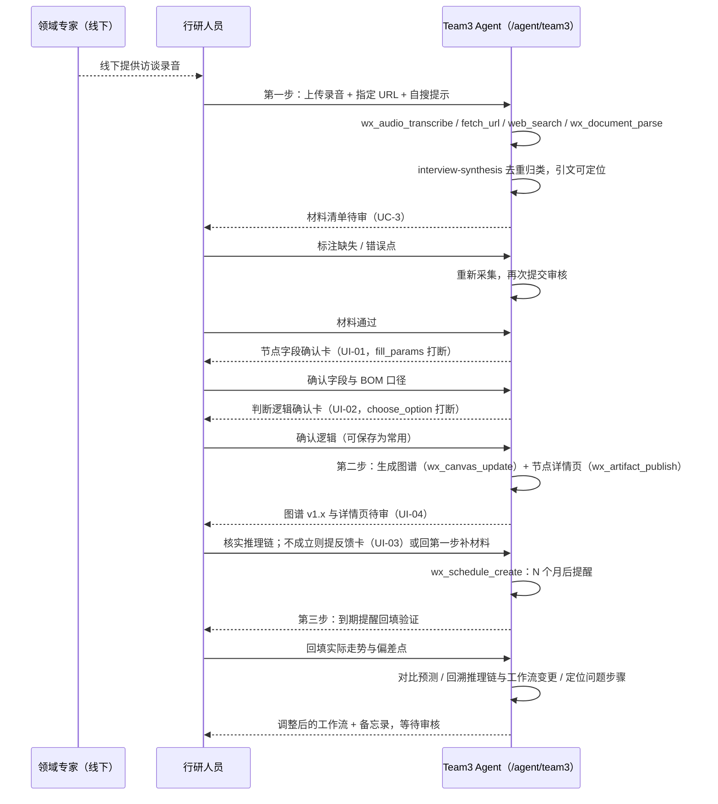

# Team3 Agent「前沿赛道技术路线研判」需求与交互设计（/agent/team3）

> 状态：需求草案 v1（2026-09-15，用户直接交办）。本文是**输入**，不是权威；权威永远是后续
> `pnpm harness new-phase --ui` 落出的 `phases/<phase>/feature_list.json`。
> 落地地址：`http://www.boardx.com.cn/agent/team3`（路由 `/agent/[teamId]`，slug `team3` 已由
> `apps/web/lib/mock/agent-previews.ts` 机械派生，页面 `apps/web/app/agent/[teamId]/page.tsx` 当前是只读占位）。

## 0. 结论与证据边界

- **要做什么**：把 `/agent/team3` 从占位页变成一个独立可用的 Agent 应用——「前沿赛道技术路线研判」。
  行研人员上传专家访谈录音 / 指定 URL / 让 Agent 自搜，Agent 转录、抓取、去重归类，人审后生成
  **产业链知识图谱 + 节点详情页**，再由人审核推理链；数月后 Agent 主动提醒回填验证结果，定位出错
  步骤并调整工作流。三步一循环，人审在每步之间。
- **能力复用原则**：本 Agent **不新造模型能力**。转录、抓取、检索、文档解析、画布、定时提醒、
  HITL 打断、长期记忆、产物发布全部复用仓内既有 tool / skill（§3 有逐项映射，含文件路径）。
  真正新增的只有**领域对象**（研究项目、材料、图谱及其版本、判断逻辑模板、反馈卡片、对话分支）
  和 **team3 专属的前端页面**。
- **需求来源（四份附件 + 仓库现状）**：
  1. HMW 卡：「我们如何能够帮助**投前行研人员**，在**研究新兴赛道时**，克服**赛道技术路线层面尚未收敛的问题**，从而**明确价值方向和验证逻辑**？」
  2. MAAU 画布（意图 / 用户 / 人与 Agent 分工 / 工作流 / 上下文 / 闭环验证）。
  3. 三方序列图（领域专家 → 行研人员 → Web 应用 Agent，三步 + 三次人工确认）。
  4. 《产业投资研判 Agent / UI 设计说明书 V5》UI-01 … UI-08（八张静态图，§6 逐张对应）。
  5. 《前沿赛道技术路线研判 大模型测试方案与模拟测试文件》v1.0：测试 A/B/C 三组材料 + 标准答案，
     本文直接拿它做**端到端评测集**（§9）。
- **证据边界**：本文只写需求与交互，未改任何运行时代码；§3 的能力映射均核对过仓内文件存在，
  但「能接上」≠「已接上」——接线属于后续 feature，按 ADR-023 契约束签核后开工。

## 1. Agent 定位

| 项 | 内容 |
|---|---|
| Agent 名称 | 前沿赛道技术路线研判（Team3） |
| 一句话 | 以量子计算为首个赛道的 Web 应用：行研人员采集专家录音与公开资料并人工审核，生成产业链图谱与详情页，数月后按实际走势反向校准判断逻辑。 |
| 服务对象 | 一级 / 二级市场投前行研人员、专门研究特定赛道的博士与论文作者 |
| 核心痛点 | 公开信息分散且滞后；专家访谈录音结构化难、无法系统追踪判断对错；跨赛道交叉机会（如 AIDC 上游碳化硅、通用芯片外溢）被忽略；新赛道缺少现成产业链图谱 |
| 价值口径 | 把「Agent 分析 + 人工校验 + 事后验证」固化成可复用产品流程，降低对个人经验的依赖 |
| 关键指标 | ① 预测命中率（被后续市场 / 政策验证的方向占比，每半年回看一次）② 单赛道研究耗时（从上传资料到可用图谱与详情页的日历天数）③ 判断逻辑可追溯率（详情页里每个结论能定位到原始材料推理节点的百分比） |
| 分工 | Agent：抓取、转录、整理、生成图谱与详情页、提醒反馈、定位问题；人（行研）：提供录音与 URL、审核材料、核实推理链、回填验证；人（领域专家）：仅线下提供录音，**不直接接触 Agent** |

## 2. 用户与角色

| 角色 | 在本 Agent 中能做什么 | 不能做什么 |
|---|---|---|
| 行研人员（researcher） | 创建 / 打开研究项目；上传录音、指定 URL、填写自搜提示；审核材料；确认字段与判断逻辑；审核图谱与推理链；提交反馈卡；回填验证结果；回看历史与分支 | 改 Agent 定义（系统提示词、工具白名单、技能挂载）；改别人项目 |
| 投研负责人（lead，只读） | 查看已发布图谱、版本差异、备忘录产物 | 发送对话、上传、改字段、确认逻辑 |
| 组织管理员（org admin） | 在 `/admin/agent/<id>` 配置 team3 Agent：模型、技能版本、工具白名单、降级策略、可见范围 | 代替行研人员做业务确认 |
| 领域专家（线下） | 不登录 | —— |
| 非 Workspace 组织用户 | 左栏「海创汇」入口不显示（`isAgentsNavVisibleForOrg`），直达 `/agent/team3` 由服务端门控拒绝 | —— |

## 3. 能力复用地图（现有 tool / skill → 本 Agent 的哪一步）

> 命名以 `packages/contracts/src/standard-*.ts` 与 `skills/**/SKILL.md` 为准；本表不是第二份事实源，
> 只做导航。「新增」列出的是本 Agent 真正要开发的东西。

| 工作流步骤 | 复用的 tool（模型可调用） | 复用的 skill（挂载到 Agent） | 需要新增 |
|---|---|---|---|
| 上传录音 → 转录 | `wx_audio_transcribe`（`standard-audio-tools.ts`；ASR 提供方 `infrastructure/recording/configured-realtime-asr-provider.ts`） | `audio-transcription`（保留时间段与识别局限）、`meeting-minutes`（≤60 分钟纪要，可选） | 转录后处理：去语气词 / 重复片段（测试文件 C 的 v2.2 需求），落为一个 skill 步骤而非新 tool |
| 指定 URL 抓取 / 自搜 | `fetch_url`、`web_search`（`standard-web-tools.ts`，出网走 `infrastructure/egress/`）；登录页或反爬页降级到 `browser_navigate` / `browser_snapshot`（`standard-browser-tools.ts`，`apps/browser-runtime`） | `web-research`（有界研究计划、保留冲突与缺口） | 自搜提示模板（赛道名 + 行研关心的维度 → 检索计划），作为 Agent instructions 一部分 |
| 上传 PDF / Word / 纪要 | `wx_document_parse`（`standard-document-tools.ts`） | `document-understanding`（表格、页码来源、扫描件 OCR 边界） | 无 |
| 去重、归类、摘要 | `wx_knowledge_search` / `wx_knowledge_read`（`standard-context-tools.ts`，PG FTS + pgvector） | `interview-synthesis`（WX-S010：可定位引文、主题与反例、不从样本推总体） | 材料状态机（待审 / 缺失 / 错误 / 通过），见 §5 UC-3 |
| 首次对话确认字段与口径（UI-01） | HITL 打断 `fill_run_params` → `fill_params`；`confirm_task_intent` → `confirm_intent`（`agent-interrupts.ts`） | —— | 「节点字段确认卡」的卡片 schema（固定属性 / 动态属性 / BOM 口径五项） |
| 确认判断逻辑（UI-02） | `choose_execution_option` → `choose_option`；`wx_memory_search` / `wx_memory_write`（`standard-memory.ts`，存历史教训） | `knowledge-grounded-answer`（有出处） | 判断逻辑模板库（S1…S6 步骤、可「保存为常用」、每步挂历史教训） |
| 生成产业链图谱（UI-04 / UI-08） | `wx_canvas_read` / `wx_canvas_update`（`standard-canvas-tools.ts`，Mermaid 白名单 `domain/canvas/mermaid-whitelist.ts`，版本冻结 `instance-version-freeze.ts`） | `diagram-and-canvas`（保留对象身份、处理版本冲突） | 图谱节点 / 边的领域对象 + 逐节点固定属性 / 动态属性 / 依据 / 判断逻辑；多图谱（产业链总览、整机 BOM 拆分、专题） |
| 节点详情页 / 备忘录 | `wx_artifact_publish` / `wx_artifact_download`（`native-artifact-publish.ts`，`agent_artifacts` 表） | `project-status-report`、`internal-communications`（≤800 字管理层备忘录） | 详情页模板 |
| 图谱版本与差异（UI-06） | 画布版本冻结 + `agent_artifact_versions` | —— | 逐属性对照表、变化来源（哪次对话触发）、影响范围 |
| 反馈卡与拟变更（UI-03） | `interject-run.ts` 打断 + `choose_option` | —— | 反馈卡对象（问题环节 / 诊断 / 修正 / 拟变更清单 / 同步影响）；「提交反馈不直接改图谱」规则 |
| 数月后提醒反馈（第三步） | `wx_schedule_create` / `list` / `cancel`（`standard-schedule.ts`，一次性 + cron，≤20 条 / 用户；通知 `schedule-notifications.ts`） | —— | 提醒到期 → 自动开一轮「验证回填」对话的入口 |
| 回填验证、定位问题步骤 | `wx_run_status`、执行日志 `agent_execution_events`（`execution-journal.ts`）、`agent_run_context_snapshots` | `data-analysis`（WX-S007，预测 vs 实际对比表）、`data-visualization`（WX-S020） | 工作流版本变更记录对象（v1.0 → v2.2 那种）+「变更影响评估」提示 |
| 对话历史与分支（UI-05 / UI-07） | 线程 / run 模型（`chat_thread_agents`、`agent_runs`）、`context-snapshot.ts` | —— | 历史只读态、「从历史新建分支」「基于最新继续」两种延续 |
| 流式与打断 UI | AG-UI over SSE（`streaming-transport.ts`、`agui-bridge.ts`、`apps/web/app/chat/copilotkit-v2/[threadId]/`） | —— | team3 页面壳：研究对话 / 知识图谱两个 tab |
| Agent 定义与治理 | `AgentDefinition`（`apps/api/src/domain/agent/definition.ts`）：`instructions`、`modelId`、`skillMounts[]`（版本钉死）、`toolWhitelist[]`、`degradePolicy`；`authorizeToolCall` 三层交集 | —— | team3 的 starter 定义（§7） |
| 把访谈提炼为 MAAU 画布（可选） | —— | `maau-canvas`（WX-S021） | 无；供行研在项目启动时复述需求 |

## 4. 端到端交互总览



三次人工确认是硬门：① 材料是否符合要求 ② 推理链是否成立 ③ 验证回填后的调整方案是否采纳。
任何一门不过，Agent 不得自动进入下一步，也不得自动发布图谱新版本。

## 5. 用例（UC-T3-x）

> 每个用例沿用 `.harness/templates/requirements.template.md` 的 R 节编号（R1 概览 / R2 前置 / R3 主流程 /
> R4 异常 / R5 权限 / R6 后置与不包含 / R7 规则 / R8 界面线索 / R10 依赖）。R3、R4、R5 不跳过。
> 章节 ID 是 `spec_ref` 锚点，标题可改 ID 不改。

### UC-T3-1 进入 team3 并选择研究项目

- **R1**：行研人员从「海创汇」卡片或直接输入 `/agent/team3` 进入；目标是落到一个研究项目的对话页。系统边界：`apps/web/app/agent/[teamId]`、项目域（`mod-project`）。
- **R2**：已登录且属于 Workspace 组织；team3 Agent 已由管理员发布（`publishState = published`）。
- **R3**：
  1. 用户打开 `/agent/team3` → 页面顶栏显示 Agent 名「前沿赛道技术路线研判」+ 项目下拉（如「量子计算产业研究」）+ 「演示数据」标签（仅当项目为演示项目）。
  2. 无项目时 → 引导创建：项目名、赛道、目标周期；创建后进入 UC-T3-2。
  3. 有项目时 → 默认打开最近项目的「研究对话」tab；右上角显示阶段状态（研究方案待确认 / 字段已确认·逻辑待确认 / 当前图谱 v1.3）。
- **R4**：A1 `teamId` 不在名单 → `notFound()`（已实现）。E1 Agent 未发布 → 页面显示「该 Agent 尚未发布」，不显示输入框。E2 用户无该项目权限 → 项目下拉不列出。
- **R5**：researcher 可进入并创建项目；lead 只读；非 Workspace 组织服务端 403。
- **R6**：后置——当前项目 id 写入用户偏好，下次直达。不包含——多 Agent 间切换（那是 `/agent` 首页的事）。
- **R8**：UI-01 顶栏；`data-testid="agent-team-page" data-team="team3"`（已存在）。

### UC-T3-2 第一步：上传录音 / 指定 URL / 自搜提示，采集与整理

- **R1**：行研人员把线下拿到的录音、想让 Agent 读的 URL 和一句自搜提示交给 Agent；Agent 产出**可定位**的材料清单。边界：录音 / 文档 / web 三类 tool，`interview-synthesis` skill。
- **R2**：项目已存在；文件类型在允许范围（音频、PDF、Word、图片、纯文本）。
- **R3**：
  1. 用户在输入框「上传文件」或拖入 → 系统显示文件卡（名称、大小、类型）。
  2. 用户粘贴 URL（可多条）+ 填写自搜提示（如「量子计算超导与离子阱 2024 年以来的进展与瓶颈」）→ 点发送。
  3. Agent 先用 `confirm_task_intent` 复述任务：「将转录 1 段 42 分钟录音、抓取 3 个 URL、按提示自搜；产出材料清单待审」→ 用户确认。
  4. Agent 逐项执行：`wx_audio_transcribe`（保留时间码）、`fetch_url`（失败则 `browser_navigate`）、`web_search`、`wx_document_parse`；流式显示每个 tool 的开始 / 结束（AG-UI `tool_call_start/end`）。
  5. Agent 用 `interview-synthesis` 去重、归类（技术里程碑 / 工程瓶颈 / 专家原话 / 转述 / 产业链环节 / 政策），每条带来源（文件 + 页码或时间码或 URL）。
  6. Agent 输出「材料清单待审」卡：按类别列出条目、来源、置信度、缺口（如「未获取到第三方对良率的验证」）。进入 UC-T3-3。
- **R4**：A1 无录音只有 URL → 跳过转录。A2 自搜提示为空 → 不自搜，只处理给定材料，并提示可补自搜。E1 转录失败（ASR 不可用）→ 该文件标「转录失败·可重试」，其他材料继续。E2 URL 抓取 403 / 登录页 → 标「不可访问」，**不**尝试绕过（`web-research` skill 边界）。E3 录音超过 ASR 上限 → 分段转录并标注段落边界。E4 材料之间存在矛盾（如企业自述已量产 vs 政策附件未过中期评估）→ 不裁决，**并列**两条并标「冲突」，交人审。E5 用户中途离开 → run 继续到出卡为止，回来可在历史里看到。
- **R5**：researcher 可上传、发送；lead 不能。所有 tool 调用受 `authorizeToolCall` 三层交集 + `toolWhitelist`。
- **R6**：后置——原始文件不可变落 `artifact_version`；材料清单成为项目知识库可检索（`wx_knowledge_search`）。不包含——从录音中识别说话人身份（专家匿名即可）。
- **R7**：**专家原话与 Agent 转述必须区分标注**；每条材料必须能锚定到页码 / 时间码 / URL（`architecture.md` 「每个 AI 引用必须可锚定」）；不允许编造来源。
- **R8**：UI-01 的输入区（上传文件 / 选择节点 / 支持 PDF、Word、图片、拖入）。
- **R10**：`standard-audio-tools.ts`、`standard-web-tools.ts`、`standard-document-tools.ts`、`skills/standard-methods/interview-synthesis`。

### UC-T3-3 人工审核材料：标注缺失 / 错误 → 重新采集 → 再审

- **R1**：行研人员对材料清单逐条判「通过 / 缺失 / 错误」，Agent 只对被标注项重新采集。
- **R2**：UC-T3-2 已出「材料清单待审」卡。
- **R3**：
  1. 用户在卡上逐条勾选状态，可写一句原因（「良率数据要产线原话不要产线报告口径」）。
  2. 用户点「提交审核结果」→ Agent 用 `choose_execution_option` 给出重采方案（补搜 / 重新解析指定页 / 需要用户补材料）。
  3. 用户选定 → Agent 只重做被标注项，产出增量清单，再次进入审核。
  4. 全部通过 → 卡片状态「材料通过」，页面右上阶段变「研究方案待确认」，进入 UC-T3-4。
- **R4**：A1 用户直接全部通过 → 跳到 UC-T3-4。E1 重采后仍缺 → 条目标「缺证待补」，允许带缺口进入下一步，但图谱节点会继承「待补证」状态。E2 两次重采仍失败 → Agent 停止自动重试，明确要求用户补材料。
- **R5**：只有项目成员中的 researcher 可审核；审核记录带审核人与时间。
- **R6**：后置——材料状态机终态；审核意见写入 `wx_memory_write`（作为该项目「历史教训」候选）。不包含——多人会签。
- **R7**：**没有通过审核的材料不得进入图谱生成**；重采只针对标注项，不重跑全量。
- **R8**：材料卡的三态徽标；序列图中「标注缺失或错误点 → 重新采集 → 再次提交审核」。

### UC-T3-4 首次对话确认节点字段与拆分口径（UI-01）

- **R1**：Agent 在生成图谱前，先让用户确认节点要展示哪些字段、BOM 拆分按什么口径。
- **R2**：材料通过。
- **R3**：
  1. Agent 识别候选节点（如「低温制冷设备」「测控系统」），以可点击 chip 展示，并注明来源（专家访谈纪要·第 6 页）。
  2. 用户提出展示诉求（「节点要展示组成构件和价值占比」）。
  3. Agent 发出「确认节点展示字段」卡（`fill_run_params` 打断）：**固定属性**＝产业概述 / 涉及公司 / 产业技术发展方向；**动态属性**＝按对话确认（组成构件 / 价值占比 / 行业发展趋势）；**BOM 口径**五项必填＝拆分范围、价值口径、占比分母、覆盖与地域、时间与币种。
  4. 用户「继续调整」（回到对话改字段）或「确认字段」→ 状态「字段已确认·逻辑待确认」，进入 UC-T3-5。
- **R4**：A1 用户不做 BOM 分析 → BOM 口径块隐藏，不强制。E1 用户确认时 BOM 五项有空 → 按钮禁用并提示哪项缺。E2 固定属性在材料中无值 → 保留字段，值标「待补证」，不允许删固定字段。
- **R5**：researcher 确认；lead 只能看到卡片的最终态。
- **R6**：后置——字段方案带版本号写入项目；后续图谱节点按此方案渲染。不包含——跨项目共享字段方案（先项目内）。
- **R7**：**固定字段永不删除，未知值待补证**；BOM 必须确认分母、价值口径、范围、期间和币种，缺一不得进入生成。
- **R8**：UI-01 整页；卡片状态徽标「待确认」。

### UC-T3-5 首次对话确认判断逻辑（UI-02）

- **R1**：对每个判断类动态属性（行业发展趋势、产业技术发展方向……），Agent 引用常用模板给出步骤，用户逐项确认，并在对应步骤看到历史教训。
- **R2**：字段已确认。
- **R3**：
  1. Agent 检索判断逻辑模板库（先项目内，再组织内），建议「复用需求趋势判断 v1.2」，并用 `wx_memory_search` 拉历史教训。
  2. 用户可插话约束（「意向订单不能当成真实需求」）。
  3. Agent 发「确认判断逻辑·行业发展趋势」卡：S1 明确行业地域与时间 → S2 区分意向、合同和实际交付 → S3 检查技术供给与竞争 → S4 比较同口径量价成本 → S5 检查反证及替代情景 → S6 输出有条件的趋势判断。每步可展开：输入 / 动作 / 输出 / 假设 / 反证 / 缺证处理 / 经验来源。相关步骤下显示教训（「S2 曾因漏查订单状态误判」）。
  4. 用户「保存为常用」（写模板库，带版本）/「继续调整」/「确认此项逻辑」。全部判断属性确认后进入 UC-T3-6。
- **R4**：A1 无模板可复用 → Agent 起草新逻辑并标「新建·未验证」。E1 用户改了某步 → 模板生成新小版本，不覆盖旧版（旧图谱仍指向旧版）。E2 某步无法执行（材料不含所需输入）→ 该步标「缺证处理」并说明降级方式。
- **R5**：researcher 确认与保存模板；模板可见范围＝项目 → 组织，由管理员决定是否提升。
- **R7**：**判断逻辑先确认后执行**，未确认的属性不得出现「正式分析结果」；每条历史教训必须能指回它来源的对话或反馈卡。
- **R8**：UI-02 整页。
- **R10**：`standard-memory.ts`（教训存取）；模板库为新增领域对象。

### UC-T3-6 第二步：生成产业链图谱与节点详情页（UI-04、UI-08）

- **R1**：Agent 按已确认字段与逻辑生成图谱（节点 + 关系 + 状态）和每个节点的详情页；同一项目可有多张图谱。
- **R2**：字段与逻辑均已确认。
- **R3**：
  1. Agent 调 `wx_canvas_update` 写图谱源（Mermaid 白名单内的 graph 语法 + 节点属性块），节点分区「上游 / 中游 / 下游 / 应用」，边带关系词（供应 / 应用 / 能力复用）。
  2. 每个节点状态之一：优先研究 / 持续观察 / 待补证 / 未评估。
  3. Agent 为每个节点发布详情页产物：固定属性、已确认动态属性、依据（可点击回源）、判断逻辑（模板名 + 版本）。
  4. 页面「知识图谱」tab：左侧图谱选择（产业链总览 / 整机 BOM 拆分 / 专题…，可搜索、加载更多）、节点搜索、历史版本下拉、缩放与适应画布；右侧「节点详情」抽屉；底部「带入研究对话」按钮把图谱 + 节点 + 版本作为引用插入对话。
  5. 首版生成后图谱状态「待审核」，用户核实推理链后点「发布 v1.0」→ 才算正式版本。
- **R4**：A1 材料只够部分节点 → 其余节点「未评估」，不编造。E1 画布写入版本冲突（`conflict-resolution.ts`）→ Agent 重读再写，仍冲突则交人。E2 Mermaid 超白名单 → 生成失败并显示原因，不降级成纯文本冒充图谱。E3 图谱节点 > 200 → 按上中下游分图谱，总览只保留一级节点。
- **R5**：researcher 生成、审核、发布；lead 可看已发布版本；未发布草稿只对项目成员可见。
- **R6**：后置——图谱版本 v1.0 冻结（`instance-version-freeze.ts`）；每个节点详情页作为 `agent_artifact` 落项目文件浏览器。不包含——图谱手工拖拽编辑（先只经对话修改）。
- **R7**：**每个结论必须锚定到材料**；未确认逻辑的属性不出结论；**图谱不自动发布**。
- **R8**：UI-04（节点详情、历史下拉）、UI-08（图谱选择器；「旧图谱界面工具栏统一按此图补充」）。
- **R10**：`standard-canvas-tools.ts`、`domain/canvas/*`、`native-artifact-publish.ts`、`skills/standard-canvas/diagram-and-canvas`。

### UC-T3-7 图谱历史、版本差异与触发对话（UI-06）

- **R1**：用户能看任一历史版本，逐属性比较两个版本，知道变化原因与来源对话。
- **R2**：图谱至少两个已发布版本。
- **R3**：
  1. 历史版本下拉列出 v1.1 … v1.4，每条带时间与摘要（「补充测控系统」「即时修正已生效」）。
  2. 选某版本 → 画布只读显示该版本，顶部提示「正在查看历史版本 vX · 只读」+「返回最新版本」。
  3. 点「比较 v1.3 与 v1.4」→ 右侧显示逐属性对照表（属性 / v1.3 / v1.4），并列「变化来源」（即时修正 / 反馈卡）、「触发对话」（可跳转）、「影响范围」。
  4. 「带入研究对话」引用历史节点，不改原版本。
- **R4**：A1 v1.4 尚未审核发布 → 比较表中 v1.4 列显示「待审核」，不显示具体新建议。E1 历史版本对应的画布快照缺失 → 显示「快照不可用」并给出最近可用版本。
- **R5**：lead 可看历史与差异；researcher 同上并可带入对话。
- **R7**：**背景画布始终显示所选版本，不混入未发布值**；比较表分别标明两个版本。
- **R8**：UI-06 整页。

### UC-T3-8 反馈卡片与图谱变更（UI-03）

- **R1**：用户在对话里纠正某个假设（「兑现时间按 4 年不是 2 年」），Agent 定位问题环节、给方案与拟变更清单，确认后才补证重算。
- **R2**：图谱已有当前版本。
- **R3**：
  1. 用户发一条修正 → Agent 用 `interject-run` 打断当前 run。
  2. Agent 发「反馈卡·低温制冷设备」：问题环节（商业化窗口判断 v1.2 / S3 客户验证）、诊断、修正；「当前图谱拟变更·基础 v1.3」表：对象 / 原值 / 拟变更（4 年·用户情景 / 建议待重算 / 综合判断待重新综合）；同步影响；经验候选（写入 S3 教训）。
  3. 用户「继续调整」或「确认方案」→ Agent 补证、重算 → 出新版本草稿待审（回 UC-T3-6 第 5 步）。
- **R4**：A1 用户修正的是「用户情景」不是事实 → 拟变更标「用户情景」，不覆盖材料证据。E1 补证失败 → 新版本只改假设，建议状态「待重算」，不给伪结论。
- **R5**：researcher。
- **R7**：**提交反馈时当前图谱不变**；方案确认后重算，再审核结果；经验候选必须经用户勾选才进模板教训。
- **R8**：UI-03 整页。

### UC-T3-9 对话历史回看与两种继续方式（UI-05、UI-07）

- **R1**：用户能回看任一历史对话（含当时图谱链接），并选择「从历史新建分支」或「基于最新版本继续」。
- **R2**：项目至少一条历史对话。
- **R3**：
  1. 顶栏「对话历史」打开左侧抽屉：可搜索，按日期分组，每条带标题、主线 / 历史分支、关联图谱版本。
  2. 点某条 → 主区只读回放，顶部黄条「正在查看历史对话 · 图谱 v1.2 · 只读」，发送 / 上传 / 选择节点禁用；消息内嵌「当时图谱 v1.2」卡：查看当时图谱 / 继续此处研究。
  3. 「继续此处研究」→ 弹窗列「与当前版本的差异」，两个选项：**从历史新建分支**（沿用 v1.2 材料与已确认方法，独立继续，不改主线）/ **基于最新版本继续**（用 v1.3，保留历史引用，生成新修订方案供审核）。
  4. 选定 → 新对话线程创建，输入恢复可用；关闭抽屉恢复常规布局。
- **R4**：A1 历史对话引用的材料已被删除或过期 → 新建分支前提示「重新检查可用性」并列缺失项。E1 权限变化（用户已失去某材料权限）→ 分支不带该材料并标注。
- **R5**：researcher；lead 只能回看不能继续。
- **R7**：**两种延续都不自动发布图谱**；编辑或重新生成保留原记录。
- **R8**：UI-05、UI-07。
- **R10**：线程 / run 模型；`context-snapshot.ts`。

### UC-T3-10 第三步：数月后提醒反馈、回填验证、定位问题步骤、调整工作流

- **R1**：图谱发布后 Agent 按用户设定的周期（默认 6 个月，可改）提醒回填；用户回填实际走势，Agent 对比预测、回溯推理链与工作流变更记录，定位问题步骤，给结构性调整方案与备忘录。
- **R2**：图谱已发布且用户设定了验证周期。
- **R3**：
  1. 发布 v1.0 时 Agent 调 `wx_schedule_create`（一次性，用户时区）→ 页面显示「将于 2027-03-15 提醒验证」，可改 / 取消。
  2. 到期 → 通知（站内 + 邮件出站走平台 outbox）→ 用户进入项目，Agent 自动开启「验证回填」对话，列出当时的预测清单（事项 / 初判 / 置信度）。
  3. 用户逐条回填实际情况（可上传新录音、新纪要，走 UC-T3-2）。
  4. Agent 产出「预测对比表」（一致 / 部分一致 / 不一致）；对每条不一致回溯：命中哪一步判断逻辑、当时置信度、期间工作流版本变更（如 v2.1 删除政策扫描步骤）、新材料是否推翻默认前提。
  5. Agent 区分**框架性问题**（如缺「变更影响评估」机制、专家分歧未当信号）与**执行性问题**（如低置信度结论被高权重使用），给结构性调整方案（恢复步骤 / 新增步骤 / 排序引入商业验证权重），并生成 ≤800 字资源配置备忘录产物。
  6. 用户审核 → 采纳项写入判断逻辑模板新版本与工作流变更记录，提醒下一周期。
- **R4**：A1 用户提前触发验证 → 同流程，提醒取消并重设。E1 提醒到期用户长期未回 → 每两周再提醒一次，最多三次后停止并在项目状态里标「验证逾期」。E2 新材料中出现相反的专家判断 → 不裁决，记为「领域未收敛信号」进入方案。E3 `wx_schedule_create` 超过每用户 20 条上限 → 提示合并或清理。
- **R5**：researcher 回填与审核；lead 可看对比表与备忘录。
- **R6**：后置——命中率指标更新（§1 指标①）；工作流变更记录多一条。不包含——自动从外部数据源抓市场实际走势（先由人回填）。
- **R7**：**低置信度结论不得作为高权重输入**（显示置信度并在综合时加权）；删除工作流步骤必须附「变更影响评估」，否则不允许保存为常用。
- **R8**：待 UI 先行阶段产出（UI 说明书 V5 未覆盖第三步界面：预测对比表、变更记录、备忘录）。
- **R10**：`standard-schedule.ts`、`schedule-notifications.ts`、`execution-journal.ts`、`skills/data-workflows/data-analysis`。

### UC-T3-11 管理员配置 team3 Agent

- **R1**：组织管理员在后台把 team3 定义为一个已发布 Agent，钉死技能版本与工具白名单。
- **R2**：管理员权限；所需 skill 已在平台目录。
- **R3**：管理员在 `/admin/agent/<id>` 填 §7 定义 → 试跑（走测试文件 A）→ 发布 → `/agent/team3` 绑定到该 agentId。
- **R4**：E1 `instructions` 为空 → 不可发布（`AGENT_NO_EXECUTABLE_DEFINITION`）。E2 工具白名单缺 `wx_audio_transcribe` → 试跑时 UC-T3-2 报「工具未授权」，发布前必须补齐。
- **R5**：仅 org admin。
- **R7**：技能挂载必须版本钉死；模型只能一个（`modelId` 单值）。
- **R10**：`domain/agent/definition.ts`、`agent-runtime.ts`。

## 6. UI 说明书 V5 八张图 ↔ 用例对照

| 图 | 内容 | 用例 |
|---|---|---|
| UI-01 首次对话确认节点字段 | 固定 / 动态属性 + BOM 五项口径 | UC-T3-4 |
| UI-02 首次对话确认判断逻辑 | S1–S6 步骤、历史教训、保存为常用 | UC-T3-5 |
| UI-03 反馈卡片与图谱变更 | 问题环节 / 诊断 / 修正 / 拟变更清单 | UC-T3-8 |
| UI-04 知识图谱与节点详情 | 图谱布局、历史下拉、节点详情抽屉 | UC-T3-6 |
| UI-05 对话历史列表与回看 | 抽屉、只读态、当时图谱链接 | UC-T3-9 |
| UI-06 图谱历史、版本差异与触发对话 | 逐属性对照、变化来源 | UC-T3-7 |
| UI-07 继续历史研究的两种方式 | 新建分支 / 基于最新继续 | UC-T3-9 |
| UI-08 选择图谱，再选择历史版本 | 多图谱选择器 | UC-T3-6 |

第一步（采集与人审材料）和第三步（验证回填）在 V5 里**没有界面**，属「原型缺口」，由 ui-prototyper 在签核前补画。

## 7. team3 Agent 定义草案（管理员录入用）

```jsonc
{
  "name": "前沿赛道技术路线研判",
  "role": "industry-research",
  "roleLabel": "行研 Agent",
  "modelId": "<部署已配置的 OpenAI 兼容模型>",
  "instructions": "你是投前行研的研究助手。三步循环：采集与整理 → 图谱与详情页 → 事后验证。每一步之间等待人工确认；专家原话与转述分开标注；每个结论带来源；材料矛盾并列不裁决；判断逻辑先确认后执行；低置信度不作高权重输入；不自动发布图谱。",
  "skillMounts": [
    "audio-transcription@<pinned>", "document-understanding@<pinned>", "web-research@<pinned>",
    "interview-synthesis@1.0.0", "knowledge-grounded-answer@<pinned>", "diagram-and-canvas@<pinned>",
    "data-analysis@1.0.0", "data-visualization@1.0.0", "project-status-report@<pinned>",
    "internal-communications@<pinned>", "maau-canvas@3.0.0"
  ],
  "toolWhitelist": [
    "wx_audio_transcribe", "wx_document_parse", "fetch_url", "web_search",
    "browser_navigate", "browser_snapshot", "browser_take_screenshot",
    "wx_knowledge_search", "wx_knowledge_read", "wx_project_read",
    "wx_memory_search", "wx_memory_write",
    "wx_canvas_read", "wx_canvas_update", "wx_artifact_publish", "wx_artifact_download",
    "wx_schedule_create", "wx_schedule_list", "wx_schedule_cancel",
    "wx_run_status"
  ],
  "degradePolicy": "ASR 或出网失败时只降级该材料项，不中止整轮；模型不可用时保留已产出卡片并提示重试",
  "visibility": "org:Workspace"
}
```

不给 `wx_memory_delete`、`wx_image_generate`、SQL 工具、`wx_skill_create_draft`、MCP 外部工具。
`browser_*` 三个工具的副作用等级为只读；任何「对外发送 / 写入外部」类工具不在白名单。

## 8. 新增领域对象（草图，契约束签核时定稿）

| 对象 | 关键字段 | 说明 |
|---|---|---|
| research_project | id, orgId, name, track, verifyCycleMonths, currentGraphId | 一个赛道一个项目 |
| research_material | id, projectId, kind(audio/url/doc/search), artifactVersionId, status(pending/missing/wrong/passed), reviewNote, anchors[] | UC-T3-2/3 |
| field_scheme | id, projectId, version, fixed[], dynamic[], bom{scope,valueBasis,denominator,coverage,periodCurrency} | UC-T3-4 |
| judgement_template | id, scope(project/org), name, version, steps[{id,input,action,output,assumption,counter,missingEvidence,lessons[]}] | UC-T3-5 |
| research_graph / graph_version | graphId, projectId, kind(overview/bom/topic), version, canvasVersionId, status(draft/published), changeSource, triggerThreadId | UC-T3-6/7 |
| graph_node | graphVersionId, key, tier, status, fixedAttrs, dynamicAttrs, evidence[], templateRef | 详情页数据源 |
| feedback_card | id, projectId, nodeKey, problemStep, diagnosis, fix, proposedChanges[], status | UC-T3-8 |
| conversation_branch | threadId, parentThreadId, mode(branch/continue), baseGraphVersionId | UC-T3-9 |
| workflow_change_log | projectId, version, change, reason, impactAssessment | UC-T3-10 |
| prediction / verification | projectId, graphVersionId, item, forecast, confidence, actual, verdict, rootCauseStepId | UC-T3-10 |

## 9. 端到端评测集与通过标准（直接取自测试方案 v1.0）

| 测试 | 输入 | 走的用例 | 通过标准 |
|---|---|---|---|
| A 专家访谈转录稿（基础提取） | 40 分钟量子计算访谈（超导 vs 离子阱） | UC-T3-2 → 3 | 里程碑 ≥5 且带原文位置；两条路线瓶颈用**原话**；「2030 前商用容错」判断归拢 ≥3 条论据，且识别反问句论据；3 项优秀 / 2 项通过 |
| B 产业链纪要 + 三省政策 + 内部研讨（综合关联） | 三份材料含矛盾与隐性风险 | UC-T3-2 → 6 | 上中下游国产化程度成图；矛盾 ≥2 处并列并给采信理由；隐性风险（EDA 空白、人才断层）命中 ≥1；≤500 字切入点建议 |
| C 年度复盘（复杂决策支持） | 初判报告、8 个月走势、对比表、工作流变更记录、两份新录音 | UC-T3-10 | 逐条比对一致性；根因命中 ≥4（含「默认前提被新录音推翻」「删除政策扫描步骤与新订单的因果」「低置信度被高权重使用」「专家分歧即信号」）；框架方案具体可执行；≤800 字备忘录 |

评测跑在 `.harness/instructions/real-model-e2e.md` 的真实模型 lane；材料文件入库 `phases/<phase>/requirements/fixtures/`，
标准答案只给评分脚本不给被测 Agent。

## 10. 非功能约束

- **性能**：42 分钟录音转录 + 3 个 URL + 自搜，出「材料清单待审」≤ 10 分钟（流式可见进度）；图谱生成 ≤ 3 分钟；页面首屏 ≤ 2 秒。
- **安全 / 隐私**：录音与文档原件走 S3 兼容对象存储，RLS 按组织隔离；出网只经 egress 守卫；不向外部发送任何材料（白名单无对外发送类工具）；凭据不进产物与日志。
- **合规**：演示项目用测试方案的虚构材料，页面显示「演示数据」；真实项目不得混用演示材料。
- **兼容与降级**：ASR / 出网 / 模型任一不可用只降级该项，已产出卡片保留；无 `KERNEL_MODEL_STREAM_ENABLED` 时退化为非流式但功能完整。
- **可观测**：每次 tool 调用进 `agent_execution_events`；命中率、耗时、可追溯率三指标由脚本从 `prediction / verification` 与 `graph_node.evidence` 聚合。

## 11. 不包含（本期明确不做）

- 领域专家直接使用 Agent（他们只线下提供录音）。
- 图谱手工拖拽编辑、多人实时协作编辑（现有画布是 LWW，不引入 Yjs）。
- 自动从外部数据源抓取「市场实际走势」做验证（先人工回填）。
- 跨组织共享判断逻辑模板。
- 除量子计算之外的赛道模板（架构不限赛道，但演示与评测只做量子计算）。

## 12. 交付建议与下一步

1. `pnpm harness new-phase --id 16 --name frontier-track-research-agent --ui`，把本文按 UC 拆入
   `phases/phase-16-*/requirements/`（§5 每个 UC 一份 `uc-t3-N-*.md`，保留 R 节 ID）；测试材料入 `fixtures/`。
2. 契约束按能力域切三束：**采集与审核**（UC-2/3）、**字段·逻辑·图谱**（UC-4/5/6/7/8/9）、**验证闭环**（UC-10）+ 管理配置（UC-11）；
   每束一份 `design-signoff.md`（UI / 用例 / API 契约三节），第一步与第三步界面先由 ui-prototyper 补画。
3. requirement-author 生成 `feature_list.json`，verification 锚定真实 `data-testid`（沿用 `agent-team-page`）。
4. 实施顺序：UC-11（定义可发布）→ UC-2/3（材料闭环，能跑测试 A）→ UC-4/5/6（图谱，能跑测试 B）→ UC-7/8/9 → UC-10（能跑测试 C）。
5. 每个 feature 一个 issue 一个 PR，`harness verify` 门控转 passing；本文不再另存工时表。
