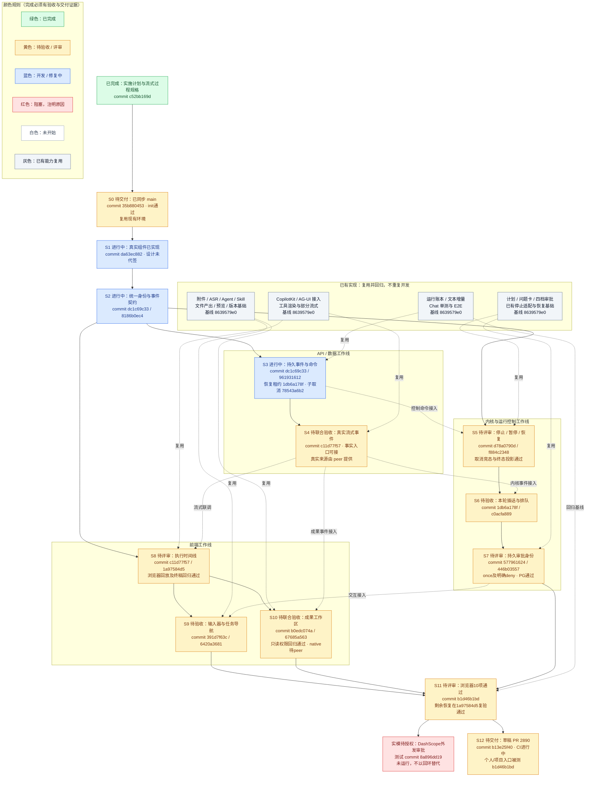
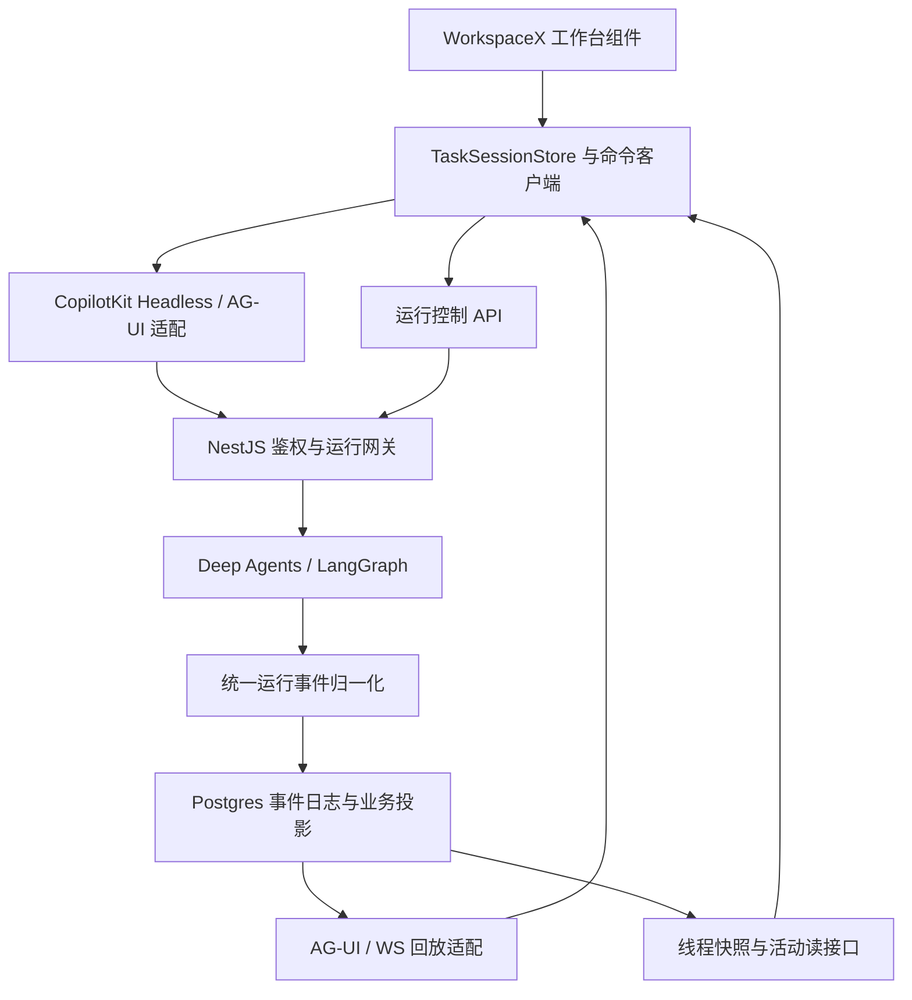

# WorkspaceX Agent 工作台一次性交付重构计划

日期：2026-09-06。状态：实施中；2026-09-07 用户直接授权独立 worktree、并行 subagent、逐单元 commit、最终一个 PR。跟踪 issue：#2867；不代改设计签核状态。

## 开发进度图（更新于 2026-09-07 03:43 Asia/Shanghai）

本图是本升级项目的进度展示入口。初始化依据为本计划已记录的代码调查，尚未重新核实远端部署。灰色表示已有代码可复用，不等于本次验收通过；绿色只用于有证据的已完成项。目前已通过新 worktree 初始化，三路实施并行；S0–S12 尚未完成实施验收，不计算虚假的完成百分比。



实线表示主要实施顺序；虚线表示复用或集成依赖。三条工作线可以在 S2 后按契约分别开发，虚线依赖未就绪时只允许独立模块工作，不能宣告端到端完成。S5 的控制适配可以提前开发，但真实接入与验收依赖 S3；S8 的组件可以先做，真实 streaming 验收依赖 S4。共享 provider、executor、harness.py 的修改仍按文件所有权串行集成。当前运行环境并发上限为协调者加三个执行槽，Review 阶段腾出执行槽。

### 如何使用本图更新进度

1. 保持 S0–S12 节点 ID 稳定。正式 feature 创建后，在对应实施步骤下记录 feature/issue/PR/evidence 引用；本图只投影状态，`feature_list.json` 经 harness 读取的状态及实际 PR/CI 仍为权威。
2. 使用统一颜色：白色 `未开始`；蓝色 `开发/修复中`；黄色 `待验收/评审`；绿色 `已完成`；红色 `阻塞`；灰色 `已有能力复用`。阻塞须写具体原因和下一动作；灰色不计本次新增完成。绿色须符合该节点的完成定义，实施节点的验收及 PR/CI 门未过不能标绿，不能因 coding Agent 返回 done 就标绿。图例是颜色说明，不是开发任务，因此不绑定实现 commit。
3. 工作包包含多条 feature 时：任一开工则显示进行中；全部实现但验证或 PR 门未过显示待验证/评审；全部达到仓库完成定义才显示已完成。发布节点另需实际发布和发布后证据。
4. 每次认领、完成实现、验证结束、评审结论、合并或阻塞变化时更新本节 Mermaid 标签/class，并追加下面变更记录。每个节点必须写实际 commit ID；未提交直接标未提交，验收同时标被测 SHA 与未提交增量边界。对外汇报复用这张图，不维护另一个手工百分比看板。
5. 变更记录写实际消耗的输入/输出/缓存 Token（运行时能提供才填）；没有计量就写未采集，不能由代码行数估出“已消耗”。可据首批任务校准剩余预算。
6. 本次已启动三个执行 subagent，根协调者统一测试及提交。此图随实际证据更新，不会自己读取 GitHub。

### 进度变更记录

| 日期 | 节点 | 变化与证据 | 下一动作 | 实测 Token |
|---|---|---|---|---|
| 2026-09-07 03:43 | S5 / S7–S12 | 恢复场景1a97584d5单独通过；普通流式PG2通过。d78a0790d取消优先原子暂停，journal18通过；f884c2348计划终态优先，PG19通过；446b03557明确deny优先grant，PG6通过。正常push已成功至17ad7475a，新增提交待推。真实模型启动被自动审查拒绝，等待用户明确DashScope外发授权；尚未运行 | 正常推送剩余提交、建立单一PR、跟进CI及peer联合验收 | 未采集 |
| 2026-09-07 03:34 | S8 / S10–S12 | b1d46b1bd 浏览器10通过/1失败；个人/项目折叠实时展开回放、5项审批和工具卡通过；恢复实际running→succeeded及终稿通过，故意断journal引发局部提示需精确断言。API工作台纯25、Python77通过；AGUI审批6通过、普通模型流式2失败，修复中。92d468eb6精确权限门禁39通过；成果只读写入边界修复未提交 | 修复回归、目标复验、真实模型证据、正常push与单PR | 未采集 |
| 2026-09-07 02:29 | S3 / S6 / S8 / S12 | 1db6a178f：恢复 fencing、同线程串行、真实最终消息身份；c0acfa889：服务端队列 UI、插话状态、项目入口与历史恢复。提交前对应工作树 PG 42 项、前端 75 项及补充测试通过；尚未将其记为该 SHA 的浏览器验收通过 | 冻结 c0acfa889 跑个人/项目流式回放与持久审批 E2E | 未采集 |
| 2026-09-07 03:10 | S3–S9 / S11 | c11d77f57：真实Skill事实入口/原子去重/阶段展示；78543a6b2+6420a3681：父取消与子确认分离；391d7f63c：草稿和ACK保护；c170a1594：取消窗口；fe7edbd5c：最终回复；bfc60e477：登录水合。前端95项+lint通过，最新PG27通过。旧E2E5/5失败已定位，待新提交复验 | 完成once参数绑定，统一浏览器验收，交peer接口文档63e57162f | 未采集 |
| 2026-09-07 02:07 | S3 / S6 / S7 / S9 | 961931612：服务端下一轮FIFO，journal/队列PG 12通过；d759d0f5f：后台提醒5通过；95720f4e3复用peer测试修复，Python 101通过；审批8186b0ec4+1657e9651，AGUI8通过。重启恢复及插话状态补齐中；最新浏览器批次未通过登录前置，首轮流式回放1通过记录保留 | 完成恢复租约、插话回放、队列UI；固定代码后统一浏览器验收 | 未采集 |
| 2026-09-07 | S7 / S10–S12 | 成果版本提交 67685a563；成果 UI 8/8、冲突控制器 1/1；项目 scope 接线完成待联合验收；独立 review 发现私有消息/成果权限缺口，正在修复；浏览器流式回放验收仍运行 | 完成问答恢复、权限修复、peer Skill 来源对齐及联合验收 | 未采集 |
| 2026-09-07 | S2–S9 | 核心提交 dc1c69c33 / fb78a425a / be15506c8；API 默认 tsc 通过；journal+FIFO PG 7/7、计划控制 PG 12/12、Python 6/6；前端核心与真实框架组件 8 测通过。E2E 仍在执行，尚未通过 | 补 REST 恢复 tail、后台终态、真实停止；成果版本接线 | 未采集 |
| 2026-09-07 | S0 / S2–S6 / S8 | issue #2867；独立 worktree 基于最新 main 8639579e0；init 退出 0；三路并行开工；当前容器可用 | 完成事件契约与实现，根协调者统一 E2E | 未采集 |
| 2026-09-07 | P / 全图 | 完成计划和进度图初始化；依据本文现状盘点及用户截图要求；尚无实施 PR | S0 复核基线与环境，随后 S1 原型和契约 | 未采集 |

代码调查中的“已实现”只是复用依据，S0 复测后可调整工作量；不能把 R1–R4 计为新开发成果，也不能据图当前颜色计算 Token 消耗。

## 0. 交付决定

保留 CopilotKit + AG-UI + NestJS 网关 + Python Deep Agents / LangGraph。重构 WorkspaceX 的任务体验、运行控制与状态投影，最终将个人及项目聊天收敛到同一套工作台组件。

“一次做完”定义为：一个完整升级项目、统一验收、一次对用户切换；依用户 2026-09-07 最新指令，在独立 worktree 按完成单元 commit，最终汇总一个 PR。所有本计划中的必需能力在切换前交付，不把取消、插话、恢复等核心行为推到下一轮。

标准 Skills/Tools 的实现由另一 peer 负责，交叉职责遵循[分工边界](agent-workbench-peer-boundary-2026-09-07.md)。此处仅链接边界，不另维护一份能力责任清单。每半小时核对实际证据并更新上方同一份 Mermaid 图；局部通过不代表联合验收。

目标是让用户能够：给出目标 → 看到真实行动 → 随时补充或纠正 → 必要时作决定 → 查看成果 → 围绕成果继续工作。视觉采用任务导航、工作时间线、成果工作区三部分。WorkspaceX 服务于研究、文档、项目与画布，无须为了模仿编码工具而给普通用户暴露终端、Git 或内部模型推理。

本次范围包含：主工作台、输入器、活动时间线、真实停止/暂停/继续、运行中插话、结构化问题与审批、持久化队列、刷新/切换/重启恢复、成果预览及继续修改、站内任务状态提醒、完整验收和旧入口退役。

本次不扩展产品能力到：任意用户电脑控制、通用本地代码执行、Git worktree 管理、完整 IDE、多 Agent 可视化编排编辑器、邮件/系统推送基础设施。已有 Agent/Skill、沙箱、组织权限与文件服务继续复用。

用户追加的最高优先级交互要求：参考所附 Codex 截图，每轮都有默认折叠的执行过程，展开可连续看到 Thinking 摘要、Tools 与 Skills 调用，全部随实际执行 streaming 更新。此项是本次必须交付的主体验，详细规格见 2.3；不能只把现有工具卡放进折叠框就认为完成。

## 1. 调研基线与可信边界

### 1.1 本轮核实范围

- 工作目录 HEAD：`fd9c6fb79af42abb250563456c14274e55236595`。
- 读取时本地缓存 `origin/main`：`5c7f8b505297cb1c7f7c215f86a1c1daca7f00d7`；它比工作目录多出若干修复。远端 fetch 被环境阻止，因此这不是 GitHub 最新状态的声明。
- 已读实际路由、主组件、控制器、运行执行器、Python 接口、契约、数据库读写及测试配置。代码存在只说明实现形态，不能证明当前部署成功。
- `./init.sh` 已尝试，在写 `.git/hooks/pre-commit` 时被沙箱权限拦截，未完成基础验证。
- `pnpm harness readiness` 遇 tsx IPC 权限问题后，以 `node --import tsx .harness/scripts/cli.ts readiness` 读取成功：记录 CLR 为 3/10，四项评分全部提示过期，不用作本次产品质量结论。
- dashboard 查询受 GitHub、Git 和 Docker 权限限制；其中“0 个开放 PR”不能解释为真实队列为空。tick 因未配置 `COORD_GATEWAY_URL` 失败，本次没有认领 worker 租约或挂持续任务。
- 本轮没有跑通真实浏览器全栈，不声称完成 UI 评分或动态验收。`docs/audits/chat-uiux-audit-2026-09-06.md` 是工作区已有、未提交的辅助审计输入；其动态验证也有明确限制，不能替代实施前复测。
- 原有 `.gitignore` 修改和 `docs/audits/` 文件保持原样。

### 1.2 当前依赖版本

| 层 | 当前证据 | 重构策略 |
|---|---|---|
| Web | Next 14.2.15 / React 18.3.1 / Tailwind 3.4.14；`apps/web/package.json` | 保留主版本，复用 shadcn/Radix 与现有 token |
| CopilotKit | manifest `^1.66.4`，使用 `@copilotkit/react-core/v2` | 实施时读取 pnpm lock 和安装包 exports；不要把文档中的新 hook 当作已安装能力 |
| AG-UI | `@ag-ui/client`、`@ag-ui/core` 0.0.57 | 保留协议，扩展必须经真实 HttpAgent 协议验证 |
| Python Agent | uv.lock：deepagents 0.7.6、langchain 1.3.15、langgraph 1.2.11、langgraph-api 0.12.4 | 先在这些锁定版本实现并验证；版本升级单独列入有证据的兼容修改 |
| TS LangGraph | API manifest `@langchain/langgraph` 0.4.9 | 与 Python 运行时区分；按实际引用清理，不因名称相同就替换 |
| 数据与服务 | NestJS、Postgres、已有 Redis 依赖 | Postgres 做业务持久化；通知总线只负责唤醒与分发 |

### 1.3 能力盘点：已有能力与实际缺口

| 能力 | 已核实的现状 / 文件 | 实施结论 |
|---|---|---|
| 主入口 | `app/chat/(v2)/layout.tsx` 挂持久 Shell；`copilotkit-v2-shell-route.tsx` 从 params 读线程 | 保持 layout 的生命周期，不能把 Shell 重新放回动态 page |
| 主聊天 | `copilotkit-v2-panel-body.tsx` 2380 行，持有发送、恢复、审批、语音、附件、计划等状态 | 按职责拆分，减少多个 effect 竞争同一任务状态 |
| 框架接入 | `copilotkit-v2-providers.tsx` → `/api/copilotkit` → API `/copilotkit/agui` | 保留认证与现有代理链，改成薄接入层 |
| 计划 | `CopilotKitV2PlanControl`、`ChatTaskInspector`、`chat_plan_ledgers` 已存在 | 复用，消除 todo snapshot 与 ledger 各自决定当前计划的歧义 |
| 工具 | provider 已按 toolCallId 提取在途与结束事件 | 不再新增第二套工具观察器；修复后续丢失状态的适配 |
| 工具折叠 | `copilotkit-v2-assistant-message.tsx:168` 的 `V2ToolCallsView` 实际 `useState(true)`，单工具分支直接展开；按消息而非整轮分组 | 改为整轮过程默认收起，包含 Thinking/Tool/Skill 交错事件；同步修正依赖默认展开的旧测试 |
| 工具结果语义 | `execute-run-events.ts` 的结束事件写死 `ok: true`；桥对普通在途步骤可立即写 RESULT | 把声明调用、执行中、成功、失败分开；不能以协议收尾冒充执行成功 |
| 流式 / 恢复 | AG-UI、delta SSE、WS bus、REST 查询并存；主 UI 恢复后重新加载文本 | 一个业务事件投影支持多种传输；历史恢复包含活动和决定 |
| 事件持久性 | `kernel.module.ts:1428` 实际注入 `InMemoryRunEventBus`；有界进程内 ring buffer | 接入持久化游标与回放；不能宣称现有 WS 支持跨实例/进程重启回放 |
| 已持久化数据 | `pg-agent-run-repository.ts` 有 `agent_runs`、`agent_run_steps`、`agent_run_deltas` | 保留并形成明确投影关系，不能说“现在完全没有持久化” |
| 停止 / 暂停 | 主输入器按钮调用 `agent.abortRun()`；`pausePlanRun` 另有真实远端 cancel adapter | 复用远端 adapter，把主输入器接到服务端控制，并统一终态 |
| 继续 | `resume-plan-run.ts` 通过新的人类消息创建新 run，返回 stepId 为 null | 当前不能称精确 checkpoint 恢复；补齐 execution attempt 与 checkpoint 关联 |
| 插话 | REST 已有；内存 Map 每个 run 一个槽；主 composer 的排队是 React state | 改为持久化多条队列，不覆盖、不因刷新丢失 |
| 插话生效 | executor 在工具结束后取走插话，但向内核传递发生于后续 ModelCallInput；Python 读 configurable.interjection | 增加同一次执行内安全边界领取与内核 ACK，区分“已收到”和“已应用” |
| HITL | `chat-host-tool-permission.tsx` 四档授权；三个具名问题工具已有卡片 | 保留风险判断与契约，增加可恢复请求身份、统一待处理区域 |
| 文件产出 | 控制器结束路径调用 `buildFileCreatedEvents`，从真实 attachment 行生成 VFS URI | 已有真实文件生产者；不要被 panel 文件旧注释“尚无生产者”误导 |
| 成果 UI | `ActiveFilePanel`、`ChatArtifactsPanel`、`ChatArtifactPreviewDialog` 等并存 | 统一展示入口，底层附件与 Artifact 领域继续保持真实身份 |
| 审计 | `get-run-transcript.ts` 只给 admin 读完整记录 | 普通用户活动时间线不能直接开放此接口 |
| 老入口 | `/chat/legacy` 仍引用 `ChatReadScreen` / `PersonalChatScreen` / `ChatLiveMessagePanel` | 列出全部真实入口后迁移宿主；删除前做引用和路由验证 |

必须吸收缓存 main 中已存在的修复：`RunProgressCard` 提取、滚动容器修复、动态画布模板建议、HITL 参数归一化、thread interrupted 状态识别、历史窗口去重（相关 #2836 / #2842）。实施者先 rebase/核实，不把这些内容重新开发成另一套。

## 2. 目标体验与界面规格

### 2.1 页面结构

```text
┌────────任务导航────────┬────────────当前任务─────────────┬────成果工作区────┐
│ 项目 / 我的任务        │ 标题 · 所属项目 · 当前 Agent     │ 当前成果名称     │
│ 新任务  搜索           │                                 │ 预览 / 内容      │
│                        │ 用户目标                        │ 版本 / 来源      │
│ 任务 A · 运行中        │ 简短进展说明                    │                  │
│ 任务 B · 等你确认      │ ▸ 检索资料：完成                │ 文档 / PDF / 图表 │
│ 任务 C · 已完成        │ ▾ 生成报告：执行中              │                  │
│                        │ 最终结果与成果引用              │ 继续修改 / 下载  │
│                        │                                 │                  │
│                        │ 当前步骤 · 用时 · 暂停 / 停止   │                  │
│                        │ 待回答问题 / 待审批动作         │                  │
│                        │ 输入目标或补充要求……            │                  │
│                        │ 上下文  Agent  模式    语音 发送 │                  │
└────────────────────────┴─────────────────────────────────┴──────────────────┘
```

具体宽度、字阶、颜色和间距在真实组件原型中选定，全部映射到 `.harness/instructions/uiux-standards.md` 的设计系统，不在此另造 token 表。

- 无成果时阅读区居中，有成果时用户可展开右区；后台新事件不抢走用户当前查看的版本。
- 工具默认一行摘要，可展开参数、结果和错误；计划是一个可展开区域，不为每条 todo 新开聊天气泡。
- 助手文本区分面向用户的进展说明与最终回复；不输出隐藏推理或原始系统提示。
- 完成后折叠普通执行活动，失败和待人处理项保持显著。最终成果入口在消息和右区指向同一资源。
- 列表显示真实状态：“运行中 / 等你处理 / 已停止 / 失败 / 已完成”，未核实状态显示“正在同步”，不能把未连接当作空闲。
- 移动端单列，对话为主，导航和成果通过可关闭抽屉进入；禁止同时挤入三栏。
- 输入器只有一个视觉外框；语音是输入手段，不与任务停止混用。运行时可补充要求，停止是独立、具名动作。

### 2.2 交互语义

| 用户操作 | 确定语义 |
|---|---|
| 普通发送 | 持久化消息与启动命令，拿到业务 runId；网络重试复用 clientMessageId |
| 运行中补充 | 默认进入当前 run 的 steering 队列，显示“等待应用”；安全边界应用后再显示“已应用” |
| 排到下一轮 | 显式选项；进入持久化消息队列，可撤回未执行项，不悄悄覆盖上一条 |
| 回答问题 | 带 requestId 回答那个问题；必答问题未解决前不继续其依赖步骤 |
| 批准动作 | 保留 once/run/forever/deny；审批对象、参数版本与作用范围确定 |
| 暂停 | 到可恢复边界停下，并确认 checkpoint；无法立即中断的工具显示“等待当前操作结束” |
| 停止任务 | 请求取消剩余工作，收到服务端确认才显示已停止；已经完成的外部副作用保留 |
| 重试 | 连接重试接回原 run；执行重试创建有 parent/attempt 关联的新尝试，两者文案不同 |
| 继续修改成果 | 绑定 resourceId + versionId + 用户要求，不能只把文件名拼进文本 |
| 切走 / 关闭页面 | 解除观察，不自动停止后端；返回后按 snapshot + cursor 恢复 |

“讨论/计划”与“执行”是任务模式；once/run/forever 是权限范围，两者不能合并成一个“自动模式”开关。计划模式的只读限制在服务端与内核工具边界执行。

### 2.3 核心规格：默认折叠、可展开的流式执行过程

**设计输入**：用户本次附图 `截屏2026-09-06 22.47.06.png`。图中可见用时折叠入口、面向用户的过程说明、工具活动和子任务更新交错排列。以下明确默认收起行为，以用户文字要求为准。

#### A. 折叠态

```text
运行中： ▸ 正在生成报告 · 1分23秒 · 工具 5 次 · 技能 2 次
待处理： ▸ 需要你确认发送对象 · 已用 2分10秒
已完成： ▸ 已完成 · 用时 7分47秒 · 查看执行过程
失败时： ▸ 生成报告失败 · 查看原因与执行过程
```

1. 每个用户任务轮次一个 `RunTracePanel`，跨多个 assistant message 聚合；一次任务的 pause/resume attempts 仍在同一面板中，显式“重新执行”则标明新尝试关系。
2. 从首次 accepted/running 就出现折叠条，不等第一个工具调用或最终结果。普通问答也可以有简短过程，不能为凑条目虚构工具调用。
3. 默认关闭，包括单个 Tool 的情况。后续事件不能自动展开；本轮用户展开后不能因新 token、状态变化或任务完成自动收起。
4. 折叠条显示最新真实动作、服务器运行状态、用时及计数；用时由服务端时间字段推导，浏览器只负责刷新显示，不凭重挂载重新计时。
5. Tool/Skill 次数按稳定调用 ID 去重，指标分别标明类别；不把 `call_skill` 与其子工具重复累加为一个含糊的总数。
6. 待审批/必答问题在面板外的 PendingActions 保持可见并给出入口，不能因为默认折叠导致任务永久等人。过程里同时保留同一个请求的历史引用。

#### B. 展开态

```text
▾ 正在执行 · 1分23秒
  Thinking  我先核对现有资料，再确定报告结构……▍
  ✓ Tool    搜索项目资料                         2秒
  ▸ Skill   调研分析                            执行中
  Thinking  已找到两处冲突，需要核对来源……
  ▸ Tool    读取参考文档                         执行中
```

- `Thinking`：面向用户的思考摘要、计划解释与进展说明。来源是明确标记的公开 commentary / reasoning summary；不展示原始隐藏推理、system prompt、私有审计正文。
- `Tool`：显示实际工具名的产品化名称、动作摘要、执行状态和耗时。点击第二层展开可查看经过权限过滤的输入、结果、错误和产物引用。
- `Skill`：读取 `call_skill` 的真实 `skill_stable_name` 与本轮 pin/version，显示技能名称、任务目标和状态；加载 Skill 与真正执行 Skill 分别呈现。
- Skill 内部 Tool 只有收到 parentActivityId 等真实关联时才嵌套；没有上游关联时平铺显示，不能靠名称或时间相近猜出调用树。
- 所有条目按持久化 seq 排列，Thinking → Tool → Thinking → Skill 可以交错；不能把所有说明收在顶部、所有工具收在底部而丢掉过程顺序。
- 最终答复放在过程区下方，成果正常可见；用户不展开也能读到结论和拿到成果。
- 已结束阶段可显示准确耗时，实时阶段持续更新。未知状态必须诚实显示，不用固定动画模拟真实进展。

#### C. Streaming 的实现细节

1. 服务端保留模型 messageId、内容通道、调用轮次与 node metadata。当前 provider 将 AI `content` 直接变成 `onDelta(string)`，无法准确分开 Thinking/最终回复，需要 S4 扩展类型化事件边界。
2. Thinking 使用同一个 activityId 的 start/delta/end，增量追加到同一行段落；工具与 Skill 使用 announced/started/progress/completed/failed 生命周期。若上游只有 start/end，就只显示这些真实信号。
3. 工具参数流是“参数生成中”，不是“工具已执行”；合法完整参数到达并且实际开始执行后再切换状态。不可把半个 JSON 暴露为报错。
4. 模型没有公开摘要通道时，允许配置其生成简短、用户可见的 progress/commentary，并使用显式事件发布；未生成时显示真实动作标签，不伪造 Thinking 文本，也不增加一轮昂贵的“解释推理”模型请求挡住执行。
5. 折叠仅控制渲染，事件接收、reduce、持久化继续进行；展开应立即显示已收到的完整过程，再追加后续事件。
6. 采用有界批量 flush（建议 30–50ms，实测调优），避免每 token 引发整棵时间线重渲染。数据库持久化也做小批次，不用打字机动画回放冒充流式。
7. 历史分页和 live cursor 共用 reducer；回放帧与实时帧按 eventId/seq 去重。不重复请求模型来“重建”旧过程。
8. 展开状态作为用户 UI 偏好按用户/线程/run 存储；只保存布尔值等偏好，不把敏感过程全文写入 localStorage。新 run 仍默认折叠。
9. 用户向上读时停止自动跟随，显示“有新活动”；聚焦、展开、收起都支持键盘，`aria-expanded` 与实际状态一致；读屏只播报关键变化。

#### D. 明确组件与改造落点

| 组件/模块 | 责任 | 与现在的关系 |
|---|---|---|
| `RunTracePanel` | 一轮执行的折叠容器、展开偏好 | 替代按 message 分散的 V2ToolCallsView 外壳 |
| `RunTraceSummary` | 当前动作、用时、真实计数与状态 | 复用已有 RunProgressCard 的数据来源，避免新计时真相 |
| `RunTraceList` | seq 排序、分页、滚动、增量渲染 | 接 S8 session reducer |
| `ThinkingSummaryItem` | 公开思考摘要流式文本 | 从类型化 commentary 事件渲染，不读完整审计接口 |
| `ToolActivityItem` | 工具生命周期与可展开详情 | 复用现有 useRenderToolCall / per-tool renderer |
| `SkillActivityItem` | Skill 标识、版本与子活动 | 对实际 call_skill 事件做领域展示，不另发起调用 |
| `run-trace-projector` | 将规范化活动投影成上述 UI | 新建纯函数，可用同一事件样本对比实时与恢复 |

这些名称是计划新增文件/组件；现有安装的 CopilotKit 1.66.4 v2 exports 已能找到 `useRenderToolCall`，可直接复用其调用渲染入口，不需要重写工具分发。

#### E. 本项验收案例

1. 发送多步任务后，过程条出现且 `aria-expanded=false`；即使只调用一次 Tool 也默认收起。
2. 收起期间触发 Thinking、Tool、Skill：摘要持续变化，计数正确；此时展开，先前事件已经可见。
3. 慢速 Thinking 连续至少三批增量，工具未结束时就看见进行中；断言不同浏览器帧中内容增加，最终文本未到达前已有可见活动。
4. 工具失败后准确显示失败；不能因为框架 status=complete 显示成功绿勾。
5. 展开→新事件→完成，保持展开；收起→新事件，保持收起；最终答复始终在折叠区外。
6. 刷新/切走再回来，活动顺序、Tool/Skill 状态、最终答复不丢不重；无权限内容不出现在 DOM 或网络 payload。
7. 真实执行只调用一次工具，DOM 与 wire 记录也只有一次；过程可视化不能意外触发前端工具再执行。
8. 现有 `copilotkit-v2-tool-rendering.spec.ts`、`copilotkit-v2-tool-calls-group.test.tsx` 改为先断言默认关闭，再显式打开验证内容；不能为保旧测试保留默认展开。

新增 `agent-workbench-run-trace.spec.ts` 覆盖以上旅程，并加入 `playwright.chat-read.config.ts` 对应 testMatch 与 CI。验收同时保留一条真实模型+真实 Skill 的流式浏览器录像/trace。

## 3. 目标架构与唯一事实源



1. LangGraph 管执行图、模型/工具循环与真实 checkpoint；API 不再实现第二个推理循环。
2. API 管组织权限、业务 run 身份、命令持久化、运行映射、产物落地、公开事件投影和恢复。
3. 一个规范化事件源生成 AG-UI 与 WS 视图；保留两种传输不等于允许两套状态真相。
4. CopilotKit 保留 provider、消息/工具原语和现有 HITL 接入能力。WorkspaceX 自定义页面骨架、时间线容器和输入器。优先 slot 组合，仅在确有必要时用已安装版本支持的 headless hook；不手抄框架工具执行器。
5. `TaskSessionStore` 是客户端只读投影和 UI 局部状态容器，不成为新的服务端事实源；业务动作必须通过命令接口。
6. 客户端区分三个维度：服务端 run 状态、传输连接状态、本地提交状态。`agent.isRunning` 只代表框架连接生命周期，不能决定业务是否完成。
7. 既有 `wave2-runtime.ts` 与 `streaming-transport.ts` 的状态差异由一个映射模块收敛；持久化的 `writeback_pending` 等内部阶段不能漏掉，更不能直接当 succeeded。
8. 普通用户读到的是已授权、已脱敏的活动记录；admin 完整审计接口维持原权限。

### 3.1 事件设计约束

在 `packages/contracts/src/streaming-transport.ts` 扩展既有 union 与 envelope，必要时拆同目录文件并 re-export，禁止前后端各定义一份。

建议补充：schemaVersion、eventId、业务 threadId/runId、executionAttemptId、稳定 seq、messageId、toolCallId、父工具/子任务引用。字段按事件类型要求，不将所有字段无差别必填。

语义类型覆盖：运行状态、用户可见进展、文本开始/增量/结束、工具声明/开始/结束、计划版本、问题请求/回答、审批请求/决定、steering 接收/应用/拒绝、成果可用/新版本。

具体枚举在签核后的 contracts 定义，本文件不是第二份协议。协议注意事项：

- AG-UI 的 `TOOL_CALL_END` 表示工具调用参数输出结束，不能拿它直接表示工具执行成功。结果通过 RESULT 或对应公开状态投影表达。
- 桥请求 `RUN_FINISHED` 与业务任务终态分开：HITL 让传输交还控制权不意味着业务任务已经成功。
- `seq` 来自持久化事件分配，不能用进程内数组位置。`toolCallId` 和消息 ID 在重放时保持稳定。
- 当前 `${runId}:${ledgerStepSeq}` 的 `checkpoint_saved` 是账本相关标识，不是已验证的 LangGraph checkpoint。升级后分开 ledger position 与真实 engine checkpoint reference。
- UI 进展是明确的用户可见事件；工具规划文本与 token 内容只能发布一次，不靠字符串比较消重。
- 工具 error 必须来自真实执行结果；无法判断时保持 unknown/incomplete，禁止默认成功。

### 3.2 数据迁移原则

推荐新增 `agent_run_events` 作为规范化、可重放事件日志；原 steps/deltas 是它的兼容投影或引用目标，明确逐字段的唯一写入者。业务命令只经一个 writer 提交，避免新旧各写一份。

- 发布事件与需要同步的业务变更在同一数据库事务里提交；广播在提交后进行。单次追加 API 支持批量 token chunk，避免每 token 一个全链路事务。
- 文本 chunk 只存一份内容：若 journal 引用现有 delta 行，引用与行同事务；若迁移为 journal 自存，旧 delta 接口从 journal 派生。设计签核时固定一种，本计划推荐先采用引用现有 delta 行降低迁移风险。
- 通用元信息 journal 持有；既有 Artifact 与 attachment 内容继续由各自领域表保存，不新增“第三种产物”。
- 新增运行控制命令存储、插话多条队列与问题/决定持久状态。新建前核查已有表能否扩展，migration 使用仓库下一可用编号。
- 事件唯一键至少覆盖 `(org_id, run_id, seq)`；命令按 `(org_id, actor_id, clientCommandId)` 幂等，payload 不同返回冲突。
- Postgres commit 后 WS/AG-UI 通知可重试；接收端按 eventId/seq 去重。通知丢失时靠日志补齐，Redis Pub/Sub 不能作为历史存储。
- 快照带最后包含的 cursor：先读快照，再订阅 after cursor；缺口返回 resync-required，由客户端重读快照。
- append-only 步骤继续追加，不原地改历史。双写兼容必须同一 writer/事务派生，禁止两个消费者自行维护权威字段。
- 当前 streaming-transport 束曾要求推流与落库解耦，可靠回放会调整此时序：必须显式做束级 contract delta，采用小批写入与背压保证性能，不能默默违反旧签核。

## 4. 实施步骤

下列 S 编号是工作包，不是已创建的 feature。每包再拆成 4–8 小时、有独立用户行为和验证的 feature；一个 issue 一个 PR。

### S0 — 固定基线、恢复验证环境、建立需求映射

**现状**：工作目录落后本地缓存 main，基础验证尚未完成，readiness 评分过期；Phase 14 的 handoff 还包含旧边界，不能直接当最终状态。

**实施**：

1. 在独立 worktree 从已核实的 main 建立实施基线，记录 SHA 与 lockfile hash，保留其他人的工作区变更。
2. 运行 init、readiness、dashboard、tick；配置合法开发者身份与租约。先修环境/基础失败再写业务代码。
3. 用真实登录分别列出个人、项目、legacy、preset/live 入口及调用链，记录所有会调用旧 ChatLiveMessagePanel 的宿主。
4. 跑现有 chat/workbench E2E、截图、真实模型 PDF lane，形成可复现的基线包；失败按环境、已有缺陷、本计划新增目标区分。
5. 把本需求放入一个新 UI phase 的 requirements；复用并引用 Phase 14 五个契约束，不复制已完成的 feature。issue 解释本次直接交办与 readiness 队列的关系。
6. 建立保留矩阵：多轮、附件、ASR、权限、Agent/Skill pins、编制、画布保存、导出、消息评价、项目权限。每项关联已有测试。

**交付 / 验收**：基线报告、入口清单、依赖锁定和失败清单；测试环境可重复启动。后续计划估时在此更新一次。

### S1 — 真实组件原型与契约束签核

**现状**：已有任务检查器、输入器、进度卡和成果预览，组件分散，不能直接用另一套视觉稿覆盖既有行为。

**落点**：`components/chat/`、`components/agent-kernel/`、`components/ui/`；新增受隔离的工作台原型路由，生产 `/chat` 不导入 mock。

**实施**：

1. 用现有设计系统组合目标三部分结构，覆盖空态、回复中、工具展开、等待问题、待审批、失败、已停止、成果修改八态。
2. 原型先固定输入器主次：文本、上下文 chips、Agent/模式、语音、发送；将 task stop 移为独立动作。
3. 验证桌面宽屏与 375/768/1440/1848 视口；键盘、长标题、100 条活动、200% 缩放都可操作。
4. 写 UI、UC、API delta；对“暂停 vs 停止”“必答问题”“取消作用范围”“计划只读”“普通活动可见字段”明确决策。
5. 生成 feature 四元组，verification 锚到真实 testid；按仓库规则由人类在束级 design-signoff 签核，随后做一致性复核。

**验收**：程序员拿到逐状态界面和动作契约。签核属于实施阶段关卡，不影响本次交付完整计划；agent 不代签。

### S2 — 统一业务身份、状态与控制契约

**现状**：客户端 wire runId、业务 agent_runs.id、远端 run_id 分离；bridge 有内存 thread 关联缓存。业务/传输状态未统一。

**落点**：`packages/contracts/src/{streaming-transport,wave2-runtime,agui-state-events,plan-control,plan-permissions,artifacts-steering}.ts`；API `application/agent-run/ports.ts`。

**实施**：

1. 定义稳定的 session/run/attempt/engineRun 映射；业务 run 不因重连换 ID，暂停恢复的新远端运行记录为 execution attempt。
2. 扩展状态映射与迁移：queued、running、等待人、paused、cancelled、failed、succeeded，以及 writeback 内部阶段。取消请求单独持久化，UI 显示“正在停止”。
3. 明确不可逆终态转换与 CAS 版本：失败恢复/重试通过显式 attempt 操作，不随意将旧终态改回 running。
4. 定义运行 snapshot、公开 activity cursor、控制 command、interjection 状态、问题 requestId、审批参数 hash/version。
5. 将现有 resume 所需的 thread/run/toolCall 关联带入请求或持久映射，退出对进程内 correlation Map 的依赖。
6. TS → JSON Schema → Python 校验复用仓库跨语言先例，自动检测枚举与必填字段漂移。

**建议接口**：复用现有 `/agent-runs/:runId`、`/interject` 与权限操作；新增版本化 public activity/snapshot 读接口、`POST /agent-runs/:runId/control`、待处理请求回答端点、线程队列端点。最终路径只在 contracts operations 声明，此处为设计提案。

**验收**：未知 run、跨租户、只读成员、重复 command、错误 version 均有明确响应；所有旧消费者通过兼容映射继续编译。

### S3 — 持久化事件、命令与会话恢复

**现状**：steps/deltas 已落 Postgres，但 bus 和插话为内存；主历史恢复只有文本，工具和决定缺少统一回放。

**落点**：`infrastructure/agent-run/pg-agent-run-repository.ts`、`application/agent-run/run-event-bus.ts`、`interjection-store.ts`、`interface/ws/agent-run-events.gateway.ts`、`kernel.module.ts`、数据库 migrations。

**实施**：

1. 按 3.2 新增 journal/cursor 和持久命令、插话 FIFO；每条都有真实业务关联、创建者、幂等键与状态。
2. 新增 `RunEventRepository` 与公开活动查询用例，沿现有 org/session/visibility guards 授权和脱敏。admin audit 不作为 UI 的后门。
3. 替换 DI 中两个内存实现；内存实现仅供单测，生产启动检测阻止误装配。
4. 实现事务后分发、多实例 wake-up、断连重放、cursor 过期快照、分页上限与背压；数据库日志是最后兜底。
5. 线程快照返回已有消息、活动引用、active run、待问题/审批、队列、plan version、成果引用和 cursor。
6. 定义运行 worker 的 lease / fencing，进程重启先 reconcile 远端 run，不靠“running 太久”直接宣告失败或重跑外部工具。
7. 老数据从已有 steps/deltas 生成兼容读取结果。无法恢复的细节标为历史未记录，不能编造时间或工具成功。

**验收**：运行 10 分钟后刷新/换实例/重启 API，仍能查看最后状态和全部已提交活动；连续提交三条插话无覆盖；重复事件不重复显示；撤销访问权限后停止继续下发内容。

### S4 — 收敛真实执行事件与 AG-UI 桥

**现状**：provider 已有在途事件，桥可能提前 RESULT，bus 的 ok 写死；计划账本写入在 HTTP controller 中 fire-and-forget。

**落点**：`deep-agent-model-provider.ts`、`execute-run.ts`、`execute-run-events.ts`、`agui-bridge.ts`、`copilotkit-agui.controller.ts`、Python `harness.py`/`graph.py`。

**实施**：

1. 抽出 kernel event adapter：保留锁定版本 `messages-tuple/updates` 可验证路径，读取消息 ID、tool ID、真实 ToolMessage 状态和子任务 namespace。
2. 为模型的每次用户可见文本分配稳定 messageId；区分进展与 final，禁止把所有模型调用 token 永远汇入一个答案气泡。
3. 工具声明只显示“准备调用”，真实 executor/tool start 才显示“执行中”；没有信号的工具允许直接出现终态。
4. 将失败透传到 ledger 与公开事件；结束事件必须真实有结果才生成，去掉 `ok: true` 默认成功。
5. 将 plan ingestion、文件可用事件等业务投影移到运行路径；HTTP 观察者离开不能使这些写入消失。
6. 将 controller 拆成请求校验、身份恢复、AG-UI encoder、流订阅；不另设轮询状态解释器。既有 SSE 兼容端点从同一数据源派生。
7. 解决写库/广播顺序与 token batching；心跳仅说明连接存活，不冒充任务进展。
8. 保留 #2768/#2778 文本去重回归、#2842 interrupted 识别和参数归一化；新实现同时验证 stream 开关两种路径。

**验收**：真实 HttpAgent 接受事件序列；普通工具在执行结束前无虚假成功；失败工具有失败状态；刷新后的时间线与实时内容一致；关闭浏览器不影响计划/产物落地。

### S5 — 实现真实停止、暂停和恢复

**现状**：主停止是 abortRun；计划暂停有远端 cancel；恢复是新消息新 run；remoteRunId 保存失败仅 log。

**落点**：`application/plan-control/{pause-plan-run,resume-plan-run}.ts`、`infrastructure/plan-control/deep-agent-engine-run-controller.ts`、`application/agent-run/execute-run.ts`、run repository、控制器。

**实施**：

1. 服务端 command handler 鉴权、CAS 写 cancel/pause request；先持久请求，后台 worker 执行，重复点击幂等。
2. 复用 `cancel?action=interrupt` adapter，增加状态确认与真实 checkpoint 查询；远端 HTTP 200 不直接等于业务已停止。
3. remote runId 在可控前必须可靠持久化；创建中收到 stop 保留请求，创建成功后立即处理，不丢窗口。
4. 在模型/工具边界检查取消信号；支持取消的 I/O 传递 AbortSignal。不支持中断的外部动作显示等待，不再启动后续工具。
5. 将 late token、late tool result、late writeback 与 cancelled/paused 状态做版本校验；取消不能被旧成功回调覆盖。
6. 暂停记录真实 checkpoint reference。继续保持用户可见 run，创建可追踪的新 engine attempt，从受支持的恢复 API 续跑；若锁定版本不支持目标组合，S0/S1 技术验证中明确并完成所需适配，不能用“再说一次继续”冒充恢复。
7. 对已落地的产物标记保留/部分完成。停止不回滚邮件、外部 API、已下载成果。

**验收**：普通问答、慢模型、慢工具、待审批、创建中、写回中各阶段 stop；只有服务端确认后 UI 才显示 stopped；暂停继续不会重复执行已确认的外部动作。

### S6 — 打通本轮插话、下一轮队列与结构化回答

**现状**：insert 只写内存；gateway 取走后，不一定有下一次 ModelCallInput。主 composer 队列只有一个字符串；A/B 普通文本无法可靠表达必答依赖。

**落点**：`interjection-store.ts`、`interjection-handling.ts`、`interject-run.ts`、Python `harness.py`；前端 `chat-composer-running-reply.ts`、`chat-host-interjection.tsx`、`copilotkit-v2-agent-interrupts.tsx`。

**实施**：

1. API 接收后返回 accepted + interjectionId，只显示“已收到，等待应用”，移除尚未成立的“下一步前一定纳入”承诺。
2. 在 Python 每次模型调用前、工具 batch 结束后的安全边界调用受认证的内部 command-claim 接口；run 身份从运行配置传入，不能由模型参数指定。
3. 领取采用 lease + ACK：注入 HumanMessage 使用稳定 `interjection:<id>`；checkpoint 提交后 ACK applied，失败可重领但不重复注入。
4. 插话作为普通用户要求进入上下文，不能升级为高于 system/安全约束的“最高优先级”指令。
5. 方向调整沿已有分类/重规划 middleware 处理；在当前工具结束后改变后续步骤，必要时撤销 run 范围授权并重新询问。
6. 下一轮队列落服务端，多项 FIFO、可撤销未消费项；线程同一时刻保持一个执行者，出队与 run 创建原子化。
7. 必答问题通过三个已有具名工具产生 requestId 和依赖停顿；回答调用专门 endpoint，不走普通 queue。可选澄清可以不阻断，但 UI 明示其作用范围。
8. 浏览器刷新后仍显示待处理问题与插话状态；run 已终态时尚未应用的插话明确标记未应用并让用户选择下一轮，不能静默丢弃。

**验收**：在同一个无 HITL 的长 run 中插入“改为 B”，后续真实模型输入和工具参数反映 B；连发三条顺序可追溯；重启不丢；必答问题等待时不执行依赖动作。

### S7 — 统一计划与审批的人机协作界面

**现状**：计划控制、三个问题卡片、工具权限 Dialog 各自接线；权限已有 once/run/forever/deny。

**落点**：`copilotkit-v2-plan-control.tsx`、`chat-host-tool-permission.tsx`、`copilotkit-v2-agent-interrupts.tsx`、`components/agent-kernel/`、计划/权限 application。

**实施**：

1. 单一待处理区域显示当前请求，时间线保留请求及决定，后台任务有“等你处理”标记。
2. 计划模式只读由后端落实；普通短问答不强制写 todo 或先审批计划。
3. plan ledger 使用 version；编辑/确认提交 expectedVersion，流中 plan_update 不能无条件覆盖用户编辑。
4. 权限卡复用 ToolPermissionCard，展示本次动作和真实范围；未知影响如实呈现，不能用泛化文案声称完全无副作用。
5. 保留四档授权语义，forever 默认不预选；决策绑定 actor、requestId、toolCallId、参数版本。重复提交只生效一次。
6. 默认用行内卡片/待处理区域避免遮挡；“收起”与“拒绝”分离。现有 Esc=deny 属行为变更，必须在 S1 签核并更新既有测试。
7. 与 CopilotKit `respond()` 建立唯一提交适配：后端恢复为权威，避免 custom endpoint 与框架自动续跑各启动一次。

**验收**：审批中刷新/切换/双开页面仍可处理同一个请求；拒绝不会伪造成功；低风险 PDF 不误弹审批；长期授权跨 run 的实际行为与范围一致。

### S8 — 拆分前端状态与重建时间线

**现状**：body 2380 行，多个订阅、history hydration、run restore、queue、input 共同持有状态；shell 另持进度和右区。

**新增建议目录**：`components/chat/workbench/` 与 `lib/chat-workbench/`，只服务本次交付，不保留第二条长期产品轨道。

**实施**：

1. 新建 session reducer/store，以 orgId + threadId 为 key；状态包含 server snapshot、cursor、pending commands、局部草稿、展开项与当前成果选择。
2. 抽 `useTaskSession`、`useRunCommands`、`useThreadHistory`、`useComposerDraft`；认证继续复用 session provider，减少重复定时读取 token。
3. `CopilotKit` hooks 只在 adapter 使用；保留框架消息/tool 原语，将业务时间线封装为 `TaskTimeline`。按 2.3 落地默认收起的 `RunTracePanel`，在面板内按序交错 Thinking/Tool/Skill，最终答复在面板外。
4. 先 snapshot 再 event reduce；组件不能直接凭本地 isRunning 把业务状态改成 completed。订阅 cleanup 只 detach。
5. 从只恢复 role/content 改成分页恢复 messages + activities；避免启动时串行拉 50 页才可交互。
6. 滚动仅在用户接近底部时跟随；向上翻阅期间显示“新内容”入口。代码块/画布/预览按需加载，不能 token 每变一次就重建整个图表。
7. Shell 保持 layout 挂载；将旧 panel 分拆为 Timeline、Composer、RunStatus、PendingActions、ArtifactWorkspace，移除旧互相回调的状态镜像。
8. 全部自动状态写入经过 reducer；测试乱序到达、快速 A→B→C、迟到恢复、请求取消与卸载，防止旧线程更新新线程 UI。

**验收**：从主宿主移走超限大文件中的业务逻辑；10 轮/100 活动交互稳定，用户位置不跳；刷新后工具、问题和结果保留；框架现有 Markdown/画布/消息动作不丢。

### S9 — 输入器、任务导航与跨会话提醒

**现状**：附件/ASR/能力选择已存在；线程搜索、重命名等已存在；缺统一服务端状态驱动的任务呈现。

**落点**：`copilotkit-v2-shell.tsx`、现有 composer 子组件、`use-asr-draft.ts`、线程查询与卡片组件。

**实施**：

1. 输入器移入 `TaskComposer`，继续用 `useChatAttachments`、ASR、设备选择、Agent/Skill picker；输入内容按线程隔离。
2. 运行中默认按钮文案为“补充要求”，另有“下一轮发送”；停止保持独立，回车组合和 IME composition 明确测试。
3. 上下文 chips 绑定真实附件/成果 id；现有 `@filename` 文本补全升级为结构引用，重名文件必须可区分。
4. 标题、项目、Agent、只读/归档状态在顶部紧凑展示；任务列表状态来自批量 snapshot，避免每卡一轮独立轮询。
5. 已运行任务允许切走；顶部/列表用真实事件计数提示完成、失败、待处理。站内提醒按用户已读游标持久化，重连不重复弹。
6. 完成时不夺焦点，不自动跳回任务；仅显示用户可采取的操作。浏览器关闭后的系统推送不在本次承诺中。
7. 移动端导航/成果抽屉、键盘焦点、aria-live 复用现有 announcer；播报阶段变化而不是每 token。

**验收**：切换三条运行任务时草稿不串，完成状态更新；语音拒绝/无设备/暂停可恢复；附件上传失败可重试；只读成员无写动作；已读提醒刷新不重复。

### S10 — 成果工作区与围绕成果继续修改

**现状**：已有真实 attachment 输出、VFS、Artifact、预览/下载/画布、版本与 continue 用例；需要把分散入口接成一致旅程。

**落点**：`active-file-panel.tsx`、`chat-artifact-preview-dialog.tsx`、`chat-task-inspector.tsx`、`application/artifacts-steering/continue-artifact.ts`、`application/artifact/upload-new-version.ts`、`application/chat/land-as-artifact.ts`。

**实施**：

1. 创建资源引用视图，区分 attachment 与 artifact，不重建内容存储；只在资源实际落地后发布 available。
2. 统一选择和预览容器，复用现有 MIME 渲染与失败降级。文件列表、结果消息与右区引用同一个 resource/version。
3. 原始上传资料和 Agent 产出分组；来源可追到 message/run/tool，但普通界面不露内部调试 ID。
4. “继续修改”发结构化资源引用和 baseVersion；附件若须转 Artifact，明确调用既有落地用例再创建版本，不能偷偷换领域身份。
5. 文本/Markdown 提供版本差异；PDF/DOCX/图片保留独立版本预览与下载，不能伪造二进制内容 diff。
6. 画布继续走 fabric-markdown 与既有保存/重开路径；防止换新容器造成 remount 丢编辑态。
7. 补齐版本冲突、删除/撤回/权限变化、渲染为空、下载失效；预览失败不能阻止拿到真实文件。

**验收**：真实 PDF 生成 → 预览 → 下载 → 指定修改 → 新版本出现 → 旧版仍可读；文本 diff 正确；跨组织无法读资源；刷新能恢复同一成果引用。

### S11 — 延迟、稳定性与完整回归

**现状**：已有 chat/workbench Playwright、vitest、真实模型 PDF lane；相当多 E2E 使用 loopback，不能证明真实内核插话/恢复。

**实施**：

1. 复用基线测试并扩展 testMatch，确保新增 spec 被正确 config/CI project 收集，禁止“文件写了但没人跑”。
2. 三层验证：纯 reducer/contract；真 API + Postgres + 确定性内核；真 Python LangGraph + 真实模型少量关键旅程。
3. 将 S3–S7 故障场景编成 deterministic scripts；核对 UI、HTTP/事件、DB、kernel trace 四者，而不是只看 DOM。
4. 增加用户体验时序指标：input acknowledgement、run accepted、首个可见事件、模型首 token、UI flush、最后事件、成果持久化；错误带 traceId，用户文案不暴露内部错误栈。
5. 起标题、模板建议、非必要摘要脱离主回复关键路径；保留 main 已做的 history window 修复并验证 20 轮 token 增长。
6. 对 1000 活动/50 轮做列表分页和渲染 profiling；只在实测有必要时引入虚拟列表，避免提前增加框架。
7. Python persistence 按部署模式核实：平台托管时不在 graph 重复传 checkpointer；自托管才按现有工厂配置持久 saver。做重启恢复实测。

**提议验收预算**（S1 录入对应 UC，尚不是已达标指标）：本地输入反馈 ≤100ms；受控同区域环境 run accept p95 ≤1s；收到事件到可见 UI p95 ≤100ms；接回已存在任务 p95 ≤2s；取消请求确认 p95 ≤1s。真正停止耗时受当前外部工具影响，必须显示等待，不用一个虚假的固定 SLA。模型 TTFT 单独测量，不归咎或归功于 UI。

**验收**：所有必需旅程通过；现有行为/视觉评分按权威 rubrics 由独立 reviewer 真浏览器复核。结果附 exact SHA、浏览器 trace、事件样本、数据库断言和截图。

### S12 — 一次切换、兼容迁移与旧路径退役

**现状**：v2 主入口、legacy 等宿主与新旧读取接口共存，直接删旧组件容易漏项目权限和历史数据。

**实施**：

1. 所有 feature 经 issue/PR 合并与 CI 门控；开发时可用单一预发布入口/发布开关隔离新壳，不能让用户长期选择两套聊天实现。
2. 发布前先部署兼容数据库和 API，再部署新前端；灰度验证是同一次发布的验证动作，不拆成下一轮产品交付。
3. 最终切换前为旧运行做 drain：停止旧版本创建新 run，等待活跃工具结束；待审批/暂停任务迁移持久关联，不能抹掉。
4. 对旧历史做可恢复映射、计数核验、抽样 hash 核验；保存既有消息/资源 ID，旧 URL 重定向保留 project/thread 上下文。
5. 个人与项目宿主复用新工作台，项目模式继续传 projectId、visibility、role 和 roster，不能沿用当前个人壳的 `projectId=null`。
6. 经路由/引用图确认后删除无消费者的旧消息渲染、重复状态 hook、旧 mock 生产引用。preset/live 等特有能力先迁移 adapter，不能仅凭名字相似直接删除。
7. 回滚保留兼容 schema 与上一发布 artifact，不靠仓库永久保留双 UI；回滚时也先处理在途运行。破坏性删列放在观察期后的独立维护，不阻碍本次功能一次交付。
8. 在实际 devapp 发布后重跑关键旅程；记录所有 flags 默认值、回滚步骤、遗留历史可读边界。由有权限的发布者执行上线。

**验收**：用户只进入一套工作台；旧链接有效；旧历史可读；运行任务不丢；取消/插话/审批/成果修改均能走真实链路；不存在“等待下一阶段补后端”的正式按钮。

## 5. 执行依赖、人员与排期

```text
S0 → S1 → S2 → S3 → S4 → S5 → S6 → S7
           └─→ S8（先按已签契约实现，接入等待 S3/S4）
                 ├─→ S9（依赖 S5/S6/S7 的真实操作）
                 └─→ S10（依赖资源引用与 S4 产物事件）
S3～S10 完整集成 → S11 → S12
```

建议配置：1 名前端、1 名 API/数据工程师、1 名 Python Agent 工程师；QA 0.5–1 人持续参与，产品/设计在 S1 和验收时参与。估算 65–90 工程人日，另加 QA 12–18 人日；三名工程师约 6–8 周完成一次发布。单人执行约 13–18 周。此为基于代码复杂度的估算，S0 环境与恢复技术验证后修正，不是完成保证。

| 时间窗 | 主要输出 | 并行约束 |
|---|---|---|
| 第 1 周 | 基线、真实组件原型、恢复/插话技术验证、契约签核 | 签核材料可以并行，实际生产接口修改依赖契约 |
| 第 2–3 周 | 持久化事件/命令、统一桥与状态；前端壳与 reducer | API migration 与 `kernel.module.ts` 单 owner；前端按已签契约接线 |
| 第 3–4 周 | 停止/暂停/恢复、本轮插话、问题/审批 | `execute-run.ts` / provider / harness.py 的共享修改串行合并 |
| 第 4–5 周 | 时间线、输入器、任务导航、成果版本旅程 | 不让多个 PR 同时修改 panel-body / shell |
| 第 6–8 周 | 真实模型与故障注入、性能、独立复核、切换清理 | 留实际返工缓冲，不能把这段当可删的测试尾巴 |

S0–S1 约 7–9 人日，S2–S4 约 18–24，S5–S7 约 18–25，S8–S10 约 16–22，S11–S12 工程约 6–10；QA 另计。实现拆分遵守现有一 feature 一 issue 一 PR，不用上述工作包数量冒充 feature 数。

## 6. 验收矩阵与命令

### 6.1 现有可复用命令

以下命令已在本仓 package scripts/config 找到；本轮未宣称已执行通过。

```bash
./init.sh
pnpm --filter @repo/contracts typecheck
pnpm --filter @repo/api typecheck
pnpm --filter web typecheck
pnpm --filter web lint:design
pnpm --filter web contrast
pnpm run verify:chat-read
pnpm run verify:chat-task-workbench
pnpm run shots:chat-main
pnpm run shots:chat-behavior
pnpm run e2e:real-model-smoke
pnpm run verify:release
```

核实过的定向测试示例：

```bash
pnpm --filter @repo/api exec vitest run tests/agent-runtime/deep-agent-stream.test.ts tests/agent-runtime/deep-agent-resume-forwards-skills.test.ts tests/agent-run/interjection-handling.test.ts
pnpm --filter web exec vitest run tests/ui/copilotkit-v2-shell-thread-switch.test.tsx tests/ui/copilotkit-v2-run-restore-on-remount.test.tsx tests/chat/chat-host-interjection.test.tsx
cd apps/deep-agent-service
uv run pytest tests/golden/test_tc7_interjection_replan.py
```

数据库、Python 与全栈命令必须在 S0 建立的隔离环境运行。最终 feature 验证使用 `pnpm harness verify --sprint <新phase>/<sprint>`，编号在新 phase 创建后填入，不运行未定义占位命令。

### 6.2 必须新增并被 CI 收集的测试

下列是计划中的新文件名，当前不存在，不能当作已可运行命令。

| 建议测试 | 核心断言 |
|---|---|
| API `run-event-replay.test.ts` | 提交后回放、重复去重、cursor gap、跨实例、租户隔离 |
| API `run-control.test.ts` | 创建中 stop、cancel/finish 竞争、pause/resume、幂等与权限 |
| API `run-command-queue.test.ts` | 三条顺序、撤回、重启重领、一次出队只创建一次 run |
| Python `test_live_steering.py` | 不经 HITL 的本轮插话进入下一次真实模型调用；ACK 与 checkpoint 一致 |
| Web `task-session-reducer.test.ts` | snapshot/live 衔接、乱序、迟到旧线程事件、server/client 状态分离 |
| E2E `agent-workbench-lifecycle.spec.ts` | 发送→执行→停止→再发送；暂停→刷新→继续 |
| E2E `agent-workbench-recovery.spec.ts` | 切换/刷新/API 重启；文本、活动、问题、成果均恢复 |
| E2E `agent-workbench-decisions.spec.ts` | 普通问答不滥审批、必要问题真停、四档授权、重复决定 |
| E2E `agent-workbench-artifacts.spec.ts` | PDF 实际内容、版本修改、下载、旧版本与权限 |
| E2E `agent-workbench-run-trace.spec.ts` | 默认折叠、展开后交错活动、真实多帧 streaming、刷新回放、单调用不重复执行 |

真实模型 lane 至少覆盖：多轮附件问答、真实慢工具期间插话、必答问题与审批恢复、生成文件后指定修改。mock kernel 不能证明内核安全边界或 checkpoint 行为。

## 7. 发布门槛与维护交接

- 计划中所有必需动作有真实后端路径，任何缺口不能靠隐藏成“高级功能”宣布完成。
- 普通用户不能从活动回放获得系统提示、凭据、admin 审计正文或其他组织数据。
- 暂停、取消、审批、插话与成果版本的 DB/API/UI 证据一致；无重复外部动作。
- 基础验证、chat/workbench 回归、真实模型关键旅程、独立 UIUX 复核通过。
- 按现有 `.harness/instructions/chat-ux-acceptance-criteria.md` 和 `.harness/rubrics/chat-main-fidelity-rubric.md` 复核；本文件新增的验收预算与交互目标在 S1 入 UC/契约，不维护第三份打分卡。
- feature 按仓库门控完成，PR 绿色且实现合入 main；发布后再核实关键旅程。
- 更新实际模块地图和交接文档；删除过期的“未接生产者”等误导性当前描述，历史背景迁至档案而非继续堆在业务文件头。
- 释放实施期间的隔离栈与租约，留下迁移、重放、失败修复和回滚 runbook。

## 8. 官方技术依据

这里的架构选择是针对本仓现状的工程建议。文档仅证明框架具备相应扩展方式，不证明本仓锁定版本已接入；实施时以 lockfile、installed exports、真实请求为准。

- [CopilotKit Headless UI](https://docs.copilotkit.ai/agent-spec/headless)：支持通过 hooks 组合自定义界面；因此不必为重做 UI 替换整个框架。完全 headless 时需自行接好工具/活动等渲染，不能只 `.map()` 文本。
- [LangGraph Interrupts](https://docs.langchain.com/oss/python/langgraph/interrupts)：interrupt 与持久状态、thread identity、resume 配合使用；网络断开或浏览器停止不是同一语义。
- [Deep Agents Streaming](https://docs.langchain.com/oss/python/deepagents/streaming)：支持基于 LangGraph 的流式与子任务观察；当前文档可能使用比本仓更新的 API，不直接复制新格式。
- [LangGraph Persistence](https://docs.langchain.com/oss/python/langgraph/persistence)：checkpoint 负责恢复执行状态，不能替代 WorkspaceX 用户活动日志、审批审计或外部动作幂等。

最终验收问题：用户能否在一个真实长任务中看到行动、补充要求、处理问题、停下任务、离开再返回并检查成果；上述全过程是否在浏览器、API、数据库与内核中保持同一事实。
