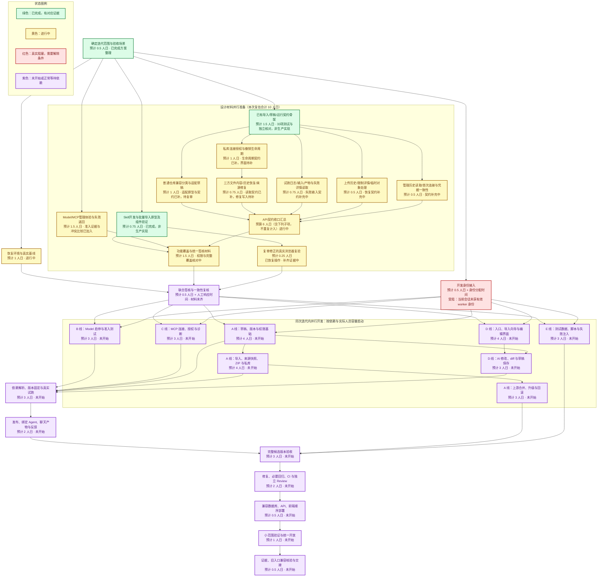

# Agent / Skill / MCP / Model 后台复盘与端到端体验方案

日期：2026-09-09。状态：设计提案，待 UI / 用例 / API 契约联合评审；不代表功能已实现或签核通过。

## 1. 结论与证据边界

建议把四类资源的后台串成一个「AI 能力工作台」，围绕用户的工作组织入口：**找一个方案 → 导入到开发区 → 配好依赖 → 修改与测试 → 发布给团队 → 在真实任务中使用 → 根据反馈继续改进**。

最先解决三件事：模型管理操作真实生效；Skill 保存与发布分离；导入完成后直接进入可继续开发、可验证的工作台。现有文件编辑器、导入器、试跑与能力图可以复用，无需整体替换运行平台。

本轮依据是本地 checkout `fd9c6fb79af42abb250563456c14274e55236595` 的路由、组件、应用用例和数据库写入实现，以及当日查阅的官方开源资料。未将旧报告、代码注释中的历史描述当成运行事实。以下“已确认”指当前 checkout 的实现，不代表生产部署版本。

浏览器尝试打开测试配置中的 `http://localhost:3197/platform-admin/agent`，返回 `ERR_CONNECTION_REFUSED`。因此没有当前页面截图，也未完成线上点击、API、数据库、真实模型四层联测；不对视觉质量或线上可用性打分。

`./init.sh` 在写 `.git/hooks/pre-commit` 时被文件权限阻止，基础验证未完成。`pnpm harness readiness` 因 tsx IPC 权限失败，改用 `node --import tsx .harness/scripts/cli.ts readiness` 成功读取；记录分数已过期，不能用来评价本次后台。`tick` 因未配置 `COORD_GATEWAY_URL` 失败。本轮是用户直接交办的研究与设计输入，没有认领 feature、注册身份、修改签核或启动生产实现。

## 2. 当前实现与问题复盘

| 环节 | 当前代码证据 | 用户影响与处理优先级 |
|---|---|---|
| 后台入口 | `app/admin/[module]/page.tsx` 把 Agent、Model、MCP 重定向至平台后台；Skill 目录去 `/skill?screen=catalog`，编辑去 `/platform-admin/skill/[id]` | 信息架构跨多个宿主；需在真实页面复核切换和返回是否造成困惑。统一任务导航，保留旧链接。P1 |
| Skill 导入 | `skill-url-import-panel.tsx` 已有单文件、仓库扫描、逐项导入；成功主要返回文件数、内部 ID、刷新提示 | 不是“没有 GitHub 导入”。缺的是明确的下一步、整体兼容性诊断、批量操作和依赖补齐。P1 |
| URL 自动识别 | `discover-skills-from-url.ts` 的遍历只检查起点的子目录；`import-skill-from-url.ts` 另有目录导入解析 | 同一条 Skill 目录链接选错模式可能发现不到自身。统一入口先检测根目录，再检查子目录；分支带斜杠等 URL 由 GitHub ref 解析，避免猜字符串。P1 |
| 导入与发布 | `pg-skill-url-import-repository.ts` 写草稿后调用 `wave2_publish_skill_version`，并创建 `enabled=true` 的目录条目 | 导入时即形成发布快照与启用目录记录；实际被哪些 Agent 选中仍要联测。导入应先成为开发草稿，不能把下载成功直接显示为可供团队使用。P0 |
| Skill 编辑 | `AgSkillEditor` 已接文件目录、文件读写和试跑；`asset-code-editor.tsx` 已使用本地 Monaco；`pg-asset-file-repository.ts` 的写文件、删除、改名通过 `publishNewSnapshot` 发布整个新快照 | 缺口不是代码编辑器，而是独立的多文件开发修订。一轮跨文件修改不应产生多个供使用者选到的中间发布版。P0 |
| Skill 试跑 | `ag-screens.tsx` 有输入、运行、结果、耗时、tokens；`execute-trial-run.ts` 有异步任务、模型选择、沙箱和失败落库 | 已有执行能力，需补版本固定、测试集、依赖图、产物检查与生产链一致性。不能用单次文本输出证明一个开源包兼容。P1 |
| Agent 导入 | `import-agent-from-url.ts` 读取单文件并写指令；导入 UI 已支持改指令、发布、试跑。用例依次 insert、setInstructions、record | 不能把任意 Agent 框架仓库当成可直接导入的 Agent。跨步骤失败可能遗留半成品；应改为可恢复任务或同库事务。P1 |
| MCP 接入 | `mcp-remote-discover-panel.tsx` 接远程端点和 token，发现工具；`mcp-servers.controller.ts` 有真实列表 | 已有连接发现与列表，不能笼统称为 mock。当前检查的 controller 未发现 review / tool scope / security policy 的消费路径；需要补“发现→配置授权→在 Agent 中实际调用”的完整证据。P0/P1 |
| Model 管理 | `model-screen.tsx` 的 enabled/tested 是 React 本地状态；测试通过、停用回调只改 setState。`model.controller.ts` 实际只有 POST /models、GET /models | 用户看到启用或停用成功，刷新或另一个管理员处不生效，更不能证明影响运行路由。这是明确的管理闭环缺口。P0 |
| 上游升级 | 所检查的 Skill/Agent 导入路径记录 sourceUrl、digest，未找到完整 upstream/base/local 三方升级流程 | 可以保存来源，不等于可以维护衍生版本。需提供固定来源修订、差异、冲突处理、回归和回滚。P1 |
| 产品文案 | 导入界面直接呈现 SSRF、idempotencyKey、真实链路、controller 等术语 | 用户难以判断自己该做什么。主文案描述可行动结果，错误码和 trace 保留在“技术详情”。P1 |
| 权限与范围 | 平台后台路由中的多个用例仍以 principal.orgId、orgRole=admin 判定 | 平台资源治理与组织资源开发的语义需要联合确认，不能只改侧栏就认为权限已迁移。P0 设计项 |

复盘归因是：过去按单个 API、单个表单补能力，完成点经常停在“写进库”或“出现结果”；用户需要的完成点却是“我改过的方案已被指定 Agent 在真实任务中正确使用”。后续每个工作包必须有用户旅程出口。

## 3. 产品结构、对象关系与权限

### 3.1 三种角色，共用能力而各有入口

- 使用者：在聊天/项目中选择已发布能力、完成个人连接授权、使用示例任务、查看结果与反馈；不承担平台模型配置。
- 开发者：在组织的授权范围内创建、导入、复制、修改、测试和提交发布；可用后台工作台，无需成为整个平台管理员。
- 管理者：管理组织可用能力、凭据、配额、发布权限和审计。平台管理者另管公共目录、供应商与平台级策略；平台身份不应自动获得各组织私有凭据。

以上开发者授权是提议新增的权限能力，需要复用身份模块设计，不直接放宽当前 org-admin 检查。发布到组织、发布到公共目录、部署外部服务是三个不同动作，按目标范围授予权限。

### 3.2 导航按工作组织，类型作为筛选

| 入口 | 内容与主要操作 |
|---|---|
| 能力库 | 已安装 / 团队发布 / 推荐来源；按 Agent、Skill、MCP 筛选；主按钮“导入方案”“创建能力” |
| 开发工作台 | 我的草稿、待测试、待评审；从空白、模板、现有版本、GitHub 方案开始 |
| 连接与模型 | 连接账户、MCP 工具范围、模型供应商、可用性、成本和调用限制 |
| 发布与运行 | 发布记录、使用范围、真实运行、失败归因、反馈、升级和回滚 |

这是导航提案，不新建一份能力数据库。目录展示名称、用途、来源、维护者、版本、可用范围、就绪状态和“下一步”；不要只有 UUID、开关与技术标签。旧 `/skill` 与后台深链仍指向同一资源并保留返回上下文。

### 3.3 四类对象保持不同的生命周期

| 对象 | 对用户的解释 | 工作台管理内容 |
|---|---|---|
| Agent | 承接任务的助手 | 指令、Skill 版本、工具授权、模型策略、示例任务、发布版本 |
| Skill | 完成特定工作的方法与资源包 | SKILL.md、脚本、参考资料、模板、测试、开发修订与发布版本 |
| MCP | 连接外部系统的一组工具 | 服务定义、部署/连接、凭据引用、工具 schema、授权和健康状态 |
| Model | 提供推理能力的模型服务 | 供应商连接、模型清单、能力测试、路由策略、成本和配额 |

Agent 组合 Skill，Skill/Agent 使用获授权的工具，实际执行由模型策略选择服务。GitHub 项目可以同时包含多类组件；Model 的接入通常是配置服务或部署权重，不能伪装成导入一份 SKILL.md。

## 4. 端到端主旅程：导入开源方案并继续开发

以“从 GitHub 找到文档处理方案，改成团队报告生成 Skill，给项目助手使用”为验收样例。示例数据使用非敏感样本。

| 步骤 | 用户看到与操作 | 系统必须完成 | 完成与异常出口 |
|---|---|---|---|
| 1 发现 | 能力库粘贴 GitHub 链接，或从推荐来源选择 | 自动识别仓库/目录/文件；只读解析默认分支并固定 commit；显示来源、更新时间、许可信息 | 不要求用户先选“单文件/仓库”模式。私库提示连接 GitHub；404 与无权访问不泄露私库详情 |
| 2 判断 | 展示“可直接导入 / 需要适配 / 需要部署 / 暂不支持”的组件列表 | 识别 SKILL.md、Agent 定义、MCP 配置和普通代码；显示识别依据及未支持字段 | 多选需要的组件；未识别时允许选择入口文件并创建适配草稿，不能将 README 当作可运行能力 |
| 3 预检 | 展示将创建什么、引用哪些已有资源、缺什么 | 检查文件完整性、相对路径、运行时、外部依赖、密钥需求、工具权限；记录包级许可文件与来源摘要 | “可编辑，缺少 Python 依赖，暂不能试跑”等具体状态。可以先导入为草稿 |
| 4 导入 | 点击“导入到开发区”，可离开再回来 | 持久任务逐项下载与校验；同一来源修订的预览和导入一致；事务创建草稿与来源关联 | 显示已完成/失败项；重试只处理失败项；不重复创建资源。成功主按钮“打开并继续开发” |
| 5 配置 | 开发工作台显示就绪清单，可在侧栏完成配置 | 选择已有模型、绑定工具、补依赖；凭据通过专用连接界面保存为引用 | 无权限时保存配置申请；返回后恢复原草稿。连接成功不自动等同于工具已获使用授权 |
| 6 修改 | 输入“把报告改为本团队模板”，查看变更文件和差异 | AI 生成对当前草稿的 patch；用户可逐文件采纳、撤销；保存草稿修订 | 已发布版保持原样。保存冲突提示比较与合并；不会覆盖同事改动 |
| 7 测试 | 使用样例文件试跑，查看文档预览、工具步骤与检查结果 | 固定草稿修订、模型配置与依赖，在隔离执行环境运行；记录真实产物与错误 | 修改后旧测试显示“已过期”；失败可“一键生成修复草稿”，不自动改发布版 |
| 8 发布 | 看到差异、测试、权限增量、发布范围与受影响 Agent | 按组织规则审核；创建不可变版本；记录发布者、来源与验证证据 | 依赖缺失/测试过期不能标记就绪；发布完成主按钮“添加到 Agent / 在项目中试用” |
| 9 使用 | 在真实聊天里选项目助手，发送同一个样例任务 | 实际 run 固定发布版本和授权上下文；产物可预览下载；可追到版本 | 不能只在后台试跑成功。普通用户只看结果和必要的授权动作 |
| 10 改进 | 从失败运行或用户反馈点“基于此版本改进” | 创建衍生草稿，带入经授权和脱敏的失败样例；修复后回归 | 上游更新先形成候选草稿；确认、测试、发布后再升级指定 Agent |

## 5. Skill 开发工作台的具体体验

### 5.1 一页内完成开发闭环

延续已有全屏编辑模式和 Monaco，不另造后台编辑器。顶部显示名称、所属组织、草稿/发布版、保存状态，提供返回、运行测试、发布三个明确动作。

中间工作区使用「概览 / 文件 / 测试 / 版本」页签；文件页保留左文件树、中央编辑与预览、可收起的右侧 AI 助手；运行详情在下方展开。窄屏改为切换面板，避免把三个不可读的窄栏压在一起。

- 概览：用途、触发场景、不适用场景、输入输出、依赖及就绪清单；由同一份内容解析产生，不能与 SKILL.md 各存一份可编辑事实。
- 文件：新增、上传、改名、删除、语法诊断、相对引用检查、模板资源预览；不把二进制文件当文本覆盖。支持一次保存多文件变更。
- AI 助手：解释当前方案、修改需求、补测试、分析失败；显示将改哪些文件，应用前可查看 patch。AI 操作与人工编辑使用同一个草稿修订控制。
- 测试：样例输入与附件、预期检查、实际产物、trace、耗时、tokens、成本；比较“原版 / 我的版本”，必要时增加“不加载 Skill”的基线。
- 版本：当前发布版、开发版、来源版本、变更摘要、使用者和回滚入口；展示旧运行的真实版本，不把历史结果重新绑定到最新版。

保存提示区分“正在保存 / 已保存草稿 / 保存失败 / 与他人修改冲突”；切换资源或关闭页面前保留未保存内容。键盘可到达主操作，错误关联具体字段，异步状态用可访问提示而非只变颜色。

### 5.2 从零创建也复用同一条路

用户选择“创建 Skill”，用自然语言填写：希望完成什么、什么时候用、一个输入与输出样例。系统生成 **可编辑草稿**，包含 SKILL.md、确有需要的脚本/资源和建议测试。没有脚本需求的 Skill 不强迫建立工程目录。

首次进入显示“生成草稿 → 运行示例 → 改进结果 → 发布”清单。AI 先复用组织已有连接和模板，仅对真实缺失项提出配置；不能自行创建付费供应商连接或复制他人的密钥。

### 5.3 保留、复制和跟踪上游

导入默认保留来源并允许在本组织开发，不要求用户理解 git fork。对用户提供“使用原版”“创建我的版本”“检查来源更新”三个动作。

开发版记录上次导入基线。收到上游更新时做三方比较：上次来源版本、我的修改、上游新版本。无冲突也只更新候选草稿；冲突文件给出保留本地/采用上游/手工合并，二进制文件逐版本选择。来源增加工具权限或依赖时重新提示，不沿用旧授权范围。

“我的版本”是平台内衍生关系；只有用户选择“同步到我的 GitHub 仓库”时才创建外部提交或 PR。导出保留来源和许可文件，凭据与私有测试数据不进入导出包。

## 6. GitHub 来源分类与兼容策略

| 来源 | 导入方式 | 必须避免的错误承诺 |
|---|---|---|
| 标准 Skill 目录 | 原样保留 SKILL.md 与资源结构；检查依赖；创建开发草稿 | 格式兼容不等于脚本可运行；标准中的 allowed-tools 不能直接授予平台权限 |
| 多 Skill 仓库 | 扫描根和子目录，预览候选，多选导入；每个组件独立结果，共用来源快照 | 不静默导入整个仓库，不把一个失败项变成整个批次重新创建 |
| 单文件 Agent 指令 | 导入指令和能识别的元数据，映射模型与 Skill 引用 | 不声称已经导入框架执行图、memory 或完整 Agent 项目 |
| 任意 Python/Node 开源项目 | 创建“待适配方案”；分析入口和依赖，建议包装为脚本 Skill、MCP 服务或外部 API | 不直接执行 README 的安装命令；不把 git clone 成功标成 Agent 可运行 |
| MCP 远程服务 | 从服务目录或 URL 创建连接，认证，tools/list，选择工具，诊断并绑定 Agent | GitHub 仓库地址不是 MCP endpoint；发现工具不等于授权使用 |
| MCP 本地命令 / 源码项目 | 显示需要部署，选择已有远程服务或受控托管执行器；保存配置引用 | 浏览器不能直接运行 stdio server，后台也不应在 API 主进程执行任意 npx/uvx |
| 模型配置 / 开源模型项目 | 导入可识别的服务配置，或引导部署到已支持推理服务后接入 | 下载权重不是模型服务已上线；不暗示本平台已有自动 GPU 部署 |
| ZIP / 本地目录 | 本次支持标准 Skill ZIP 上传后走同一预检与草稿流程；本地目录先打包上传 | 限制解压大小/数量、路径穿越和符号链接；不能把上传入口当不同安全路径 |

兼容结果应逐项展示“能保留什么、需要改什么、为什么、如何修复”。纯格式转换可以自动生成建议；运行行为变更必须在 diff 中可见。本次迭代交付标准 Skill（含 GitHub、私库与 ZIP）、已有单文件 Agent 和远程 MCP 的完整旅程，并完成上游更新与回滚；任意框架自动适配与托管部署明确显示为未支持能力。

## 7. Agent、MCP、Model 如何接上同一个体验

### Agent：从资源表单变成组装和验证入口

在同一编辑页配置目标与指令、挂载指定 Skill 版本、选择可用 MCP 工具和模型策略。保留已有能力图，用就绪检查表达“缺模型 / 连接失效 / Skill 未发布 / 工具无权限”。从 Skill 发布页进入时预选该版本，用户确认目标 Agent 后完成装配。

测试会话与发布后会话共用能力解析及权限判定逻辑，仅草稿选择和测试数据范围不同。最终发布清单固定 Agent、Skill 版本和工具 schema 摘要；凭据只固定引用，运行时仍校验当前权限与撤销状态。

### MCP：服务定义、连接、授权分开管理

同一个服务可以供多个组织使用，但各组织连接和个人账户授权独立。添加流程为：选择服务 → 连接/部署 → 认证 → 发现工具 → 选择需要的工具 → 试调用 → 绑定 Agent。

界面分别显示连接状态、授权状态和最近一次实际调用结果。OAuth 过期可重新连接；schema 变化显示影响工具与 Agent，危险权限增量需要重新授权。断开连接后阻止新调用，在途调用按既有可中断能力如实展示，不承诺浏览器点停就能撤销外部写入。

### Model：供应商连接与模型清单分离

先选供应商或自定义兼容端点，配置一次凭据；在支持枚举时拉取模型清单，不支持则允许手填模型 ID。每个模型可运行连通性、工具调用、结构化输出等可自动验证项；人工质量评价单独记录，不能通过勾选框冒充系统测试。

启用、停用、修改配置和默认模型策略都必须持久化，刷新、另一位管理员和实际 Agent 路由结果一致。停用前查询真实引用与在途状态；未知不能显示 0。影响范围预览后选择有能力实现的 drain/interrupt 策略，并在后台追踪完成状态。

模型升级/回退使用能力约束、预算与数据范围共同筛选；不能仅凭 self-hosted 标签判断适合机密数据，也不能为保证“总有结果”而跨越数据边界回退到别的供应商。

## 8. 后端设计与现有资产复用

以下是概念设计；具体字段、枚举、API path 在 `packages/contracts` 与所属契约束确认后定义，此文不成为第二份契约单源。

| 需要补齐的能力 | 设计要点 | 现有落点 |
|---|---|---|
| 来源快照 | repository、commit、subdirectory、文件摘要、许可文件、adapter 版本；预检和导入共享快照 | 扩展 skill-import / agent-import；复用安全取回层 |
| 持久导入任务 | 扫描、预检、导入分步骤；可恢复、取消、局部重试、进度查询；幂等键绑定入参摘要 | 将同步 URL 导入编排扩展为任务，保持已有导入仓储幂等规则 |
| 开发修订 | 基于版本的可编辑 workspace；多文件原子保存；乐观并发 revision；发布前不进入运行目录 | 新开发修订层，复用资产文件存储能力；不修改已发布不可变行 |
| 依赖解析 | 解析 Skill、运行时、脚本库、模型能力、工具和凭据引用；给出缺项及修复入口 | agent-skill-pins、model、mcp；复用已有授权层 |
| 测试记录 | 固定内容 digest、依赖锁定、模型配置修订、测试集版本、结果和真实产物 | 现有异步 trial-run、sandbox、artifact、provenance |
| 发布记录 | 校验测试对应当前草稿；创建不可变 release；原子更新可用范围/引用；留审计 | 统一已有发布用例与数据库触发器，不新增绕过触发器的写口 |
| 上游同步 | 来源基线 + 本地修订 + 上游快照；冲突产生候选草稿，测试后发布 | 扩展来源关联与开发修订；保持原 resource ID 与历史版本 |

关键约束：

1. 授权后再 fetch；每次重定向、GitHub API 与文件下载继续走同一安全取回策略。私库 token 不进入 sourceUrl、日志或导出包。
2. GitHub ref 先解析到不可变 commit，再读取目录与文件，避免扫描之后上游移动导致导入与预览不一致。大小、深度与文件数上限配置有单一来源，UI 展示超限原因和可缩小范围的入口。
3. 不在扫描/导入阶段执行仓库脚本。需要执行时进入受控运行环境，限定依赖、网络与资源；仅扫描出“未发现问题”不能证明内容可信。
4. 开发保存只改开发修订。发布的输入是固定 revision；有新修改时返回冲突/测试失效。已在运行的任务继续引用原快照，撤权仍即时检查。
5. 内容版本、发布范围、连接健康、授权状态和就绪状态分别记录；“已发布但连接失效”可以同时成立，不能都塞进一个 enabled。
6. UI 只投影后端状态；未知在途数量显示未知，超时显示任务仍在后台处理或明确失败。操作有统一关联 ID，可从页面定位日志而不暴露凭据。
7. 现有 Skill 导入/文件保存的发布行为变更涉及旧客户端：先增加草稿 API 和适配读口，再迁移写入口；不能只隐藏发布按钮，数据库仍自动发布。
8. 旧数据保留 IDs、文件字节和 digest；来源缺 commit 的标为“历史来源未固定”，不伪造上游基线。既有权限和绑定不静默扩大。

## 9. 可借鉴和接入的开源方案

以下均已在 2026-09-09 查阅官方仓库或规范，只作为候选；本轮没有安装、导入或执行这些项目。接入时固定具体版本，检查该版本和具体子目录的许可及依赖。

| 方案 | 采用建议 | 适配边界 |
|---|---|---|
| [Agent Skills 规范](https://agentskills.io/specification) | 作为 Skill 导入/导出的优先格式，保留 SKILL.md、scripts、references、assets；可评估官方 skills-ref 校验 | 标准定义格式，不保证执行环境一致，allowed-tools 不替代本平台授权 |
| [Anthropic skill-creator](https://github.com/anthropics/skills/blob/main/skills/skill-creator/SKILL.md) | 作为首个“导入后再开发”的样例，借鉴草稿→测试→人工反馈→改进及基线比较；可改造为平台 Skill 开发助手 | 依赖宿主工具、CLI 与评测脚本，需要适配 WorkspaceX 工具和测试记录，不能照搬执行指令即宣称兼容 |
| [MCP Registry](https://github.com/modelcontextprotocol/registry) | 在连接页接入服务发现元数据，支持组织白名单目录 | Registry 是发现目录，不负责托管、凭据或信任审批 |
| [Monaco Editor](https://github.com/microsoft/monaco-editor) | 本项目已使用，继续扩展 diff、诊断与草稿保存体验 | 不重新替换编辑器；编辑能力不等于版本、测试、发布能力 |
| [promptfoo](https://github.com/promptfoo/promptfoo) | 评估作为测试工作器的适配器，为固定测试集做模型/版本比较 | 不额外维护第二份生产执行逻辑；先接现有运行入口，并将结果写回统一测试记录 |
| [LiteLLM](https://github.com/BerriAI/litellm) | 仅当现有 provider gateway 的多供应商成本/路由能力不足时评估 | 优先修好现有 Model 管理写路径；引入网关会带来运维和凭据边界成本，不是后台按钮修复的前提 |
| [Dify](https://github.com/langgenius/dify) | 参考应用构建、模型与工具组织方式；暂不整体嵌入 | 本仓已有运行、权限、资产与发布体系，双平台会增加同步成本；其官方仓库标明基于 Apache 2.0 且有附加条件，需按用途核对许可 |

优先组合：**现有 WorkspaceX 工作台 + Agent Skills 格式 + 适配后的 skill-creator + MCP Registry 发现 + 统一测试记录**。promptfoo 为评测增强候选，LiteLLM 与 Dify 不作为第一阶段依赖。

MCP 的本地与远程接入差异依据：[本地服务连接](https://modelcontextprotocol.io/docs/develop/connect-local-servers)、[远程服务连接](https://modelcontextprotocol.io/docs/develop/connect-remote-servers)。

## 10. 交付顺序与端到端验收

### 10.1 一次迭代、并行开发、统一发布

| 顺序 | 工作包 | 可评审交付物/用户出口 |
|---|---|---|
| S0 | 可运行基线与现状核验 | 隔离环境、当前部署 SHA、四类后台的真实截图、请求与 DB 对照；复核本报告边界 |
| S1 | 真实组件原型与契约束设计 | 导入向导、Skill 工作台、Agent 装配、连接与模型状态；UI/UC/API 同束评审，确认开发者与平台权限 |
| S2 | 修 Model/MCP 管理闭环 | 模型启停与准入持久化，连接授权可验证；另一管理员与实际 run 观察一致 |
| S3 | 草稿修订与发布分离 | 导入和多文件保存不改变发布版；试跑固定 revision；回滚恢复指定版本 |
| S4 | 统一导入与来源记录 | 标准 Skill、仓库多选、单文件 Agent、远程 MCP 自动分类；导入后可直接继续开发 |
| S5 | AI 开发、测试与真实使用闭环 | skill-creator 适配、变更 diff、样例/基线比较、发布→绑定 Agent→真实聊天产物 |
| S6 | 上游更新与运营 | 三方合并、影响分析、回归、回滚、失败反馈建草稿；标准 Skill ZIP 与私库导入纳入本次验收 |

2026-09-09 更新：按用户要求，S0–S6 全部归入**同一次迭代升级**。以上编号是范围索引，不是必须逐项等待的串行排期。导入、开发、Model/MCP 管理、Agent 装配、测试、发布、上游更新和回滚共同完成后统一开放，不把 S6 留到下次迭代。标准 Skill ZIP 与私库导入也纳入本次范围。

本次不以整体接入 Dify/LiteLLM 为前提；任意框架自动转换、MCP 源码自动托管、模型权重自动部署仍是未承诺的扩展能力。对这些来源，本次必须完成准确识别、兼容报告、适配建议和已有端点接入；不能用“全部升级”暗示支持所有开源项目的任意运行环境。

**估算口径（2026-09-10 00:06复估）**：1 人日 = 8 小时有效工作；节点数字是该工作包的总投入，不是每个参与者都花这么多，也不是承诺完成日期。图中业务与交付节点合计 51 人日，加身份接入 0.5 人日，复估 51.5 人日；基线恢复后须按实际代码缺口重估。四个执行席位受依赖、共享文件、评审容量约束，建议先预留约 5–6 个工作周，并另计人工签核等待时间；这是容量规划，不是实测工期或 Agent 运行时长承诺。

绿色 A 表示范围与验收方案已写入本文；绿色 C1 表示 Skill 工作台和导入初版原型通过17项组件/状态测试及3次变异反证，已有浏览器截图见阶段UI材料，均不代表生产功能完成。复审修正的原生后退/键盘复验单列Y，Mac锁屏是工具确认的真实阻塞。原C拆为C1–C4和Y，复估合计10人日。C3已有契约反例测试，涵盖来源、版本、AI差异、上传预检、失败草稿血缘和Model/MCP操作delta；独立复审与完整功能覆盖仍需收口。X 的阻塞依据是新身份尚未完成注册合并、enroll和有效凭据接入，不能冒用其他身份。G 正常等待完整材料，不把尚未提请的签核写成用户阻塞。

2026-09-10 00:06剩余估算：未开始的生产实施、集成验证和发布节点D–Z合计仍为39人日；设计、基线和身份收口另计。原型与schema通过不折算成生产完成量，继续预留约5–6个工作周，并单列解锁、签核和身份接入等待。目录导入既有缺陷PR #3241的f6ac3bb9检查已全绿并转交协调者；远端随后更新到3975ff7b，已于23:04:21合并，重跑于23:22:17成功；但judgeClosingPrGreen使用合入前策略重建后确认violation：合入时fullstack-smoke仍FAILURE，已交回协调者追溯，不计为合规完成。

状态更新按真实证据：完成需对应 PR/验证/发布结果；失败或缺失必要外部条件才标红；普通依赖等待标紫；修复或恢复后转黄重新执行。本图是本次开工快照，后续执行状态以 feature_list / issue / PR 为准，由其更新图中显示，不单独维护另一份权威状态。

实线表示“后项完成并验收所必需的前置成果”。前端可以在已签契约上使用测试数据开发；运行集成各适配器可提前准备，但 R 不能在任一输入缺失时宣布完成。验收脚本提前建设、每个 PR 持续执行，V 是完整候选版本的最后一次集成验证，不是到最后才开始测试。

### 10.1.1 哪些可以并行，哪些必须串行

| 工作 | 并行策略 | 必须等待的结果 |
|---|---|---|
| 环境、现状核验与产品设计 | 可同时推进，设计用实际发现修正 | 环境未恢复和基线未核验前，不把生产实现当成可开工 |
| Model 与 MCP | 模块实现可并行，独立文件、测试与 owner | 共享鉴权、契约与 DI 修改归一个集成 owner，按队列串行合入 |
| 前端与后端 | 契约签核后并行；共享契约样例防止接口漂移 | 前端“完成”必须接真实 API，不以 mock 验收 |
| 导入与编辑 | UI、解析器可提前；独立草稿基础先落地 | 导入落库、保存、发布必须遵循同一版本模型 |
| 上游更新与运行集成 | 来源快照/版本基础落地后，两线并行 | 上游更新发布必须复用测试与发布门槛，不能直接覆盖上线版本 |
| 测试与功能实现 | 用例和契约确定后持续并行 | 最终验收必须针对同一个包含全部改动的候选 SHA |
| 合并与部署 | 独立 PR 可持续进入集成版本 | 共享热点按前置 PR 合并后再开；数据库→API→前端按兼容顺序部署 |

**同文件冲突视为真实依赖**：`packages/contracts` 中同一契约文件、数据库 migration 序列、`kernel.module.ts`、共享导航和 `ag-screens.tsx` 不能由多条线同轮修改。开工前按预计文件清单检查交集；有交集就交给唯一 owner 串行处理，或先完成职责拆分再并行。隔离 worktree 只能隔离工作区，不能消除合并冲突。

### 10.1.2 人员与调度：避免图上并行、实际互相等待

图中 A–E 是逻辑工作线，不要求同时启动五个 agent。推荐四个执行席位的调度：

| 席位 | 首批 | 后续接力 |
|---|---|---|
| 1 数据与版本 | D 草稿、版本和权限基础 | I 导入与来源 → U 上游合并与回滚 |
| 2 运行与连接 | M Model → P MCP（容量足够且文件无交集时可拆成两人并行） | R 运行集成 → H Agent 装配与真实使用 |
| 3 前端体验 | F 页面与导入向导 | E AI 编辑、diff、保存 → H 用户入口与联调 |
| 4 验证与集成 | T 测试数据、回归与失败注入 | 共享接线、持续集成、候选版本验收与发布准备 |

执行者各自一次只认领一个 feature。Review 使用独立评审者或已经释放且未参与该变更的席位；不能让实现者签自己的独立 Review。若仅有三个执行席位，测试准备由集成负责人分时承担并为最终独立评审预留容量，不能取消验证线换取表面并发。

**优先保障长依赖链**：草稿/版本基础 → 来源导入 → 运行集成 → 发布到聊天 → 整体验收 → 发布。另一路“来源导入 → 上游合并”也可能成为瓶颈。当前没有可靠工时数据，不能断言哪条是数学意义上的关键路径，更不承诺固定提速比例；基线核验后补任务工时与容量，优先消除最长链的阻塞。

### 10.1.3 一次升级的完成门槛

- 一个迭代目标、一套功能范围、一张依赖图、一个最终发布候选版本；内部仍按一 feature 一 issue 一 PR 增量合并。
- 未完成的新入口通过受控发布开关隔离；同一开关不应替代后端权限检查。用户统一切换到完整的新体验。
- 兼容数据库与 API 可先准备部署，前端统一启用属于同一次发布；小范围验证和扩大开放也属于本次发布，不拆成产品下一轮。
- 10.2 中全部核心场景通过，并增加 ZIP 路径穿越拒绝、私库撤权和凭据不入导出包的验证。任一必需能力失败，修复后再进入最终验收，不静默移到下期。
- 上游合并、反馈改进、模型真实启停、MCP 授权与回滚均是本次交付项，不能只交“导入+编辑”的半条链路。
- 迁移演练保留旧 ID、版本和在途任务；回滚使用兼容的上一发布 artifact 与绑定记录。旧入口重定向、历史结果可读必须随版本一起交付。
- 最终以统一候选 SHA 的 CI、独立评审、真实模型产物和发布后冒烟结果收口；修复导致 SHA 变化时重跑受影响场景及必要整体门控，不能复用过期的全绿结论。
- 本节是执行规划，不表示已经启动 agent、创建 sprint、完成签核或执行部署。

工作包不是 feature 编号。真实组件原型和用例确认后，再按仓库规范拆成唯一权威 feature_list，每 feature 一 issue 一 PR，经过 verify、CI 和合并门控；本文件不维护另一套执行状态，也不预先填写 passing。

### 10.2 必须通过的验收场景

| 场景 | 可观察断言 |
|---|---|
| GitHub 根/目录/单文件 | 同一输入框识别类型；预览与导入 commit/digest 相同；直接 Skill 根不会漏识别 |
| 批量导入中断 | 关闭页面再打开能恢复任务；成功项不重复落库；失败项可重试；取消不出现部分可运行版本 |
| 多文件开发 | 连续改 SKILL.md 与脚本后保存草稿，旧 Agent 输出不变；试跑读取同一草稿快照的两个文件 |
| 并发编辑 | 两人基于相同 revision 修改，同一个文件冲突可见；不得静默覆盖；发布不能用过期 revision |
| 脚本与依赖 | 原始脚本和 assets 在真实 sandbox 可访问；缺依赖给出修复入口；越权工具调用被拒；不能靠模型重写一个无关脚本冒充复用成功 |
| 发布到使用 | 发布前目标用户选不到草稿；发布并绑定后在真实项目聊天中产出正确文件；下载字节与产物记录一致 |
| 模型治理 | 启用/停用/测试结果刷新后保留；另一管理员看到一致状态；新 run 实际遵守启停与数据策略 |
| MCP 授权 | 已发现但未授权的工具不可调用；授权后成功；凭据过期显示重连；重连不扩大授权 |
| 上游冲突 | 本地修改与上游修改同一文件进入冲突页；发布版保持原样；合并后回归；回滚恢复原绑定 |
| 来源不兼容 | 普通代码仓库呈现“需适配”，stdio 服务呈现“需部署”，不会假装导入即运行 |
| 权限/数据隔离 | 开发者可在授权区保存草稿但不能越权公共发布；跨组织读写、凭据引用和运行记录均被拒 |
| 运行故障 | API/worker 重启、模型超时、沙箱失败有真实终态或恢复机制；不重复外部副作用；不会无限显示运行中 |

每条关键场景需浏览器 trace/截图、API 请求响应、数据库版本/任务状态、实际内核/模型与产物证据互相对应。格式、事务与错误分支可使用确定性替身；“导入开源 Skill 后生成真实成果”至少跑一次真实模型和实际脚本环境，不能只检查 DOM 有一段输出。

现有可复用测试文件包括 `apps/web/e2e/skill-agent-import-usecase-audit.spec.ts`、`apps/api/tests/skill/edit-skill-version-and-trial-run.test.ts`、`apps/api/tests/skill/url-import-http-route.test.ts`、`apps/api/tests/agent-runtime/agent-url-import-repo-guard.test.ts`。本轮仅确认文件存在，未执行；后续新增测试必须进入实际 CI 收集配置，不以“有测试文件”作为验收证据。

### 10.3 衡量体验是否真的变好

先测 S0 基线，再确定数值目标；当前不编造成功率或耗时。

- 核心指标：首次导入 → 首次成功真实使用的转化率和时长；区分已有连接与首次配置。
- 开发效率：从失败样例 → 修复草稿 → 回归通过的时长；修改后首次测试通过率。
- 导入质量：分来源类型的成功率、失败原因、可自动恢复比例；不将“已下载”计为“可运行”。
- 发布质量：发布后真实任务失败率、回滚率、上游升级回归率；关联具体版本与模型配置。
- 操作成本：完成主旅程的页面跳转数、重复填写次数、寻求管理员协助次数。

最终验收问题：一个有开发权限但不熟悉底层协议的用户，能否把找到的 GitHub 方案导入、改成自己的 Skill、看到测试证据、发布给指定 Agent，并在真实任务失败后回到同一工作台继续改进。

## 11. 本轮交接

本轮交付为此设计输入；未修改业务代码、功能清单、签核状态或生产资源，未安装候选开源项目。没有创建 Docker 栈、开发服务器或租约。工作区已有其他未提交内容，保持原样，不宣称仓库干净。

下一次实施先恢复标准初始化与隔离环境，确认协调身份/网关及对应 issue，再执行 S0 真实核验。联合评审重点是开发者权限、平台/组织范围、草稿与发布语义、第一阶段来源兼容边界；采用本方案后统一进入所属契约束，不把本文的建议当成人类签核。

### 11.1 开工状态补充（2026-09-09）

- 本次升级总工单：[boardx/workspacex#3234](https://github.com/boardx/workspacex/issues/3234)。已记录用户直接交办的队列外原因、全部范围、并行计划与阻塞。
- 已从最新 origin/main 创建隔离工作区 `/private/tmp/workspacex-ai-capability-studio`，分支 `codex/ai-capability-studio`，基线 `bfd186a51de76ea097c61dd25d9e89e2cd3f2605`；原共享工作区未切分支。
- 隔离工作区 `./init.sh` 退出码 0：依赖、hooks、生成物与快速健康检查通过。尚未运行全仓验证或真实后台 E2E，因此环境与基线节点仍为黄色。
- 已核实 GitHub 登录有效；沙箱内认证失败是网络限制，提权检查成功。协调网关配置已找到，凭据未写入文档或 issue。
- 用户已授权创建身份 `dev-ai-capability-studio`；注册 PR 为 https://github.com/boardx/workspacex/pull/3235 ，配置生成及唯一性检查通过，CI 尚在运行。远端凭据、登记和租约未完成，因此身份节点仍是阻塞，不能标绿。
- 此时尚无本次新契约束的正式 UI/UC/API 签核，不能把自然语言方案当成已完成签核。图中 51.5 人日是工程投入估算，不是实测执行耗时。
- 未修改业务代码、功能清单、签核状态或生产配置，未启动 Docker 栈与开发服务器。隔离工作区保留供身份确定后继续本次升级。

### 11.2 新增三个云端任务（2026-09-09）

已向 ChatGPT Work 的 workspacex 项目提交三个云端任务，属于代码核验与设计材料并行分工。创建成功不代表仓库已连接、协调身份已登记或实现已完成。

| 任务责任 | 创建返回标识 | 专属材料目录 | 当前证据 |
|---|---|---|---|
| Skill 导入与版本契约 | local-chatgpt:258b1c9a-7e1f-439a-be17-64f65e1abc2f | docs/design/ai-capability-studio/import-version/ | 创建请求成功，待仓库连接核验 |
| Skill 开发工作台体验 | local-chatgpt:ca7e3ff4-38db-4020-9ded-0f7869127b38 | docs/design/ai-capability-studio/workbench/ | 创建请求成功，待仓库连接核验 |
| Model MCP 与端到端验收 | local-chatgpt:b5589c0b-b458-4017-b1a0-c4e8e372fd85 | docs/design/ai-capability-studio/runtime-verification/ | 创建请求成功，待仓库连接核验 |

三路先并行核验现状、用例及契约提案；主任务汇总跨域约束，完成真实 UI 材料和统一签核后再安排实现。共享 contracts、数据库迁移及现有业务页面未分配给三个任务，避免争写。各任务必须提供实际证据，不得把任务创建或静态代码存在标作功能完成。

### 11.3 Phase 15 实施准备（2026-09-09）

权威阶段目录为 `phases/phase-15-ai-capability-studio/`，需求及跨域一致性提案已落盘。阶段由标准 new-phase 建立；清除脚手架自带的示例健康检查条目时使用 loadFeatureList/saveFeatureList，功能清单暂为空，待 UI 和契约材料定稿。没有编造已完成 feature。

注册 PR 的名单遗漏已修复（0aad4e221），8 项定向测试通过。原 AG-UI 失败文件在隔离数据库/真实 HTTP 环境下 4 项测试通过，测试栈自动释放；新一轮 CI 尚未完成，仍不能标绿或合并。

三个云端任务已确认仓库可读。主任务已接管工作台原型并完成本地运行、7项状态测试和浏览器主路径/七态验证，截图索引见阶段 design-proposal/capability-studio/ui.md。云端任务继续处理导入契约一致性、导入交互矩阵和独立PR审查。原型与schema草案仍未接生产API，因此总图C3保持黄色，生产功能节点不提前标绿。

既有GitHub目录导入缺陷已作为独立修复提交 #3241（关联 #3240）：修正独立review发现的空下载地址回归后，定向18项测试、API编译/lint通过；远端合入最新main后重新运行CI，正式review未完结。该修复不等于新导入系统完成。

协调凭据和租约仍未完成；tick 检查明确报网关环境未配置。readiness 队列已读取，本次用户直接交办的队列外原因见 #3234。所有已完成本地测试均不代表生产功能已交付。

管理设计估算增加1.5人日：独立审查识别出配置并发比较、证据时效、MCP差异/授权和运行引用等未覆盖控件，C2由0.5调整到1.5，C3由1调整到1.5。增加的是已确认工作范围，不把已耗时间误计为完成量。

00:06复估依据：独立覆盖审查发现普通仓库适配、私库生命周期、运行详情、三方内容、上传恢复、管理历史六组缺口。C3的6人日包含已有骨架1.5与待收口子项4.5；C4增加完整权限/功能映射1人日，总量由46调整到51.5。C3是汇总节点，不与C30–C36重复相加。生产39人日暂保留，细粒度feature形成后再校准；本次不是承诺发布日期。
