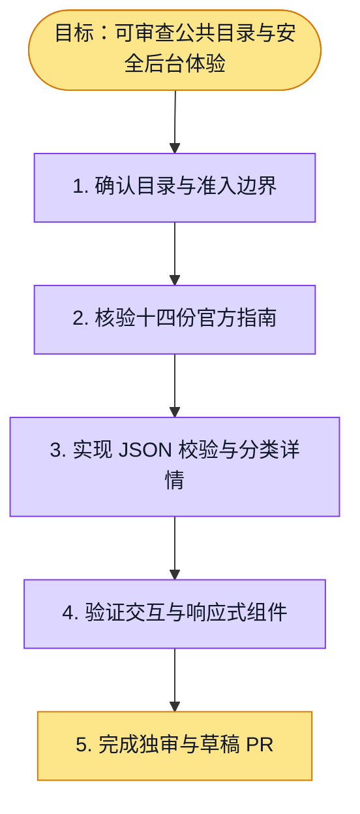

# 执行计划 — 百炼公开模型目录与后台体验

> 规范：`.harness/instructions/execution-plan-visualization.md`。
> 改状态用 `node .harness/scripts/execution-plan.mjs set <本文件> <节点> <状态>`，
> 改完 `check` 一遍；不要手改 classDef 颜色。

## 我理解的目标
- **目标**：导入可审查的百炼公共规格快照，在后台搜索分类查看详情，区分组织可调用状态。
- **完成判据**：strict 契约测试、Web 交互回归、typecheck / lint、真实组件响应式浏览器验收及正常 PR 门控。
- **不做什么**：不写组织数据库，不自动启用模型，不调用供应商推理，不冒充账号全量或完整 API 参数。
- **假设与待确认**：用户已接受公共 JSON + 组织数据库分离；账号地域与价格保持待核验。

## 执行计划

图例：⬜ 灰=未开始 · 🟨 黄=已开始 · 🟩 绿=已完成 · 🟪 紫=已测试（有证据） · 🟥 红=被堵塞

## 进度日志（append-only，每次改颜色追加一行）
| 时间 | 节点 | 状态变化 | 依据（命令 / 证据 / 堵塞原因） |
|---|---|---|---|
| 2026-10-05 | G, S1 | todo → doing | 接到目标，开始理解 |
