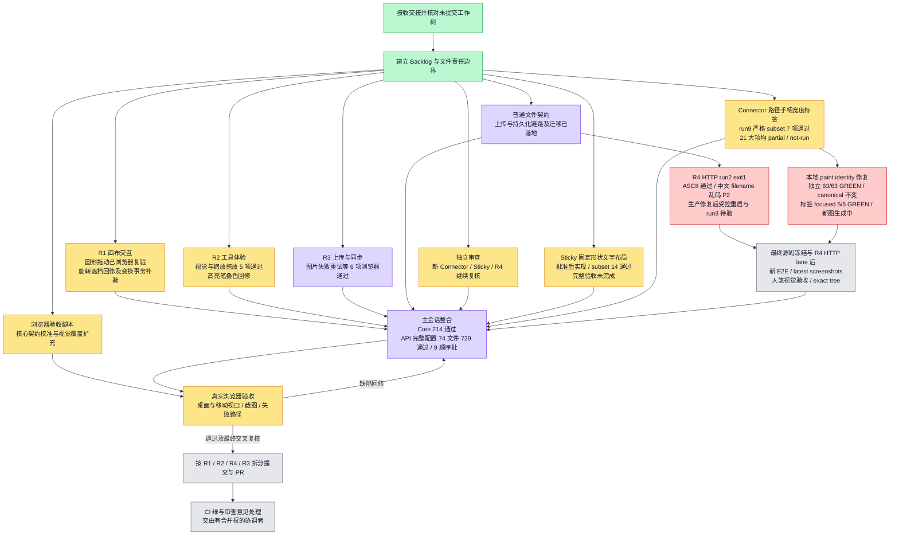

> Historical snapshot, 2026-10-02. Not current approval, runtime acceptance, or feature status. See README.md and issue #5001.

# 白板核心交互修复 Backlog

日期：2026-10-01。用户直接交办的本地修复执行记录，不替代阶段 `feature_list.json`，不声明 feature passing。

工作目录：`/Users/shenyanbin/.codex/worktrees/board-perf-baseline/workspacex`。
分支：`codex/board-input-ux-round1`。保留全部已有未提交改动；不切换分支，不启动 Docker，不直接合并 PR。

## 验收口径

- 已实现：源码存在实现，尚不能表示用户链路通过。
- 定向验证：相关行为测试通过；完整 lint/typecheck、浏览器和服务端持久化仍分别记录。
- 已验收：行为、失败路径、回归均有本轮证据；不能据此声明全量 backlog 完成或达到 9/10。
- PR/CI 是后续交付门，本地验收与合入分别记录。

## 执行计划与进度

### 动态调度算法

主会话保留六个 worker 槽位，以事件驱动重新计算队列；完成、失败、权限阻塞立即触发，每轮主验收后再次检查，不以静态链接或旧心跳推断运行状态。

```text
score(task) = 4 * risk + 3 * blocked_dependents + 2 * user_impact + evidence_gap + waiting_age
eligible(task) = dependencies_ready AND exclusive_file_owner_available
on_event(completed | failed | blocked | acceptance_result):
  inspect live agent states and fresh evidence
  move failed acceptance to correction queue; never mark it complete
  assign highest scoring eligible task to compatible idle owner
  redirect dependency-blocked owners to independent verification/review/delivery tasks
  keep shared editor, Fabric surface and tool menus single-writer
  stop dispatching new edits during final source freeze; run final gates on unchanged source
```

评分各项为本轮相对排序而非产品质量评分。每个 agent 同时只负责一项主任务，有明确文件边界、验收输出和失败回流；不重复别人已完成的检查，不以无关改动填满负荷。主会话负责跨任务推理、调度、真实浏览器执行与证据汇总。

当前六路：画布变换与擦除事务、工具窄屏与高亮像素、图片真实 viewer 权限、文件失败文案与安全、独立交付审计、整套验收编排。原生 Trackpad、原生 OS 剪贴板、HTTPS 图片 URL 成功路径没有设备或链路证据时保留未验证，不能因为所有脚本退出 0 而删除边界。

### 文件规模临时豁免

`apps/api/src/kernel.module.ts` 是既有超限装配文件，本轮暂时豁免仅限文件资产 controller、repository、service 的 imports 与 DI wiring，不允许在其中继续添加业务实现。负责人：本轮 R4 PR 作者（files_fix / 主会话交付负责人）；移除期限：2026-10-15；跟踪任务 [#4863](https://github.com/boardx/workspacex/issues/4863)。拆分计划：抽离白板 controllers/providers 到领域模块，保留 injection tokens、Kernel exports 和依赖方向，独立运行 API typecheck、tenant permission lint、architecture dependency lint 及本地白板运行验证。当前实现的新文件均小于 2000 行，API 713 项测试与权限/架构检查已通过；这不是拆分完成或额外功能 passing 的声明。



## Backlog

| ID | 优先级 | 组 | 用户可观察的验收结果 | 当前状态 |
| --- | --- | --- | --- | --- |
| B01 | P0 | R1 | Select 下双指滑动平移；pinch/Ctrl/Meta 滚轮以指针为中心缩放 | 已有实现，复核中 |
| B02 | P0 | R1 | 鼠标中键/右键按住拖动画布，释放或取消后正确结束，不误选或创建 | 已有实现，复核中 |
| B03 | P0 | R1 | 拖动、缩放、旋转时控制点、浮动菜单与连接线连续跟随 | run9 真实拖动通过；发现旋转把手被菜单遮挡，补修复和旋转验收 |
| B04 | P0 | R1 | 带端点偏移的连接线在旋转、多选移动与取消后保持正确 | 已有定向测试，复核中 |
| B05 | P0 | R1/R3 | 橡皮擦仅命中实际绘图笔迹，保留 Sticky、Shape、图片、锁定对象 | 已有实现，补集成回归 |
| B06 | P0 | R3 | 一次擦除跨多个旋转/缩放绘图对象，一次撤销/重做完整恢复 | 集成测试已证明一次 undo/redo 完整恢复；待浏览器擦除验收 |
| B07 | P1 | R2/R3 | Sticky/Text/Shape 选择后不立即创建，点击画布仅创建一次并回 Select | 已有实现，复核中 |
| B08 | P1 | R2 | 工具栏与子菜单均可拖放工具到准确画布位置，结束后退出创建模式 | 已有实现，复核中 |
| B09 | P1 | R2 | 所有含子菜单的工具在右侧显示小箭头 | 已有实现，复核中 |
| B10 | P1 | R2 | Sticky 形状预览与工具栏均反映所选颜色/形状，放置后保留最近选择 | 已有实现，复核中 |
| B11 | P1 | R2 | Text 预设直接呈现真实字号与字重层级 | 已有实现，复核中 |
| B12 | P1 | R2 | Shape 菜单直接呈现实际形状轮廓 | 已有实现，复核中 |
| B13 | P1 | R2/R3 | Arrow/Frame 创建入口与 C/F 快捷键隐藏/禁用，已有对象不删除 | 已有实现，复核中 |
| B14 | P1 | R2 | Draw 面板约为原高度一半，保留样式、粗细、颜色，移除 Opacity 控件 | 已有实现，待浏览器量测 |
| B15 | P1 | R2/R3 | Pen/Marker/Pencil/Highlighter 实际笔迹与预览一致且可区分 | 四种真实笔迹可区分；截图发现 Highlighter 分段叠色，回修统一笔迹合成 |
| B16 | P0 | R3 | 图片弹窗支持本地选择、拖放、URL、忙碌状态、错误与可操作重试 | 已有实现，补入口集成 |
| B17 | P0 | R3 | 直接画布拖放、粘贴、I 快捷键、替换图片共享验证与错误路径；重试保留位置/目标 | 图片补验 run3 六项通过：真实 drop/ClipboardEvent、503 重试、替换与归档只读；非原生 OS 剪贴板 |
| B18 | P0 | R3/主会话 | 图片持久化后刷新或另一会话可读取，失败不产生假成功对象 | 单测覆盖，待真实 API 验收 |
| B19 | P1 | R3 | 去掉黄色同步信息条，Header 云端状态显示同步动画、离线与重连入口 | sync-run1 真实 WebSocket ACK 延迟、断网、重连、保存与刷新通过；新版错误门控待最终重跑 |
| B20 | P1 | R3/主会话 | 普通文件直接拖入白板可上传并读取，图片与文件类型分流明确 | 真实接口与前端分流已实现，7 条服务测试通过；待浏览器上传下载 |
| B21 | P0 | 主会话 | 旧同步样式断言改为状态行为断言 | 状态与重连行为测试通过 |
| B22 | P0 | 主会话 | 完整 web lint、typecheck、相关白板测试退出码为 0 | API 完整配置 74 文件 729/729，经 9 顺序隔离批通过且 sourceStable；当前 Connector/Sticky 冻结树的 Web/lint/typecheck 仍需最终门控 |
| B23 | P0 | 主会话 | 真实浏览器逐项验收 B01–B20，桌面/窄屏截图与失败证据落盘 | 主 run9 9/9、工具 run2 5/5、图片失败 run3 6/6、同步 run1 通过；变换事务/高亮/窄屏菜单补验中，原生 Trackpad 未实测 |
| B24 | P0 | 交叉 reviewer | R1/R2/R3 独立复核，逐条修复真实风险 | 稳定源码复核通过；待最终提交 SHA 与浏览器证据复核 |
| B25 | P1 | 主会话 | 按 R1/R2/R3 范围拆分提交/PR，保持引用与依赖清晰，CI 全绿 | 未提交、未推送、未建本轮 PR |

## 并行责任范围

| Owner | 可修改文件 | 共享边界 |
| --- | --- | --- |
| r1_canvas | `components/whiteboard/fabric/*` 与对应 Fabric/input/hit-test 测试 | 编辑器集成由 R3 修改；只向 R3报告协议变化 |
| r2_tools | bottom-dock、sticky-picker、tool-preview、tool-drag、draw-tool-panel 与对应 UI 测试 | 不修改 Fabric 或 collaborative-thinking-editor |
| r3_upload | collaborative-thinking-editor、image-upload-dialog、sync-indicator、editor-header、live-board 与内容/图片测试 | 独占编辑器热点；汇总 R1/R2 集成建议 |
| 主会话 | 本 Backlog、旧断言、浏览器验收、整合证据 | 等各 worker 写完后统一执行全量检查 |

同文件热点由单个 owner 修改。当前并发上限已扩为六个 subagent：画布、工具、图片与同步、普通文件契约、独立 review、浏览器验收准备。主会话负责整合、规划与最终验收，不重复开发交接已有实现。

## 验证与证据

- 2026-10-01 第一轮复跑：`board-header-responsive`、`board-image-upload-dialog`、`board-fabric-surface`、`board-content-tools`，91 个断言通过；测试进程因沙箱不允许写 Vitest cache 返回 1，不能记为成功命令。后续禁用缓存或按权限审查重跑。
- 旧断言：`spatial-interactions.test.tsx` 将 `whitespace-nowrap` 样式检查改为 `data-sync-state=saved` 行为检查。
- 中断后重新核对工作树并恢复六路分工。本轮整合回归 46 个文件 346 项中 345 项通过，唯一失败为旧 `board-sync-banner` 断言，R3 正在修正。
- TypeScript 无缓存全量检查 `pnpm exec tsc --noEmit --incremental false` 退出码 0；ESLint `pnpm exec next lint --no-cache --cache-location /private/tmp/wsx-board-ux-eslint.cache --max-warnings 0` 退出码 0；light-scope 检查退出码 0。默认脚本曾因沙箱缓存写入受限失败，不记为默认脚本通过。
- R1 修复取消平移后 Fabric 与 React viewport 不一致，新增中键/右键/Hand 取消回归；Fabric surface + drawing hit-test 63/63 通过。
- 设计 lint 尚有 7 条禁用态/hover transition 违规，按 owner 回修；普通文件上传已确认缺少现有契约，批准单独新增最小白板文件资产接口。
- 本地真实验收服务恢复启动已获批：独立临时数据库 `/private/tmp/wsx-board-ux-runtime-20261001`，不启动 Docker；Web/API 健康与浏览器结果继续单独记录。
- `./init.sh` 快速基础路径退出码 0；没有运行全仓 `--full`，不将其等同全仓验证。
- 稳定版本原始 `pnpm --filter web lint/typecheck` 和 `pnpm --filter api lint/typecheck` 均退出码 0。
- API 白板纯内存套件 `vitest.whiteboard-unit.config.ts`：73 文件 709/709 通过；旧 work-eval alias 已补齐。未运行需共享数据库或 Docker 的其他 API 套件。
- 普通文件迁移 `20261001090000_whiteboard_file_assets.sql` 已在本任务独立 PGlite 数据库真实执行；API 重启完成。
- 真实 Chromium run1/run2/run3 的前四步通过，后续因脚本组织来源和 strict style seed 假设失败；失败记录分别在 `/private/tmp/wsx-board-input-ux-run1`、`run2`、`run3`，不得记为整套浏览器通过。
- 追踪 issue：R1 #4858，R2 #4859，R3 #4860，普通文件 #4861；均关联用户队列外交办的总计划 #4029。

## 普通文件当前边界

### 最新 Connector UI 收敛门

最终新projectionfreeze full67241实读 `/private/tmp/wsx-web-ui-whiteboard-hidden-projection-20261001.json` success:true /601files/4805total/4800PASS/0FAIL/5SKIP，EXIT0；Weblint42543/type3298、APItype5363pass。两项真修复为heldcandidate身份丢失silentdetach、hidden纸/ghost交互投影；latestlate3run3独立security确认当前hash3/3/12PNG/update/headzero/hidden消失/fresh404。C06实Fabric3、生命周期3与portable service3含manifest各自scope不汇总，straight7旧rendererhash历史不外推当前全部。CXX/多身份独立浏览器/native硬件/quotecontract/公开授权/PR仍待。浏览器资源释放，自有runtime56874仍preview3317无Docker。

最新真实late3run3 `/private/tmp/wsx-connector-late-target-run3/report.json` 3/3 strictPASS/12PNG/sourceStable/错误HTTP0/3ownedfresh404；实际receivedepoch1seq3+latestlocked/hidden/deleted，APIhead2→3控制后release仍3，B恢复刷新，hidden/delete纸蓝RGBA→全0。run1生产hiddenRED和run2双Yjs仪器RED保留。full67241仍运行，不填最终count；Weblint42543/tsc3298green，等实际full再handoff。该lane非完整C01-C21/独立角色权限全集，publicapprovalpending/localonly。

真实late3run1已执行lockedPASS，但hidden servertrue/observerWS+cue消失后目标纸仍visible是真FAIL，证据 `/private/tmp/wsx-connector-late-target-run1/report.json` / `late-target-hidden-failure.png` 保留；hiddenrelease/delete原未run。Canvas hiddenvisible/ghost交互修26focusedpass，editor hidecontext2RED→GREEN+12pass，非ACL更改。统一新freeze/full67241 `/private/tmp/wsx-web-ui-whiteboard-hidden-projection-20261001.json` 运行未结果；旧599/4791不算最新projection全绿。late3run2授权启、finalstatic/security在跑，不公开/不标passing。

最新 hook freeze 完整 Web 已实读：full8180 EXIT0，`/private/tmp/wsx-web-ui-whiteboard-connector-capabilities-20261001.json` 599files/4796total/4791PASS/0FAIL/5SKIP/success:true，非历史4777。目前真实late3controlledAPI browser 0executed，runner小patch审批timeout待处理，不能计通过；等实际结果再最终handoff。仅本地记录，公开授权仍待，不重发gh。

最新 capability 修复：heldcandidate作者30pass/独立security9PASS（cleanup加强）；straight真实浏览器 `/private/tmp/wsx-connector-capabilities-straight-run1` 7/7、18PNG，改接/解绑/Meta free/双free整体delta/Esc/label法线UndoRedo刷新已验证但coveragefalse。真实late3controlledAPI待browser。Webtsc22436/API5363/lint14304pass；最新full8180 `/private/tmp/wsx-web-ui-whiteboard-connector-capabilities-20261001.json` 仍running，历史597/4777不作当前新hash全绿。Portablemanifest原config已加入3pass。GitHub详细权限comment被auto-review拒绝，主会话请求明确公开授权，禁止绕过/另途发布；仅本地记录，PR未交付。

后续 capability 增量：Editor C19 latecandidate新增9检查中3RED（锁/hidden/delete导致silentdetach）、6GREEN（包括主动leave/ctrlforcefree合法），owner最小hook修candidateidentity/releasevalidity待独立。C06真实Fabric3小scopeGREEN（straight附着from/freeend，move/scale/rotate各held0release1+remote-noecho），非完整C06。corelifecycle3+PortableService3GREEN非HTTP，API manifest entry待加；新browsercapabilityscript未launch等sourcefreeze。不得将这些增量与历史4777相加冒当前整套绿；流程testRED→fix→independent→browser→freshfullregress见remaining queue。

最终冻结 complete suite18961 已真实 EXIT0：`/private/tmp/wsx-web-ui-whiteboard-final-widgets-20261001.json` 597files/4782total/4777PASS/0FAIL/5SKIP/success:true。本轮菜单/位置门结合最新lint12157/fulltsc66722及53browser场景已GREEN，旧失败历史保留。53场景是33Connector位置+20widget位置，仍按报告范围，不覆盖完整C01-C21/allmutating/nativehardware；全backlog及quote文件contract审批未完，无featurepassing/PRmerge声明。

最新冻结位置/菜单浏览器已完成：above-final1440-24-run1 24scene/138pass/347PNG；above-final390-9-run1 9scene/53pass/132PNG，报告在对应 `/private/tmp/wsx-connector-.../report.json`。源码hash一致、错误/HTTP零、33ownedfresh404、narrow densepathabove true。widgets toolbar390-run3与1440-run2各10strictPASS/30PNG含initial。范围是position-only/controls-hit，非所有mutating操作、非APIfixture用户创建、非真实硬件、非完整C01-C21。最新lint12157/type66722exit0；full18961仍运行，不能全绿。

最新 complete suite76192 exit1：595 files、4768pass/2fail/5skip；旧 start-open 与 fixed-bottom class 断言不匹配新合并端点/对象锚定，editor 更新真实交互验证，不能提前全绿。full Web typecheck59011 exit0，canonical fixture typings已修；object-context新增chevron与align-state是必要增量，最终图等待新source/freeze。

390 first-diagnostic run2 7/7PASS：menu y260/h46/bottom306 < actual path top340，无bbox，新横线/合并端点图 `/private/tmp/wsx-connector-above390-run2/straight-horizontal-compact-menu-selected.png`。此为 resize 增量之前记录源码的单场景证据，不是最终 all-widgets 完成。后续必要 top-anchor resize 方向独立 RED→GREEN2（21 combined focusedpass），已重新冻结源码，browser 准备新 all-widget/Connector 矩阵；不能旧图冒称最终全部通过。

最新真实回归报告 `/private/tmp/wsx-web-ui-whiteboard-final-rerun-20261001.json`：594 个 testResults 文件，4,759tests / 4,754pass / 0fail / 5skip，session28116 exit0。这是 prior baseline 修复后完整范围 GREEN；由于运行中最新 positioning/icon 改动并行，不能称最终 fresh-source 全绿。新 toolbar focused22pass，定位独立14待实现；后统一 freeze/focused/tsc/lint/newbrowser。R4 新 API 中文 filename 通过，但 quote `%22` 真实失败仍未完成。

用户最新追加两项真实需求：390px 选中 submenu 必须锚定箭头/对象上方，不能固定在底部；检查全部 widgets 的共享定位路径。lineStyle/start/end 三个近似斜线图标造成歧义，改为合并端点样式入口并使用横向线型预览。editor/security 已实施，独立 reviewer 正在验证 6 kinds × 2 viewports 定位，browser 准备新截图。旧 desktop24/narrow9 不证明这两项新增要求完成，feature passing 与人类签核状态不变。

当前真实门：Web typecheck32481/lint89305 均 exit0；完整 UI+whiteboard rerun28116 仍运行，不能提前全绿。R4 fresh HTTP run3 `/private/tmp/wsx-board-file-security-rfc-run3/results.json` 仍 FAIL 中文 multipart filename mojibake，前三 ASCII/quote 通过仅为局部。core 诊断运行 compiled artifact 仍加载旧 helper，必须确认真实服务加载修复产物并重跑 HTTP，不能用源码单测替代运行事实。

最新门控取代下方早先运行状态：完整 Web lint61166/typecheck12493 均 exit0；完整 UI+whiteboard 593 文件 4,758 断言中 4,746pass、7fail、5pending，3 个失败文件正在修，不能全绿。新 UI desktop24 浏览器已 exit0，真实报告 `/private/tmp/wsx-connector-final-ui-desktop24-run1/report.json` 为 position-subset-pass / coverageComplete:false；390 宽 9 场景同 lane 进行中，未完成。旧 popup run2 失败与首次 typecheck48390 typings失败保留历史，不用旧24run2图代替新源码。

用户要求修复当前 Connector 全部问题并提供测试截图。主会话提供的新证据分别为：独立 selection 4 项与 toolbar 2 项（共 6）GREEN、核心 focused 91 GREEN。不能与旧 full24 run2 的 24/24 scene、88/88 checks 相加或替代新 UI 端到端结果。完整 web lint 仍 FAIL：editor 第 408 行 useMemo dependency 警告由 owner 修复，待真实复跑。

新 P2：label dirty draft 被远端更新静默覆盖，以及 IME composition 中 Escape 的行为，正在修复且待独立验证。紧凑 UI 在 1440/390 宽度、实际 upper canvas 无蓝 bbox、真实 24 方向位置矩阵的新冻结源码复跑仍 Pending。最新截图索引不预填；完成独立缺陷验证、静态门与新矩阵之后才展示本轮图供人类验收。

后续真实门控取代上述 lint/独立验证待验：主会话完整 web lint 退出 0、无 warnings，gen-light 49 tokens 与 design 扫描通过（执行 session 67771）。editor UI/IME/draft 独立 21 项 GREEN，security 独立 5 项完成 RED→GREEN；core 100 项与 core tsc 通过，不能代替 Web typecheck。完整 Web typecheck session 48390 尚在运行，结果未收到。最新 1440/390 UI 与 24 位置浏览器仍 Pending，旧图不作为本轮验收图。

当前增量：先前 preview/canonical revision 碰撞 RED 已用纯本地 appearance identity 修复，独立 63/63 GREEN，另 failure-cache 新 appearance/canonical 不变测试转绿。新 P2 为多行 label 背景 TextBox 使用 path bounds 过宽遮线，editor 正在修。最终 freeze 与 R4 HTTP lane 后需新浏览器验收；用户要求 E2E 通过后提供截图进行人类验收。run9 保留历史 subset-pass，不能用其旧图代表最新源码；截图待图索引见 `board-delivery-boundaries.md`。

后续状态取代上述标签“正在修”：独立 label focused 5/5（collision/path/长词/CJK）已 GREEN，新浏览器图生成中。R4 重启后 run2 ASCII `it's`、`(1)`、`*` 严格 HTTP 用例通过，但发现中文 filename 乱码真实 P2；整体 exit1 保留，hash 稳定且两块 owned fixture fresh404 清理确认。生产/小测试修复及受控重启后的 fresh run3 待验。任何子集通过均不等于全 backlog 完成，截图索引不预填。

最新增量：完整 API unit manifest 74/74 文件、729/729 测试在 9 个顺序隔离批次全部退出 0，报告 `/private/tmp/wsx-api-batches-20261001-run1/summary.json` 包含计划/实际完整清单与相等源码 hash。此前单进程 exit 137 未改写为通过，也未确定其原因。Connector run9 报告 `/private/tmp/wsx-connector-pointer-run9/report.json` 为严格 subset-pass：7 Connector + 9 Sticky，共 16/16；真实 Meta+Z/Shift redo、C07 独立黑色 Fabric 像素、width 7、多行标签/拖动/API 刷新通过，但全部 21 大项仍 partial/not-run，不能标记完整完成。run8 旧紫线重叠导致像素 oracle 失败保留，run9 用不同锚点排除遮挡而非修改生产。Sticky subset 14 与 focused 18 是不同范围，新 Sticky19 结果待回报，均尚不代表全部 S01–S18。

普通文件支持本板上传、持久化读取与鉴权附件下载，25 MB 上限，空文件拒绝。同摘要重传保留首份文件名/MIME。跨板整板复制、备份与便携导入导出暂时明确拒绝含普通文件引用的板，避免静默丢文件；不能宣称这些文件生命周期功能已支持。
- 完整验证命令：`pnpm --filter web lint`、`pnpm --filter web typecheck`、白板相关 Vitest 套件与本轮浏览器验收。
- 浏览器能验证 wheel/pinch 事件和鼠标按钮行为；原生 Mac Trackpad 的实际手感仍需设备实测，不能由模拟事件代替。
- 真实持久化必须读真实 API，刷新后取回资产内容；拦截请求的浏览器 fixture 仅能证明客户端链路。

## 执行优化

1. 风险前置：上传真实服务、擦除事务、动态连接线先确认。
2. 第一波并行按文件划分，第二波整合测试，第三波交叉 review；减少编辑器冲突。
3. 用户原始普通文件拖放要求单列 B20，不能把图片上传通过算成普通文件通过。
4. 自动化与浏览器证据分开记；任何红项明确记录原因并回修，不宣称全量完成。
5. 本地实现和证据完备后再拆分提交，PR 依赖方向 R1 → R2 → R3（R3 持有编辑器集成），不用合并其他人的现有改动。
