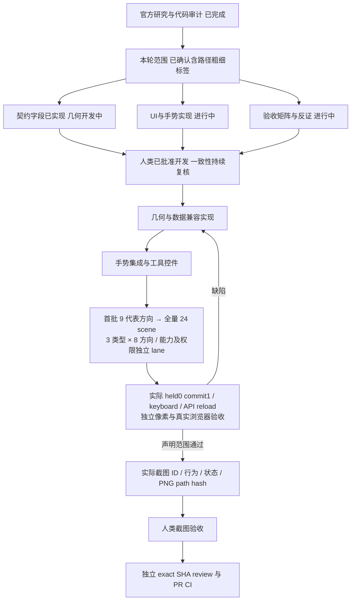

> Historical snapshot, 2026-10-02. Not current approval, runtime acceptance, or feature status. See README.md and issue #5001.

# Connector FigJam 体验执行计划

日期：2026-10-01。状态：用户已批准开发，实现进行中，未完成验收，不替代 feature_list.json。

跟踪 Issue：[Connector 新体验 #4878](https://github.com/boardx/workspacex/issues/4878)。2026-10-01 主会话实时查询未发现 BV13 标题 Issue 后建立，不声称覆盖所有历史 Issue 的查重。

## 已确认范围

用户要求研究 FigJam、建立验收标准并分派实现；另明确本轮也包含路径手柄、持久化粗细和标签位置。沿用之前的单次创建规则，完成一次返回 Select。Frame 继续隐藏，Connector 入口在完整验收前不恢复。

2026-10-01 用户针对「Connector 的新契约仍待设计签核」明确答复「我批准，你先完成开发」。主会话据此启动开发并保留原话作为人类授权证据；不伪造签名、不自行改写签核 status 或 feature passing。

官方来源：[Create diagrams and flows with connectors in FigJam](https://help.figma.com/hc/en-us/articles/1500004414542-Create-diagrams-and-flows-with-connectors-in-FigJam)。当前研究依据官方资料与本仓代码，尚未亲自操作 FigJam，不能声称进行了竞品实机验收。

## 责任与依赖

| Owner | 独占责任 | 输出与门禁 |
| --- | --- | --- |
| review_final | 新纯几何与吸附 helper、专属测试 | 当前转为实现 worker，不独立审查自己的代码；路径/命中/标签计算单源 |
| files_fix | 数据契约与兼容方案 | 有界字段、旧文档默认、复制导出、协作与撤销语义；不重复路径模型 |
| upload_fix | editor 手势状态机 | 创建/改接/路径/标签拖动，预览零写入、释放单事务、取消恢复 |
| tools_fix | 工具与上下文 UI | 三种真实路径预览、粗细/颜色/端点样式；先修旧菜单遮挡回归 |
| browser_prepare | 并行 Sticky Fabric 文本适配 | 独占 Surface Sticky 排版段，不竞争 Connector 段 |
| fabric_skill | 验收规范与浏览器测试 | 实际指针、独立几何/像素、API 读回、刷新、两个浏览器协作 |

主会话负责范围、接口对齐、动态队列、集成、独立复核、验收和交付。共享 editor、Surface 与契约按明确职责段划分 writer；Surface Sticky 段由 browser_prepare 负责，Connector 段由 upload_fix 负责，禁止整体覆写。几何作者不计为自己的独立 reviewer。

## 动态调度

最新位置/能力矩阵与人类截图计划见 [Connector matrix](connector-matrix-acceptance-plan.md)。
主会话报告 run10 严格 pointer subset 已通过，仍仅其报告声明的部分范围；新矩阵待执行。
browser_acceptance 独占新 matrix runner，review_canvas 独立 oracle，editor/core 单 writer。
不同位置/类型截图必须来自新冻结源码、实际行为和通过的 E2E 报告，不能由旧图或示意图代替。

用户追加批准 UI：Connector 单选不显示蓝色矩形框，保留真实可操作 handles；menu 改为紧凑、
功能完整 icon 工具栏。editor 独占生产、review_canvas 独立复核、browser_acceptance 新矩阵。
旧 full24 run2 24/24 scene、88/88 checks 是旧 chrome 源码证据，不能当新 UI 验收。
新增单选无 bbox / 非 Connector 与多选回归 / 宽窄菜单 hit / 最新截图门，详见 matrix plan。

沿用本轮 backlog 的事件驱动评分算法。设计未就绪的实现任务不进入 eligible 队列；其 owner 转到独立测试设计、兼容审计或旧范围缺陷修复，不用无关工作维持表面负荷。完成、失败、阻塞、验收发现和用户范围变更均立即重排。源码冻结期间仅验证与审查，不穿插编辑。

## 不得误报

- 现有 board-fabric-surface 签核仅 covers BV01-BV03，不自动覆盖 BV13 新体验。范围确认不冒充三件设计材料签核。
- 新 route、strokeWidth、labelPosition 字段由 contracts 单源提供，旧文档缺省保持原有行为；字段实现不代表 C01-C21 已验收，不在多个文件各自定义第二份模型。
- 候选测试命令尚未实现或执行时必须标明；没有截图、事务和持久化证据不能标通过。
- 原有核心交互本轮 Web 84 文件 548 测试、lint、typecheck 已通过；浏览器 run3 为 51 行为通过但整体 7/8 组通过，Sync 取消错误分类与菜单遮挡、CI Chromium 仍待修，不能被新任务掩盖。
- 新功能按 issue/PR 和设计门交付；用户禁止直接合并，不声明已合入或 feature passing。

本次设计过程中旧范围的前置缺陷另有进展：端点偏移重算最小修复通过 whiteboard-core 14 文件 160 测试；普通创建隐藏旧对象浮动工具栏与连接点，真实浏览器工具 7/7 通过，包含 390px 菜单所有可选按钮的 elementFromPoint 命中检查。证据目录 `/private/tmp/wsx-board-tools-menu-hit-run4`。这些不代表新 Connector C01-C21 已执行。
