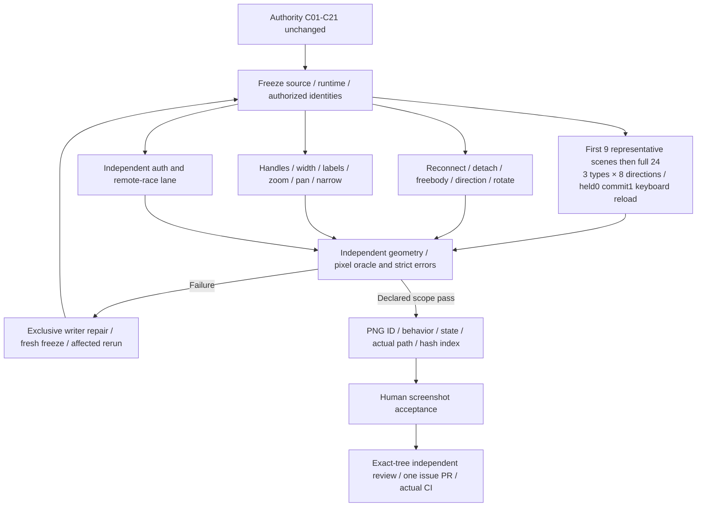

> Historical snapshot, 2026-10-02. Not current approval, runtime acceptance, or feature status. See README.md and issue #5001.

# Connector Position And Capability Matrix

2026-10-01 execution plan, not a second acceptance specification. Required behavior, thresholds,
contract semantics and C01-C21 definitions remain solely in
[Connector acceptance](connector-figjam-acceptance.md). This plan assigns execution combinations and
human screenshot views; it does not change signoff or feature status.

## Baseline And Ownership

Main reports run10 strict pointer subset passing on its frozen source. Preserve its exact report/hash
and declared partial scope; run10 is not all C01-C21 or the new matrix. New rows below are Pending.
`browser_acceptance` exclusively owns the new matrix runner and evidence. `review_canvas` owns an
independent geometry/pixel oracle review, not the production implementation. `connector_editor`
and `connector_core` retain their exclusive business boundaries. Main freezes source and schedules
the single heavy/runtime verification lane; `delivery_checks` owns this plan and the execution plan.

## Execution Matrix

Direction schedule single source for this plan (source node to target): right, left, down, up,
down-right, down-left, up-right, up-left. This is a test scheduling dimension, not a duplicated
canonical enum/constant. Each of three path types runs all eight directions: **24 independent scenes**.
The nine horizontal/vertical/diagonal rows below are the first representative discovery batch only,
not complete position coverage; finish the remaining direction scenes after that batch.

| Matrix IDs | Position/capability combinations | Standard reference | New execution status |
| --- | --- | --- | --- |
| P-S-H / P-S-V / P-S-D | Straight: horizontal / vertical / diagonal | C01, C02, C07, C10, C16 | Pending |
| P-E-H / P-E-V / P-E-D | Elbow: horizontal / vertical / diagonal | Same referenced standards; elbow-specific assertions from authority | Pending |
| P-C-H / P-C-V / P-C-D | Curve: horizontal / vertical / diagonal | Same referenced standards; curve-specific assertions from authority | Pending |
| P-REV / P-BI / P-ROT | Reverse source/target; both arrow-end directions; actual rotated nodes | C02, C06, C08 | Pending |
| E-RECONNECT / E-DETACH / E-FREEBODY | Endpoint reassignment, free endpoint, whole-free-edge translation | C03, C04, C05 | Pending |
| H-PATH / H-WIDTH / H-LABEL | Applicable path handles; measured width; multiline/long-word/CJK label and drag | C07, C08, C11, C14 | Pending |
| V-ZOOM / V-PAN / V-NARROW | Zoom/pan coordinate mapping and narrow real hit targets | C12, C13, C15, C17 | Pending |
| A-DELETE / A-LOCK / A-REVOKE / A-DUAL | Remote deletion/locking/revocation and genuinely independent browser processes | C18, C19, C20 | Pending; independent authorized lane |
| B-BOUNDARY | Cancel/outside/zero-length/reselected single-shot boundaries | C09, C21 | Pending |

Each of the 24 full type-direction scenes (including the first nine representatives) follows actual UI creation → held canonical zero-write
→ released single commit → actual keyboard Undo/Redo → saved API readback → reload. Use independent
endpoint/world/pixel assertions from the authority; do not manufacture a route handle for straight
paths or assume fixed type semantics from this scheduling table. Reverse/bidirectional/rotation rows
expand capability coverage, not merely screenshot composition. Reconnect/free-body and authority
lanes must retain the same connector identity and mutation assertions specified by the standard.

Auth/permission races run separately with real authorized owner/viewer/commenter identities and
independent processes where required. Owner setup is not viewer denial. A winning remote mutation
must be observed before release. API fixture setup cannot stand in for tested Connector creation.

## Human Screenshot Index

Each baseline scene gets separate selected and unselected committed-position images plus the
held-operation view; capability rows get the actual
state showing that capability. Files are indexed only after passing their declared E2E scope.

| Screenshot IDs | Intended observable behavior | Status | Actual PNG path / SHA256 |
| --- | --- | --- | --- |
| P-S-H/V/D-HELD and -SELECTED/-UNSELECTED | Straight first-batch representatives, live versus committed | Pending | Pending |
| P-E-H/V/D-HELD and -SELECTED/-UNSELECTED | Elbow first-batch representatives, actual bend visible | Pending | Pending |
| P-C-H/V/D-HELD and -SELECTED/-UNSELECTED | Curve first-batch representatives, actual curvature visible | Pending | Pending |
| FULL-type-direction-HELD/-SELECTED/-UNSELECTED | All 24 type × eight-direction independent scenes | Pending | Pending |
| P-REV / P-BI / P-ROT | Reversed/double-ended direction and rotated-node anchors | Pending | Pending |
| E-RECONNECT / E-DETACH / E-FREEBODY | Reassignment, unbound endpoint and translated free edge | Pending | Pending |
| H-PATH / H-WIDTH / H-LABEL | Path handle, width cross-section, label drag/background | Pending | Pending |
| V-ZOOM / V-PAN / V-NARROW | Mapped controls and unclipped narrow interaction | Pending | Pending |
| A-DELETE / A-LOCK / A-REVOKE / A-DUAL | Authoritative rejection/convergence, no stale preview | Pending | Pending |

The slash notation denotes separate IDs/files, not one image satisfying three cases. Each indexed
image records case/check ID, behavior, pass/fail/partial scope, frozen application hashes, viewport,
timestamp, PNG signature/bytes/hash and actual absolute path. Include an unobstructed viewport plus
target ROI when needed; do not reuse old run9 images as current source. Main displays actual fresh
images to the human after strict E2E, cleanup and source-stability gates; human approval remains
separate from automated subset success.

All matrix rows remain pending until actual reports are read. There is no summed score, no new
passing flag and no claim that the reported run10 subset closes the complete requirement set.
Execution inventory: 24 independent position scenes, with nine representatives first; 17 separately
named capability/race/boundary scheduling IDs in the grouped rows (P-REV/P-BI/P-ROT; three E;
three H; three V; four A; one B). Capability IDs may expand to multiple actual checks and are not
automatically distinct scenes or a fabricated total of 41 completed cases. Selected/unselected
screenshots are separate images of scene states, not extra C01-C21 completions.

## First Horizontal Attempts And Oracle Correction

The first three horizontal scenes in matrix runs 1/2 failed the strict gate. API-created identities
and held-zero/released-one stages were observed, but those stages alone do not make a scene pass.
The previous pixel oracle required raw alpha above 200 and rejected actual antialiased thin-line
pixels observed as RGBA `(40,37,29,191)`. This is an oracle coverage issue, not evidence of a
production positioning defect. Preserve both failed reports and images as failed history.

The runner owner is correcting the independent color-match/cumulative-alpha coverage oracle;
position ROI and coordinate tolerances remain unchanged. Its planned cumulative coverage threshold
must be mathematically justified and independently reviewed, not tuned to count any changed pixel.
Do not copy runtime pixel constants into this plan; the runner and independent reviewer own the
executable oracle and negative examples.

An old empty-check `handlePassed:true` was vacuous. Empty or unexecuted handle checks must report
NotRun, never pass. The new nine-representative run remains pending, as do the full 24 scenes.

Subsequent base9 actual report supersedes the pending first-batch status: all nine representative
positions passed creation/API/pixels/path-edit/reload stages, but **strict overall FAIL** remained
with four handle-gap scenes. Elbow horizontal/vertical endpoint handles overlapped elbow guidepoint;
curve horizontal start control overlapped end control; curve vertical endpoints overlapped route
handles, persisting after reload. Report contained 57 PNGs, zero unexpected/HTTP errors, stable
source and nine owned fixture fresh-404 cleanups. These are real interaction failures, not nine
overall passing scenes; preserve both ordinary position images and failure evidence.

Later full24 run2 reports 24/24 scenes and 88/88 checks on its **old chrome source**. Preserve that
real passing report without using it to approve the newly requested selection/menu UI below.

## Approved Selection And Toolbar Revision

The human explicitly requested no blue rectangular selection box for a single Connector and a
compact, function-complete icon toolbar; supplied images show the old base9 blue box/two-line menu.
Record this as human scope authorization, not an agent-authored signoff-status transition.

New UI checks: single Connector has no blue bbox while real endpoint/path/label handles remain
operable; toolbar retains every supported operation with icons/tooltips and visible selected states;
wide/narrow layouts avoid line wrapping, clipping and handle interception. Preserve ordinary object
selection and multi-selection behavior in independent regressions. Schema/constants remain their
existing single sources; this is chrome behavior, not canonical geometry mutation.

`connector_editor` owns production, `review_canvas` independently verifies selection/handle/menu
behavior, and `browser_acceptance` reruns the fresh frozen matrix and generates latest selected and
unselected screenshots. New UI regression, matrix, strict errors and human screenshots are pending.
Old full24 green and old base9 attachments remain history, not evidence for the new chrome source.

### Current UI Verification Gates

Main-reported fresh independent selection four checks plus toolbar two checks are GREEN; core focused
91 is GREEN. Full web lint is still FAIL on editor useMemo dependencies at the reported line 408,
owner repair and actual rerun pending. Label dirty-draft remote overwrite and IME Escape are new P2
repairs awaiting independent verification. These scoped results do not supersede full UI gates.

Pending fresh browser scope: compact toolbar at widths 1440 and 390; actual upper-canvas no-blue-bbox
assertion with Connector selected; genuine handle operability; ordinary/multi-selection regressions;
all 24 direction/type scenes on frozen new UI source. Preserve old run2 as old UI evidence only.

Human screenshot checklist, all still pending actual paths:

| View | Human-observable result | Evidence scope |
| --- | --- | --- |
| Wide selected Connector | No blue rectangle, compact complete toolbar, real handles | New UI 1440 width; not old run2 |
| Narrow selected Connector | Controls fit and are hittable, no overlap or clipped actions | New UI 390 width |
| Unselected path variants/positions | Straight/elbow/curve ink and directions visible independently | New 24-scene frozen matrix |
| Edited path/width/multiline label | Correct ink, compact label background and retained attributes | Actual held/commit/API/reload checks |
| Label conflict/IME interaction | Draft preserved or conflict explicit, no silent data loss | Independent P2 checks plus browser declared scope; native IME separately named |

No row has a passing image path yet. Each eventual image carries scene/check ID and PASS/PARTIAL
scope so visually convincing screenshots cannot masquerade as all C01-C21 passing.

Fresh main-executed gate update: complete web lint exited 0 with no warnings; gen-light 49-token
and design scans passed (session 67771), superseding the earlier dependency-warning failure.
Independent editor UI/IME/draft 21 checks and independent security five RED-to-GREEN checks passed.
Core focused 100 and core tsc passed but do not prove Web typecheck; full Web typecheck session
48390 is in progress without a result recorded here. New 1440/390 and 24-position browser gates
remain pending. Screenshot indices remain unfilled until actual fresh report/paths are available.

Superseding static-gate state: latest full Web lint session 61166 and typecheck 12493 exit 0;
the earlier 48390 test-typing failure and later 20507 pass remain history. Complete UI+whiteboard
593-file regression is RED (4,746 passed, seven failed, five pending out of 4,758), three test files
being repaired. New-UI desktop24 actual report
`/private/tmp/wsx-connector-final-ui-desktop24-run1/report.json` records position-subset-pass with
full requirement coverage false; main records exit 0. Narrow 390 nine-scene run is in progress.
Index only actual desktop images with that subset scope, not full C01-C21 or narrow approval.

## Latest Anchored Menu And Icon Requirement

Human additions: selected submenu at 390px anchors above its Connector/object rather than fixed
at viewport bottom; inspect the shared positioning path for all widgets. Replace ambiguous repeated
diagonal line-style/start/end icons with horizontal line-style previews and one combined endpoint
style entry. Preserve actual start/end choices and every supported action behind that entry.

Editor/security owners report implementation, not independent acceptance. Reviewer verifies six
object kinds at two viewports on the actual shared positioning path; browser prepares fresh
selected-menu screenshots with real trigger hit targets and anchor alignment. Previously passing
desktop24/narrow9 reports do not satisfy these later requirements. New screenshot path/hash and
human visual approval remain pending; no feature or signoff status is changed here.

Prior-baseline complete UI+whiteboard rerun exited 0: actual JSON has 594 file results and
4,759 tests (4,754 pass, zero fail, five skip). Latest position/icon edits overlapped its execution,
so freeze/rerun affected gates before calling the new source green. New toolbar 22 focused pass;
independent positioning 14 cases await implementation. No new screenshot scope is closed by
the baseline suite report.

Latest frozen-source increment: selected-panel object anchoring 21 focused checks and new toolbar
22 checks pass. Fresh full UI/whiteboard session 76192 report target
`/private/tmp/wsx-web-ui-whiteboard-menu-freeze-20261001.json` is running; do not record it green
before the actual result. Fresh browser images and independent positioning gates remain separate.

New narrow first-diagnostic run2 reports 7/7 PASS on its recorded source: selected menu y260,
height46, bottom306, above actual path top340; no bbox, horizontal line preview and combined
endpoint visual. Actual image:
`/private/tmp/wsx-connector-above390-run2/straight-horizontal-compact-menu-selected.png`.
This is pre-resize-increment diagnostic evidence, not final all-widget acceptance. A necessary
top-anchor resize-direction fix subsequently completed two RED-to-GREEN regressions (21 combined
focused pass). Source was refrozen; all-widget and Connector matrices are being prepared anew.
Do not represent this one actual screenshot as every widget, final source or all C01-C21 passing.

Fresh complete suite 76192 finished exit 1: 595 files, 4,768 pass, two fail, five skip. Failures are
legacy UI expectations for the removed separate start-style entry and fixed-bottom anchoring class;
editor owner is updating them to assert the actual combined endpoint interaction and object anchoring,
not deleting tests to manufacture green. Full Web typecheck 59011 exited 0 after canonical fixture
typing correction. Object-context chevron/alignment-state fixes are necessary new source changes;
final screenshots wait for that source and a fresh freeze. No complete-suite pass is recorded yet.

Latest frozen browser reports are complete and read directly:
`/private/tmp/wsx-connector-above-final1440-24-run1/report.json` has 24 scenes / 138 passing checks
and 347 PNGs; `/private/tmp/wsx-connector-above-final390-9-run1/report.json` has nine scenes /
53 passing checks and 132 PNGs. Main reports matching source hashes, zero unexpected/HTTP errors,
33 owned fresh-404 cleanups and all narrow dense-path menus above the actual path. These supersede
the pending position/menu browser gate only: coverage is position-only, not complete C01-C21.

All-widget toolbar runs `/private/tmp/wsx-object-toolbar390-run3` and
`/private/tmp/wsx-object-toolbar1440-run2` each report ten strict checks and 30 PNGs, including
initial views. Distinguish controls hit from executing every mutating command. API-seeded widget
fixtures prove positioning/selection, not user creation; real Trackpad/native hardware is untested.
Latest full lint12157/typecheck66722 exit 0; full regression18961 is still running without final
result. No all-backlog-green claim follows from these browser counts.

Final frozen regression read directly:
`/private/tmp/wsx-web-ui-whiteboard-final-widgets-20261001.json` contains 597 file results,
4,782 total tests, 4,777 passed, zero failed, five skipped, `success:true`; main session18961 exit0.
Together with full lint12157/typecheck66722 and the latest position/widget browser reports,
the current menu/position revision gates are GREEN. Preserve the earlier failing attempts as
history. The 53 browser scenes (33 Connector position plus 20 widget-position checks) retain
their scoped assertions; they do not complete all C01-C21, all mutating controls, hardware tests,
the whole backlog or the unresolved quote-file contract approval. No feature passing, PR merge
or automatic human screenshot approval is declared.

Continuation queue with current six workers, exact remaining acceptance dependencies and hunk
delivery blockers: [remaining delivery queue](connector-remaining-delivery-queue.md). Latest menu
scope green is the starting baseline, not permission to erase the full required capability gaps.

### Per-Scene Evidence Record

Each actual scene report must index: scene ID and path/direction; application hashes before/after
and sourceStable; held/commit/UndoRedo/reload check statuses; selected/unselected/held PNG absolute
paths, signature, byte count and SHA256; strict page/console/network errors and classification;
cleanup result; PASS/FAIL/NotRun for each applicable handle/capability. Inapplicable controls are
explicitly distinguished from applicable-but-unexecuted checks. No screenshot path is marked
passing here until the corrected fresh run and independent oracle review succeed.
