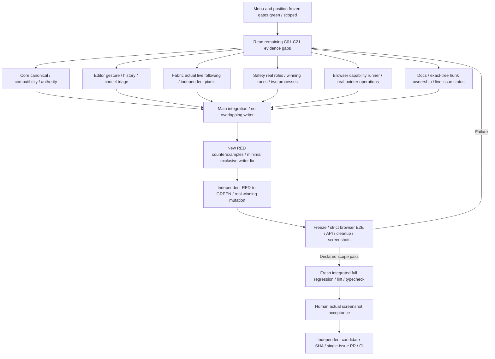

> Historical snapshot, 2026-10-02. Not current approval, runtime acceptance, or feature status. See README.md and issue #5001.

# Connector Remaining Delivery Queue

2026-10-01 continuation after the final menu/position freeze. The authoritative requirements remain
[C01-C21](connector-figjam-acceptance.md); this queue maps remaining evidence, not a second spec.
Latest desktop24/narrow9 and widget20 scenes prove their reported position/chrome scopes. None is
silently promoted to complete C01-C21 or hardware acceptance.

## Evidence Gaps And Dependencies

| Required IDs | Still needed beyond recorded subset | Execution dependency / writer |
| --- | --- | --- |
| C01/C21 | Complete creation boundaries, zero-distance/free destination/reselect sequence and snap cue assertions | Browser capabilities; fresh UI gestures, not seeded edges |
| C02 | All cardinal anchor IDs, snap-radius inside/outside and actual rotated endpoint oracle | Browser capabilities + core snap single source |
| C03 | Reconnect both requested targets/sides; moving old/new target proves changed binding | Browser capabilities + editor gesture |
| C04 | Both ends detached, actual whole-body translation with path/style invariance | Browser capabilities + editor free-body behavior |
| C05 | Real modifier bypass/resumption and subsequent target movement independence | Browser capabilities; OS hardware not inferred |
| C06 | Actual node drag/resize/rotation/multi-selection held following and independent pixels | Fabric live-follow writer/reviewer; capture controls rather than imperative mutation |
| C07/C14 | Every applicable elbow/curve handle, cancel/reload/UndoRedo at required viewport transforms; straight free-body behavior | Browser capabilities + core path + editor gesture; position matrix alone insufficient |
| C08/C15 | All style/end choices actual paint, dashed gaps/direction and independent width cross-sections | Browser capabilities; toolbar hit alone is not command execution |
| C09/C10 | Native pointercancel and every supported gesture history/cancel recovery | Editor triage + actual input runner; preserve one-gesture attribution |
| C11/C16 | Second-browser persisted rendering; label positions across paths/transforms and endpoint/path changes | Independent browser processes + core label model; no second schema |
| C12/C20 | Real viewer/commenter/outsider denial and in-flight revocation/archive/lock race with unchanged authoritative head | Safety race lane; authorized identities and observed winning mutation |
| C13 | Required zoom/pan creation/reconnect combinations beyond recorded narrow positioning | Browser capabilities; nonzero viewport inverse oracle |
| C17 | Actual copy/paste/duplicate and standard/portable roundtrips, remapped bindings and legacy malformed cases | Core canonical lane + real API/browser roundtrip |
| C18/C19 | Two process convergence and remote deletion policies with full node/edge/history restoration | Safety race + core/editor; no assumed winner from static trace |

Every row references the authority's required fields/tolerances rather than redefining them. Exact
check totals must come from the new runner's executed/nonempty manifest; grouped IDs are not counts
of completed cases. No optional deferral of the user's required path/width/label round is implied.

## Six-Worker Dynamic Assignment

Browser capabilities owns new capability runner/evidence; core canonical owns contracts/path/spatial
command and compatibility tests; editor triage owns editor/hook/toolbar integration; Fabric live-follow
owns its exclusive Surface transform/paint segment; safety race owns independent permission/race
fixtures/review; delivery docs owns this queue and hunk/evidence records only. Main coordinates shared
hotspots, chooses eligible work and runs final source-frozen gates. A reviewer does not approve its
own implementation. Heavy suites and runtime/browser execution stay in one scheduled lane.

### New Continuation Evidence

Editor late-candidate integration adds nine checks: three actual RED cases where target lock,
hidden state or deletion silently turns a previously attached candidate into a free endpoint;
six GREEN cases include legitimate pointer leave and modifier-forced free drops. Editor owner is
making a minimal hook repair preserving candidate identity until release validity is checked.
These failing cases remain blockers until independent rerun, not acceptable fallback behavior.

Fabric C06 small real-surface scope reports three GREEN tests: straight connector with attached
from/free end, actual move/scale/rotate, held-zero/release-one checks and remote projection without
echo. This is not the full C06 asymmetric/multi/both-bound matrix. Core lifecycle three and
PortableService three pass; service-level is not real HTTP, and API manifest inclusion is pending.
New browser capability script has not launched while waiting for source freeze. Do not add these
counts to historical 4,777 passes or claim latest integrated full regression green.

Subsequent held-candidate repair reports author 30 pass and independent safety nine PASS with
strengthened cleanup, superseding those specific three RED cases; real controlled-API late-race
browser coverage remains pending. Straight capability browser
`/private/tmp/wsx-connector-capabilities-straight-run1` reports 7/7 checks, 18 PNGs: reconnect,
detach, real Meta free drop, dual-free whole-body delta, Escape and label-normal/UndoRedo/reload
behavior. Its coverage remains false; it does not complete C01-C21 or all path/permission races.
PortableService three tests are now included in the original configured manifest and pass.

Latest static gates supplied by main: Web typecheck22436, API typecheck5363 and lint14304 pass.
Fresh full suite8180 output `/private/tmp/wsx-web-ui-whiteboard-connector-capabilities-20261001.json`
is running; historical 597/4777 passes are not a fresh-hash full-suite result for these changes.

GitHub publication boundary: detailed security/permission comment was denied by auto-review.
Main requested explicit human authorization; do not retry through another tool/channel or publish
those details before approval. This record is local only and PR delivery remains incomplete.

Fresh current-hook frozen full Web result read directly:
`/private/tmp/wsx-web-ui-whiteboard-connector-capabilities-20261001.json` has 599 file results,
4,796 total tests, 4,791 PASS, zero FAIL, five SKIP, success:true; main8180 EXIT0.
This replaces the running state for that invocation and is current-hook integrated evidence,
not historical 4,777 passes. Real late-three controlled-API browser has zero executed checks;
runner patch approval timed out and remains pending, not a completed or security-rejected run.
Final handoff waits for that actual result; public-detail authorization still pending, no publication.

Real controlled-API late-target run1 now executed: locked target PASS, but hidden server state and
observer WebSocket/cue removal were followed by a still-visible target paper, an actual rendering
FAIL. Evidence `/private/tmp/wsx-connector-late-target-run1/report.json` and
`/private/tmp/wsx-connector-late-target-run1/late-target-hidden-failure.png` remain preserved.
Hidden-release and deletion were not executed in that failed attempt.

Canvas hidden-visibility/interaction-ghost repair reports 26 focused pass; editor context hiding
has two RED-to-GREEN cases and 12 pass. These are projection/UI fixes, not ACL changes. Source is
refrozen; new full67241 `/private/tmp/wsx-web-ui-whiteboard-hidden-projection-20261001.json` runs
without result yet. Previous 599/4791 report is not complete green for this newer projection.
Late-target run2 is authorized to execute and final static/safety gates are running. All results
remain local; no passing status or public security detail is published here.

Latest actual late-target run3 `/private/tmp/wsx-connector-late-target-run3/report.json` completes
three strict PASS cases and 12 PNGs, source stable, unexpected/HTTP errors zero, three owned
fresh-404 cleanups. Main confirms actual received epoch1/sequence3 and latest locked/hidden/deleted
states; controlled API head2→3 then release remains3, saved binding restored on reload. Hidden/deleted
target paper independent blue pixels become zero. Preserve run1 production-hidden RED and run2
duplicate-Yjs instrumentation RED; neither is rewritten by run3.

Full new-projection suite67241 is still running without final counts. Latest Web lint42543 and
typecheck3298 pass on frozen source; final handoff waits for actual complete-suite result. Run3
proves this controlled late-target lane, not all independent-process/role/revocation/C01-C21 scope.
Public approval remains pending, all detailed updates stay local.

Final actual new-projection frozen report read:
`/private/tmp/wsx-web-ui-whiteboard-hidden-projection-20261001.json` success:true,
601 files / 4,805 total / 4,800 PASS / zero FAIL / five SKIP, main67241 EXIT0.
Latest Web lint42543/typecheck3298 and API typecheck5363 pass. Independent safety review confirms
late-target run3 current hashes and its three strict checks/12 PNGs, actual official update/head
nonmutation/hidden removal/owned cleanup. Straight-seven report remains historical scoped behavior
at its prior renderer hash, not all-current-source capability evidence. Remaining complete C01-C21,
multi-identity/process/OS-hardware, quote filename contract, public authorization and PR/CI delivery
remain open. Browser resources released; owned non-Docker runtime56874 remains preview3317.

## Live Delivery Audit And Candidate Hunk Map

Live issue query succeeded: #4878 OPEN, no closing-PR references. PR-list query failed networking;
absence of an existing PR remains unknown. This audit did not checkout, commit, index or create PRs.

Candidate #4878 includes canonical Connector contract additions, `connector-path`/`connector-snap`,
route/authority/CAS document and spatial-command hunks, exports, dedicated Connector UI/hook/gesture
modules and corresponding independent negatives/history/preview/width/label tests. Shared editor,
Surface, dock and tests must exclude unrelated R1 navigation/drawing, #4222 Sticky, R3 image/sync and
R4 ordinary-file hunks. Old offset-only regression remains R1 unless scope explicitly changes.
The Connector runner currently depends on Sticky runner/classifier modules; include only necessary
test infrastructure with a clear dependency or separate the runner, not all Sticky business code.

Blockers before one issue PR: actual existing-PR lookup, coherent isolated candidate tree with all
imports and independent exact-SHA gates, remaining required capability evidence, human latest image
review, and actual CI. R4 quote filename contract approval is separate scope and cannot be quietly
included to make the Connector tree green. All dirty changes by other owners remain untouched.
