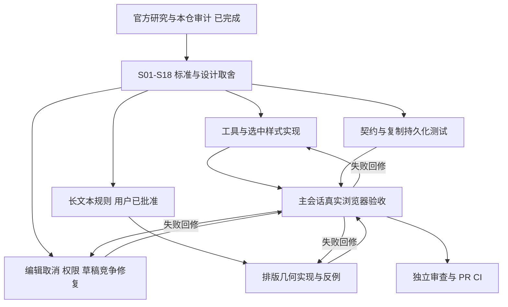

> Historical snapshot, 2026-10-02. Not current approval, runtime acceptance, or feature status. See README.md and issue #5001.

# Mural 便利贴研究与执行计划

日期：2026-10-01。跟踪：[既有 Mural Sticky 体验任务 #4222](https://github.com/boardx/workspacex/issues/4222)。本文件是研究和执行记录，不替代 feature_list.json、不代签设计、不声明 passing。

## 官方研究

主要来源：[Mural 官方便利贴教程](https://learning.mural.co/lessons/add-create-and-customize-sticky-notes)、[官方便利贴用途页](https://www.mural.co/use-case/sticky-notes)、[官方 Sticky 更新 API](https://developers.mural.co/public/reference/updatestickynote)。本次是官方资料与本仓代码研究，不是登录 Mural 的实机验收。

- 官方教程强调先选形状与颜色，再把便利贴拖到画布；形状和颜色都是创建前可决定的内容。
- 教程还介绍双击空白、附近便利贴样式继承和 Tab 快速添加；这些是竞品参考，不自动成为本产品要求。
- 教程建议通过视口缩放阅读默认大小便利贴，而非仅为阅读改变便利贴尺寸。
- 官方 API 可证文字、样式、几何、旋转等数据能力，不证明其浏览器输入法、自动字体适配或撤销细节。

## 本产品取舍

保留用户明确要求：方/长方/圆形及颜色真实预览，工具栏与创建结果一致；点击创建一次即返回 Select；也可从工具拖出创建；移动时菜单、控制点和关联连线实时跟随。创建拖放与文字编辑分开，不能把原生 Tab 打字或 IME Enter 误判为连创。

2026-10-01 用户答复「按照你的推荐的设计来开始开发」，批准固定已选形状/尺寸、自动换行与适度缩小到可读下限；超限时编辑区滚动显示完整内容，不截断或丢字。实现只调整显示排版，不为适配重写 canonical text 或尺寸；可读下限复用现有 TEXT_PRESETS.caption 单源。此为本产品决策，不归因于 Mural 官方行为，也不代填人类签名或 feature passing。

本轮不自动添加附近样式推断、持续创建、富文本 HTML、标签、投票、便签堆栈或 Frame 入口。已经存在的批量/快捷路径单独记录现状和缺口，不因读到竞品介绍就扩大本轮交付承诺。

## 六路责任

| Owner | 独占工作 | 必须输出 |
| --- | --- | --- |
| tools_fix | picker/dock/style toolbar、对应测试 | 真正的颜色形状预览、直接拖出后最近选择一致、可命中窄屏控件 |
| browser_prepare | Fabric sticky 排版/轮廓/几何、专属 helper/tests | 实际文本度量、圆形内接约束、FixedLayout 不漂移；仅负责 Surface 的 Sticky 排版段 |
| upload_fix | editor/ThinkingInputEditor、交互测试 | Esc 取消创建、锁定拒绝、输入法/编辑结束、远端竞争下草稿不丢失 |
| files_fix | 现有契约与独占生命周期/交换测试 | 序列化、复制/导出/备份、权限和 Undo 的真实边界，无第二份 schema |
| fabric_skill | S01-S18 标准、专属浏览器脚本 | 实际指针与像素、独立几何、API/刷新、双进程和失败门 |
| review_final | 只读独立复核与反证 | 不把计划当实现，不把软件合成输入当原生硬件/IME 验收 |

主会话统一调度、研究判断、实际浏览器执行、集成和证据汇总。每个共享业务文件只允许一个 writer。当前可修的原要求缺陷优先于未经确认的新功能；blocked owner 转入独立测试/审查，不通过无关代码维持忙碌。

## 验收与进度

验收单源：[sticky-mural-acceptance.md](sticky-mural-acceptance.md)。S01-S18 包括预览、单次创建、重叠点创建、真实拖放、取消、文字/IME、长文本、变换、实时跟随、撤销、持久化、双浏览器、只读/锁定竞争、缩放/DPR和窄屏。文本编辑沿既有 debounced history，不冒称整个编辑会话仅一个 Undo；Esc 当前结束并提交待处理文字，不是回滚原文。

所有脚本须记录执行项/未执行项、源码 hash、实际用户输入、读回结果、截图和意外错误。M0 基础软件矩阵通过不等于 S01-S18 全部通过；未签策略、未测真实 OS IME/Trackpad 不能删除或伪装 PASS。

当前：picker/dock/选中样式预览及 Esc 创建取消、远端竞争草稿保护已有实现和定向测试。浏览器 run5 的 9 项行为通过，但严格错误门因 3 条请求取消未能归因而失败，不能称整体通过。长文本新策略已获用户批准，排版和编辑区分别开始开发。完整 S01-S18、PR 和 CI 尚未完成，不声明 9/10 或全量完成。

后续验证：run7 修复取消归因后为 9/9 M0 subset-pass，错误 0，8 张截图校验，测试板归档删除后 fresh GET 404；并非完整 S01-S18。2026-10-01 15:32 主会话独立运行 `pnpm --filter web exec vitest run tests/ui/board-sticky-text-layout.test.ts tests/whiteboard/thinking-input-interactions.test.tsx tests/whiteboard/board-content-tools.test.tsx tests/whiteboard/collaborative-editor.test.tsx --no-cache`：4 文件 / 102 测试通过、退出码 0。包含固定尺寸创建、全文提交不改几何、圆形实际直径边界和真实 Fabric 排版；旋转编辑、字体加载刷新及真实长文本浏览器项仍待最终验收。

真实长文本 run11 的 12 项软件子集通过（3 形状、3565 字符、固定几何、实际滚动尾部、缩放与刷新）。主会话查看 `long-circle-tail.png` 后发现圆形编辑的整个 textarea 滚动视口仍会越出圆形，已要求改为内接滚动视口并补视觉反证；不得把这份行为子集报告作为圆形视觉通过。双独立浏览器 run12 的文字和移动收敛通过，但 61 条同用户多会话 presence 重复 key 警告导致严格失败，正在修复源头，不能忽略警告制造绿色。
