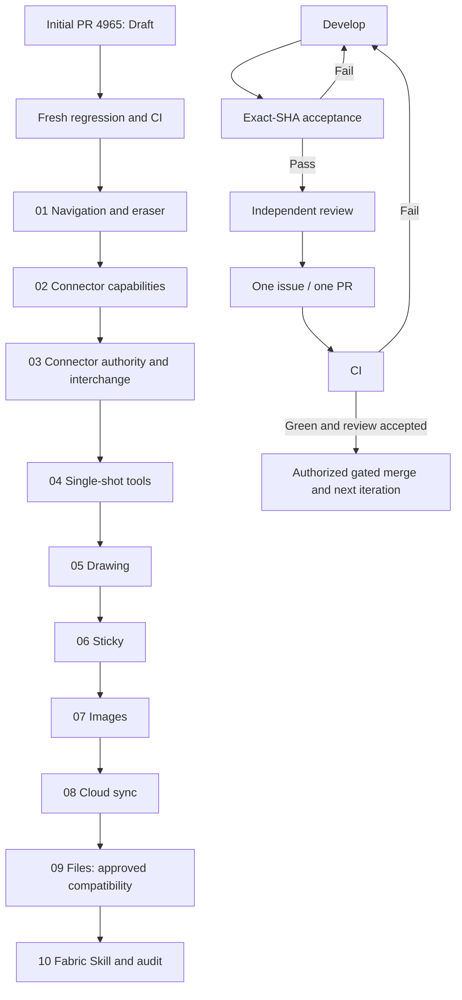

# Board UX: Next Ten Iterations

Date: 2026-10-02 (Asia/Shanghai).
This is a user-requested delivery plan, not a feature-state or design-signoff source.
Existing feature lists, bundle contracts and human signoff remain authoritative.
Initial delivery: https://github.com/boardx/workspacex/pull/4965 (Draft).
The initial PR is not counted as one of the ten following iterations.
Round 01 software-subset evidence: https://github.com/boardx/workspacex/pull/4993
(Draft stacked on #4965). Runtime source `48a96cbe2e68f49167b9da54a4d9d44fd0c80b28`;
evidence-only head `5be0a4ef63868d58e2f6b8c8d8d7bb37fbef967d`.
Native hardware remains unaccepted; live CI/review state must be read from GitHub,
not inferred from this publication record.
Round 02 publication: https://github.com/boardx/workspacex/pull/4998
(Draft stacked on the navigation branch), source head
`fad52d981c8fb76821f75409b537f1b5ee315f45`. A fresh `gh pr view` confirmed
OPEN/Draft at publication; full runtime acceptance, current CI and merge remain unverified.

## Common Acceptance And Delivery Gate

Each iteration follows: issue/scope -> candidate development -> exact-SHA freeze ->
automated regression -> real browser/API acceptance -> independent review -> PR -> CI.
Failed acceptance returns to development; a draft or pending CI is not a passing iteration.
Do not bypass acceptance, independent review or the repository's green-check merge gates.
The human authorized merging after those gates pass; this is not a permanent merge prohibition.
No issue closure or feature passing claim before the repository's gates.
Run ./init.sh for each new candidate. Required CI is green only when the repository's
classifyChecks accepts it. Any post-acceptance code change requires a new frozen SHA
and rerun of affected acceptance. Hardware gaps permit only software-subset acceptance,
not a claim that the complete iteration has passed.
One issue per PR. Multiple issues in a round require separate PRs, not a mixed PR.
Dependent PRs must declare their parent/base; shared Editor/Fabric changes are serialized.
On 2026-10-02 the human directed development to continue through all ten rounds
without waiting for CI. CI is a delivery gate, not a development scheduling gate.
Independent domain work may run concurrently on isolated candidates; dependent
local acceptance uses integrated exact-source candidates. Keep each round's PR
separate and report pending/red CI explicitly; do not bypass merge gates or claim passing.
Do not reset, switch or stage the original dirty development checkout.

For every item, retain command exit codes, case manifest, exact source SHA/hash, API
head/canonical readback, refresh results, failure history and owned-fixture cleanup.
UI acceptance includes 1440px and 390px screenshots with actual menu/control interaction.
Visual claims require rendered pixels, not only DOM or mock assertions.
Browser sessions/secrets and private fixture data must not enter the public repository.
Run full related Web UI/whiteboard tests, Web lint/typecheck and Core checks; when API
changes, run API lint/typecheck and its configured whiteboard test manifest.
Historical mixed-worktree results cannot substitute for candidate-tree verification.
Real Mac trackpad/pinch and macOS IME remain hardware gates, never simulated passes.

## Iteration Backlog

Integration order is 01 -> 02 -> 03 -> 04 -> 05 -> 06 -> 07 -> 08 -> 09 -> 10.
Implementation overlaps where ownership is disjoint: 02, 04, 05, 06, 07 and 09
start in separate worktrees; 03, 08 and 10 follow as implementation lanes free up.
Dependency audit found that initial f09436316 lacks held-node transform previews;
therefore #4858 must precede complete Connector live-follow acceptance. The sections
below retain domain grouping; numeric round IDs define the execution order.

### 02: Connector Capability Matrix -- #4967

Depends on PR #4965 and iteration 01 #4858 live geometry preview; related parent #4878. Initially planned, not verified.
- C01: Drag-create on four anchor sides; verify snap threshold inside/outside and zero-distance cancellation. Held gesture writes zero operations; release writes once; return to Select.
- C02: Reconnect/detach both ends, Meta force-free, move/scale/rotate/multi-select follow. Independent world-coordinate error <=0.01 and screen endpoint error <=2px at zoom 0.5/1.65/2, nonzero pan and 390px.
- C03: Straight/elbow/curve handles, width/color/line/arrow styles and label position produce distinct correct pixels; API readback, Undo/Redo and refresh preserve values.
- C04: Esc/pointercancel clear preview/capture without revision; next gesture works. Real keyboard history restores complete semantics; contextual menus stay above paths with no blue bbox, overlap or ambiguous duplicate icons.

### 03: Connector Collaboration And Authority -- #4968

Depends on 02; related parent #4878.
- C05: Two independent browser processes with explicit different users converge on head/canonical/rendered path after route/width/label changes and concurrent reconnects.
- C06: Viewer/commenter/outsider cannot write via UI or equivalent valid API payloads; head is unchanged. Mid-gesture revoke/archive/lock/hide/delete cannot submit unauthorized or stale edits.
- C07: Delete/undo restores node, edge, binding, route, style and label while preserving unrelated remote endpoint movement.
- C08: Duplicate/copy/paste and standard/portable export-import preserve fields and remap IDs; old records default safely and invalid fields are rejected.

### 01: Navigation, Live Transforms And Erasure -- #4858

- N01: Select-mode wheel pans; Ctrl/Meta wheel zooms around pointer within bounds; text editing retains input. Automated input plus real browser checks; native trackpad acceptance is recorded separately.
- N02: Middle/right-button pan creates/selects no object and suppresses unintended context menu. Release/pointercancel/blur terminate pan; React/Fabric viewport remains consistent.
- N03: Sticky/Shape/Drawing drag/scale/rotate keeps handles, menus and existing connector endpoints live; held canonical is unchanged, release is one transaction, Esc restores all.
- N04: Rotated/scaled local-offset endpoint geometry remains correct after multi-select and refresh. Reuse the Connector offset fix rather than duplicate it.
- N05: Eraser hits only actual drawing strokes, never Sticky/Shape/image/locked drawings; transformed/empty hits work. A multi-drawing erase gesture has one atomic Undo/Redo.

### 04: Single-Shot Creation And Visual Menus -- #4859

- T01: Selecting Sticky/Text/Shape creates nothing; one canvas click creates exactly one object and returns to Select; next click does not repeat; Esc and menu clicks create nothing.
- T02: Native Dock/picker drag-drop at 50/100/200% and offset viewport lands correctly with one transaction. Outside release/cancel creates nothing.
- T03: Sticky color/shape match picker, Dock and object; recent choice persists. Text shows real size/weight and Shape its actual outline, not text-only substitutes.
- T04: Every actual submenu entry has a chevron. All options are reachable at 1440/390 without overflow, occluded controls or indistinguishable command icons. Preserve existing Arrow/Frame data.
- T05: Hide Frame creation entry and F shortcut as requested; Connector exposure follows the approved gate. Existing Frame/Connector objects remain readable and editable where permission allows, with no serialization loss.

### 05: Compact Drawing And Distinct Strokes -- #4969

Depends on 01/04; related parent #4859.
- D01: Draw panel height is 45-55% of a recorded baseline at a fixed viewport; style/width/color remain reachable, Opacity is removed, 390px does not clip.
- D02: Pen/Marker/Pencil/Highlighter previews match real strokes and are distinguishable. Same-stroke highlighter segments have no dark seams; cross-stroke blending policy is tested.
- D03: One stroke equals one history transaction; cancel leaves no fragment. Undo/Redo/refresh preserve style/width/color/geometry at 50/200%; N05 erasure regresses cleanly.

### 06: Mural-Inspired Sticky Experience -- #4222

Depends on 04; uses the existing S01-S18 standard rather than replacing it.
- ST01: All colors times square/rectangle/circle match actual pixels in picker, Dock and board; picking creates nothing and recent choices survive reopening.
- ST02: Click and native drag create once; Esc/outside-release/pointercancel/lost-capture leave no draft or saved object and subsequent creation works.
- ST03: At least 3565 mixed-language characters, newlines and long words persist fully in all shapes. Fixed geometry, real font-floor token and rotated-circle clipping remain correct; scroll/edit the tail and read/select full text without operation POSTs.
- ST04: Remote updates do not overwrite unsent local draft; conflicted commit preserves draft. Composition does not submit early; real OS IME stays a separate hardware gate.
- ST05: Actual transforms keep handles/menu/edges live; single history steps and reload preserve text/shape/color/geometry. Viewer/lock/revoke/delete races reject writes without resurrecting objects.
- ST06: Independent-user browsers converge; zoom/pan/DPR1/2 and 390px options are correct. Complete S01-S18 evidence on this candidate, not aggregated historical subsets.

### 07: Image Entry, Retry And Persistence -- #4860

- I01: Real local picker, dialog drop, board drop, paste, I shortcut and controlled successful HTTPS URL use one upload path; create exactly one image with correct pan/zoom placement.
- I02: Downloaded asset bytes match source digest; object/asset API and refresh show persistent image. Replacement preserves object ID; failed replacement preserves original.
- I03: Bad MIME/corrupt bytes/over-limit/revoked access create no object. Inject one real 503, retry once without duplication and retain intended position; busy/abort/unmount prevent late submits.

### 08: Cloud Sync And Reconnect -- #4970

Related parent #4860; separate from image business changes.
- S01: Remove yellow standalone status bar. Header cloud reports pending until actual server ACK and then synced; labels agree with real state after drag/text/undo.
- S02: Actual WebSocket disconnect shows offline without false saved status. Offline edits survive reconnect; real ACK, API snapshot, refresh and second-browser update agree.
- S03: Failed reconnect is recoverable without lost writes; 1440/390 icon/control screenshots; readonly and unmount cause no late submission.

### 09: Ordinary File Drag-Drop And Security -- #4861

- F01: Nonimage file drops directly to board, never image dialog. Correct pan/zoom placement, one tile, exact upload/download SHA-256, original metadata/UI filename and refresh persistence; 503 retry adds no duplicate tile.
- F02: Missing/empty returns 400; 25MB+1 returns 413 with no readable asset. Other-board/cross-tenant/viewer/revoked writes reject. Archive/org-freeze and private attachment/octet-stream/nosniff/no-store behavior are proven via real HTTP.
- F03: Apostrophe/brackets/star/Chinese/percent/double-quote filenames survive real multipart, metadata, UI and RFC5987 header exactly. Browser disk names may use native safe-character normalization; pinned Chromium replaces star/double-quote with underscores, while the other matrix names remain unchanged. Browser download bytes and SHA-256 must remain exact. Portable/copy rejection is explicit, never silent asset loss.
- Contract decision: on 2026-10-02 the human explicitly approved optional multipart fileName with compatibility when old clients omit it. The 2026-10-05 human decision supersedes the original exact browser disk-name requirement: native safe-character normalization is accepted, while original multipart/metadata/UI/RFC5987 names and downloaded bytes remain exact. Approval is not implementation or acceptance. Record this decision in the existing bundle workflow without agent-authored signoff status.

### 10: Fabric Canvas Skill And Final Evidence Audit -- #4880

Depends on exact source facts from prior rounds, not assumed merges.
- K01: Skill frontmatter validates, six references and internal relative documentation links resolve at PR SHA. Unmerged source helpers use explicit PR/commit links with conditional status, never extra business code just to satisfy links; no duplicate schema/algorithm facts.
- K02: Independent reviewer can navigate canonical state, coordinates, projection, gesture, history and acceptance. Remove stale hard-coded evidence counts and contradictory implementation status.
- K03: Audit each round's exact SHA, screenshots, API/reload and cleanup evidence, required CI and unresolved findings. Report missing hardware or permission tests explicitly; audit document does not close other issues.
- If Chromium CI setup needs repair, create a separate infrastructure issue/PR and prove the real GitHub job runs pixel tests. Do not hide CI code inside the Skill PR.

## Scheduling

| Round | Implementation responsibility | Acceptance responsibility | Independent review |
| --- | --- | --- | --- |
| 01 | Navigation/Fabric writer | Input/geometry/eraser lane | Canvas reviewer |
| 02 | Connector runner writer + main precise integration | Browser/environment lane | E2E reviewer |
| 03 | Connector Core/API writer | Two-user browser/API lane | Authority reviewer |
| 04 | Dock/creation writer | Native drag/visual lane | Feature reviewer |
| 05 | Drawing writer | Stroke pixel/history lane | Canvas reviewer |
| 06 | Sticky writer | S01-S18 browser lane | Sticky/E2E reviewer |
| 07 | Image writer | Upload/failure/persistence lane | Asset reviewer |
| 08 | Sync writer | WebSocket/ACK/reconnect lane | Realtime reviewer |
| 09 | File API/Web writer | HTTP/download/identity lane | Security reviewer |
| 10 | Skill writer | Link/skill/evidence audit lane | Independent documentation reviewer |

These are task ownership boundaries, not simultaneous permission to edit shared files.
Main assigns a concrete agent before each round. Reviewers cannot approve their own edits.
Actual PR/report/SHA/CI results are recorded in each linked issue, not copied as stale
statuses into this plan. All ten rounds are planned; 01 has software-subset evidence
in Draft #4993, but no complete iteration is declared passed. Connector runner
preparation is for 02, not evidence of complete 01 acceptance or 02 runtime acceptance.
Existing Sticky S01-S18 source is the original development branch's
phases/phase-19-board-visual-workspace/requirements/sticky-mural-acceptance.md;
resolve that standard at its recorded commit before candidate execution.

Six lanes: domain implementation; precise shared-file integration; browser/API acceptance;
independent feature review; authority/negative-path review; evidence/CI/knowledge audit.
Same-file writers are serialized. One heavy full-suite/runtime lane runs at a time.
At each completion/failure, reprioritize blockers before starting additional business work.
Do not create artificial changes or empty PRs merely to reach ten rounds.

### Dynamic Dispatch Algorithm

On a task completion, new failure or dependency change, recompute the runnable queue.
A task is runnable only with an issue, approved scope, satisfied dependencies, an
available owner and no conflicting file writer. A waiting task is not counted as work.
Rank runnable tasks lexicographically: current acceptance/required-CI blocker first,
then tasks unlocking the current iteration, then independent review and negative-path
coverage, then later-round preparation. Within one rank, prefer the shortest useful
task, then the longest-waiting task to avoid starvation.
Assign at most six child lanes; keep the main session responsible for decisions,
integration and screenshot acceptance. Completed workers are reused for the next
bounded task. Idle workers can inspect a future scope or design executable oracles,
but cannot start dependent business changes before the current gate passes.
Reserve one machine-heavy lane for either a full suite or a browser stack, never both.
Record failures before reassignment; source edits invalidate the affected acceptance
and require a new commit/source attestation. A lane without useful independent work
waits rather than manufacturing changes. Human approvals are recorded as decisions,
never translated into an implementation or passing claim.

