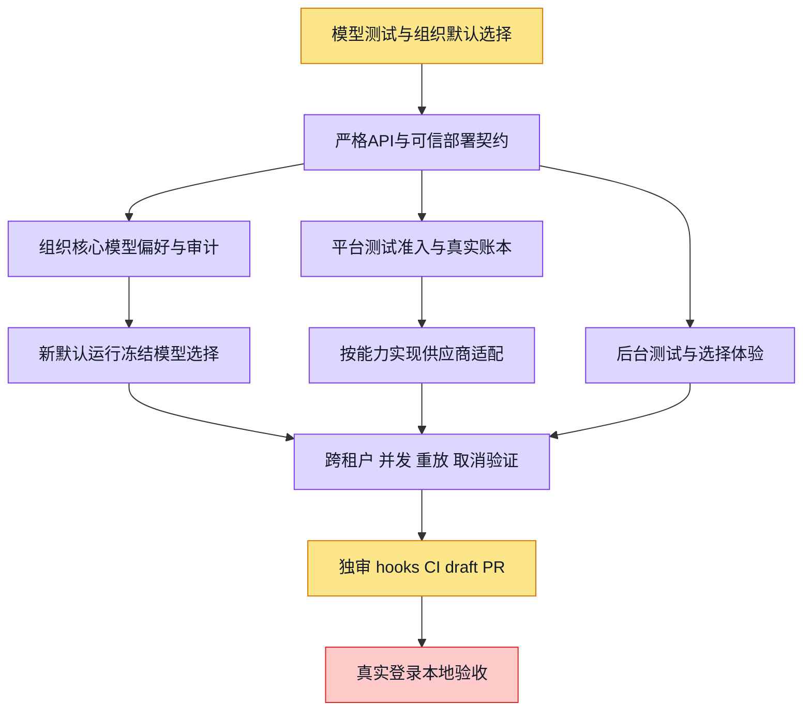

# 平台模型能力测试台与组织核心模型

平台operator在后台选择模型和能力，提供测试样本、明确上界，查看真实输出/用量/失败；组织admin选择默认文本模型，新运行冻结选择。公共目录不代表账号可用，缺可信适配/费用归属不调用。依赖配额PR5269和目录PR5373，现有PR head保持不变。

灰待开始、黄进行中、绿源码完成、紫有验证、红阻塞。

测试adapter实际能力按部署注册展示；未适配项带明确原因。平台入口不免组织/成员费用，未知供应商计量保守保留预留。付费实测由部署后的正常operator显式操作，开发仅本地替代HTTP/WS。已发布模型pin、历史run和重试不重新读最新核心偏好。

当前验证：API 纯测试 252/252，测试台 Web 49/49，组织模型 Web 24/24；六种能力客户端、可信部署接线和核心调用前冻结校验已实现。紫色表示替代依赖测试与源码验证；实际 PostgreSQL、部署配置及付费供应商验收尚未全部完成。

CI 收口：旧 HEAD 路由登记与三个 backend 分片失败，修复中；联合 API 280/280、导航76/76，旧 HEAD 实际 PG 核心4/4、平台测试7/7、原生15/15。权限审计前提验证与新提交 CI 仍待完成。外部测试工程师转交仅草稿，未确认接单。

第二轮修复：backend完整绿；harness发现动态路由重复生成独立测试页及旧mock边台账，已按trace修源码与精确事实断言（路由17/17、台账20/20）。S8继续进行中，等待最新SHA正常CI；真实登录S9仍阻塞。
