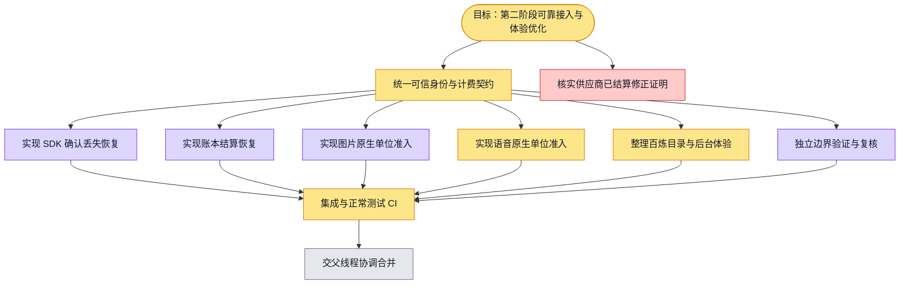

# 第二阶段：模型接入、恢复与体验优化

目标：完成已授权模型和配额功能的可靠调用、恢复与公共目录体验。验证依据分别保留源码、局部测试、完整CI及真实页面证据。供应商可信修正、真实模型价格/边界与第三阶段环境仍需真实输入。

灰=待开始，黄=进行中，绿=源码完成，紫=有通过证据，红=阻塞。

源码节点只表示产出存在；子智能体局部测试结果在根集成复核前不标完整CI通过。

## 本轮交付与未闭合项

- 已实现不可变原生预留种类、单位、最大数量；同金额不同数量不能重放，Token回执不能替代原生数量。
- 已接图片/ASR可信部署配置与同租户准入事务；终态使用新的全局事务。配置缺失保持拒绝，没有生产启用。
- SDK仅重放同一物理请求的回执，不重试供应商。跨物理请求的逻辑重试仍缺可信、持久化的producer operation身份。
- ASR当前协议未报告计费usage，估算时长只作计量提示，费用预留继续保留。不能宣称已精确结算。
- TTS有严格协议/参数/计量基础模块，缺可信调用入口、实际dispatch、音频产物与流式取消闭环；旧Token TTS还缺输出硬边界。
- 未启动本地数据库。12个实际PG验收用例已编写，尚待正常CI执行。
- 已结算供应商修订缺账号/请求/单调revision可信来源；no-op回放不等于修订授权。
- 第三阶段仍缺可用隔离本地API/Web、迁移后的schema和正常operator/member登录上下文；没有真实认证页面验收截图。
- 百炼公开目录为独立issue/PR，公开规格不等于账号可用，价格未知不填默认、不自动启用。
