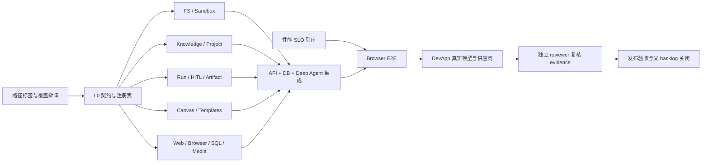

# WorkspaceX /chat 三维验收方案：路径、能力与性能

> 跟踪：[Issue #2985](https://github.com/boardx/workspacex/issues/2985)  
> 适用基线：`docs/design/standard-capabilities/capability-catalog.json`（9 个平台前置、46 个 Tools、20 个 Skills）  
> 目的：给开发、QA、独立 reviewer 和发布负责人提供同一份可执行完成契约。验收同时覆盖用户路径、Tools/Skills/画布模板能力、性能三个维度。
>
> 普通用户执行入口：[普通用户验收手册](acceptance-user-test-guide.md)。

## 1. 验收结论规则

本方案验证四个事实：能力已注册、真实运行链可达、结果可被终端用户使用、权限和失败链不会产生越权或假成功。测试文件存在、模型提到工具名、mock 返回成功、静态截图存在，都不能单独证明能力通过。

每项能力只有同时满足以下条件才能标记 `PASS`：

1. 对应正向行为通过，产出与用户可见出口一致。
2. 至少一个反向或越权场景按契约失败，且没有副作用。
3. trace 包含能力 ID、实际实现来源、run、actor、org、输入摘要、结果和耗时，不包含凭据。
4. 承诺文件产物时，必须重新打开并验证结构、MIME、字节 hash 和下载权限。
5. 需要真实模型或供应商的能力在 DevApp trusted lane 通过；loopback、fixture 和假模型只能记为组件通过。
6. 证据已上传到 CI artifact 或提交到允许的 evidence 目录，并绑定 exact SHA。

状态枚举：

| 状态 | 含义 |
|---|---|
| `PASS` | 所有适用层级和反证通过 |
| `PARTIAL` | 组件通过，但真实模型、DevApp、视觉或权限层尚缺 |
| `BLOCKED` | 实现或环境前置缺失 |
| `FAIL` | 已执行且行为不符合契约 |
| `N/A` | 经 reviewer 确认该层不适用，并写明理由 |

## 2. 测试层级与环境

| 层级 | 环境 | 验证内容 | 标准命令/入口 |
|---|---|---|---|
| L0 契约 | 干净 checkout | ID、schema、依赖、别名、注册表一致 | `pnpm run lint:skills-doctor`、contracts Vitest |
| L1 组件 | 隔离数据库/沙箱 | 领域规则、解析、序列化、风险等级 | 定向 Vitest、pytest |
| L2 服务集成 | API + PostgreSQL + Deep Agent | 真实 DI、HTTP、持久化、恢复、跨服务回调 | `with-test-isolation.ts` 包装的定向测试 |
| L3 浏览器 E2E | Web + API + DB | 用户可见入口、HITL、下载、刷新恢复 | Playwright fullstack lanes |
| L4 真实模型 | DevApp trusted runner | 模型选择、真实工具调用、真实文件、供应商错误 | main-only manual workflows |
| L5 发布验收 | DevApp 当前 main | 部署、迁移、健康检查、回滚和审计 | backend-gates deploy + devapp probe |

共用夹具必须包含：组织 A/组织 B、同组织两个用户、可撤销成员关系、中文/英文文件、损坏文件、大结果、慢任务、并发 revision、可控 HTTP 站点、只读 SQL 数据集、19 个内置画布模板和一个组织自定义模板。

## 3. 三维覆盖模型

一条测试只有同时回答以下三个问题才算进入完整覆盖：

| 维度 | 要回答的问题 | 结果记录 |
|---|---|---|
| P 路径 | 用户从哪个入口开始，经过哪些状态，看到什么结果，如何失败和恢复？ | `pathId`、现有 spec、覆盖状态 |
| C 能力 | 路径真实调用了哪些 WX-E/WX-T/WX-S 和画布模板，权限是否逐层收窄？ | `capabilityIds`、tool trace、skill version、template key |
| R 性能 | 该路径的等待、流式、产物、并发或恢复是否符合性能事实源？ | `sloId`、原始样本、p50/p95、机器负载 |

每条路径的最小证据键为：

```json
{
  "pathId": "P-C8",
  "capabilityIds": ["WX-T010", "WX-T020", "WX-T021", "WX-T042"],
  "skillIds": [],
  "canvasTemplateKeys": [],
  "sloRefs": ["artifact-ready"],
  "exactSha": "<40-char sha>",
  "verdict": "PASS"
}
```

路径层 PASS 不能替代逐能力 PASS；同样，46 个 Tool 的组件测试全绿也不能证明用户能从 `/chat` 完成任务。性能只对已经功能正确的样本计时，错误结果再快也必须记为 FAIL。

## 4. /chat 路径全集与三维映射

覆盖状态来自仓库现有 spec 与当前验收输入。状态含义：

- **已覆盖**：存在真实行为 spec，且该 spec 所在 lane 是回归门控。
- **部分**：只覆盖了其中一层（例如 API 有真栈、`/chat` 没有）。
- **当前红**：门控 lane 里真实未通过，属于要清的存量红线。
- **记分牌红**：spec 位于 `chat-task-workbench` project，**设计上就是红的**——红 = 已登记的能力缺口，不是回归失败，不进红线队列。判据单一事实源见 `.harness/instructions/chat-task-workbench-acceptance.md`，处置方式见 §14.1。
- **未覆盖**：没有对应端到端 spec。

阈值只引用 `.harness/instructions/chat-agent-performance-acceptance.md`，本表不复制数字。

| Path ID | 用户可见路径 | 当前覆盖 / spec | 能力映射 | 性能映射 |
|---|---|---|---|---|
| P-A1 | 单轮文本：一问一答入库并刷新恢复 | 已覆盖 · `agent-chat-core-paths` | E002/E006、T040 | 发送反馈、首字、流式连续 |
| P-A2 | 多轮同线程：第二轮引用第一轮，run 独立持久化 | 已覆盖 · `agent-chat-core-paths` | E006、T040 | 缺第 N 轮首字 |
| P-A3 | 长会话压缩后仍连贯且保留关键事实 | 未覆盖 | E001/E006、S001/S002 | 缺上下文增长斜率 |
| P-A4 | 线程切走再切回，无硬导航/骨架屏，历史正确 | 已覆盖 · `copilotkit-v2-thread-persistence` | E006、T040 | 缺线程切换耗时 |
| P-A5 | 冷启动进入 `/chat` 到可输入 | 部分 · `chat-route-warmup` 仅预热 | E001/E006 | 冷启动只记录，缺完整采样 |
| P-B1 | 确认意图，可改假设并恢复同一 run | 已覆盖 · `agent-task-planning-hitl` | T011、E006 | HITL 出现/继续 |
| P-B2 | 按 optionId 选方案；全部拒绝诚实结束 | 已覆盖 · `agent-task-planning-hitl` | T013、E006 | HITL 出现/继续 |
| P-B3 | 补参后同一 run 恢复，只显示一条轨迹/产物 | 已覆盖 · `agent-task-clarification-result` | T012、E006 | HITL 出现/继续 |
| P-B4 | once/deny/forever 的真实服务端语义 | 已覆盖 · `copilotkit-v2-hitl` | E002/E006、受控 Tool | HITL 出现/继续 |
| P-B5 | 刷新恢复同一 permissionRequestId | 已覆盖 · `copilotkit-v2-hitl` | E006、T040 | HITL 刷新恢复 |
| P-B6 | 继续只提交一次，旧请求不可重复裁决 | 已覆盖 · `agent-task-planning-hitl` | E006、T011-T013 | 当前无独立 SLO |
| P-B7 | 复杂任务先确认，简单问题直接回答 | 记分牌红 · `chat-task-workbench-workflow-states` | T009/T011、Agent route | 当前无独立 SLO |
| P-C1 | canvas 围栏渲染为可用工作坊画布 | 已覆盖 · `chat-canvas-guidance-render` | T029/T030、S012、C001-C019 | 画布内嵌/放大 |
| P-C2 | 最大化编辑→保存→reload→原始版 | 已覆盖 · `chat-diagram-save-reopen-roundtrip` | T029/T030、S012 | 画布刷新读回 |
| P-C3 | 管理员建模板→发布→项目绑定→chat 可达 | 已覆盖 · `core-journey-04` | T029/T030、C020-C024 | 缺生命周期耗时 |
| P-C4 | 同一轮生成两个模板且互不覆盖 | 未覆盖 | T010/T029/T030、S012、C025 | 缺双产物耗时 |
| P-C5 | 连续三轮各产一个产物，无闪烁/重复挂载 | 未覆盖 | E006、T020/T021 | 缺第三轮产物耗时 |
| P-C6 | chat 请求 DOCX/XLSX/PPTX，可下载并重开 | 部分 · API 有 real stack，chat 无 | T008/T020/T021、S003-S005 | 缺产物端到端耗时 |
| P-C7 | chat 请求 PDF，页数和逐页渲染正确 | 已覆盖 · `real-model-pdf-smoke` | T008/T019-T021、S006 | 缺产物端到端耗时 |
| P-C8 | durable subtask 文件回到父会话并下载 | 未覆盖 | T010/T020/T021/T042 | 缺子任务产物耗时 |
| P-D1 | write_todos/search_documents 定制卡片到终态 | 已覆盖 · `copilotkit-v2-tool-rendering` | T009/T016/T017 | 工具事件呈现 |
| P-D2 | 轨迹折叠、实时更新、刷新回放 | 已覆盖 · `copilotkit-v2-tool-rendering` | E006、T040 | 轨迹展开、100 条稳定 |
| P-D3 | 会话挂载 Skill，刷新保留且幂等 | 已覆盖 · `chat-agent-skill-context` | E004、S001-S020 | 当前无独立 SLO |
| P-D4 | 发现元数据、读取正文、执行成功三态可区分 | 未覆盖 | E004、S001-S020 | 当前无独立 SLO |
| P-D5 | 切换 Agent 后 header 与回复来源一致 | 已覆盖 · `copilotkit-v2-agent-switch` | E002/E004 | 当前无独立 SLO |
| P-D6 | 子 Agent 折叠树显示输入、工具、耗时、结果 | 记分牌红 · `chat-task-workbench-tool-events` | T010/T042 | 工具事件/轨迹展开 |
| P-E1 | 麦克风转录进输入框，可编辑并发送 | 已覆盖 · `copilotkit-v2-voice-input` | T037、S016 | 缺首段转录延迟 |
| P-E2 | 图片进模型；能力缺席时诚实降级 | 已覆盖 · `chat-vision-honest-degrade` | T018/T038、S017 | 当前无独立 SLO |
| P-E3 | 附件上传后可预览、下载且授权正确 | 已覆盖 · `chat-attachment-preview-download` | T018-T021 | 当前无独立 SLO |
| P-E4 | 运行中插话排队到安全步骤 | 已覆盖 · `agent-workbench-steering-acceptance` | E006、T040/T041 | 缺插话生效延迟 |
| P-F1 | 真实失败显示可读横幅，界面仍可使用 | 已覆盖 · `copilotkit-v2-error-banner` | E006 | 当前无独立 SLO |
| P-F2 | 网络中断后 SSE/WS 重连并从 journal 续上 | 未覆盖 | E006、T040 | 缺重连恢复时间 |
| P-F3 | 暂停、恢复、取消、重试单步真实生效 | 当前红 · `agent-workbench-control-acceptance` | T040/T041 | 运行中刷新恢复 |
| P-F4 | 失败步骤可重试或修改输入 | 记分牌红 · `chat-task-workbench-workflow-states` | E006、T040 | 当前无独立 SLO |
| P-F5 | 父取消传播，子任务无晚到产物 | 部分 · API 有，chat 无 | T041/T042/T020 | 当前无独立 SLO |
| P-F6 | 两线程并发 run，事件不串线 | 未覆盖 | E002/E006、T040/T042 | 缺并发劣化指标 |
| P-F7 | 模型超时/断流后 UI 诚实结束 | 未覆盖 | E006 | 缺失败收敛时间 |

路径覆盖计数基线：22 条已覆盖、7 条部分覆盖 / 当前红 / 记分牌红（其中 P-B7、P-D6、P-F4 三条是记分牌红，不计入红线队列）、8 条未覆盖，共 37 条。机械门控落地后由脚本计算，文档中的数字仅作为首次导入基线。

## 5. 平台前置验收（9 项）

| 测试 ID | 能力 | 核心验收 | 必测反证 |
|---|---|---|---|
| AT-E001 | WX-E001 runtime-baseline | 锁文件冷启动；导出真实依赖版本和工具 schema | 缺依赖/配置显式失败；假模型探针不能标真实验收 |
| AT-E002 | WX-E002 capability-contracts | 注册表与运行时 tool set 集合一致；旧别名唯一 | 伪造 org/user 无效；A/B 组织互不可见 |
| AT-E003 | WX-E003 sandbox-backend | write→execute→read→恢复真实闭环 | 穿越、技能包写入、禁网、超时、跨用户全部拒绝 |
| AT-E004 | WX-E004 skill-package-mount | SKILL.md、references、scripts、assets 渐进读取且脚本真实执行 | 缺文件、坏 hash、跨组织、版本切换不污染运行中快照 |
| AT-E005 | WX-E005 mcp-execution | discover→schema→call→observable side effect | 未授权不触发 server；同名工具/凭据并发不串用 |
| AT-E006 | WX-E006 run-artifact-events | run、HITL、文件事件、恢复、取消状态一致 | 上传失败不显示 ready；重复 resume 不重复副作用 |
| AT-E007 | WX-E007 acceptance-runner | 每项能力映射实际命令和 exact-SHA 证据 | 空测试集合、静态文件或 skipped lane 不能报告通过 |
| AT-E008 | WX-E008 migration-router | 旧 ID 可发现；旧 run 可恢复；灰度切回 | 已产生对象和外部动作不重放 |
| AT-E009 | WX-E009 scheduled-run-adapter | 重启后到期触发一次；时区/DST 策略确定 | 双 worker 不重复；取消后不再触发 |

## 6. Tools 验收矩阵（46 项）

每行都必须执行正向、反向、trace 三类断言；“组合”列用于减少环境启动次数，不减少独立结果记录。

| 测试 ID | Tool | 组合 | 关键正向断言 | 关键反证 |
|---|---|---|---|---|
| AT-T001 | WX-T001 `ls` | FS | 中英文目录完整 | 不存在/无权路径不泄露 |
| AT-T002 | WX-T002 `read_file` | FS | 分页行区间、图片内容块正确 | 越界路径拒绝 |
| AT-T003 | WX-T003 `write_file` | FS | UTF-8 写回 hash 相同 | 只读 skill 包不可写 |
| AT-T004 | WX-T004 `edit_file` | FS | 只修改唯一目标片段 | 无匹配/歧义不写 |
| AT-T005 | WX-T005 `glob` | FS | 嵌套及中文名匹配 | 不跨 workspace |
| AT-T006 | WX-T006 `grep` | FS | 命中、未命中、截断可区分 | 大结果不静默丢失 |
| AT-T007 | WX-T007 `delete` | FS | 临时文件删除后不可见 | 附件原件、skill、其他 run 不可删 |
| AT-T008 | WX-T008 `execute` | FS | 计算值和文件正确 | 非零、超时、取消、禁网可区分 |
| AT-T009 | WX-T009 `write_todos` | RUN | UI 状态投影且刷新保留 | 纯文字计划不算工具调用；坏 JSON 不编造状态 |
| AT-T010 | WX-T010 `task` | RUN | 两个子任务独立返回 | 不继承未授权工具和其他租户文件 |
| AT-T011 | WX-T011 `confirm_task_intent` | HITL | 用户修改假设后按新值继续 | 拒绝无副作用；他人不可代答 |
| AT-T012 | WX-T012 `fill_run_params` | HITL | 编辑值经恢复传入执行 | 缺参不猜值；不声称未支持类型 |
| AT-T013 | WX-T013 `choose_execution_option` | HITL | 选择 B 只执行 B | 旧 ID、重复提交不二次执行 |
| AT-T014 | WX-T014 `web_search` | WEB | 中英文实时结果含可打开来源 | 超时/配额不变空结果或编造 |
| AT-T015 | WX-T015 `fetch_url` | WEB | 正文与 URL 可追溯且截断显式 | localhost、metadata、危险重定向阻断 |
| AT-T016 | WX-T016 `wx_knowledge_search` | KNOW | 授权资料及引用定位正确 | 撤回、跨租户、故障与零命中 |
| AT-T017 | WX-T017 `wx_knowledge_read` | KNOW | 片段、页码/segment 与原文一致 | 搜索后撤权不可借旧 snapshot 读取 |
| AT-T018 | WX-T018 `wx_attachment_mount` | DOC | 中文附件挂载后字节 hash 一致 | 伪造附件 ID、重复装载 |
| AT-T019 | WX-T019 `wx_document_parse` | DOC | PDF/Office/表格/OCR 有定位 | 密码、损坏文件、禁止出网 |
| AT-T020 | WX-T020 `wx_artifact_publish` | ART | UI、DB、对象存储 hash 一致 | 上传失败、无文件、MIME 错误不 ready |
| AT-T021 | WX-T021 `wx_artifact_download` | ART | 本人下载 hash 一致 | 第二用户、过期或重复兑换拒绝 |
| AT-T022 | WX-T022 `browser_navigate` | BROWSER | 打开受控测试站 | 内网和跨 run context 拒绝 |
| AT-T023 | WX-T023 `browser_snapshot` | BROWSER | 表单、按钮及结构正确 | 过期元素 ref 不误操作 |
| AT-T024 | WX-T024 `browser_click` | BROWSER | 授权提交只产生一次动作 | 拒绝、旧 ref 无点击副作用 |
| AT-T025 | WX-T025 `browser_fill_form` | BROWSER | 多字段填写值正确 | 错 ref 不写其他字段 |
| AT-T026 | WX-T026 `browser_take_screenshot` | BROWSER | 图片可解码且裁剪正确 | 路径和图像不含其他 run 数据 |
| AT-T027 | WX-T027 `wx_project_list` | PROJECT | 仅返回本人项目 | 无权项目不暴露名称/存在性 |
| AT-T028 | WX-T028 `wx_project_read` | PROJECT | 多项目类型字段与 API 一致 | 撤权后拒绝；依赖失败不装空 |
| AT-T029 | WX-T029 `wx_canvas_read` | CANVAS | 对象、关系、revision 往返不变 | 跨项目读取拒绝 |
| AT-T030 | WX-T030 `wx_canvas_update` | CANVAS | 指定对象更新且 ID 不变 | 旧 revision 冲突；拒权零写入 |
| AT-T031 | WX-T031 `wx_memory_search` | MEMORY | 跨会话读取明确保存的偏好 | 其他用户不可见；删除后不注入 |
| AT-T032 | WX-T032 `wx_memory_write` | MEMORY | 明确“记住”后跨会话生效且幂等 | 模型伪造 source、越权和冲突拒绝 |
| AT-T033 | WX-T033 `wx_memory_delete` | MEMORY | 删除后新会话不使用 | 跨用户、旧 revision 拒绝 |
| AT-T034 | WX-T034 `wx_schedule_create` | SCHEDULE | 到时进入同一 LangGraph 入口 | 无效时区、撤权后执行失败并通知 |
| AT-T035 | WX-T035 `wx_schedule_list` | SCHEDULE | nextRunAt 与本人任务正确 | 其他用户不可见 |
| AT-T036 | WX-T036 `wx_schedule_cancel` | SCHEDULE | 取消后无新 run，重复取消幂等 | 运行中任务不谎称已停止 |
| AT-T037 | WX-T037 `wx_audio_transcribe` | MEDIA | 中英文时间片段正确 | 无权、未知说话人、重复 transcript |
| AT-T038 | WX-T038 `wx_image_generate` | MEDIA | 图片可打开且记录模型/请求 | 无权参考图；不支持编辑时明确失败 |
| AT-T039 | WX-T039 `wx_skill_create_draft` | AUTHOR | 多文件草稿版本和 hash 一致 | 穿越、缺依赖、普通用户写平台 skill 拒绝 |
| AT-T040 | WX-T040 `wx_run_status` | RUN | 刷新后与后台一致并区分等待/执行 | 无权 run 不泄露步骤与文件 |
| AT-T041 | WX-T041 `wx_run_cancel` | RUN | 长脚本及子任务最终取消且幂等 | 跨用户拒绝；完成/取消竞争终态确定 |
| AT-T042 | WX-T042 `spawn_async_task` | RUN | 关闭主界面仍执行、可查询并返回真实产物 | 重试不重复；父取消不遗留沙箱 |
| AT-T043 | WX-T043 `sql_db_list_tables` | SQL | 只列授权视图 | 连接/用户隔离；凭据不入模型/trace |
| AT-T044 | WX-T044 `sql_db_schema` | SQL | 字段和样例符合策略 | 无权表拒绝 |
| AT-T045 | WX-T045 `sql_db_query_checker` | SQL | 错误查询给出可执行修正 | checker 不执行查询或写入 |
| AT-T046 | WX-T046 `sql_db_query` | SQL | SELECT 结果与基准数据一致 | UPDATE/DDL/越权视图拒绝；超时终止 |

## 7. Skills 验收矩阵（20 项）

每个 Skill 使用两组最小样例：正向触发和相邻但不应触发的反例。含脚本或参考资料的包必须通过 trace 证明实际读取；Skill 提示词不能扩大 Tool 权限。

| 测试 ID | Skill | 代表任务与可观察结果 | 必测反证 |
|---|---|---|---|
| AT-S001 | WX-S001 组织知识问答 | 有引用的组织事实回答 | 撤文后不引用；无结果明确未知 |
| AT-S002 | WX-S002 联网深度研究 | 多来源冲突报告和预算边界 | 搜索失败不编造来源 |
| AT-S003 | WX-S003 Word 创建/有限编辑 | 中英文多页、表格、页眉；目标段落编辑 | 无关段落 hash 不变；未知对象不静默丢失 |
| AT-S004 | WX-S004 表格创建/有限编辑 | 单元格、公式、重算和多 sheet | 其他 sheet 不变；超限明确失败 |
| AT-S005 | WX-S005 演示创建/有限编辑 | 中文换行、字体、图片、逐页渲染 | 未知对象不静默丢失 |
| AT-S006 | WX-S006 PDF 处理 | 提取、页序、表单、渲染 | 覆盖矩形不得宣称安全脱敏 |
| AT-S007 | WX-S007 数据分析 | 已知答案数据集、缺失值记录、可重跑脚本 | 相关性不写成因果 |
| AT-S008 | WX-S008 会议准备 | 目标、议程、参与者事实有来源 | 无资料时列缺口，不编造 |
| AT-S009 | WX-S009 会议纪要 | 决策/行动项定位原句或时间 | 建议不写成决定；责任人未知不猜 |
| AT-S010 | WX-S010 访谈综合 | 去重、主题、反对证据和来源 | 不推断缺失人口属性 |
| AT-S011 | WX-S011 组织沟通文稿 | 基于授权事实生成草稿 | 不外发；不编指标或泄露保密资料 |
| AT-S012 | WX-S012 图表与协作画布 | 对象身份往返、并发冲突 | 无权写入零副作用 |
| AT-S013 | WX-S013 交互网页产物 | 按钮、空状态、桌面/移动视口和可下载 bundle | 未授权网络阻断；运输失败不伪装成功 |
| AT-S014 | WX-S014 项目进展报告 | 指标逐项映射 API 或标未知 | 未实现能力不写成可用 |
| AT-S015 | WX-S015 Skill 制作 | 多文件草稿可触发并验证依赖 | 草稿不等于发布；提示词不提权 |
| AT-S016 | WX-S016 音频转录 | 静音、损坏、时间范围和真实供应商样例 | 未提供身份不命名说话人 |
| AT-S017 | WX-S017 视觉内容 | 尺寸、文案、中文字体、来源和下载 | 错误不返回虚假产物 |
| AT-S018 | WX-S018 文档理解 | 跨页表格、扫描页、定位和结构 | 未识别不编造；撤权后缓存不可读 |
| AT-S019 | WX-S019 用户研究规划 | 问题映射目标，敏感题有必要性 | 不伪造受访者和发现 |
| AT-S020 | WX-S020 数据可视化 | 数字、标签、颜色、缺失值和静态导出 | 缺失值不当零；图表数值不可漂移 |

Office、PDF、网页、视觉和图表 Skill 的产物验收必须使用对应解析器重新打开；只检查文件大小大于零属于失败的验收设计。

## 8. 画布模板验收

### 8.1 内置模板身份

以下 19 个 key 必须与 `@repo/fabric-markdown` 注册表集合相等，且 displayName、字段 key、section、布局和版本均可读取：

| 测试 ID | key | 显示名 |
|---|---|---|
| AT-C001 | persona | 用户画像 |
| AT-C002 | pestel | PESTEL 分析 |
| AT-C003 | swot | SWOT 分析 |
| AT-C004 | empathy | 同理心地图 |
| AT-C005 | jtbd | 待完成工作画布 |
| AT-C006 | journey-map | 用户旅程图 |
| AT-C007 | value-proposition | 价值主张画布 |
| AT-C008 | adlib | 价值主张宣言 |
| AT-C009 | bmc | 商业模式画布 |
| AT-C010 | mvp | MVP 实验画布 |
| AT-C011 | freytag | 戏剧结构金字塔 |
| AT-C012 | burger | 汉堡沟通模型 |
| AT-C013 | three-horizons | 三地平线模型 |
| AT-C014 | hmw | HMW 问题陈述 |
| AT-C015 | golden-circle | 黄金圈法则 |
| AT-C016 | three-lenses | 三视角模型 |
| AT-C017 | storyboard | 故事板 |
| AT-C018 | ai-strategy | AI 战略画布 |
| AT-C019 | ai-bmc | AI 商业模型画布 |

每个模板执行统一场景：

1. 列表和详情可见，key 集合非空且无重复。
2. 创建实例后 section、field、token、对象 ID 和 binding key 正确。
3. Mermaid/Fabric 序列化往返保留支持对象和关系；坐标不会写回权威语义源。
4. 编辑 sticky 后 revision 单调递增；旧 revision 更新产生冲突。
5. 导出 PNG/PDF 可打开，边界、标题、便签、连接线不裁切。
6. 归档模板不影响既有实例；新项目不能继续采用已归档版本。

### 8.2 生命周期和权限场景

| 测试 ID | 场景 | 通过标准 |
|---|---|---|
| AT-C020 | 组织模板创建→编辑→试跑→发布→采用→归档→恢复 | 每次状态转换合法且审计可追溯 |
| AT-C021 | 可见性 | platform/org/private 三层结果与 actor 权限一致 |
| AT-C022 | 版本固定 | 已采用实例不因模板新版本静默变化 |
| AT-C023 | 三方合并 | sticky、结构、布局按决策表处理；keep-both 可追踪 |
| AT-C024 | 跨组织反证 | B 组织无法发现、采用或修改 A 的模板 |
| AT-C025 | Agent 生成/套用 | 真实模型选择模板后，结构符合 schema，未知字段不写入 |
| AT-C026 | 推荐 | 推荐理由与项目/阶段信号一致；无匹配时不强推 |
| AT-C027 | A1 布局视觉 | 12×8 网格边界内，无标题遮挡、连线压内容和不可读缩放 |

## 9. 性能维度

性能阈值、两层门控和采集契约的唯一事实源是 `.harness/instructions/chat-agent-performance-acceptance.md`。本方案只维护“哪条路径引用哪个 SLO”以及“哪些路径尚无 SLO”，不复制 p50、p95 或硬上限。

### 9.1 已有 SLO 的应用方式

- PR 硬门控使用固定 loopback、固定分片、单 worker，预热后重复采样。
- 定时基线保存至少事实源要求的有效样本；样本不足不得发布 p95。
- 浏览器用 `performance.mark` 与 `MutationObserver` 采 DOM 提交时间。
- 浏览器、journal 和服务日志通过 `runId/attemptId/toolCallId/permissionRequestId` 关联。
- 真实模型数据只进入趋势观测，不作为 PR 延迟硬门控。

### 9.2 缺失的性能覆盖

| Perf ID | 路径 | 需要加入现有 SLO 单源的指标 | 采样设计 |
|---|---|---|---|
| PERF-01 | P-A2/P-A3 | 第 N 轮首字和上下文增长斜率 | 固定任务采第 1/5/15 轮，比较趋势 |
| PERF-02 | P-A4 | 线程切换到历史可交互 | 热线程和含 100 条轨迹线程分别采样 |
| PERF-03 | P-C3 | 模板发布到项目 chat 可采用 | 分解 API 完成和 UI 可见两个时间点 |
| PERF-04 | P-C4/C5 | 双产物及第三轮产物 ready | 单轮两个产物、连续三轮分别采 |
| PERF-05 | P-C6/C7/C8 | DOCX/XLSX/PPTX/PDF/子任务产物 ready | 发送→可下载，另记生成/上传/投影分段 |
| PERF-06 | P-E1 | 语音首段进入输入框 | 音频开始发送→第一段可编辑文本 |
| PERF-07 | P-E4 | 插话排队到生效 | 用户提交 steering→下一安全步骤消费 |
| PERF-08 | P-F2 | 断线重连恢复 | 断网→相同 run journal 和画面续上 |
| PERF-09 | P-F6 | 双 run 并发劣化 | 与单 run 基线比较首字和工具事件延迟 |
| PERF-10 | P-F7 | 上游失败收敛 | 供应商断流→UI 进入真实终态 |

这些指标必须通过修改现有 SLO 表的独立 PR落地；每行同时提供故障注入反证，证明采集器会变红。

## 10. 可执行测试套件

本节每条命令都在一台干净 worktree 上实测过（见本节各条下的实测计数）。
**判定纪律**：跑完必须核对 runner 打印的 `Test Files` / `Tests` 计数非零。
只看退出码分不出「断言红了」和「一条都没收集到」——后者是 §11 列为故障注入负对照
的信号，不能出现在验收路径上。

### 10.0 前置（缺一条就会把「跑法错了」伪装成「能力没实现」）

```bash
pnpm install --frozen-lockfile
(cd apps/deep-agent-service && uv sync --frozen --extra dev)
pnpm --filter web exec playwright install --with-deps chromium   # 只有 §10.3 需要
```

⚠ `init.sh` **不装** deep-agent-service 的 Python 依赖。不装它，跨语言用例会以
`spawn <repo>/apps/deep-agent-service/.venv/bin/python ENOENT` 失败——实测 5 条：
`standard-memory-real-db`（2）、`standard-scheduler-service`、`standard-sql-database`、
`standard-sql-source-real-db`。这是环境缺失，不是能力缺失，不得记成 `FAIL`。

### 10.1 静态与包级组件层（不连数据库）

```bash
pnpm run lint:skills-doctor
pnpm --filter @repo/contracts test
pnpm --filter @repo/fabric-markdown exec vitest run
pnpm --filter @repo/fabric-markdown exec tsc --noEmit
pnpm --filter skill-sandbox test
node .harness/scripts/lint-spec-gate-coverage.mjs
```

实测：contracts 55 文件 / 573 用例全绿；fabric-markdown 16 文件 / 240 用例全绿；
skill-sandbox 16 文件 / 72 通过 + 1 skipped；三条 lint 退 0。
`pnpm --filter skill-sandbox test` 会起自己的容器做网络隔离反证，属预期。

### 10.2 `apps/api` 的全部 vitest：一律走隔离外壳

`apps/api/vitest.config.ts` 的 `globalSetup`（`tests/support/db-global-setup.ts`）
**第一行**就 `assertIsolatedDatabase`，所以 `apps/api` 里**不存在「不连库的组件层」**：
裸跑任何一条 `pnpm --filter api exec vitest run …` 都会在 globalSetup 里抛
「未在隔离外壳里运行」，一条用例都不收集。

```bash
pnpm exec tsx .harness/scripts/with-test-isolation.ts -- \
  pnpm --filter api exec vitest run tests/kernel tests/mcp tests/skill

pnpm exec tsx .harness/scripts/with-test-isolation.ts -- \
  pnpm --filter api exec vitest run tests/agent-runtime tests/agent-run

pnpm exec tsx .harness/scripts/with-test-isolation.ts -- \
  pnpm --filter api exec vitest run tests/canvas
```

实测（前置齐备后）：kernel/mcp/skill 127 文件 / 1292 用例；
agent-runtime + agent-run 173 文件 / 984 用例；canvas 40 文件 / 448 用例。

⚠ **`*real-db.test.ts` 不是独立车道，不要单独过滤。** 它们与其它文件共用同一份
`include: ["tests/**/*.test.ts"]`，没有单独的 config、单独的 lane 或单独的跑法。

而且 vitest 的位置参数是**路径子串过滤器，不是 glob**。`tests/skill/*real-db.test.ts`
这种写法在仓库根（文档给的工作目录）实测有两种死法，都不产生任何断言：

- bash：`tests/skill/` 在根目录不存在，`*` 原样传给 vitest，vitest 拿它当子串匹配 →
  `No test files found, exiting with code 1`。零收集，却是非零退出码，看起来像「有东西红了」。
- zsh：`no matches found: tests/skill/*real-db.test.ts`，命令根本没被执行。

需要更窄范围时用子串，并且**先用 `vitest list` 确认它真的匹配到文件**
（`list` 不跑 globalSetup，所以不需要隔离外壳）：

```bash
pnpm --filter api exec vitest list real-db --filesOnly   # 实测 28 个文件
```

⚠ **目录切片不是全量，别拿它当包级结论。** `apps/api/tests/` 下共 934 个 `*.test.ts`
（实测 `find tests -name '*.test.ts' | wc -l`），上面三条命令覆盖的六个目录只有 340 个，
约 1/3；`tests/auth`、`tests/capability`、`tests/chat`、`tests/files`、`tests/itv`、
`tests/tpl`、`tests/project` 等都不在内，而 `real-db` 文件也散落在 `tests/itv/`、
`tests/mcp/`、`tests/tpl/` 里。目录切片只用来定位和缩短反馈环；
**包级 PASS 必须以全量为准**：

```bash
pnpm exec tsx .harness/scripts/with-test-isolation.ts -- pnpm --filter api test
```

⚠ `standard-sql-source-real-db.test.ts` 与 `standard-sql-database.test.ts` 要求
`COMPOSE_PROJECT_NAME` 以 `wsx-` 开头，且该 project 名下真有一个自己的 postgres 容器
（`apps/api/tests/support/standard-sql-tls.ts`，它会 `ALTER SYSTEM SET ssl=on`）。
隔离外壳会起这个自有栈并在退出时 `docker compose down -v`；把连接指到别人已在跑的
postgres 上，这两个文件必红——**不能复用共享库跑它们**。

⚠ 独占段 `tests/recording/personal-transcription-persistence.test.ts` 被默认 config
`exclude` 掉（DDL 重放拿重量级锁，不能与他人并行），只在 `vitest.exclusive.config.ts`
里串行补跑。上面三条目录命令**不覆盖它**；`pnpm --filter api test` 覆盖（= 主套件 + 独占段）。

⚠ 已知不稳定：`tests/kernel/local-export-copy-not-move.test.ts` 在三目录并行下实测
3 次中红 1 次（2 条断言 `expected 0 to be greater than 0`），同一 SHA 上单独跑该文件 9 条断言全绿。
按跑法问题分诊，不要记成能力 `FAIL`；追踪见 PR 正文。

### 10.3 浏览器 E2E 门控 lane

```bash
pnpm run verify:fullstack-smoke
pnpm run verify:core-loop
```

`verify:chat-task-workbench` **不属于这里**——它是记分牌车道，设计上就是红的，
取分数而非取绿灯，处置方式见 §14.1。

### 10.4 真实模型与供应商 lane（main + trusted self-hosted runner）

工作流必须绑定执行时的完整 main SHA，并对日志脱敏：

```bash
SHA=$(gh api repos/boardx/workspacex/commits/main --jq .sha)
gh workflow run s013-real-model-evidence --repo boardx/workspacex --ref main -f exact_sha="$SHA"
gh workflow run s016-asr-real-evidence  --repo boardx/workspacex --ref main -f exact_sha="$SHA"

# 这条没有 exact_sha 输入，多传会被 GitHub 以 422 拒掉
gh workflow run real-model-chat-evidence --repo boardx/workspacex --ref main
```

⚠ 三条工作流的输入 schema 不同，别照抄同一行。核对过 main 上的定义：
`s013-real-model-evidence.yml` / `s016-asr-real-evidence.yml` 都声明了 `exact_sha`
（required，必须等于当前 main HEAD）；`real-model-chat-evidence.yml` 只有
`prompt` / `run_timeout_ms` / `expect_kind`，**没有 `exact_sha`**——它对着 DevApp
当前部署跑，SHA 由证据里回填的 `git log -1` 给出。给它传 `-f exact_sha=…` 会直接
`Unexpected inputs provided` 失败，一条断言都不会执行。

这三条会在 main 上花真实模型的钱并向线上账号写入，因此本方案只做了**输入 schema 的静态核对**
（`gh api repos/boardx/workspacex/contents/.github/workflows/<name>.yml?ref=main`），
没有实际 dispatch；派工时由持有授权的人触发，并把 run URL 写进 §12 的 manifest。

在 Office、SQL、画布真实 lane 尚未成为 main 上的受信工作流前，对应项只能标 `PARTIAL` 或 `BLOCKED`。

## 11. 防假阳性与故障注入

每个组合套件至少做一次 mutation：

- 将预期 capability ID 改错，注册表测试必须失败。
- 将 org/user 换成另一个 fixture，读取或写入必须失败。
- 删除一个 Skill 包内引用文件，加载必须失败。
- 将 artifact MIME 与内容错配，发布必须失败。
- 把模板注册表替换成同样数量的假 key，集合测试必须失败。
- 中断数据库、对象存储、MCP、模型供应商和浏览器 transport，错误必须与零结果区分。
- 在上传成功前杀死 worker，恢复后不得重复外部副作用。
- 把全套测试过滤成零条，runner 必须因 collected/executed 数量为零而失败。

## 12. 证据清单

每次验收输出一个 manifest：

```json
{
  "schemaVersion": 1,
  "capabilityId": "WX-T020",
  "testId": "AT-T020",
  "exactSha": "<40-char sha>",
  "environment": "ci|devapp",
  "actorFixture": "org-a-user-1",
  "commands": ["<exact command>"],
  "assertions": {"passed": 8, "failed": 0, "skipped": 0},
  "negativeProof": "<artifact-relative path>",
  "trace": "<artifact-relative path>",
  "artifacts": [{"path": "...", "sha256": "...", "mime": "..."}],
  "startedAt": "<ISO-8601>",
  "completedAt": "<ISO-8601>",
  "verdict": "PASS"
}
```

Manifest 不记录 token、cookie、数据库 URL、供应商 key 或完整敏感输入。CI artifact 保存原始输出；仓库文档只保存脱敏摘要和 artifact/run URL。

## 13. 并行执行与发布门禁



五个 B 组合可以并行；L4 真实模型 lane 按供应商限流并行，但共享 DevApp runner 时限制并发，避免资源竞争制造假失败。

发布门禁：

1. P0 前置、P0 Tools、P0 Skills 全部 `PASS`。
2. P1 项不存在未登记的 `FAIL`；允许延期的项必须有独立 issue、风险和 owner。
3. 19 个内置模板集合、组织模板生命周期、跨组织反证全部通过。
4. backend-gates、harness-verify、fullstack smoke 全绿。**`harness-verify` 的 `chat-task-workbench` job 不计入「全绿」**——它默认不跑，且设计上就是红的（§14.1）；把它算进发布门禁等于永远发不出去。
5. DevApp 当前 main SHA 与 evidence SHA 相同，部署和数据库迁移成功。
6. 独立 reviewer 从 artifact 重放至少一个正向、一个越权反证和一个文件/画布产物。

## 14. 执行顺序与机械门控

### 14.1 先分清红线与记分牌，再清红线

`e2e-full` 与 `chat-task-workbench` 都会输出失败，但它们**是两类完全不同的东西**，
处置方式相反。把它们并成一句「先清存量红线」，直接后果是派人去「修」一批本来就在
追踪的能力缺口。

| | `e2e-full`（含 `chat-read` project） | `chat-task-workbench` project |
|---|---|---|
| 性质 | **回归门控**，绿是常态 | **记分牌**，红是设计意图 |
| 红的含义 | 真的坏了，或真的没实现却曾经绿过 | 已登记的能力缺口，红一条 = 少一分 |
| CI 默认 | 跑 | **不跑**（`harness-verify.yml` 的 `run_chat_task_workbench` 默认 `false`，要显式勾选） |
| 处置 | 逐条分诊、修到绿；记录基线 run，不允许用新增 spec 掩盖 | 记录当前分数作为基线，把每条红断言映射到 §15 的 QA 任务或 §4 的路径缺口 |
| 禁止 | —— | 当成存量红线派人「修绿」；用 `test.skip` 让它变绿——skip 掉的差距等于不存在 |

`chat-task-workbench` 的逐条判据、spec 清单与分数口径，单一事实源是
`.harness/instructions/chat-task-workbench-acceptance.md`；spec 数量以
`playwright --list` 的真实输出为准。**本方案不复述任何一条判据，也不复述数量**——
这份文档里出现的第二份副本就是下一次漂移。

对应地，§4 覆盖表里 P-B7 / P-D6 / P-F4 标的是「记分牌红」，不进红线队列；
P-F3（`agent-workbench-control-acceptance`，位于门控 `chat-read` project）标的是
「当前红」，属于本步要清的存量红线。

### 14.2 其余执行顺序

1. **清 `e2e-full` 存量红线**：按 §14.1 左列执行，记录基线 run。
2. **补九条零覆盖路径**：优先 P-F2、P-C8、P-C5、P-F6，再做 P-C4、P-A3、P-F7、P-D4、P-A5。
3. **补性能映射**：PERF-01 至 PERF-10 每项独立 issue/PR，在既有性能事实源加行并添加采样 spec。
4. **建立路径标签门控**：E2E spec 使用 `@path:P-C8` 形式标注；脚本校验未知标签、重复权威、矩阵无 spec、spec 无路径四类漂移。
5. **做能力交集报告**：每次 CI 从 trace 生成 Path×Capability 矩阵，任何 P0 WX 能力没有正向和反向证据即失败。
6. **真实模型对照**：loopback 全绿后，以获授权的合成提示和合成文件运行关键路径；证据脱敏并绑定 main SHA。

B7、D6、F3、F4 涉及统一工作台控制面。实施测试前先读取 peer 已合入的契约符号，禁止另建并行状态机让测试“变绿”。其中 B7/D6/F4 的现有断言在记分牌车道里，收敛路径是**实现能力**——不是改断言，也不是把车道调绿。

## 15. 当前已知缺口及拆分建议

以下是测试任务，不应塞进本方案文档 PR：

| 建议任务 | 优先级 | 内容 |
|---|---|---|
| QA-01 | P0 | 组织 Skill 晋升到平台的真库全链路 |
| QA-02 | P0 | DOCX/XLSX/PPTX 创建、有限编辑、重开、视觉 QA 的 trusted lane |
| QA-03 | P0 | Deep Agent→API 子任务真实 HTTP、持久化和 artifact 回传 |
| QA-04 | P0 | Tool 风险登记、真实注册、HITL 和执行路径一致性 |
| QA-05 | P1 | 组织画布模板完整生命周期浏览器 E2E |
| QA-06 | P1 | 19 个模板批量结构、往返与视觉回归 |
| QA-07 | P1 | 真实模型驱动画布模板选择、生成和套用 |
| QA-08 | P1 | SQL Toolkit 只读、RLS、超时、凭据脱敏 |
| QA-09 | P1 | S013/S016/Office trusted runner 的凭据权限与失败清理 |

每个任务必须独立 issue、独立 PR，并在 PR 中列出覆盖的 `AT-*` 与 `WX-*` ID。父 Issue #2985 只在方案被 review 后关闭，不代表这些后续测试已经实现。
