# 实施过程与证据快照

2026-09-07，跟踪 issue #2864。此图是实施记录，不是 feature passing 状态；绿色只表示框内范围已验证提交，黄色为未完成的开发/验收，红色为阻断，灰色为待实现或接入，蓝色由 peer 负责。跨会话边界见 [peer-boundaries.md](peer-boundaries.md)。

```mermaid
flowchart TD
  A[核对现有实现与75项目录]:::verified --> B[19个共享工作包：逐编号保留验收]
  B --> E1[WX-E001 本地及容器锁定依赖：a2e6de1c0]:::verified
  E1 --> E2[WX-E002 共享包契约：65327d7b1]:::verified
  E2 --> T11[WX-T011 真实假设确认：ac597acc5]:::verified
  E2 --> E4API[WX-E004 API完整包传输：7dcd2feaa]:::verified
  E2 --> E3[WX-E003 隔离沙箱及160次回收验证：751b16b34]:::verified
  E4API --> E4[WX-E004 原生Skills图：ebe8afe29]:::verified
  E3 --> E4
  E4 --> Scope[WX-T010 实际文件授权委派：db2dd434a]:::verified
  E3 --> FileTests[T001–T008 官方文件行为证据：f9b1ca28a]:::verified
  FileTests --> ImageRead[WX-T002 有界图像传输：8b7fe404b，46项回归通过]:::verified
  ImageRead --> FileJoin[附件只读挂载与真实完整链：66d36f813]:::verified
  FileJoin --> NativeTrace[标准编号与实际ToolNode身份：50a4895cd]:::verified
  NativeTrace --> InputGate[附件当前可见性与完整链复测：66d36f813]:::verified
  E4 --> NativeJoin[可信factory、加密session与恢复：045f48ae5]:::verified
  E4 --> SkillEvents[实际Skill事实与必达journal：0e2bdb411 / 570abc19e]:::verified
  SkillEvents --> NativeAuthority[逐次工具授权与有界HTTP：0e2bdb411]:::verified
  SkillEvents -.契约对齐.-> Peer
  E4 --> Version[WX-E008 恢复与旧run排空：f5fbf35f4；快照b8352e879]:::verified
  E3 --> OutputStore[WX-E006 字节收集与UDS下载：16961012d、ff22a9e5a]:::verified
  OutputStore --> E6[W04 暂存与产物写回：045f48ae5]:::verified
  E4 --> E6
  E2 --> T42[WX-T042 文本子任务与独立回收期限：dd1079503]:::verified
  Peer[peer S2–S10：统一事件与主任务控制、插话审批、工作台与成果UI]:::peer
  E6 -.接入统一契约.-> Peer
  T42 --> PendingCancel[WX-T042 单个pending取消：352a506ba]:::verified
  PendingCancel --> T42Join[WX-T042 父取消与晚到入队阻断：4ef787b83]:::verified
  T42Join --> RunningCancel[WX-T042 running cancel: 5068ecb0a]:::verified
  T42Join -.复用统一控制契约.-> Peer
  E2 --> MCPSchema[WX-E005 完整schema及变更授权：53658daf1]:::verified
  MCPSchema --> MCP[WX-E005 anonymous, isolation and credential broker: 41d60d32f]:::verified
  MCP -.复用准入与审批.-> Peer
  MCP --> Browser[W10 实际Chromium 3项与PG 6项通过；隔离运行时待验]:::active
  E4 --> Research[W06 搜索抓取：85f56f1a1；研究包：086155098]:::verified
  E4 --> Context[W07 项目与检索：35fc834dc；四项Skill：ce3399822]:::verified
  E3 --> Parse[W08 四格式定位：真实UDS及6项生产HTTP通过，c67dc4e15]:::verified
  E3 --> Office[W09 Office完整包与有限编辑：02f73bdff]:::verified
  Office --> Renderer[W09 隔离Office渲染与简单页面检查：274f4e8ad]:::verified
  E3 --> Data[W18 离线分析依赖与完整方法包：c917fdbae]:::verified
  E4 --> Canvas[W11 画布版本工具：ecfbee70f；Skill：776e2a9f7]:::verified
  E2 --> MemoryScope[W12 可信个人scope：1f2735a71]:::verified
  MemoryScope --> Memory[W12 持久Store、撤权、取消回滚及生产DI：b91057172]:::verified
  E2 --> Schedule[W13 持久调度：1d86b1200]:::verified
  Schedule --> Notify[持久通知 API 与 UI：8ec487b2c]:::verified
  E6 --> Media[W14 长音频链：4a3582ab0；真实模型验收中]:::active
  E4 --> Author[W15 草稿到产物再导入完整链：f51283005]:::verified
  E3 --> SQL[W17 官方SQL与取消反证：7d42283e3]:::verified
  E4 --> Methods[W19 两项方法包及导入源校验：ffbf307a2]:::verified
  Methods --> MethodDelivery[标准包启动发布与跨组织可见性：5aba6a788、d3c1c8c03]:::verified
  E6 --> Gate[逐任务测试、独立review、真实E2E]
  Peer --> Gate
  T42 --> Gate
  T42Join --> Gate
  Scope --> Gate
  FileTests --> Gate
  FileJoin --> Gate
  NativeJoin --> Gate
  Version --> Gate
  Browser --> Gate
  Research --> Gate
  Context --> Index[组织索引与审核入口：be6dd0c23]:::verified
  Index --> Hybrid[多通道检索与重排：58587bae5，65项DB/HTTP通过]:::verified
  Hybrid --> Gate
  Index --> Gate
  T11 --> NativeForms[T011–13 native 交互入口：4cc047087]:::verified
  RunningCancel --> NativeAsync[T042 native 入口待补]:::active
  NativeForms --> Gate
  E6 --> NativeEntries[T021/T040/T041 下载与状态取消：78a771abf，35项DB/HTTP通过]:::verified
  NativeEntries --> Gate
  NativeAsync --> Gate
  Parse --> S018[S018跨页表格与扫描页：并发409及缓存撤权待修验]:::active
  S018 --> Gate
  Renderer --> OfficeSkills[S003页眉视觉复验；S004创建公式通过；S005/S006待验]:::active
  OfficeSkills --> Gate
  Context --> ContextVersion[context 1.1.0：组件通过，新版真实模型待验]:::active
  ContextVersion --> Gate
  Browser --> S013[S013网页Skill：等待生产隔离浏览器入口]:::active
  S013 --> Gate
  Parse --> Gate
  Renderer --> Gate
  Data --> Gate
  Canvas --> Gate
  Memory --> Gate
  Schedule --> Gate
  Media --> Gate
  Author --> Gate
  SQL --> Gate
  MethodDelivery --> Gate
  Gate --> Commits[每个任务独立commit]
  Data --> S007[S007真实模型：报告+CSV+Python源码，51c85cf7f]:::verified
  Context --> S001[S001知识问答与S008会议准备：ec3e655b4，真实引用核验通过]:::verified
  Research --> S002[S002真实研究：来源账本及失败恢复通过，a727c21bb]:::verified
  Author --> S015[S015草稿已提交；生成Skill第二次模型调用通过，待提交]:::active
  Methods --> SkillsRevised[S017/S019/S020代表场景及人工核对通过：352efabaf / ffbeae429]:::verified
  Media --> S009[S009真实模型及语义核对：1.1.1，d3d5baf2d]:::verified
  Media --> ASR[S016真实ASR：等待配置]:::blocked
  Commits --> Migration[迁移与数据指纹重放：9a4f280f8，228项通过]:::verified
  Peer --> Picker[Skill选择器：c2948fbd7；桌面/手机真实挂载通过]:::verified
  Picker --> Gate
  Migration --> Push[已授权公开推送；远端检查点ec3e655b4]:::verified
  Push --> PR[Draft PR #2869；CI 修复与新 SHA 验证中]:::active
  PR --> Main[等待后续整合main]
  Resource[本地3路：沙箱并发、Office与新版上下文、剩余Skill验收]:::active -.影响未完成工作.-> Gate
  classDef default fill:#eef0f3,stroke:#88909c,color:#20242a;
  classDef verified fill:#dcfce7,stroke:#15803d,color:#14532d;
  classDef active fill:#fef3c7,stroke:#d97706,color:#78350f;
  classDef blocked fill:#fee2e2,stroke:#dc2626,color:#7f1d1d;
  classDef peer fill:#dbeafe,stroke:#2563eb,color:#1e3a8a;
```

## Current delivery boundary

Local committed checkpoint: c67dc4e15. Public checkpoint: ec3e655b4. PR #2869 remains draft and unmerged. Green means only the exact bounded behavior inside a node; it does not imply all 75 requirements or harness passing. The [three-round plan](three-round-delivery-plan.md) remains active.

At earlier b8352e879, all four backend test shards, runtime gates, full compilation and control-plane checks passed. Core-loop and fullstack smoke failed on an overflowing Skill picker; Python ended cancelled and is under diagnosis. Peer correction c2948fbd7 and normal-pointer regression assertions 923df5362 are now pushed in ec3e655b4. Desktop/mobile actual mount tests passed; current-head CI must pass separately.

Hybrid retrieval passed 65 real database/HTTP and 14 Python tests (58587bae5). Migration fresh/replay covered 228 files and populated-data fingerprints; the workbench replay passed 8 tests (9a4f280f8). Persistent tool snapshot/browser registration is committed in b8352e879.

S009 passed a real-model scenario and full semantic review with immutable meeting-minutes 1.1.1 (d3d5baf2d). Earlier false rejection wording remains recorded as a failed run. S007 published actual report, CSV and executable Python source through artifact writeback (51c85cf7f); the reviewed result and bounded fixture-specific limitations are retained in evidence/g-skill-batch/S007. These are bounded acceptance cases, not general model reliability claims.

W08 four-format locators are committed in c67dc4e15: actual isolated UDS execution and six production HTTP/PG cases passed. Download/status/cancel adapters passed 35 real PG/HTTP, 11 Python and three contract tests (78a771abf). Browser fixes now pass three actual Chromium cases and six real PG receipt cases; these changes are still uncommitted. The Chromium fixture explicitly permits in-process execution and does not establish production network isolation. Remote runtime/proxy acceptance and S013 remain yellow. See [browser evidence](evidence/W10-real-browser/current-acceptance.md).

S002 source-ledger accuracy and failed-fetch recovery passed and were committed in a727c21bb. S017/S019/S020 representative scenarios and reviewed artifacts were committed in 352efabaf and ffbeae429. S015 draft generation is committed; a second isolated actual-model run loaded the generated Skill, executed its original script and produced total 3. That additional evidence awaits commit. These bounded successes do not imply every catalog acceptance clause has passed; see the [20-Skill coverage index](evidence/G-SKILL-methods/README.md).

S003 remains yellow: the second actual rendered document still lacks the required page-two header. S004 creation, real formula values and two-page rendering passed; specified-cell editing remains to be verified. S005/S006 still require their actual-model acceptance, including PDF form values after reopening. Updated standard-context 1.1.0 has component evidence but still needs new-version model verification; prior 1.0.0 results are not relabeled as 1.1.0 results.

S018's actual model requested PDF parsing and scan OCR concurrently, exposing HTTP 409 SESSION_BUSY. A bounded dispatch fix is in progress. A separate cache-revocation test is also required: rejection of a new parse after revocation does not prove that an already-created cache cannot be read. Neither boundary is green. S016 live ASR remains blocked on provider configuration. T042's native entry remains incomplete.

Python CI's oversized parameter IDs have a committed fix (9ff99a631), preserving the original large payload test. New-head CI must verify the result; an earlier timeout is not treated as a proven runtime deadlock. Public checkpoint remains the last confirmed ec3e655b4 because the later push encountered a network failure.

The [W07 scope audit](w07-scope-audit.md) removes an unnecessary new graph seed resolver and universal interview-index project from the implementation plan. The original capability requirements remain intact; graph requests are explicitly rejected rather than simulated.

Three local workers coordinate one owned database stack at a time. No merge into main is authorized.
