# 实施过程与证据快照

2026-09-07，跟踪 issue #2864。此图是实施记录，不是 feature passing 状态；绿色只表示框内范围已验证提交，黄色为未完成的开发/验收，红色为阻断，灰色为待实现或接入，蓝色由 peer 负责。跨会话边界见 [peer-boundaries.md](peer-boundaries.md)。

```mermaid
flowchart TD
  A[核对现有实现与75项目录]:::verified --> B[19个共享工作包：逐编号保留验收]
  B --> E1[WX-E001 本地及容器锁定依赖：a2e6de1c0]:::verified
  E1 --> E2[WX-E002 共享包契约：65327d7b1]:::verified
  E2 --> T11[WX-T011 真实假设确认：ac597acc5]:::verified
  E2 --> E4API[WX-E004 API完整包传输：7dcd2feaa]:::verified
  E2 --> E3[WX-E003 隔离沙箱及160次回收验证：751b16b34]:::verified
  E4API --> E4[WX-E004 原生Skills图：ebe8afe29]:::verified
  E3 --> E4
  E4 --> Scope[WX-T010 仅文本委派已验证；扩展文件授权待做]:::active
  E3 --> FileTests[T001–T008 官方文件行为证据：f9b1ca28a]:::verified
  FileTests --> ImageRead[WX-T002 有界图像传输：8b7fe404b，46项回归通过]:::verified
  ImageRead --> FileJoin[附件只读挂载与真实完整链：66d36f813]:::verified
  FileJoin --> NativeTrace[标准编号与实际ToolNode身份：50a4895cd]:::verified
  NativeTrace --> InputGate[附件当前可见性与完整链复测：66d36f813]:::verified
  E4 --> NativeJoin[可信factory、加密session与恢复：045f48ae5]:::verified
  E4 --> SkillEvents[实际Skill事实与必达journal：0e2bdb411 / 570abc19e]:::verified
  SkillEvents --> NativeAuthority[逐次工具授权与有界HTTP：0e2bdb411]:::verified
  SkillEvents -.契约对齐.-> Peer
  E4 --> Version[WX-E008 固定包版本兼容]
  E3 --> OutputStore[WX-E006 字节收集与UDS下载：16961012d、ff22a9e5a]:::verified
  OutputStore --> E6[W04 暂存与产物写回：045f48ae5]:::verified
  E4 --> E6
  E2 --> T42[WX-T042 文本子任务与独立回收期限：dd1079503]:::verified
  Peer[peer S2–S10：统一事件与主任务控制、插话审批、工作台与成果UI]:::peer
  E6 -.接入统一契约.-> Peer
  T42 --> PendingCancel[WX-T042 单个pending取消：352a506ba]:::verified
  PendingCancel --> T42Join[WX-T042 父取消与晚到入队阻断：4ef787b83]:::verified
  T42Join --> RunningCancel[WX-T042 running取消与公共事件待接入]
  T42Join -.复用统一控制契约.-> Peer
  E2 --> MCPSchema[WX-E005 完整schema及变更授权：53658daf1]:::verified
  MCPSchema --> MCP[WX-E005 执行桥：不可变审查与运行快照开发中]:::active
  MCP -.复用准入与审批.-> Peer
  MCP --> Browser[W10 浏览器交互与网页产物]
  E4 --> Research[W06 搜索抓取：85f56f1a1；研究包：086155098]:::verified
  E4 --> Context[W07 项目与检索：35fc834dc；四项Skill：ce3399822]:::verified
  E3 --> Parse[W08 AnyDoc原件解析：契约已验证，容器完整链待验]:::active
  E3 --> Office[W09 Office完整包与有限编辑：02f73bdff]:::verified
  Office --> Renderer[W09 隔离Office渲染与简单页面检查：274f4e8ad]:::verified
  E3 --> Data[W18 离线分析依赖与完整方法包：c917fdbae]:::verified
  E4 --> Canvas[W11 画布版本工具：ecfbee70f；Skill：776e2a9f7]:::verified
  E2 --> MemoryScope[W12 可信个人scope：1f2735a71]:::verified
  MemoryScope --> Memory[W12 持久Store、撤权、取消回滚及生产DI：b91057172]:::verified
  E2 --> Schedule[W13 持久调度]
  E6 --> Media[W14 图片、音频与纪要]
  E4 --> Author[W15 完整Skill草稿包]
  E3 --> SQL[W17 官方SQL真实TLS链已通过；最终取消反证中]:::active
  E4 --> Methods[W19 两项方法包及导入源校验：ffbf307a2]:::verified
  Methods --> MethodDelivery[W19 标准包启动发布与跨组织可见性验收中]:::active
  E6 --> Gate[逐任务测试、独立review、真实E2E]
  Peer --> Gate
  T42 --> Gate
  T42Join --> Gate
  Scope --> Gate
  FileTests --> Gate
  FileJoin --> Gate
  NativeJoin --> Gate
  Version --> Gate
  Browser --> Gate
  Research --> Gate
  Context --> Gate
  Parse --> Gate
  Renderer --> Gate
  Data --> Gate
  Canvas --> Gate
  Memory --> Gate
  Schedule --> Gate
  Media --> Gate
  Author --> Gate
  SQL --> Gate
  MethodDelivery --> Gate
  Gate --> Commits[每个任务独立commit]
  Commits --> Migration[迁移重放修复：e4b8e9b34，本地202项重放通过]:::verified
  Migration --> Push[权限lint已修复：7442e1543；待重新push]:::active
  Push --> PR[汇总Draft PR #2869：尚未收到最新本地提交]:::active
  PR --> Main[等待后续整合main]
  Resource[3个并行agent运行中：文档、MCP、SQL]:::active -.影响未完成工作.-> Gate
  classDef default fill:#eef0f3,stroke:#88909c,color:#20242a;
  classDef verified fill:#dcfce7,stroke:#15803d,color:#14532d;
  classDef active fill:#fef3c7,stroke:#d97706,color:#78350f;
  classDef blocked fill:#fee2e2,stroke:#dc2626,color:#7f1d1d;
  classDef peer fill:#dbeafe,stroke:#2563eb,color:#1e3a8a;
```

当前图只记录具体组件的已验证提交，原始 75 项编号和逐项验收仍以 `capability-catalog.json` 为准。绿色不等于部署给所有终端用户，也不等于真实模型端到端验收通过。蓝色由 peer 实现，本分支负责接口集成。

原生生产 factory、加密 session、产物暂存与恢复已提交 045f48ae5。附件原件只读挂载、当前来源可见性与真实 Python→UDS→Nest→PG/ObjectStore 完整链提交 66d36f813；该链使用脚本模型，不替代真实模型验收。

W07 工具提交 35fc834dc，四项完整 Skill 提交 ce3399822；覆盖现有项目 API 与授权附件检索，仍不代表全组织五路检索。W11 源码版本读写、冲突与幂等回放工具提交 ecfbee70f，完整画布 Skill 提交 776e2a9f7；renderSource 是现有源码投影，不是像素截图。

已直接与「agent ux dev」协作，保留其同参数拒绝优先级和取消优先原子更新，分别集成于 1eb5f732c、a8d47eb89。原生暂停结算被取消抢先时释放 session 的修复提交 50b9d9a40，相关 6 文件 41 项回归通过。对方负责统一事件、主任务控制与工作台 UI；running 子任务取消及 MCP 接口依赖尚待继续对齐。

W17 已有真实 HTTPS/TLS PostgreSQL 的官方 SQL Toolkit 调用与记忆回归通过记录，最终取消、超时和独立只读角色反证仍在运行，尚未提交。W08 文本解析的契约和 Python 检查通过，真实容器完整链待镜像构建完成；OCR、页面和表格定位仍未完成。MCP 不可变授权快照与调用桥正在开发。

标准完整包启动发布已接入既有导入器，正在验证普通用户跨组织可见性。最近 3 文件测试为 13 通过、1 失败：新测试错误期待英文状态，已修正为现有中文契约，待复测。未把工作树代码或单项验证等同于全用户已部署。

共享授权与权限 lint 修复已提交 7442e1543，最新本地提交尚需重新正常 push 并取得当前 SHA 的 CI。旧 d5f15ec15 CI 快照不继承给后续提交。[Draft PR #2869](https://github.com/boardx/workspacex/pull/2869) 保留，未合入 main。

## 最新交付边界

- 本快照最新实现提交：50b9d9a40；最后成功推送仍为 4fcf896b4。
- 三个并行 agent 已恢复工作，数据库验证按单栈串行调度，避免共享主机资源争用。
- 浏览器、持久调度、媒体、完整 Skill 草稿、running 子任务取消等仍有剩余开发；统一发布、真实模型验收与最新 CI 均未完成。
- 全部 75 项 backlog 尚未完成；绿色只覆盖图中明确范围，不以提交数量估算完成百分比。
