# 实施过程与证据快照

2026-09-07，跟踪 issue #2864。此图是实施记录，不是 feature passing 状态；绿色只表示框内范围已验证提交，黄色为进行中，灰色为待实现或接入，蓝色由 peer 负责。跨会话边界见 [peer-boundaries.md](peer-boundaries.md)。

```mermaid
flowchart TD
  A[核对现有实现与75项目录]:::verified --> B[19个共享工作包：逐编号保留验收]
  B --> E1[WX-E001 本地及容器锁定依赖：a2e6de1c0]:::verified
  E1 --> E2[WX-E002 共享包契约：65327d7b1]:::verified
  E2 --> T11[WX-T011 真实假设确认：ac597acc5]:::verified
  E2 --> E4API[WX-E004 API完整包传输：7dcd2feaa]:::verified
  E2 --> E3[WX-E003 隔离沙箱及160次回收验证：751b16b34]:::verified
  E4API --> E4[WX-E004 原生Skills图：ebe8afe29]:::verified
  E3 --> E4
  E4 --> Scope[WX-T010 仅文本委派已验证；扩展文件授权待做]:::active
  E3 --> FileTests[T001–T008 官方文件行为证据：f9b1ca28a]:::verified
  FileTests --> ImageRead[WX-T002 有界图像传输：8b7fe404b，46项回归通过]:::verified
  ImageRead --> FileJoin[附件原件及标准编号trace待接入]
  E4 --> NativeJoin[可信factory、加密session生命周期与恢复：集成中]:::active
  E4 --> SkillEvents[实际Skill事实与必达journal：0e2bdb411 / 570abc19e]:::verified
  SkillEvents --> NativeAuthority[逐次工具授权与有界HTTP：0e2bdb411]:::verified
  SkillEvents -.契约对齐.-> Peer
  E4 --> Version[WX-E008 固定包版本兼容]
  E3 --> OutputStore[WX-E006 字节收集与UDS下载：16961012d、ff22a9e5a]:::verified
  OutputStore --> E6[W04 显式路径暂存、现有产物写回与恢复：集成中]:::active
  E4 --> E6
  E2 --> T42[WX-T042 文本子任务与独立回收期限：dd1079503]:::verified
  Peer[peer S2–S10：统一事件与主任务控制、插话审批、工作台与成果UI]:::peer
  E6 -.接入统一契约.-> Peer
  T42 --> PendingCancel[WX-T042 单个pending取消：352a506ba]:::verified
  PendingCancel --> T42Join[WX-T042 父取消与晚到入队阻断：4ef787b83]:::verified
  T42Join --> RunningCancel[WX-T042 running取消与公共事件待接入]
  T42Join -.复用统一控制契约.-> Peer
  E2 --> MCPSchema[WX-E005 完整schema及变更授权：53658daf1]:::verified
  MCPSchema --> MCP[WX-E005 执行桥：准入接口已合入；固定版本授权待实现]:::blocked
  MCP -.复用准入与审批.-> Peer
  MCP --> Browser[W10 浏览器交互与网页产物]
  E4 --> Research[W06 搜索与研究工作流]
  E4 --> Context[W07 项目上下文、检索与写作]
  E3 --> Parse[W08 文档解析]
  E3 --> Office[W09 Office完整包与有限编辑：02f73bdff]:::verified
  Office --> Renderer[W09 真实Office渲染与视觉QA]:::active
  E3 --> Data[W18 数据分析与可视化]
  E4 --> Canvas[W11 画布与图表]
  E2 --> MemoryScope[W12 可信个人scope：1f2735a71]:::verified
  MemoryScope --> Memory[W12 持久Store、来源校验、读写删与撤销]
  E2 --> Schedule[W13 持久调度]
  E6 --> Media[W14 图片、音频与纪要]
  E4 --> Author[W15 完整Skill草稿包]
  E3 --> SQL[W17 只读SQL工具]
  E4 --> Methods[W19 两项方法包及导入源校验：ffbf307a2]:::verified
  Methods --> MethodDelivery[W19 部署发布及真实模型验收]
  E6 --> Gate[逐任务测试、独立review、真实E2E]
  Peer --> Gate
  T42 --> Gate
  T42Join --> Gate
  Scope --> Gate
  FileTests --> Gate
  FileJoin --> Gate
  NativeJoin --> Gate
  Version --> Gate
  Browser --> Gate
  Research --> Gate
  Context --> Gate
  Parse --> Gate
  Renderer --> Gate
  Data --> Gate
  Canvas --> Gate
  Memory --> Gate
  Schedule --> Gate
  Media --> Gate
  Author --> Gate
  SQL --> Gate
  MethodDelivery --> Gate
  Gate --> Commits[每个任务独立commit]
  Commits --> Migration[迁移重放修复：e4b8e9b34，本地202项重放通过]:::verified
  Migration --> PR[汇总Draft PR #2869：CI与完整验收进行中]:::active
  PR --> Main[等待后续整合main]
  classDef default fill:#eef0f3,stroke:#88909c,color:#20242a;
  classDef verified fill:#dcfce7,stroke:#15803d,color:#14532d;
  classDef active fill:#fef3c7,stroke:#d97706,color:#78350f;
  classDef blocked fill:#fee2e2,stroke:#dc2626,color:#7f1d1d;
  classDef peer fill:#dbeafe,stroke:#2563eb,color:#1e3a8a;
```

W01 基础分开显示；W03 API 传输通过不代表原生加载已完成。WX-E003 最终 sessions-only 镜像、HTTP 隔离链和官方 Backend 已验证提交，原生图接线仍在进行。WX-T042 文本子任务持久化、权限、幂等和受限执行已验证提交；父取消增量已提交，运行中取消、产物和公共事件仍待集成，不代表 W16 全部验收。蓝色节点保留集成验收责任，不在本分支重复建设。

原始 75 项编号、场景、重要程度和验收范围见 `capability-catalog.json`；本图没有删除灰色任务，也不以已有提交数量换算总体完成百分比。

当前执行顺序：E004 原生 Skills 图已独立 review 并提交；E005 完整schema增量38项测试通过。T006 上游模板兼容修复已提交 c448d3028；文件/Skills/兼容组合49个用例已有分次通过证据（46项通过后修正3个测试字段，再3项通过），并非一次49项全绿。基础Python回归173通过、4个显式集成跳过；这些集成另有真实沙箱证据。E003另外完成160次执行、零僵尸累积验证。

W12可信身份组件已提交1f2735a71，API21项及契约20项测试通过；长期记忆的持久化、来源校验、CAS与幂等仍待实现。E005执行桥为红色依赖项：当前批准工具发布未形成固定版本快照，peer准入接口已合入，受控调用桥尚待接入；不以目录发现或mutable whitelist代替授权。

生产factory、公共trace和联合验收单独保持灰色；T010扩展授权与E008仍待完成，不把组件结果扩展为完整用户链路已交付。正常pre-push的13项受影响typecheck/lint已通过，init.sh快速路径也通过；全仓CI及最终整合以汇总PR实际结果为准。

汇总 [Draft PR #2869](https://github.com/boardx/workspacex/pull/2869) 已创建。CI发现新增迁移不可重放，修复 e4b8e9b34 已完成本地空库建立与强制重放验证；新一轮CI结果待核对。WX-T002初始图像测试为1通过、1失败；修复8b7fe404b复用官方capture有界传输，46项真实沙箱回归通过，独立review无阻断。绿色仅表示PNG字节进入脚本模型的image block及错误路径，不包含生产附件接线或真实模型视觉验收。

CI补充修复dd1079503：子任务回收期限独立于peer主run期限，真实DB模拟主run两分钟期限仍完成子任务；七项反证通过。四类旧契约断言更新，五文件73项回归通过。GitHub Skill导入仍待下一轮CI定位：trace明确IMPORT_FETCH_FAILED，上游非200，尚无具体status证据。

新增352a506ba提供单个pending子任务取消，23项真实DB/HTTP测试与API/Web类型检查通过；该提交时父取消尚未实现；父级联和晚到入队阻断已由后续4ef787b83完成，running取消仍待完成。E006两项组件分别完成真实磁盘26项和真实UDS9项验证，尚未接生产factory/附件写回。转发peer所需接口与证据见[peer-integration-request.md](peer-integration-request.md)。此前d5f15ec15已按仓库classifyChecks判定无blocked/changes/waitingCi，快照见evidence/ci/d5f15ec15-checks.json；此后新增提交需要自己的CI，不继承旧head绿灯。

最新集成：peer精确提交b952314f0已合入本分支（e58f6bedc），没有合入main。父取消adapter 4ef787b83通过20项真实DB/HTTP与8项边界测试。权限边界门控550a2e064已通过全量lint及42项组合反证；这是结构回归门控，不替代实际权限验收。Skill journal严格流交付与超时截止570abc19e通过39项组合测试；native事实/逐次授权正在独立review与有界传输验证中。

增量提交：0e2bdb411为原生事实/逐次授权（74项沙箱组合及后续26项有界传输验证）；ffbf307a2为两项方法包及真实starter源校验，未代表部署；02f73bdff为Office固定完整包及有限编辑，32项平台回归及实际沙箱结构验证通过，渲染仍进行中。新的native owner/factory/暂存/恢复尚未提交，不计绿色。
