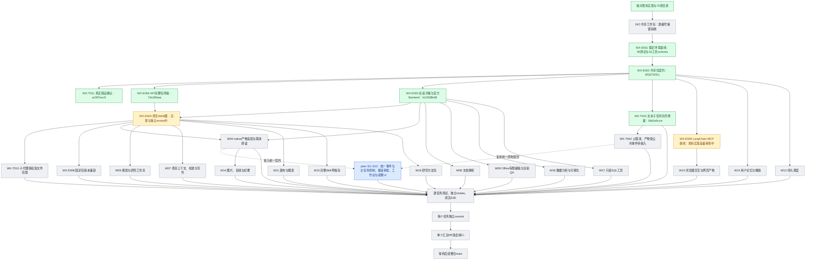

# 实施过程与证据快照

2026-09-07，跟踪 issue #2864。此图是实施记录，不是 feature passing 状态；绿色只表示框内范围已验证提交，黄色为进行中，灰色为待实现或接入，蓝色由 peer 负责。跨会话边界见 [peer-boundaries.md](peer-boundaries.md)。

W01 基础分开显示；W03 API 传输通过不代表原生加载已完成。WX-E003 最终 sessions-only 镜像、HTTP 隔离链和官方 Backend 已验证提交，原生图接线仍在进行。WX-T042 文本子任务持久化、权限、幂等和受限执行已验证提交；父取消、产物和公共事件仍待集成，不代表 W16 全部验收。蓝色节点保留集成验收责任，不在本分支重复建设。

原始 75 项编号、场景、重要程度和验收范围见 `capability-catalog.json`；本图没有删除灰色任务，也不以已有提交数量换算总体完成百分比。

当前执行顺序：完成 E004 原生 Skills 图的独立 review 和未知执行结果禁止重试的回归，再接 E005 已有 MCP 治理。E004 已运行固定脚本并下载真实产物，但尚未提交，也尚未启用生产 factory；因此保持黄色。T010 与 E008 单列为待完成，不把 E004 的局部结果扩展为整个 W03 已完成。
