# 实施过程与证据快照

2026-09-07，跟踪 issue #2864。此图是实施记录，不是 feature passing 状态；绿色只表示框内范围已验证提交，黄色为未完成的开发/验收，红色为阻断，灰色为待实现或接入，蓝色由 peer 负责。跨会话边界见 [peer-boundaries.md](peer-boundaries.md)。

```mermaid
flowchart TD
  A[核对现有实现与75项目录]:::verified --> B[19个共享工作包：逐编号保留验收]
  B --> E1[WX-E001 本地及容器锁定依赖：a2e6de1c0]:::verified
  E1 --> E2[WX-E002 共享包契约：65327d7b1]:::verified
  E2 --> T11[WX-T011 真实假设确认：ac597acc5]:::verified
  E2 --> E4API[WX-E004 API完整包传输：7dcd2feaa]:::verified
  E2 --> E3[WX-E003 隔离沙箱及160次回收验证：751b16b34]:::verified
  E4API --> E4[WX-E004 原生Skills图：ebe8afe29]:::verified
  E3 --> E4
  E4 --> Scope[WX-T010 实际文件授权委派：db2dd434a]:::verified
  E3 --> FileTests[T001–T008 官方文件行为证据：f9b1ca28a]:::verified
  FileTests --> ImageRead[WX-T002 有界图像传输：8b7fe404b，46项回归通过]:::verified
  ImageRead --> FileJoin[附件只读挂载与真实完整链：66d36f813]:::verified
  FileJoin --> NativeTrace[标准编号与实际ToolNode身份：50a4895cd]:::verified
  NativeTrace --> InputGate[附件当前可见性与完整链复测：66d36f813]:::verified
  E4 --> NativeJoin[可信factory、加密session与恢复：045f48ae5]:::verified
  E4 --> SkillEvents[实际Skill事实与必达journal：0e2bdb411 / 570abc19e]:::verified
  SkillEvents --> NativeAuthority[逐次工具授权与有界HTTP：0e2bdb411]:::verified
  SkillEvents -.契约对齐.-> Peer
  E4 --> Version[WX-E008 持久版本恢复：f5fbf35f4；全量兼容待验]:::active
  E3 --> OutputStore[WX-E006 字节收集与UDS下载：16961012d、ff22a9e5a]:::verified
  OutputStore --> E6[W04 暂存与产物写回：045f48ae5]:::verified
  E4 --> E6
  E2 --> T42[WX-T042 文本子任务与独立回收期限：dd1079503]:::verified
  Peer[peer S2–S10：统一事件与主任务控制、插话审批、工作台与成果UI]:::peer
  E6 -.接入统一契约.-> Peer
  T42 --> PendingCancel[WX-T042 单个pending取消：352a506ba]:::verified
  PendingCancel --> T42Join[WX-T042 父取消与晚到入队阻断：4ef787b83]:::verified
  T42Join --> RunningCancel[WX-T042 running cancel: 5068ecb0a]:::verified
  T42Join -.复用统一控制契约.-> Peer
  E2 --> MCPSchema[WX-E005 完整schema及变更授权：53658daf1]:::verified
  MCPSchema --> MCP[WX-E005 anonymous, isolation and credential broker: 41d60d32f]:::verified
  MCP -.复用准入与审批.-> Peer
  MCP --> Browser[W10 浏览器交互与网页产物]
  E4 --> Research[W06 搜索抓取：85f56f1a1；研究包：086155098]:::verified
  E4 --> Context[W07 项目与检索：35fc834dc；四项Skill：ce3399822]:::verified
  E3 --> Parse[W08 原件解析7d1126261、OCR50c6eac90；跨页表格待做]:::active
  E3 --> Office[W09 Office完整包与有限编辑：02f73bdff]:::verified
  Office --> Renderer[W09 隔离Office渲染与简单页面检查：274f4e8ad]:::verified
  E3 --> Data[W18 离线分析依赖与完整方法包：c917fdbae]:::verified
  E4 --> Canvas[W11 画布版本工具：ecfbee70f；Skill：776e2a9f7]:::verified
  E2 --> MemoryScope[W12 可信个人scope：1f2735a71]:::verified
  MemoryScope --> Memory[W12 持久Store、撤权、取消回滚及生产DI：b91057172]:::verified
  E2 --> Schedule[W13 持久调度：1d86b1200]:::verified
  Schedule --> Notify[持久通知 API 与 UI：8ec487b2c]:::verified
  E6 --> Media[W14 长音频链：4a3582ab0；真实模型验收中]:::active
  E4 --> Author[W15 草稿到产物再导入完整链：f51283005]:::verified
  E3 --> SQL[W17 官方SQL与取消反证：7d42283e3]:::verified
  E4 --> Methods[W19 两项方法包及导入源校验：ffbf307a2]:::verified
  Methods --> MethodDelivery[标准包启动发布与跨组织可见性：5aba6a788、d3c1c8c03]:::verified
  E6 --> Gate[逐任务测试、独立review、真实E2E]
  Peer --> Gate
  T42 --> Gate
  T42Join --> Gate
  Scope --> Gate
  FileTests --> Gate
  FileJoin --> Gate
  NativeJoin --> Gate
  Version --> Gate
  Browser --> Gate
  Research --> Gate
  Context --> Index[组织索引与审核入口：be6dd0c23]:::verified
  Index --> Hybrid[多通道检索与重排：生产 HTTP 验收中]:::active
  Hybrid --> Gate
  Index --> Gate
  T11 --> NativeForms[T011–13 native 交互入口：4cc047087]:::verified
  RunningCancel --> NativeAsync[T042 native 入口待补]:::active
  NativeForms --> Gate
  NativeAsync --> Gate
  Parse --> Gate
  Renderer --> Gate
  Data --> Gate
  Canvas --> Gate
  Memory --> Gate
  Schedule --> Gate
  Media --> Gate
  Author --> Gate
  SQL --> Gate
  MethodDelivery --> Gate
  Gate --> Commits[每个任务独立commit]
  Commits --> Migration[迁移重放修复：e4b8e9b34，本地202项重放通过]:::verified
  Migration --> Push[已授权公开推送；远端检查点414aca176]:::active
  Push --> PR[Draft PR #2869；CI 修复与新 SHA 验证中]:::active
  PR --> Main[等待后续整合main]
  Resource[本地3路：Skill验收、索引入口、native交互；云端并行]:::active -.影响未完成工作.-> Gate
  classDef default fill:#eef0f3,stroke:#88909c,color:#20242a;
  classDef verified fill:#dcfce7,stroke:#15803d,color:#14532d;
  classDef active fill:#fef3c7,stroke:#d97706,color:#78350f;
  classDef blocked fill:#fee2e2,stroke:#dc2626,color:#7f1d1d;
  classDef peer fill:#dbeafe,stroke:#2563eb,color:#1e3a8a;
```

## Current delivery boundary

Local verified checkpoint: 4cc047087. Last successful public push: 414aca176. PR #2869 remains unmerged. The [three-round plan](three-round-delivery-plan.md) is active. Green nodes refer only to the exact verified scope printed inside each node, never all 75 requirements or harness passing.

Recent independent commits: notifications 8ec487b2c, organization FTS e56bb54aa, FFmpeg 3a36038c3, delegated file access db2dd434a, long-audio chain 4a3582ab0, persisted engine recovery f5fbf35f4, CI stream fixtures 1d57982aa, reviewed indexing entry be6dd0c23, platform audio packs a101d0029, native interactions 4cc047087.

The indexing entry passed 32 real database/HTTP tests. Native interactions passed 53 Python and 6 real database tests. E008 profile routing passed 12 targeted tests. CI fixture regression passed 24/26 initially; the remaining two cases and platform pack delivery passed the subsequent 11-test run. The current API typecheck passed. A stronger explicit migration-file replay and populated-data fingerprint from cloud PR #2907 are applied locally and await final local evidence.

Remaining work includes hybrid production HTTP acceptance, cloud Office locator patch transfer and local acceptance, browser runtime/egress/receipt integration, remaining native adapters, complete per-Skill real-model acceptance, and current-SHA CI. Browser component tests passed 6 cases; real Chromium acceptance has not run yet. Cloud output alone is not integrated or verified production behavior.

S009 real-model technical delivery reached persisted Markdown, but semantic review caught an unsupported rejection claim. The strict semantic gate remains yellow while an immutable 1.1.1 Skill revision is retested. S016 real ASR success requires provider configuration; fixture success does not satisfy that gate.

Three local workers remain assigned to hybrid retrieval, native snapshot compatibility/browser wiring, and real-model Skill acceptance. Cloud workers handle independent adapters and reviews. Database-heavy suites use one owned stack at a time. No merge into main is authorized.
