# 实施过程与证据快照

2026-09-07，跟踪 issue #2864。此图是实施记录，不是 feature passing 状态；绿色只表示框内范围已验证提交，黄色为进行中，灰色为待实现或接入，蓝色由 peer 负责。跨会话边界见 [peer-boundaries.md](peer-boundaries.md)。

```mermaid
flowchart TD
  A[核对现有实现与75项目录]:::verified --> B[19个共享工作包：逐编号保留验收]
  B --> E1[WX-E001 本地及容器锁定依赖：a2e6de1c0]:::verified
  E1 --> E2[WX-E002 共享包契约：65327d7b1]:::verified
  E2 --> T11[WX-T011 真实假设确认：ac597acc5]:::verified
  E2 --> E4API[WX-E004 API完整包传输：7dcd2feaa]:::verified
  E2 --> E3[WX-E003 隔离沙箱及160次回收验证：751b16b34]:::verified
  E4API --> E4[WX-E004 原生Skills图：ebe8afe29]:::verified
  E3 --> E4
  E4 --> Scope[WX-T010 仅文本委派已验证；扩展文件授权待做]:::active
  E3 --> FileTests[T001–T008 官方文件行为证据：f9b1ca28a]:::verified
  FileTests --> ImageRead[WX-T002 有界图像传输：8b7fe404b，46项回归通过]:::verified
  ImageRead --> FileJoin[附件原件只读挂载接入中]:::active
  FileJoin --> NativeTrace[标准编号与实际ToolNode身份：50a4895cd]:::verified
  NativeTrace --> InputGate[附件输入联合验收待完成]
  E4 --> NativeJoin[可信factory、加密session与恢复：045f48ae5]:::verified
  E4 --> SkillEvents[实际Skill事实与必达journal：0e2bdb411 / 570abc19e]:::verified
  SkillEvents --> NativeAuthority[逐次工具授权与有界HTTP：0e2bdb411]:::verified
  SkillEvents -.契约对齐.-> Peer
  E4 --> Version[WX-E008 固定包版本兼容]
  E3 --> OutputStore[WX-E006 字节收集与UDS下载：16961012d、ff22a9e5a]:::verified
  OutputStore --> E6[W04 暂存与产物写回：045f48ae5]:::verified
  E4 --> E6
  E2 --> T42[WX-T042 文本子任务与独立回收期限：dd1079503]:::verified
  Peer[peer S2–S10：统一事件与主任务控制、插话审批、工作台与成果UI]:::peer
  E6 -.接入统一契约.-> Peer
  T42 --> PendingCancel[WX-T042 单个pending取消：352a506ba]:::verified
  PendingCancel --> T42Join[WX-T042 父取消与晚到入队阻断：4ef787b83]:::verified
  T42Join --> RunningCancel[WX-T042 running取消与公共事件待接入]
  T42Join -.复用统一控制契约.-> Peer
  E2 --> MCPSchema[WX-E005 完整schema及变更授权：53658daf1]:::verified
  MCPSchema --> MCP[WX-E005 执行桥：准入接口已合入；固定版本授权待实现]:::blocked
  MCP -.复用准入与审批.-> Peer
  MCP --> Browser[W10 浏览器交互与网页产物]
  E4 --> Research[W06 搜索抓取：85f56f1a1；研究包：086155098]:::verified
  E4 --> Context[W07 项目上下文、检索与写作]:::active
  E3 --> Parse[W08 文档解析]
  E3 --> Office[W09 Office完整包与有限编辑：02f73bdff]:::verified
  Office --> Renderer[W09 隔离Office渲染与简单页面检查：274f4e8ad]:::verified
  E3 --> Data[W18 离线分析依赖与完整方法包：c917fdbae]:::verified
  E4 --> Canvas[W11 画布与图表]
  E2 --> MemoryScope[W12 可信个人scope：1f2735a71]:::verified
  MemoryScope --> Memory[W12 持久Store、撤权、取消回滚及生产DI：b91057172]:::verified
  E2 --> Schedule[W13 持久调度]
  E6 --> Media[W14 图片、音频与纪要]
  E4 --> Author[W15 完整Skill草稿包]
  E3 --> SQL[W17 只读SQL工具：核查上游复用与独立只读源]:::active
  E4 --> Methods[W19 两项方法包及导入源校验：ffbf307a2]:::verified
  Methods --> MethodDelivery[W19 部署发布及真实模型验收]
  E6 --> Gate[逐任务测试、独立review、真实E2E]
  Peer --> Gate
  T42 --> Gate
  T42Join --> Gate
  Scope --> Gate
  FileTests --> Gate
  FileJoin --> Gate
  NativeJoin --> Gate
  Version --> Gate
  Browser --> Gate
  Research --> Gate
  Context --> Gate
  Parse --> Gate
  Renderer --> Gate
  Data --> Gate
  Canvas --> Gate
  Memory --> Gate
  Schedule --> Gate
  Media --> Gate
  Author --> Gate
  SQL --> Gate
  MethodDelivery --> Gate
  Gate --> Commits[每个任务独立commit]
  Commits --> Migration[迁移重放修复：e4b8e9b34，本地202项重放通过]:::verified
  Migration --> PR[汇总Draft PR #2869：CI与完整验收进行中]:::active
  PR --> Main[等待后续整合main]
  classDef default fill:#eef0f3,stroke:#88909c,color:#20242a;
  classDef verified fill:#dcfce7,stroke:#15803d,color:#14532d;
  classDef active fill:#fef3c7,stroke:#d97706,color:#78350f;
  classDef blocked fill:#fee2e2,stroke:#dc2626,color:#7f1d1d;
  classDef peer fill:#dbeafe,stroke:#2563eb,color:#1e3a8a;
```

当前图只记录具体组件的已验证提交，原始 75 项编号和逐项验收仍以 `capability-catalog.json` 为准。绿色不等于部署给所有终端用户，也不等于真实模型端到端验收通过。蓝色由 peer 实现，本分支负责接口集成。

原生生产 factory、加密 session、产物暂存、现有写回和恢复已在 045f48ae5 提交；真实 Python→UDS 沙箱→Nest→PG/ObjectStore 链使用脚本模型，不能替代真实模型验收。公共原生工具身份已提交 50a4895cd，附件原件只读挂载正在联合验收。

W06 的授权搜索/抓取与研究完整包分别提交 85f56f1a1、086155098；W18 真实隔离环境 CSV/XLSX/JSON 分析、中文 PNG/PDF 可视化与固定完整包提交 c917fdbae。Office 完整包与有限编辑提交 02f73bdff，隔离渲染提交 274f4e8ad；渲染验证只覆盖实际测试页面。上述完整包尚需统一发布与真实模型验收。

W12 官方 LangMem/AsyncPostgresStore 已完成来源撤权、CAS/幂等、真实取消/总截止/锁等待回滚验证，生产 DI 新断言及原生调用策略共 8 项通过，提交 b91057172。W07 当前聚焦真实可见文件来源与现有项目 API；不能用该子集宣称全组织五路检索已实现。MCP 固定版本调用、浏览器、调度、媒体、画布、Skill 草稿和 SQL 的剩余工作保留在图中。

扩大 API 回归首轮 804 通过、42 失败；修复后 24 文件回归为 142 通过、1 失败，最后路径断言修正后相关 16 项通过。这是分次证据，不宣称一次全量全绿。详情见 `evidence/ci/native-integration-verification.md`。当前 API typecheck 通过；全仓 CI 需在最新推送 SHA 重新核对。

汇总 [Draft PR #2869](https://github.com/boardx/workspacex/pull/2869) 保留，未合入 main。旧 d5f15ec15 的 CI 快照仅属于旧提交，不能继承给后续提交。
