# 实施过程与证据快照

2026-09-07，跟踪 issue #2864。此图是实施记录，不是 feature passing 状态；绿色只表示框内范围已验证提交，黄色为未完成的开发/验收，红色为阻断，灰色为待实现或接入，蓝色由 peer 负责。跨会话边界见 [peer-boundaries.md](peer-boundaries.md)。

```mermaid
flowchart TD
  A[核对现有实现与75项目录]:::verified --> B[19个共享工作包：逐编号保留验收]
  B --> E1[WX-E001 本地及容器锁定依赖：a2e6de1c0]:::verified
  E1 --> E2[WX-E002 共享包契约：65327d7b1]:::verified
  E2 --> T11[WX-T011 真实假设确认：ac597acc5]:::verified
  E2 --> E4API[WX-E004 API完整包传输：7dcd2feaa]:::verified
  E2 --> E3[WX-E003 隔离沙箱及160次回收验证：751b16b34]:::verified
  E4API --> E4[WX-E004 原生Skills图：ebe8afe29]:::verified
  E3 --> E4
  E4 --> Scope[WX-T010 实际文件授权委派：db2dd434a]:::verified
  E3 --> FileTests[T001–T008 官方文件行为证据：f9b1ca28a]:::verified
  FileTests --> ImageRead[WX-T002 有界图像传输：8b7fe404b，46项回归通过]:::verified
  ImageRead --> FileJoin[附件只读挂载与真实完整链：66d36f813]:::verified
  FileJoin --> NativeTrace[标准编号与实际ToolNode身份：50a4895cd]:::verified
  NativeTrace --> InputGate[附件当前可见性与完整链复测：66d36f813]:::verified
  E4 --> NativeJoin[可信factory、加密session与恢复：045f48ae5]:::verified
  E4 --> SkillEvents[实际Skill事实与必达journal：0e2bdb411 / 570abc19e]:::verified
  SkillEvents --> NativeAuthority[逐次工具授权与有界HTTP：0e2bdb411]:::verified
  SkillEvents -.契约对齐.-> Peer
  E4 --> Version[WX-E008 恢复与旧run排空：f5fbf35f4；快照b8352e879]:::verified
  E3 --> OutputStore[WX-E006 字节收集与UDS下载：16961012d、ff22a9e5a]:::verified
  OutputStore --> E6[W04 暂存与产物写回：045f48ae5]:::verified
  E4 --> E6
  E2 --> T42[WX-T042 文本子任务与独立回收期限：dd1079503]:::verified
  Peer[peer S2–S10：统一事件与主任务控制、插话审批、工作台与成果UI]:::peer
  E6 -.接入统一契约.-> Peer
  T42 --> PendingCancel[WX-T042 单个pending取消：352a506ba]:::verified
  PendingCancel --> T42Join[WX-T042 父取消与晚到入队阻断：4ef787b83]:::verified
  T42Join --> RunningCancel[WX-T042 running cancel: 5068ecb0a]:::verified
  T42Join -.复用统一控制契约.-> Peer
  E2 --> MCPSchema[WX-E005 完整schema及变更授权：53658daf1]:::verified
  MCPSchema --> MCP[WX-E005 anonymous, isolation and credential broker: 41d60d32f]:::verified
  MCP -.复用准入与审批.-> Peer
  MCP --> Browser[W10 隔离Remote与PG验收通过：4c535ffc6]:::verified
  E4 --> Research[W06 搜索抓取：85f56f1a1；研究包：086155098]:::verified
  E4 --> Context[W07 项目与检索：35fc834dc；四项Skill：ce3399822]:::verified
  E3 --> Parse[W08 四格式定位：真实UDS及6项生产HTTP通过，c67dc4e15]:::verified
  E3 --> Office[W09 Office完整包与有限编辑：02f73bdff]:::verified
  Office --> Renderer[W09 隔离Office渲染与简单页面检查：274f4e8ad]:::verified
  E3 --> Data[W18 离线分析依赖与完整方法包：c917fdbae]:::verified
  E4 --> Canvas[W11 画布版本工具：ecfbee70f；Skill：776e2a9f7]:::verified
  E2 --> MemoryScope[W12 可信个人scope：1f2735a71]:::verified
  MemoryScope --> Memory[W12 持久Store、撤权、取消回滚及生产DI：b91057172]:::verified
  E2 --> Schedule[W13 持久调度：1d86b1200]:::verified
  Schedule --> Notify[持久通知 API 与 UI：8ec487b2c]:::verified
  E6 --> Media[W14 长音频链：4a3582ab0；真实模型验收中]:::active
  E4 --> Author[W15 草稿到产物再导入完整链：f51283005]:::verified
  E3 --> SQL[W17 官方SQL与取消反证：7d42283e3]:::verified
  E4 --> Methods[W19 两项方法包及导入源校验：ffbf307a2]:::verified
  Methods --> MethodDelivery[标准包启动发布与跨组织可见性：5aba6a788、d3c1c8c03]:::verified
  E6 --> Gate[逐任务测试、独立review、真实E2E]
  Peer --> Gate
  T42 --> Gate
  T42Join --> Gate
  Scope --> Gate
  FileTests --> Gate
  FileJoin --> Gate
  NativeJoin --> Gate
  Version --> Gate
  Browser --> Gate
  Research --> Gate
  Context --> Index[组织索引与审核入口：be6dd0c23]:::verified
  Index --> Hybrid[多通道检索与重排：58587bae5，65项DB/HTTP通过]:::verified
  Hybrid --> Gate
  Index --> Gate
  T11 --> NativeForms[T011–13 native 交互入口：4cc047087]:::verified
  RunningCancel --> NativeAsync[T042 native文本入口7e8848e93；文件产物仍待补]:::active
  NativeForms --> Gate
  E6 --> NativeEntries[T021/T040/T041 下载与状态取消：78a771abf，35项DB/HTTP通过]:::verified
  NativeEntries --> Gate
  NativeAsync --> Gate
  Parse --> S018[S018双解析真实模型通过：cfeb272d8；撤权0cea68804]:::verified
  S018 --> Gate
  Renderer --> OfficeSkills[S003–S006代表场景与PDF表单重开通过：75c4a43bb]:::verified
  OfficeSkills --> Gate
  Context --> ContextVersion[context 1.1.0：两项新版真实模型通过，830cb9db5]:::verified
  ContextVersion --> Gate
  Browser --> S013[S013网页Skill：HTML产物出口后续修复]:::active
  S013 --> Gate
  Parse --> Gate
  Renderer --> Gate
  Data --> Gate
  Canvas --> Gate
  Memory --> Gate
  Schedule --> Gate
  Media --> Gate
  Author --> Gate
  SQL --> Gate
  MethodDelivery --> Gate
  Gate --> Commits[每个任务独立commit]
  Data --> S007[S007真实模型：报告+CSV+Python源码，51c85cf7f]:::verified
  Context --> S001[S001知识问答与S008会议准备：ec3e655b4，真实引用核验通过]:::verified
  Research --> S002[S002真实研究：来源账本及失败恢复通过，a727c21bb]:::verified
  Author --> S015[S015生成Skill第二次模型调用通过：cfeb272d8]:::verified
  Methods --> SkillsRevised[S017/S019/S020代表场景及人工核对通过：352efabaf / ffbeae429]:::verified
  Media --> S009[S009真实模型及语义核对：1.1.1，d3d5baf2d]:::verified
  Media --> ASR[S016真实ASR：等待配置]:::blocked
  Commits --> Migration[迁移与数据指纹重放：9a4f280f8，228项通过]:::verified
  Peer --> Picker[Skill选择器：c2948fbd7；桌面/手机真实挂载通过]:::verified
  Picker --> Gate
  Migration --> Push[核心候选已推送：b1a31d8f4]:::verified
  Push --> PR[Draft PR #2869；CI 修复与新 SHA 验证中]:::active
  PR --> Preview[devapp核心预览部署34100037730：门控运行中]:::active
  Preview --> Live[远端普通用户文件验收待执行]:::active
  PR --> Main[等待后续整合main]
  Resource[本地3路：沙箱并发、Office与新版上下文、剩余Skill验收]:::active -.影响未完成工作.-> Gate
  classDef default fill:#eef0f3,stroke:#88909c,color:#20242a;
  classDef verified fill:#dcfce7,stroke:#15803d,color:#14532d;
  classDef active fill:#fef3c7,stroke:#d97706,color:#78350f;
  classDef blocked fill:#fee2e2,stroke:#dc2626,color:#7f1d1d;
  classDef peer fill:#dbeafe,stroke:#2563eb,color:#1e3a8a;
```

## 当前交付边界

核心候选 b1a31d8f4 已推送；devapp 部署 workflow 34100037730 已启动，尚未完成远端验收。见 [核心预览说明](core-preview.md)。PR #2869 保持未合并。

绿色只表示框内注明的范围及证据，不表示全部75项目录或线上启用。Office代表场景、S015二次加载、S018并发解析与缓存撤权、新版上下文两场景均已通过并提交。S013 HTML产物、T042子任务文件输出、真实ASR及目录其他剩余验收继续迭代，见 [Skill覆盖索引](evidence/G-SKILL-methods/README.md)。

旧检查点8cc4a46a0的pytest通过；后端第4分片失败是实际容器测试误入只有PG的普通通道。修复增加独立真实容器job并作为部署依赖，不跳过该验收。固定核心候选的CI与部署结果须另行确认。

已整合最新main及peer工作台UI。现有devapp配置未启用新的原生session运行时，因此本地原生证据不等于devapp可用。需要真实远端文件生成/下载验收；后续配置开启原生能力另留证据。
