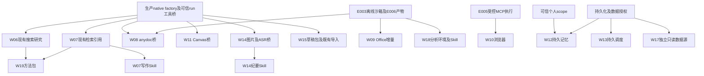

# 剩余工作包运行时复用审计

日期：2026-09-07。范围：本工作树已整合 peer 工作台接口后的只读代码审查，用于派工，不是运行验收或 passing 证明。未运行重测试、未验证外部服务可用性、未读取凭据，也不改变权威 capability catalog。下列路径均相对仓库根目录。

结论：W06/07/08/09/11/14/15 有大量可复用领域实现；主要差量是受控工具接线、完整技能包和明确的能力扩展。目录项、路由声明、测试文件存在都不能单独证明用户链路可用。

## 每包最短接入路径

| 包 | 实际代码与接线 | 差量及部署依赖 |
| --- | --- | --- |
| W06 搜索研究 | `apps/api/src/infrastructure/research/google-guided-search.ts::GoogleGuidedSearch.search` 已由 `kernel.module.ts` 注入；`application/research/guided-runtime-service.ts` 和 `apps/deep-agent-service/src/deep_agent_service/guided_research_graph.py` 已有研究流程。 | 包装现有搜索端口并保留 URL/引用，避免重写研究引擎。搜索返回 snippet，不是全文；全文抓取及 SSRF 约束仍需实现。`KERNEL_GUIDED_SEARCH_URL` 有默认代理地址，但当前可用性未验证。 |
| W07 上下文检索/写作 | `infrastructure/agent-run/pg-file-retrieval.ts::PgFileRetrieval.search` 已注入执行器；`infrastructure/retrieval/pg-segment-retriever.ts::PgSegmentRetriever` 提供 fts/vector/graph/metadata；`application/context-pack/{build-items,finalize-pack,pin-pack}.ts` 提供组装、引用和固定上下文。 | 从可信 run 注入 org/user/thread/project，模型只提供 query；补可调用工具桥、结果限额和写作技能包。已有自动检索不等于模型能主动调用。依赖现有 DB/索引；当前数据覆盖未验证。 |
| W08 文档解析 | `infrastructure/chat/anydoc-attachment-to-markdown.ts::AnydocAttachmentToMarkdown.convert` 真实调用 `@firecrawl/anydoc.toMarkdownBytes`，已生产 DI；`AttachmentExtractionExecutor` 与 `runExtractionTick` 已有抽取队列。 | 从授权附件读取 bytes，复用 converter/已抽取结果，结果接 artifact。不再为相同格式另接解析库。纯文档转换无需外部凭据。`domain/files/extraction-adapters.ts` 是确定性分段/锚定，不能把它当真实 PDF/OCR 解码器。 |
| W09 Office | `apps/api/scripts/office-docs-skill-content.ts` 有 DOCX/XLSX/PPTX/PDF 四个 CREATE 正文；`infrastructure/skill/ensure-platform-skill-catalog.ts::ensurePlatformSkillsSeeded` 消费这些正文；sandbox 已预装 docx/exceljs/pdf-lib/fontkit/pptxgenjs。 | 复用 create 能力，迁为完整固定版本包；补有限编辑、渲染与 QA。docx 生成库不等于现成 Word 编辑器。依赖 E003、E006、镜像字体/渲染环境；无需外部凭据。已有输出测试未在本审计重跑。 |
| W10 浏览器 | 本次检索未发现生产浏览器控制工具；E2E 浏览器不属于终端用户能力。 | 接所选 MCP/browser provider，依赖 E005 授权与凭据保管、浏览器 session 及 artifact。缺实现与服务部署，不是仅缺 API key。 |
| W11 画布图表 | `interface/controllers/canvas-instance.controller.ts::CanvasInstanceController` 的 handler 调用 getSource/updateSource/render/exportSource/applyStickyChange 用例；对应 `application/canvas/*` 及 `packages/fabric-markdown`。 | 工具包装既有授权用例，保留版本冲突与 ignored syntax。缺工具桥和图表 Skill；无需外部凭据。`renderCanvas` 返回模型/sections/stickies，不是 PNG renderer。 |
| W12 memory | 已有可信 `wsx_memory_scope` 转发；Python 已依赖 langgraph-checkpoint-postgres 和 psycopg。 | checkpoint 不等于长期 memory API。缺 durable Store 消费、namespace、来源授权、CAS/删除/撤销及 LangMem 接线；当前直接依赖表没有 LangMem。既缺实现，也需 DB 部署配置。 |
| W13 调度 | 本次未发现用户 schedule/cron/reminder 契约或控制器；现有 subtask executor 可供到期后投递执行复用。 | 新建持久调度、到期领取、幂等及时间规则，再投递既有运行入口。不得以 harness automation 或进程 timer 充当产品调度。不依赖外部 SaaS 凭据；缺实现。 |
| W14 图片/音频/纪要 | `infrastructure/agent-run/bailian-image-provider.ts::BailianImageProvider` 已生产 DI；`infrastructure/recording/configured-realtime-asr-provider.ts` 有实际 WebSocket ASR；`application/recording/personal-transcription-usecases.ts` 有记录与 ticket 用例。 | 图片复用 provider 并接 artifact，但文本生图不能算图片编辑。实时 ASR 不能算任意文件转写，后者需格式/文件适配。图片依赖 KERNEL_MODEL_API_KEY/BAILIAN 配置；ASR 依赖 KERNEL_ASR_PROVIDER 及模型/端点/key。纪要 Skill 可独立制作，但输入需绑定真实 transcript。 |
| W15 Skill 作者 | 可复用模型 A 的 URL/starter 导入、版本编辑、试跑和审核；详情见下节。**POST /skills 已冻结，不能复用新建。** | 草稿先成为完整包产物，经既有导入和版本治理进入系统。管理员权限仍适用，不能因“所有终端用户”要求而绕过。缺完整作者 Skill/产物接线；starter 分发依赖部署配置，不能把来源存在当包已分发。 |
| W17 SQL | 现有 DatabasePort.withTenant 是内部数据库能力，本次未找到用户只读 SQL 工具。 | 独立只读数据源、权限、timeout/限行/单语句与危险函数约束，再直接整合所选 LangChain SQL 能力。不能暴露 app_rw；不依赖 MCP。缺实现和数据源授权。 |
| W18 数据分析 | 可复用 E003 Python/Node、文件工具、exceljs；Python直接依赖尚未见 pandas/matplotlib 分析栈。 | 完整分析 Skill、离线预装依赖、格式适配与 E006 产物。无需外部凭据；不可在断网运行时安装依赖。Python 能执行不等于分析环境完整。 |
| W19 方法包 | `application/research/guided-research-skill.ts::ModelGuidedResearchSkill` 和访谈/research 流程可复用，但不是已发布的标准 SKILL.md 包。 | 制作方法完整包与触发/引用验收，复用 W06/W07/E004。不增加方法执行引擎；模型调用继承现有配置。 |

## W15 handler 复核与纠正

初次审计仅依据路由存在，把 `POST /skills` 列作可复用创建入口；这是错误判断。本节以实际 handler 为准纠正，不恢复冻结路径。

| 入口 | 实际 handler 行为 | 条件/限制 |
| --- | --- | --- |
| `POST /skills`，`SkillController.create()` | 直接 `throw new GoneException`，reasonCode 为 `SKILL_DRAFT_WRITE_PATH_FROZEN`；handler 无参数，无 body pipe，无写库动作。 | **无 feature flag，无重新开放分支**；进入 handler 后恒 410，与 body 和成员资格无关。外围认证中间件仍可先拒绝请求。参照 `apps/api/tests/skill/post-skills-gone-410.test.ts`，本审计未重跑。 |
| `POST /admin/skills/url-imports`，`SkillUrlImportController.import()` | 校验 principal/组织，调用 `importSkillFromUrl`；新建 201，幂等回放 200；按具体失败码映射 403/409/422。 | 组织不存在拒绝；用例在出站前要求 orgRole=admin；本地组织出站受限，SSRF/超时/体积错误不吞掉。不是仅因为路由存在就可调用成功。 |
| `POST /admin/skills/starter-pack-imports`，`SkillStarterImportController.import()` | 调用 `importSkillStarterPack`；新建 201，回放 200；失败 403/404/409/422。 | 用例要求 orgRole=admin；`FileSkillStarterPackSource` 的 root 来自 `SKILL_STARTER_PACK_ROOT`，未配置则 load 返回 null，最终 404 `SKILL_STARTER_PACK_NOT_FOUND`。无默认包目录、无静默 fallback。 |
| `SkillVersionEditController.edit()`，路径取自共享契约 `operations.editSkillVersionContent.path` | 调用 `editSkillVersionContent` 并校验输出；用例错误映射 403/404/422。 | 用例要求 orgRole=admin；编辑现有模型 A 版本不是创建模型 B 的逃生口。 |

终端用户可生成作者技能的草稿包产物；入库、安装、审核与发布应保持各自现有权限。模型提示词或标准目录都不能授予管理员权限。

## 派工依赖图

可优先并行 W08 桥、W09 包/有限编辑、W11 桥、W19 包；不必等待浏览器、memory、调度。公共 factory 和 kernel DI 由一个 owner 接线，避免各包并行修改共同入口。图中箭头表示实施依赖，不表示任何节点已经通过验收。
