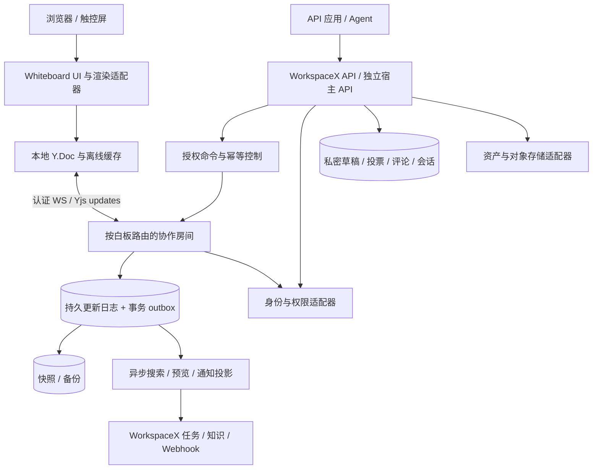

# WorkspaceX Board 系统架构提案

状态：Proposed design input，未作为 Accepted ADR；性能及功能均待实现验证。产品需求以 [requirements.md](requirements.md) 为准。

## 1. 架构结论

采用“独立白板领域内核 + Yjs 协作模型 + 可替换渲染器 + 服务端授权房间 + WorkspaceX 适配层”。首选自托管 Node.js 协作服务与现有 API/数据库部署相邻，保持云厂商可替换；不把应用协作数据放进用于 agent 协调的 coord-gateway。

Yjs 负责内容合并，服务端负责权限、持久化、审计、受控业务操作和外部 API。Yjs 不等于权限系统，也不自动提供可靠保存或可信作者身份。



## 2. 现有系统与建议模块边界

本轮基于本地 HEAD 的检查不是生产环境审计；文件与调研范围见 [research.md](research.md)。

| 已有能力 | 处理原则 |
|---|---|
| `packages/fabric-markdown` 的图模型与 Mermaid/Fabric 转换 | 复用为受限图形导入导出适配器；不让 Fabric JSON 或 Mermaid 成为自由白板唯一格式 |
| `packages/contracts/src/canvas.ts` 模板和画布契约 | 保留已签核语义；新白板通过模板版本/来源映射接入，不能修改旧契约后假称兼容 |
| `apps/api/src/domain/canvas/sticky-lww.ts` | 保留旧画布路径；新白板采用 Yjs，禁止同一对象同时由旧 LWW 和新 CRDT 写入 |
| `packages/contracts/src/board.ts` | 已是任务看板契约，不能占用；白板领域用 `whiteboard` |
| `standard-canvas-tools.ts` | 现有 read/replace-source 保持；新增对象级白板工具，从新契约生成，不将自由图对象转回整段替换 |
| 身份、项目、资产、任务、Agent 域 | 通过既有 application service/port 复用；白板不另做 RBAC、任务状态机和模型路由 |

建议包划分（拟新增，不代表当前存在）：

- `packages/whiteboard-core`：对象语义、命令、几何与不变量；无 React、数据库、模型供应商依赖。
- `packages/whiteboard-yjs`：共享类型映射、事务、同步协议版本与本地撤销；不直接调用 WorkspaceX。
- `packages/whiteboard-react`：工具状态机、DOM 编辑器、可访问对象列表、渲染适配接口。
- `packages/contracts/src/whiteboard.ts`：WorkspaceX 契约单源，导出 OpenAPI/SDK 所需 schema；独立发行通过可发布的契约入口复用，禁止手抄类型。
- `apps/whiteboard-collab`：WS 接入、房间实例、更新验证、持久日志与恢复；先独立进程，后可独立伸缩。
- `apps/api/.../whiteboard`：资源、授权、业务命令、私密区、投票、集成与后台任务。

避免一次拆出大量网络微服务：投票、导入、评论等先作为 API 内模块；只有高频 WS 房间独立部署。

## 3. 渲染与交互选型

首选探针复用 Fabric.js（已有转换资产和团队代码），配合 DOM 文字编辑层。模型、工具状态机和渲染适配器分离，渲染器只能提交领域操作、订阅对象投影；不得把每帧 `canvas.toJSON()` 整板写入 Yjs。

| 方案 | 收益 | 代价与裁决 |
|---|---|---|
| Fabric + DOM 编辑 | 复用现有图形路径，支持自由画布 | 需开发选择、Frame、空间索引、协作绑定与可访问层；作为首选探针而非无条件定案 |
| 自有 DOM/SVG/Canvas 混合 | 便签文字和无障碍易控制 | 多层坐标、命中检测及性能复杂；Fabric 探针无法达标时对照验证 |
| GoJS | 参考其节点/边/组、工具与模型分离思路 | 其授权体系不应成为开放核心默认依赖；复杂制图可后续评估独立商业适配器 |

技术门：中文 IME、触控与笔输入、5,000 对象导航、50 人同步、连接线正确性和无障碍编辑六项均有证据后正式选型。采用视口裁剪、缩略图、空间索引、缩放分级细节；隐藏渲染对象不等于卸载 Y.Doc 数据或安全隔离。

Mermaid 导入仅对受支持图型转为节点/边，输出明确兼容性报告；坐标不写回 Mermaid，保持现有不变量。自由笔迹、任意插件、私密草稿不承诺 Mermaid 往返。

### 3.1 Chat → Board 图形桥接

WB-12 为首版必需链路。复用 `MarkdownMessage` 的图块定位与分流，分别接入 `ChatDiagramFabric` 和 `ChatCanvasFabric` 及其最大化编辑器；模板围栏不能送进 Mermaid 解析器。图型覆盖从现有权威入口派生，适配器不得手抄另一份“支持图型”枚举。

转换链：`Chat 当前已完成渲染的版本 → DiagramModel + 当前布局/专用属性 → Whiteboard 导入适配器 → 授权 import-diagram 命令 → Y.Doc`。优先复用 `packages/fabric-markdown/src/canvas-io.ts` 的模型提取能力，但须逐图型核对其保真度；提取缺字段时补映射，不能假设抽取模型已保留全部可见信息。

导入包建议包含 sourceRef（threadId/messageId/blockId、artifactId/version 如有）、sourceHash、fenceLanguage、diagramKind、converterVersion、schemaVersion、模型与布局；未保存编辑标明 derivedFrom 和当前快照 hash，不伪造已保存 artifact 版本。图块需稳定标识，不能只靠消息内第几个围栏识别长期来源。

坐标采用独立于 Chat 视口缩放/平移的世界坐标，保留对象尺寸、相对位置、嵌套变换及连接端点；整体平移至目标落点，不把 Chat canvas 的 viewportTransform 当作对象坐标。布局写入 Board geometry 并经 Yjs 持久化；Mermaid 原文仅作来源快照，仍不写入坐标。

每次独立插入生成 groupId 及一套新对象 ID；保留 source-local ID → board object ID 映射并重映射边、父容器和专用引用，禁止直接复用源 ID 导致重复插入冲突。时序生命线、类成员、图表扇区等专用语义必须在对象类型或受控扩展属性中保留，并提供相应编辑能力；迁移为原生对象不要求能无损写回 Mermaid。

API 新增导入命令种类 `import-diagram`（归入已有 imports/commands 契约单源）；Chat 按钮、SDK 和 AI 调用同一授权服务。服务端验证源读取/转出策略、目标写权限、内容 schema、来源版本与资产可分享性。目标成员可阅读已批准复制的内容，但来源链接不赋予 Chat 会话访问权；界面须明确副本会继承目标白板可见范围，源撤权不等于追回已合法分享副本。

在容量上限内整图原子提交；超大图预检拒绝或先进入不可见 staging，全部验证后发布，不能向协作者逐步暴露半张断链图。响应携带 importId、groupId、objectIds、committedSeq 和能力/损失报告；同一幂等键重试返回同一结果，主动再次插入使用新键。

本轮不引入隐式双向绑定；未来“从源更新”需三方差异（导入基线/当前 Board/新源）与冲突确认，不能覆盖 Board 人工编辑。未知类型的静态快照是用户明确选择的降级选项，不能替代对当前 Chat 图型的可编辑支持。

## 4. 数据模型与权威边界

### 4.1 共享内容

每块白板一个共享 `Y.Doc`（首版容量边界内）。对象用稳定 UUID；命名空间为 `orgId + boardId + documentEpoch`。不按 Frame 分片：首版跨 Frame 拖动与连线需要同文档事务。

```text
objects: Y.Map<objectId, Y.Map>
  kind, schemaVersion
  geometry: {x, y, width, height, rotation}  // 单键原子值
  text: Y.Text                             // 便签/文本的字符并发
  style: Y.Map                            // 独立样式字段
  tags: Y.Map<tagId, true>
  container: {parentId, orderKey}           // 单一父容器与排序
  sourceRef, extensionData
  connector: {from:{objectId,port}, to:{objectId,port}, label}
deletedObjects: Y.Map<objectId, true>       // 单调墓碑，不允许普通更新移除
frameOrder: Y.Array<frameId>                // 演示顺序，读取时去重/过滤已删项
```

上面是概念 schema，最终类型仅在契约包定义。geometry 原子更新防止 x/y 各自合并产生意外位置；文字使用 Y.Text，禁止每次输入 set 整段字符串。字符格式仅支持签核后的有限属性。

Group/Frame 的父关系使用一个权威字段，不同时维护另一份可写 children 列表。并发操作后验证无环、引用有效、每个对象最多一父容器；无效更新在服务端接纳前拒绝。排序冲突使用稳定次序及 objectId 作确定性补充，不能用本机时钟排序。

删除添加墓碑；所有读模型/命令都过滤墓碑；迟到修改可留历史但不让对象复活。恢复创建新 ID 并记 `restoredFrom`；对象及相关连接修改在有界事务中完成。墓碑清理只能随保留期与 document epoch 迁移执行，需处理旧离线客户端。

### 4.2 服务端权威数据

关系库保存白板资源归属/ACL、actor、文档 epoch、schema 版本、更新序号与内容 hash、命令幂等结果、检查点、导入任务、审计和事务 outbox。

私密草稿采用独立按用户授权的存储/文档，投票计数与资格采用服务端事务表，评论走独立受控 API。它们不能写进所有参与者可下载的共享 Y.Doc。发布草稿通过幂等命令将选定内容复制到共享板；草稿与共享写入的跨存储步骤有操作状态，重试不得重复发布。

资产二进制进入既有文件治理/对象存储，Y.Doc 只存资产 ID、尺寸和展示元数据。授权下载不因知道 assetId 即放行，导出同样复核资源权限。

数据库对象索引、搜索和缩略图是派生投影，可重建；不能成为另一条直接写对象的通道。作者及 AI 来源由认证连接和服务端审计产生，客户端 `createdBy`、Yjs clientID、transaction origin 都不是身份凭据。

### 4.3 临时状态

光标、选择、视口、正在拖动等放 Awareness 并限频，断线清除，不写持久更新日志。显示名/角色由服务端绑定身份，不能相信客户端声称“管理员”。跟随主持人是参与者主动订阅的视口状态，不修改其永久偏好。

## 5. Yjs 同步、验证与可靠保存

### 5.1 接入和更新路径

1. 客户端经宿主身份系统领取短期白板连接凭证，绑定 board、actor、role、epoch、有效期；避免将长期 token 放 URL/日志。
2. 房间验证组织、成员关系和撤销版本，再交换 state vector/差异。客户端只能读取获准的文档。
3. 客户端乐观编辑本地 Y.Doc，发送有 requestId 的 update envelope；每次更新重新校验写能力、大小和 schema 边界。
4. 服务端在隔离候选文档应用更新，验证受影响对象及全局不变量；持久化 update、审计与 outbox 成功后，才接纳到权威内存文档、广播并返回 durable ACK。
5. ACK 含 requestId、epoch 和持久 seq；客户端仅在本地待确认队列为空时显示“已保存”。Awareness 单独通道，不等待持久化。

不能“先把任意二进制 Yjs 更新广播，再尝试撤销恶意字段”。原始 update 可修改任意共享字段，需验证解码后的变化以及删除集；不只校验 HTTP JSON 或表面最终值。限制对象数、文字/笔迹长度、嵌套深度、结构数量、待依赖更新和处理耗时，防止小报文触发高内存占用。未解析依赖在隔离区有界缓存，不得未验证进入权威文档；缺依赖时请求补齐或重新同步。

**这是首个安全技术探针**：实现候选文档验证并测 CPU/延迟。若不能可靠完成，则缩小客户端写协议为可验证操作（文本传受限文本更新），由房间统一生成 Yjs 更新；不能以性能为由接受不可校验的公网 raw update。

客户端被拒的更新已经进入乐观本地 Y.Doc，不能靠 applyUpdate 抹掉。必须隔离未接受操作，销毁污染副本，从最后已接受状态重建，再逐项重新验证允许的本地意图；用户可见哪些改动未提交。

### 5.2 持久化与横向扩展

一个房间同一时刻只有一个带 fencing token 的写入领导者，按 boardId 路由；数据库提交核验 token，旧领导者失联恢复不能继续写。首版可单实例，仍需设计 failover token，后续按房间分片。Redis 可用于路由/通知，不作为唯一可靠存储。

更新日志 append-only，序号按 epoch 单调递增。服务端崩溃后从快照水位加剩余日志恢复；ACK 丢失时重放幂等，不生成重复对象或重复外部事件。已提交但未广播的更新通过重连同步补齐。

快照是保存到某 seq 的完整 Y.Doc 状态及校验信息，写入和校验成功后才推进压缩水位；并发新增日志不被误删。Yjs 合并二进制 updates 不等于垃圾回收；压缩需要加载文档并结合保留/恢复策略。

搜索和 Webhook 消费 outbox，以 eventId 去重。跨白板不保证事务；一次 API 原子批次限定一个 board。大导入、资产复制、任务关联使用可恢复作业，不伪装为一次跨系统 ACID 提交。

### 5.3 撤销、离线和升级

Y.UndoManager 按本地 trackedOrigins 管理，不跟踪远端/AI 更新；拖动和连续输入合理合并为一次操作。它仅解决选择性撤销基础，仍须加入 R7 的协作者依赖保护，不能将默认 UndoManager 当完整产品语义。

IndexedDB 缓存按 actor/org/board/epoch 隔离，退出登录清除敏感缓存。撤权不能保证远程擦除已下载数据，客户端停止读取和提交并执行清理；组织可禁用离线缓存。

兼容新增字段用 schemaVersion；破坏性迁移冻结写入、快照备份、迁移到新 epoch、切换路由、拒绝旧 epoch 写入。离线旧操作经迁移适配重放或转恢复提案，不直接合入新文档。回滚保留旧 epoch 只读源，避免版本来回写坏。

## 6. 公共 API 与事件契约草案

建议 `/api/v1/whiteboards` 命名，最终路径和 schema 从契约包生成。以下为设计面，不是已存在端点。

| 接口 | 语义 |
|---|---|
| POST /whiteboards | 创建资源与初始文档；带幂等键 |
| GET /whiteboards/{id} | 元信息及调用者可用能力 |
| GET /whiteboards/{id}/objects | 按 Frame/类型/区域查询；游标绑定快照水位，避免分页重复/漏项 |
| POST /whiteboards/{id}/commands | 单板有界批次；create/update/delete/group/connect 等领域命令 |
| POST /whiteboards/{id}/connection-ticket | 经认证的短时 WS 接入凭证 |
| POST /whiteboards/{id}/imports 或 /exports | 返回 jobId；进度、报告、取消和授权下载 |
| GET /whiteboards/{id}/events | 以服务端 seq 游标读取有权看到的事件；不公开私密草稿或投票明细 |

命令示意：

```json
{
  "idempotencyKey": "client-operation-uuid",
  "epoch": 1,
  "operations": [{
    "type": "sticky.update",
    "objectId": "object-uuid",
    "precondition": { "objectRevision": 42 },
    "patch": { "text": "确认后的下一步" }
  }]
}
```

API 整段替换文字要求对象前置版本，冲突返回 409 与可读取的新版本；实时编辑仍走字符 CRDT。客户端生成 ID 与幂等键由服务端检验，actor 从认证导出，不接受请求体伪造作者。

幂等作用域为 tenant+actor+board+key；同键不同内容拒绝；结果与内容更新原子持久化。响应包括 committedSeq、对象版本和 replayed。AI 前置版本在领导者执行时检查，不能在读 API 时检查后放任并发窗口。

读模型有 `asOfSeq`；默认对象 API 由房间/可靠快照提供，不能用滞后搜索投影冒充刚刚提交的结果。支持携带 `minSeq` 等待达到指定水位，超时返回可重试状态。

统一错误：UNAUTHORIZED/FORBIDDEN、NOT_FOUND、VERSION_CONFLICT、STALE_EPOCH、LIMIT_EXCEEDED、VALIDATION_FAILED、PERSISTENCE_UNAVAILABLE。多租户隐藏存在性策略沿用身份域。

Webhook 事件如 objects.changed、checkpoint.created、export.ready；至少一次投递，eventId、boardSeq、schemaVersion、签名和重试；接收端去重。配置时限制目的地址，防止内网 SSRF；事件 payload 不自动携带全部板内文字。

## 7. 人与 AI、AI 与 AI

Agent 为服务端可追溯 actor：agentId、runId、delegatedBy、capabilities、scope、expiresAt、budget。复用已有 Agent runtime 的执行/取消/模型路由与权限审批，工具名建议 `wx_whiteboard_read`、`wx_whiteboard_propose`、`wx_whiteboard_apply`，最终以统一工具注册表为准。

基本链路：按用户选区读取结构化对象及水位 → AI 产生带来源对象 ID 的建议集 → 展示新增/修改/移动/删除差异 → 用户逐项或批量接受 → 服务端前置条件检查后生成 Yjs 更新 → 记录 applied/rejected/conflicted。

AI 聚类默认生成标签/分组建议，保留原便签文字；AI 摘要独立生成摘要对象并链接依据。上下文包按权限与预算裁剪，不把全组织白板塞给模型。画布文字和插件内容是不可信输入，不能借其中的指令扩权调用工具。

AI 与 AI 通过独立 proposal、任务及 provenance 协作，不能共享管理员身份。事件带 causationId/correlationId；不因自己产生的事件无限触发自身，设最大链深、预算和频率；并发改同一对象需重新求解冲突。主持人可暂停所有委托写入，已接纳内容可通过补偿操作处理，不能删审计来“回滚”。

AI 不进入正常协作同步的关键路径：模型离线或额度耗尽，人工白板继续工作。

## 8. 会议室作为连接载体

MeetingSession 引用项目/议程与 board，而不复制白板内容；RoomDevice 独立于人类账号，绑定有限会议权限。设备显示的二维码只携带短期一次性配对码，由已登录主持人确认设备/白板范围；不是长期编辑 token。

桌面、大屏、平板、个人手机访问同一 board；大屏默认展示模式，触控写入须临时授予；大屏代写标记为设备来源，不伪造某位参会者。个人扫码后以自己的身份写便签。

结束会议/超时 → 设备令牌吊销、WS 断开、缓存清理、返回空闲屏。断网时到期也要本地锁屏；重连不得自动恢复已过期授权。物理人员在场不自动获得组织项目权限。

后续音频转写通过受授权的资产/转写模块形成带时间戳的引用；板内对象可关联某段发言。实体便签识别输出待校对候选，不能假定 OCR 正确或默认上传房间摄像头内容。

## 9. 扩展协议和开源部署

对象插件 manifest 至少有 typeId、schemaVersion、属性 schema、renderer、commands、serializer、migration、所需 capabilities。首版内置插件走同一接口；第三方代码后续才开放。

共享存储保留未知 extensionData，旧客户端不得覆写看不懂的字段。服务端必须已安装并批准对应 schema/validator 才允许新类型写入；“未知类型保留”不等于允许任意 JSON/代码执行。

第三方 UI 使用隔离 iframe/worker 与受限消息通道，不拿全量 Y.Doc、宿主 cookie 或任意网络权限；通过授权的查询/命令接口工作。服务端任意插件不直接在主进程执行。

开放发行包含 core、Yjs、UI、基础 host/collab、契约 SDK、示例插件和部署资料。WorkspaceX adapter 注入身份、资产、任务和 Agent。独立 host 提供同一端口的本地实现，端口一致性测试防止开源版本成为无法运行的“组件集合”。

Compose 基线建议 Web/API + collab + PostgreSQL + S3 兼容存储，单机试点可简化存储适配但语义一致。托管高级治理可独立发行，基本数据导出/备份/协作不能依赖托管授权。根许可证、第三方 NOTICE、依赖清单和商标边界需发布前确认，不在本轮擅自重授权。

## 10. 迁移、运维和风险门控

Miro 迁移采用授权 API 和用户合法导出资料，逐对象记录 sourceId → targetId、支持等级、附件处理、连接及容器映射。只有确认支持的对象才宣称可编辑迁移；PDF/图片只能作为视觉参考，CSV 不能恢复原有空间关系。分页、限流、授权失效均可断点续传，重复导入按迁移任务去重。原始 Miro backup 不假定可直接解析。

旧 WorkspaceX canvas 采用显式迁移：冻结旧写入口 → 保存旧版本 → 转换成新白板 → 校验数量/文字/来源/连线 → 切换引用。未迁移的旧板继续原路径；迁移后旧板只读。禁止长期双向双写。

观测：活动房间/连接数、更新验证耗时、durable ACK 时延、未确认队列、重连率、快照滞后、投影水位、授权拒绝、每板内存与出站流量。日志记录 ID 与错误码，默认不记录文字、凭证或私密票据。

发布先按组织/board feature flag 灰度；出现问题禁新建或降为只读并保留待同步提示，禁止切回旧整板覆盖写法。备份恢复演练覆盖完整对象、附件及权限，而不仅是数据库健康检查。

| 风险 | 必须先有的证据 |
|---|---|
| Yjs 更新难以安全校验 | 恶意字段、墓碑删除、跨类型注入、待依赖与资源耗尽负例；不达标改受控操作协议 |
| 大板内存与同步耗时 | R9 基准及快照恢复压测；超限机制可见 |
| 双领导者或 ACK 假保存 | fencing 故障注入，持久化失败不能回 ACK |
| 撤销/删除丢他人内容 | 双端竞争场景及历史恢复测试 |
| 渲染器替换成本 | 领域模型无 Fabric 类型依赖，第二个最小 renderer/导出适配验证 |
| Miro 迁移损失 | 真实样板差异清单、用户接受降级项 |
| 私密数据泄露 | 共享更新、缓存、导出、日志、Webhook 均进行负例检查 |

评审后建议分别正式记录 ADR：领域/渲染隔离；Yjs 与服务端授权持久化；开放核心与 WorkspaceX 宿主边界。本文只提供背景、建议、代价与备选，不替代正式编号及人类签核。
