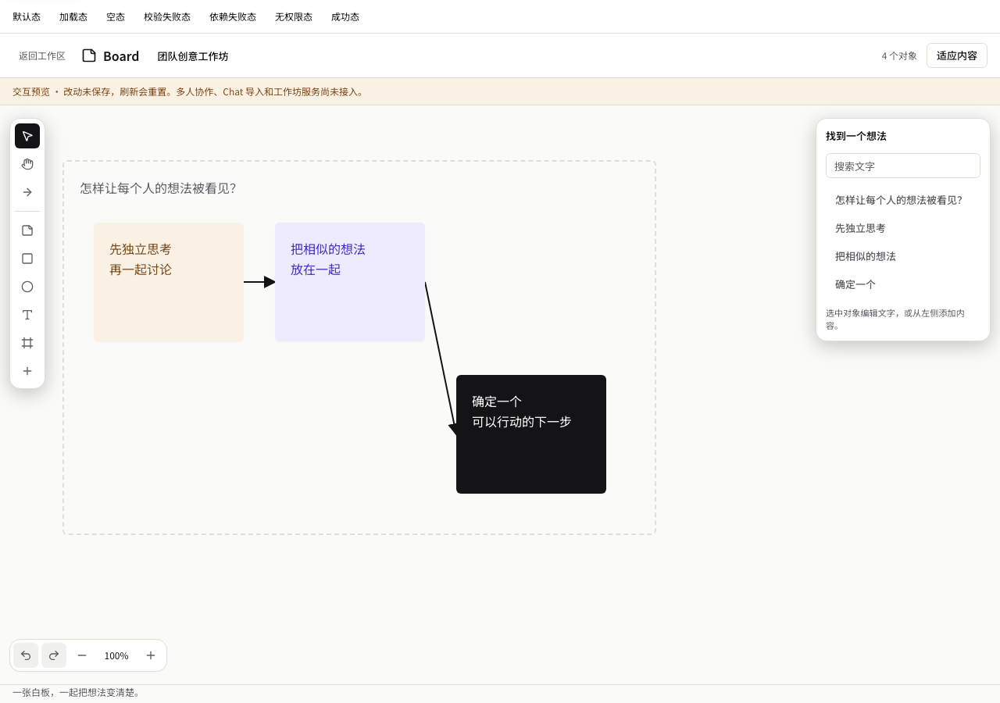
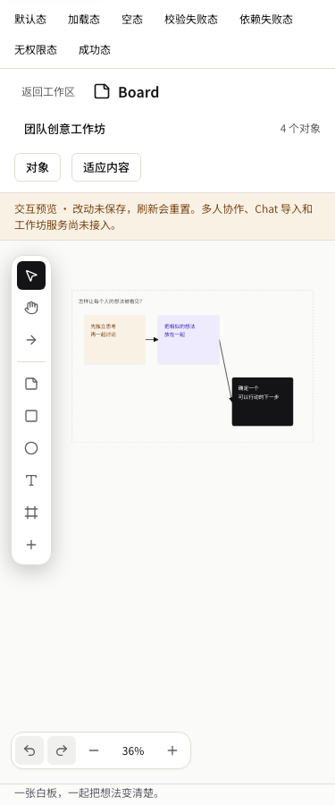

# 第 1 轮：Board 界面审阅材料

状态：待审阅，尚非束级正式签核。第一轮 issue：[#3902](https://github.com/boardx/workspacex/issues/3902)。

## 可运行入口

- 产品入口：Studio 一级 `Board` → `/studio/board`，继承真实 SessionProvider/AppShell 登录行为。
- 开发态审阅：`/preview/whiteboard`，使用同一组件与显式 mock 身份。生产构建返回 404，不能用该入口绕过正式身份系统。
- 预览状态：界面顶部可切换默认/加载/空/校验失败/依赖失败/无权限/成功。
- 内容明确标记“交互预览 · 改动未保存，刷新会重置”，没有假光标、假在线成员或假已保存状态。

## 设计选择

沿用系统字体、黑白灰基础及已有 warning-tint / ai-tint / primary 语义色，以便签内容为主，不添加营销装饰。工具靠左、对象编辑靠右、撤销与缩放靠左下；窄屏先呈现全图、属性按需展开。保留既有 Studio 分组，新增白板入口不改后台画布模板。

## 真实可操作内容

- 创建便签、矩形、圆形、文字及 Frame；选择、拖动，方向键微调。
- 属性区修改文字和语义颜色，删除前确认；删除及其连线可本地撤销。
- 选择连接工具后依次选择两个对象创建连接，移动对象后线端跟随。
- 批量按行创建便签、忽略空行、限制数量；查找文字并定位对象。
- 视口平移、缩放、适应内容；本地撤销/重做。
- 弹窗复用 Radix Dialog，Escape/焦点限制沿用统一组件。

## 证据

[浏览器验证报告](ui-preview/browser-verification.md)包含命令及边界；目前 13 项真实浏览器测试通过，组件/导航 19 项通过，web TypeScript 与定向 ESLint、设计 token、导航可达门通过。

其余状态截图在 `ui-preview/`。这些测试只证明 UI 内存态交互；不能证明 Yjs、服务端授权、持久化、Chat 导入、投票、导出或 Miro 迁移。

## 待确认及未进入的设计面

本轮可审阅菜单位置、画布布局、便签操作、窄屏导航与状态反馈。后端/API 契约、并发冲突处理、Chat 全图型适配尚未物化，不能以批准本 UI 自动视为批准所有后续契约。下一步依据 implementation-plan.md 完成第2轮前置材料和正式束级签核。
