# Interview research-alignment browser acceptance — #4946

## Scope

Test-only follow-up to PR #4931, stacked on `codex/interview-research-alignment-complete` at `54a2841af`. Latest main fetched before development (`2ad776298`); parent PR remains open, so its approved layout is the explicit dependency rather than duplicating it in a second PR. No new worktree or gateway used. No production, API, database, deployment or permission changes.

## Failure and fix

CI run `36881221532`, job `110433164434`, failed two cases in `digital-interview-research-quality.spec.ts`. Local Next + Chromium reproduced both failures before editing:

- Report statistics default collapsed, but the test expected them directly visible.
- Compact research-aligned headings are 24px, but the older prototype assertion required at least 30px.

Updated acceptance clicks the real summary, checks hidden → visible → hidden, and retains expert/completion/finding/action counts, simulated-evidence wording and mobile overflow checks. The six-stage journey keeps navigation, body readability, expert editing and document geometry assertions. It checks readable compact headings and top-right action placement. Heading/action geometry is read in one browser frame, avoiding false failures while expert navigation scrolls smoothly.

These browser cases mock their existing HTTP fixtures; they verify actual frontend rendering/interaction, not live API/DB/model or deployment behavior.

## Verification

- Red: two cases failed with the same assertions as CI (`/private/tmp/interview-e2e-4946-red.log`).
- Browser regression: `pnpm --filter web exec playwright test e2e/digital-interview-research-quality.spec.ts --config playwright.config.ts --grep 'report summary cards|prototype journey' --workers=1 --timeout=240000` → 2 passed (3.4m), exit 0 (`/private/tmp/interview-e2e-4946-browser-final.log`). Covers six routes and desktop/tablet/mobile geometry with actual Next rendering.
- Interview unit suite: 28 files / 202 tests passed (`/private/tmp/interview-e2e-4946-unit.log`).
- Web typecheck and lint passed.
- Full web suite was started with two workers, then stopped to release resources during severe host overload (load >500). It exposed three timeouts in unchanged `tests/ui/chat-read-screen.test.tsx` and eight local crypto-image failures in unchanged `tests/whiteboard/board-content-tools.test.tsx`; no full-suite green claim. Relevant interview unit suite passed independently. Interrupted workers were explicitly identified and released; other tasks were not stopped.
- Read-only independent review found no remaining Critical/Important/Minor findings after improving the geometry snapshot.
- Local cold-route navigation timed out at the default budget under host overload. Final browser command uses an explicit local `--timeout=240000`; CI config/timeouts are unchanged.

## Plan and handoff

```mermaid
flowchart LR
  G([目标：修复验收并提交新 PR]) --> S1[核对失败与基线] --> S2[复现旧断言失败] --> S3[更新交互验收] --> S4[运行浏览器与静态检查] --> S5[提交新 PR]
  classDef todo fill:#e5e7eb,stroke:#6b7280,color:#111827
  classDef doing fill:#fde68a,stroke:#d97706,color:#111827
  classDef done fill:#bbf7d0,stroke:#16a34a,color:#111827
  classDef tested fill:#ddd6fe,stroke:#7c3aed,color:#111827
  classDef blocked fill:#fecaca,stroke:#dc2626,color:#111827
  class G doing
  class S1 done
  class S2 done
  class S3 done
  class S4 tested
  %% evidence S4: Two browser cases, 202 interview tests, typecheck and lint passed; full-suite boundary recorded above
  class S5 doing
```

