# Interview / research layout alignment — #4920

## Scope and progress

User confirmed aligning interview with the existing user-research flow. New branch from freshly fetched main (`d1df49f49`); no new worktree and no gateway used. This is independent of PRs #4782 and #4903.

- Six-step header follows `guided-research-six-step-shell.tsx`: horizontal circle/label, flexible connectors, wrapped mobile steps, no selected gray tile.
- Workbench and document use research width, page padding and unboxed directory/body columns.
- Execution/next-step/revision controls live in the shared step-title action region.
- Duplicate interview hero/progress bar and nonessential introductory copy removed. Durable expert/answer counts remain.
- Report details default closed; mobile directory can collapse. Persisted Markdown, attribution, version protection and export evidence declarations remain intact.
- Running navigation includes planning/editing operations and distinguishes report generation from interview execution.

## Verification

- `./init.sh`: exit 0 (quick dependency/bootstrap path).
- `pnpm --filter web exec vitest run interview --maxWorkers=2 --minWorkers=1`: 28 files / 201 tests passed.
- `pnpm --filter web typecheck`: exit 0.
- `pnpm --filter web lint`: exit 0, including design lint.
- Chromium rendering real components and real application CSS at 1440, 768, 375 px: no horizontal overflow; current step has transparent background; optional report details closed; print media exposes evidence boundary. This is frontend layout evidence, **not** an API/database end-to-end or deployed-version verification.
- Desktop/mobile screenshots: `interview-alignment-4920/report-1440.png`, `interview-alignment-4920/report-375.png`.
- Red/green: new layout assertions failed against the old header/report/runs/intake; mobile-directory assertion failed before the toggle implementation.
- Full web suite initial run: 779/787 files passed; 18 failures, including three subsequently resolved interview assertions. Narrow rerun of other failed modules: 71/79 tests passed; 8 remaining failures in unchanged whiteboard image tests (`SubtleCrypto.digest` rejects a cross-realm BufferSource on this local runtime). Whiteboard source/tests have no diff from origin/main. Full suite is **not claimed green**.

## Deployment / handoff

PR #4903 merged, but main Actions run `36859691814` has a failed deploy job (`110364988261`). Its trusted server copies of `workspacex-deploy` and `workspacex-deploy-readiness.sh` differ from repository scripts. The fail-closed gate must stay intact; this change does not touch deployment scripts.

Live DNS resolves devapp.boardx.us to 47.77.215.155. Read-only SSH with the available default key was rejected (`Permission denied (publickey)`). No remote files or deployment state were changed. Await a valid authorized maintenance connection to synchronize trusted copies and rerun normal CD, then verify the actual devapp browser. A successful PR check is not proof of deployment.

```mermaid
flowchart LR
  A[最新 main 与部署诊断] --> B[研究布局对照]
  B --> C[实现与浏览器验证]
  C --> D[新 PR 与 CI]
  D --> E[部署及线上核验]
  classDef todo fill:#e5e7eb,stroke:#6b7280,color:#111827
  classDef doing fill:#fde68a,stroke:#d97706,color:#111827
  classDef done fill:#bbf7d0,stroke:#16a34a,color:#111827
  classDef tested fill:#ddd6fe,stroke:#7c3aed,color:#111827
  classDef blocked fill:#fecaca,stroke:#dc2626,color:#111827
  class A done;
  class C tested
  %% evidence C: 201 interview tests, typecheck, lint and Chromium 1440/768/375 pass
  class B tested
  %% evidence B: Reference source compared with screenshots and actual Chromium rendering
  class D doing;
  class E blocked
  %% blocked E: Devapp trusted scripts drift; available SSH key rejected; need authorized maintenance connection
```

No phase status was changed; deployment is not complete. No Docker stack was started in this session. Temporary Vite preview must be stopped after visual verification.
