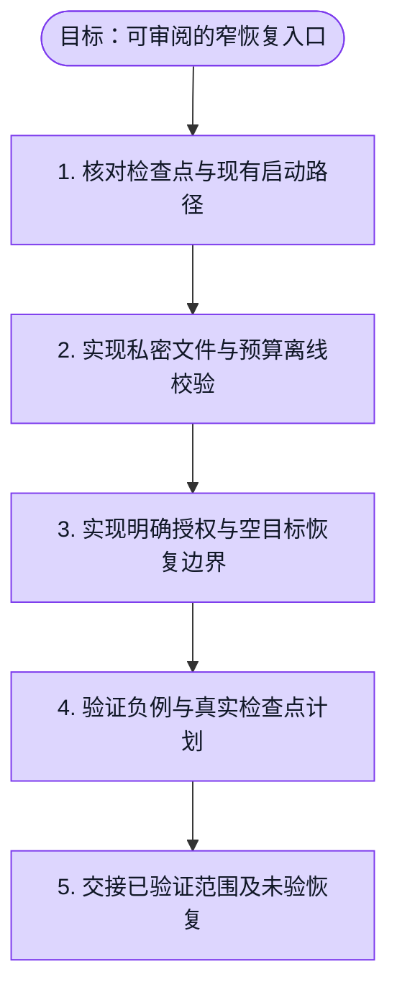

# 执行计划 — 私有检查点恢复入口

目标：为已验证的唯一 Stack04 私有检查点提供默认离线计划和严格受理边界，保留既有组、版本、原件、凭据与预算。当前不启动资源、不恢复数据库、不发供应商请求；实际恢复能力和启动接线分开验收。

```mermaid
flowchart TD
  G([目标：可审阅的窄恢复入口])
  S1[1. 核对检查点与现有启动路径]
  S2[2. 实现私密文件与预算离线校验]
  S3[3. 实现明确授权与空目标恢复边界]
  S4[4. 验证负例与真实检查点计划]
  S5[5. 交接已验证范围及未验恢复]
  G --> S1 --> S2 --> S3 --> S4 --> S5
  classDef todo fill:#e5e7eb,stroke:#6b7280,color:#111827
  classDef doing fill:#fde68a,stroke:#d97706,color:#111827
  classDef done fill:#bbf7d0,stroke:#16a34a,color:#111827
  classDef tested fill:#ddd6fe,stroke:#7c3aed,color:#111827
  classDef blocked fill:#fecaca,stroke:#dc2626,color:#111827
  class G tested
  %% evidence G: Actual zero-model recovery, normal Web login/readback and complete owner cleanup verified
  class S1 tested
  %% evidence S1: Existing startup resetOrgs path inspected; prior checkpoint receipt verified
  class S2 tested
  %% evidence S2: 45 combined configuration and restore guards pass; private plan02 actual checkpoint verified without resource startup
  class S3 tested
  %% evidence S3: Actual fresh owned restore and receipt-gated standard startup; checkpoint-restore-normal-readback.json
  class S4 tested
  %% evidence S4: 45 unit guards and actual normal Web login/S1V2 S2V5/four originals/unchanged finance and thread set verified
  class S5 tested
  %% evidence S5: Normal owner cleanup exit0; exact ports/lease/slot/containers0, immutable checkpoint/budgets preserved; plan03 offline prepared
```

进度：已核对现有 e2e-up 无条件 resetOrgs；恢复入口不得调用该种子。Root 已授权离线准备，未授权此时实际 --apply。
