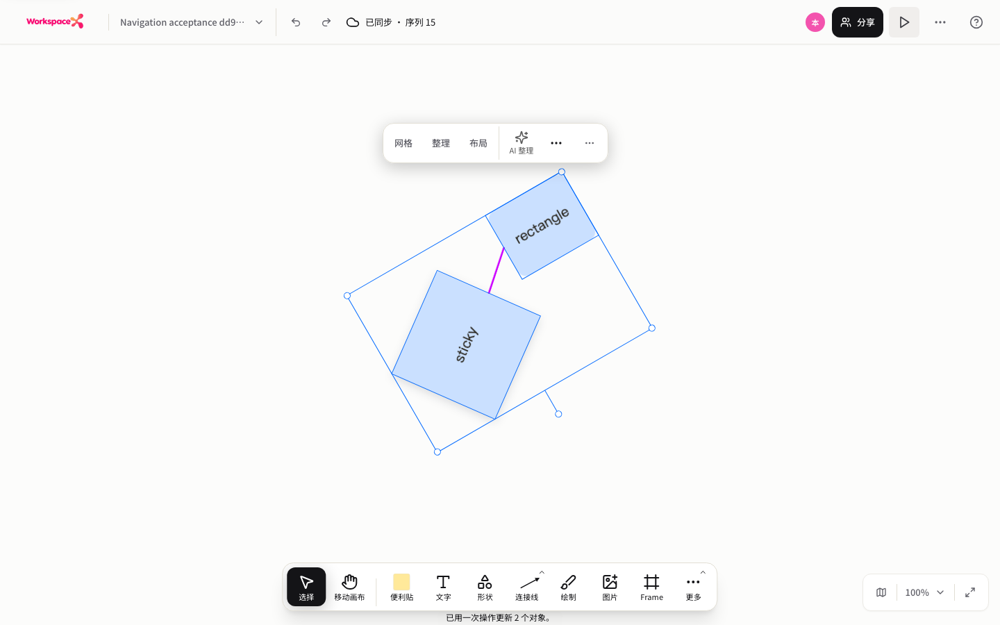
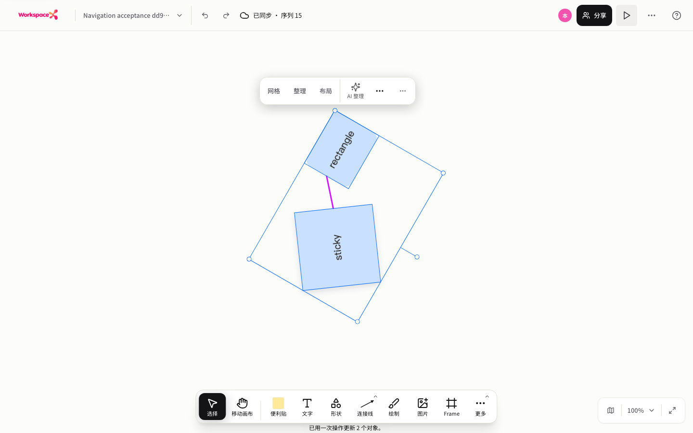
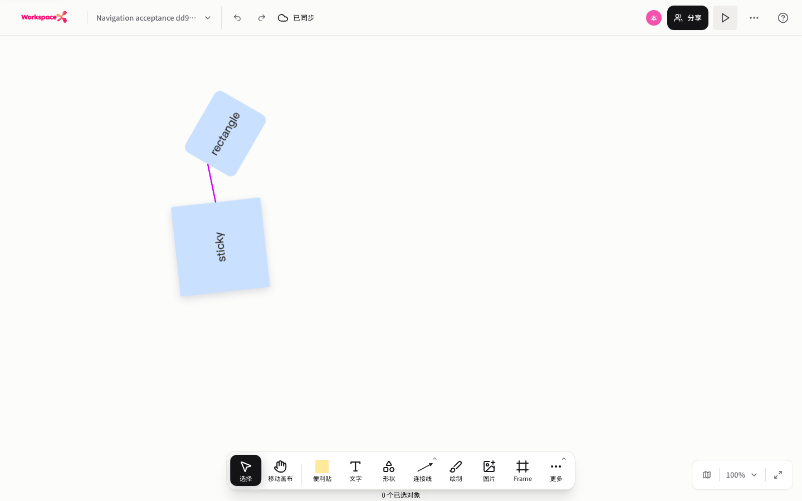
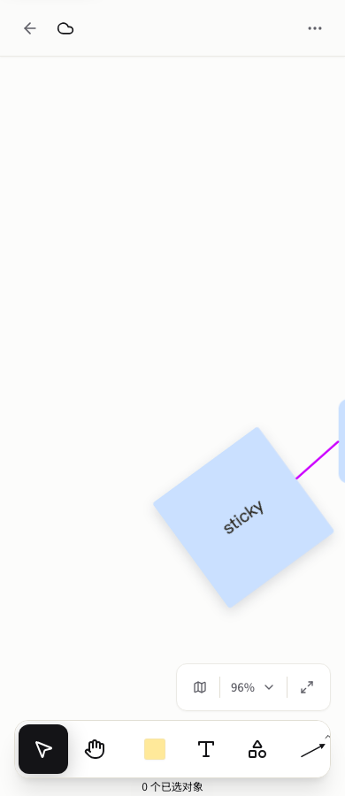
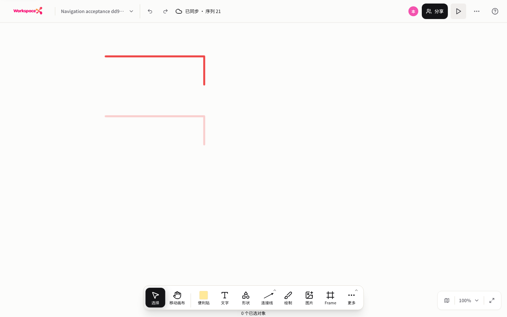

# Round 01: Board navigation and live transforms

Refs #4858. This is software acceptance, not native-device acceptance or a completed ten-round backlog.

Accepted source: `48a96cbe2e68f49167b9da54a4d9d44fd0c80b28`.
Stack dependency: PR #4965, source `18bbaa14529cf84600f64d9fa52dedfa0043d8ed`.
The later evidence-only commit does not change the accepted runtime source.

## Verification

- Fresh full web lint and typecheck: exit 0.
- Fresh UI/whiteboard suite: 629 files passed; 5113 tests passed, 5 existing unrelated skips, 0 failures.
- Browser Run16: 21/21 passed, no browser errors or HTTP failures; desktop 1440 and narrow 390 viewports.
- All 32 attested source hashes match before/after both runs and the accepted Git source.
- Real held gestures: no canonical writes while held, one write on release; handles, menu and attached lines follow.
- Multi-rotation: independent entity and frame pixel checks at 0, -30 and -60 degrees; menu position tolerance at most 1px. One-step undo, redo and reload preserve geometry.
- Drawing-only erasure: multiple transformed drawings, locked/non-drawing protection, one transaction and one undo.
- API rate limits remained enabled. Runner dispatch pacing was at least 1000ms; HTTP 429 was a hard failure, not ignored or retried.
- Owned test board was archived/deleted after exact owner/title checks and fresh GET returned 404. Owned runtime stopped; no Docker used.
- Standard `RUN_INFRA=0 RUN_START_COMMAND=0 ./init.sh` passed. This is not `init.sh --full`; the full UI suite was run separately.

The sanitized machine summary, hashes, UTC intervals and aggregate counts are in [evidence.json](evidence.json). The browser case report is [browser-report.md](browser-report.md). Raw logs and full runner reports remain local temporary evidence, not public credentials or session state.

Full test command:

```sh
pnpm --filter web exec vitest run tests/ui tests/whiteboard --maxWorkers=1 --no-file-parallelism --no-cache --reporter=default --reporter=json --outputFile=/private/tmp/wsx-r01-full-ui-whiteboard-run6-20261002.json
```

## Screenshots







## Boundaries And Remaining Work

Native Mac trackpad/pinch, OS blur/touch/IME, Firefox/WebKit and multi-user conflict behavior are not accepted by this matrix. Blur cancellation here is synthetic.

Attached-line fixtures have no arrowhead to avoid legitimate entity-pixel occlusion. Connector arrowhead styles remain Round 02 work. Pen 100% and Highlighter 25% were explicitly configured through the real UI; Highlighter defaults and compact Draw UI remain Round 05 #4969 work. Frame visibility and single-shot menus remain Round 04 work.

Earlier failed runs are retained locally, not rewritten as passes. They found real sticky geometry, Fabric selection/projection, fixed-pivot rotation and rotated menu-bounds bugs. Other failures exposed fixture/oracle defects and legitimate arrowhead occlusion. Run10 was aborted because the source freeze was invalidated; it is not evidence of a production crash.

This is a Draft stacked PR. Parent #4965 has unresolved CI failures in Journeys and Visual at publication time. Neither issue closure, main merge, CI-green delivery nor harness passing is claimed.
