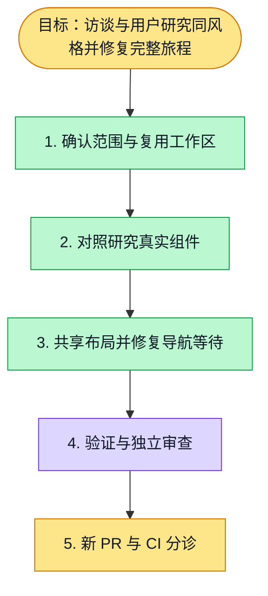

# Interview / research shared workspace styling (#5018)

Base: d19128e17032dade2bf00dd6e6828f5eb7911a4a.
Branch: codex/interview-shared-research-style.

Presentation is shared between the real research and interview components: workspace width, header, inline timeline, step indicator, connectors, main content and report columns. Navigation, confirmations, versioning and evidence semantics remain owned by each workflow. No gateway, deployment or merge was performed.

## Verification

- Red: new shared running-step test failed against the original research indicator.
- `pnpm --filter web exec vitest run interview guided-research-reference-layout research-interview-style --maxWorkers=2 --minWorkers=1`: 30 files / 223 tests passed.
- Final focused rerun: 3 files / 27 tests passed.
- `pnpm --filter web lint`: passed.
- `pnpm --filter web typecheck`: passed after rebuilding stale local fabric-markdown declarations and avoiding concurrent Next generated-type writes.
- Browser direct route / timeline and two report tests: 3 passed. Real Chromium and Next; API fixtures, not production API / database evidence.
- Independent review: no findings; `git diff --check` passed.

## Unverified boundaries

The original prototype journey failed at list-to-intake navigation with the default 5s URL assertion. Diagnostic trace showed the correct anchor target and the intake RSC request still pending at failure, without a pageerror. The fix preserves the real click, exact URL, workbench rendering and all six-stage / responsive assertions, while giving this navigation a bounded 60s budget. The full journey then passed in 3.1m (1440/1280 desktop, 768 tablet, 390 phone checks). Its own total timeout is explicitly 300s; no global timeout is changed. Final rerun without CLI timeout overrides passed in 1.3m, command: `pnpm --filter web exec playwright test e2e/digital-interview-research-quality.spec.ts --config playwright.config.ts --grep 'prototype journey' --workers=1`.

Screenshots in `docs/evidence/interview-density/`: analysis-1280, report-1280, report-1280-end, report-390, report-390-table and report-390-end were regenerated by this passing journey. The unrelated list screenshot was restored. Desktop and mobile report captures were visually inspected.

The additional full web test run was stopped after discovering failures in whiteboard board-content tools (8), knowledge list/graph (1) and blueprint tests (2). Knowledge passed when rerun alone (27 tests); blueprint subprocesses reported sandbox IPC listen EPERM. Whiteboard failures have not been proven baseline or resolved. This is not a green full-regression result. The user explicitly requested fixing the journey and submitting it together with the layout changes; unrelated modules remain outside the deliverable. No full-suite success is claimed.

## Execution plan

