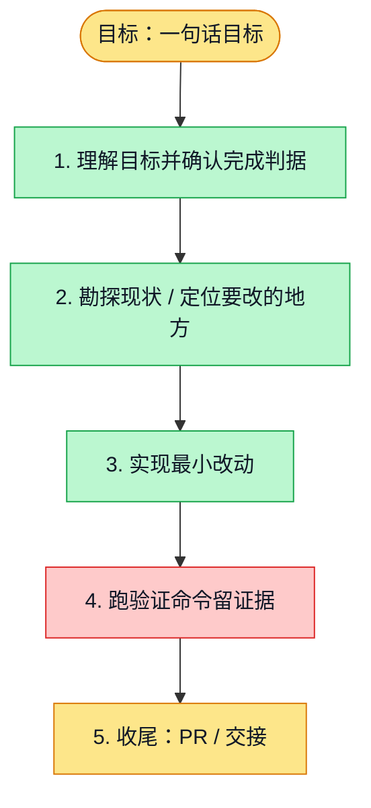

# 执行计划 — 组织首页与 Logo 主题配置（Refs #4881）

> 规范：`.harness/instructions/execution-plan-visualization.md`。
> 改状态用 `node .harness/scripts/execution-plan.mjs set <本文件> <节点> <状态>`，
> 改完 `check` 一遍；不要手改 classDef 颜色。

## 我理解的目标
- **目标**：更新组织首页与后台配置，Logo 上传自动生成主题颜色
- **完成判据**：取色、编辑、预览、保存、首页消费通过验证
- **不做什么**：保留既有组织头像与权限接口，使用真实个人工作数据
- **假设与待确认**：配色作用域为组织首页；语义状态色保持可辨识

## 执行计划

图例：⬜ 灰=未开始 · 🟨 黄=已开始 · 🟩 绿=已完成 · 🟪 紫=已测试（有证据） · 🟥 红=被堵塞

## 进度日志（append-only，每次改颜色追加一行）
| 时间 | 节点 | 状态变化 | 依据（命令 / 证据 / 堵塞原因） |
|---|---|---|---|
| 2026-10-01 | G, S1 | todo → doing | 接到目标，开始理解 |
