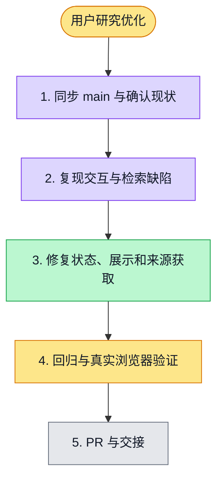

# 执行计划 — 用户研究执行与资料获取优化 #4897

> 规范：`.harness/instructions/execution-plan-visualization.md`。
> 改状态用 `node .harness/scripts/execution-plan.mjs set <本文件> <节点> <状态>`，
> 改完 `check` 一遍；不要手改 classDef 颜色。

## 我理解的目标
- 目标：落实用户交办的 7 项研究流程优化，执行状态清晰、步骤浏览不打断任务、资料获取保留有效结果、报告展示精简、补足相关来源。
- 完成判据：受影响 UI/API 测试、类型检查、lint、初始化检查；浏览器/API/隔离数据库全链路验证。
- 范围：guided research UI、检索适配与章节补搜；保留证据、来源排除与报告引用校验。
- 接入：用户指定 coord-deep-research，并明确授权本次跳过不可达网关；复用当前 worktree，已 fetch 最新 main。

## 执行计划

图例：⬜ 灰=未开始 · 🟨 黄=已开始 · 🟩 绿=已完成 · 🟪 紫=已测试（有证据） · 🟥 红=被堵塞

## 进度日志（append-only，每次改颜色追加一行）
| 时间 | 节点 | 状态变化 | 依据（命令 / 证据 / 堵塞原因） |
|---|---|---|---|
| 2026-10-01 | G, S1 | todo → doing | 接到目标，开始理解 |

## 验证记录

- `./init.sh`：修改后重新运行，退出 0。
- Web/API `typecheck`：退出 0；Web 受影响组件 ESLint 与 API 官方 `lint`：退出 0。
- API 隔离回归：7 文件 / 155 测试通过（检索适配、编排、正文读取、查询恢复、相关性筛选、报告证据与章节）。
- Web guided research 回归：27 文件 / 232 测试；旧质量文案断言调整后，对应测试及最终受影响 6 文件 / 54 测试全部通过。覆盖执行中步骤浏览、POST/轮询结束保持页面、助手失败恢复、旧计划隐藏、报告生成状态与历史提示隐藏。
- 公开搜索端点只读实测：返回 `results` 10 条，空摘要 0 条；旧适配器只保留 5 条。
- 独立代码 review：两项 P2 已复现修复，复审无新增问题。
- 浏览器全链路：正在运行官方 seeded 配置的单条 guided-research-runtime；回环模型、真实 API 与隔离 PostgreSQL，不代表真实外部模型。

## 未验证边界

本次未部署生产环境；没有生产报错会话的运行日志，因此资料错误修复对应已复现的空摘要整批失败，不声称排除了所有外部检索故障。
