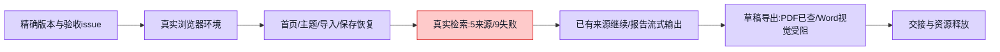

# PR #5020 用户研究真实浏览器验收

验收 issue：https://github.com/boardx/workspacex/issues/5056

测试代码为拉取后的 main `6f76967db950f217f6155c62c3c33290ca5eb23c` 的独立 archive snapshot；包含 #5020 合并提交 `09f5f71bbad29cf6309956244a1f8bda65d1cb5d`（ancestor 检查成功）。没有修改共享分支、创建 worktree、修复产品代码、创建 PR 或标 passing。验收尚未全通过。

## 环境与证据边界

- 真实 Next 浏览器、API、独立 PostgreSQL/Redis/MinIO；数据库与端口见 `runtime.json`。复用已安装依赖，业务代码来自上述 exact SHA。
- 真实远程模型 `qwen3.7-plus`，实际模型调用记录见运行时 JSON；实际远程搜索为默认 `web-search.boardx.us`，正文读取来自真实来源网站。没有使用回环模型或伪造报告。
- 唯一故障注入：IAB CDP 的浏览器断网，用于主题保存失败/重试；已恢复在线。该结果不代表真实模型或检索服务故障性能。
- IAB 文本输入有效，后续多种按钮交互无效；换新标签页亦未恢复。原生 Chrome 的新专用标签页成功切换排序、导航和打开助手，故不把 IAB 点击异常归为产品缺陷。未覆盖其他标签页已有输入。
- 控制平面 gateway 返回 403（包括公开时间端点），本次未取得 authenticated lease，也未假称 tick/心跳成功；按既有直接验收授权执行。

## 逐项结果

| 路径 | 结果 | 实际证据与边界 |
|---|---|---|
| 空研究首页 | PASS | `01-home.png`，0 项、新建入口可见 |
| 首页搜索/空筛选/清除 | PASS | `09-home-search-empty.png`；无匹配提示，清除恢复列表 |
| 标题、标签编辑与组合筛选 | PASS | 重命名为“验收5056数字阅读”，新增“公开资料”，标签+进行中+数字阅读匹配；`10-home-combined-filter.png` |
| 首页排序 | PASS | 原生 Chrome 切换“最近更新”→“最早更新”；`21-home-sort-oldest.png` |
| 文本创建与错误保留 | FAIL | 123 字需求立即创建失败，输入保留，重复失败；Network 无创建 POST；`02`/`03`；独立缺陷 https://github.com/boardx/workspacex/issues/5057 |
| 短文本需求创建 | PASS | 63 字合成需求成功，远程模型生成主题和研究计划 |
| TXT 文件导入 | PASS | 合成 `import-demand.txt` 通过实际文件选择器导入，48 字显示并成功创建第二研究；`15-file-import.png` |
| 主题有效编辑自动保存 | PASS | 主题、目标、用户需求关注项；待保存→已保存，保持主题页；`04-topic-autosaved.png` |
| 主题刷新恢复 | PASS | 刷新后字段、关注项与主题步骤保留；`05-topic-refresh.png` |
| 自动保存断网恢复 | PASS（受控注入） | 保存失败提示“输入已保留”，保留字段，下一步禁用；恢复网络点击重试成功，保持主题页；`17`/`18` |
| 计划生成与编辑 | PASS（实际呈现） | 远程生成 4 个计划条目，编辑首章标题，确认影响提示后保存；`07-plan-edited.png`。实际为可编辑条目列表，未看到 Markdown 全文编辑器 |
| 后台生成不强制跳页 | PASS（已观察窗口） | 计划生成期间查看主题，生成结束仍停主题；`06`。报告生成期间查看主题，停留至主动点击报告；`25`。未把尚未观察到的报告终态自动跳转行为计为通过 |
| 真实检索渐进来源与刷新 | PASS | 检索运行中先见 1 来源，后 5 来源；刷新恢复；`13`/`19`，DB 补证 `14`/`20` |
| 真实检索完整成功 | FAIL | 11 任务中 2 成功、9 失败；真实空结果/相关性校验/模型与搜索不可用，不是注入；`22-real-partial-failure.png` |
| 部分检索失败展示与保留 | PASS | 展开 9 项失败原因，已有 5 来源保留，提供重试/已有来源继续；`22` |
| 基于已有来源继续 | PASS | 实际点击后进入 4 章章节页，随后报告开始生成；`23`/`24` |
| 仅失败任务重试 | 未完成 | 已见按钮；尚未执行并核对成功来源不会重放。后续原生 Chrome 当前页面已变为用户页面，未接管；IAB 点击故障仍存在 |
| 暂停/恢复、来源排除/删除 | 未验证 | 当前资料列表未见对应直接按钮；不能据静态 API 或注释声称 UI 通过 |
| 报告章节页 | 部分通过 | 4 章及小章节显示正确，编辑/增删/上下移按钮可见；未完整操作这些编辑路径 |
| 报告实时正文 | PASS | 真实模型正文渐进显示，目录与引用链接显示；`26-report-streaming.png` |
| 报告刷新与流式恢复 | PASS | `27-report-refresh-restored.png`，刷新后恢复检查点和正文 |
| 已保存章节计数实时更新 | FAIL | UI 保持 2/4，后端已经保存更多章节；刷新变为 4/4，仍在生成。`30`/`31`；独立缺陷 https://github.com/boardx/workspacex/issues/5068 |
| 轻量进度响应 | PASS（实测响应） | 实际浏览器响应 2854 字节，不含 rawText/document/来源正文；`28-lightweight-progress.json` |
| 正式报告完成与质量门 | BLOCKED | 实际终态 `busy=false, report=null, reportDraft!=null, reportPartial=true, completed=false`；publicationReadiness limited，核心问题覆盖不足；`32`/`35`/`36`。草稿可读，不等于正式报告完成 |
| Word 实际下载与正文 | PASS（结构检查） | UI 下载完成 `33`；`research-draft.docx` 19875 字节，OOXML 包含中文、四章正文与未验证说明 |
| Word 视觉版式 | BLOCKED（验收工具） | 配套 renderer 缺少中文字体，6 页渲染中文字形为空但文本提取存在；两次渲染分别见 `word-render/` 与 `word-render-cjk/`。不能据此认定产品导出丢中文，也不能判视觉通过 |
| PDF 实际导出与版式 | PASS（草稿） | 原生打印预览 `34`，实际 `research-draft.pdf` 748075 字节、8 页；`pdf-page-1.png` 至 `pdf-page-8.png` 全部逐页检查，中文清晰，无观察到重叠/裁切 |
| 导出引用追溯 | 未达到可追溯导出 | 两种实际导出均无参考来源列表、无外部引用超链接。当前导出实现明确删除引用；未找到要求保留引用的签核依据，记录事实，不另造缺陷或宣称保留了引用 |
| 真实录音/其他文件类型 | 未验证 | 没有采集人类音频，TXT 结果不外推到所有格式 |

## 实测时间与质量边界

主研究 `grs_84c272eb9f8d4280be38624b8c6b890d`；文件导入/断网研究 `grs_228e134d5fa44b40b408a2e611919168`。

检索开始持久时间为 `2026-10-02T10:29:28.019Z`；第一来源 `retrievedAt=10:33:56.724Z`，约 4 分 29 秒。后续四来源为 `10:41:05.559Z`。首次真实检索整体历经约 23 分钟才出现部分失败终态。这里是单次真实环境观察，没有前后性能基线，也没有把提供方长尾失败包装成性能已通过。

来源包括广州市智慧城市规划、老年数字鸿沟文章与会议资料；其中一些是背景证据，不能据有 URL 就认定已经回答公共图书馆具体问题。报告实际生成时间为 `10:52:58.745Z` 至 `11:08:51.547Z`，约 15 分 53 秒。证据整理有 8 次尝试并产生引用校验警告；章节 1/3/4 质量不足，章节 2 通过。最终仅保存有限草稿，正文明确包含证据缺口与未验证说明。测试需求包含“验收5056”，部分补充查询也带此前缀，因此本次检索结果不能外推为所有主题质量或性能结论。

## 收尾与交接

已保存最终运行时、请求与质量状态 `35-final-runtime.jsonl`、`36-final-quality.json`。只对实时核对父子关系后的本会话 launcher 子树发 SIGTERM（`37-cleanup-processes.json`）；包装器退出码 0，清理约 2 秒。本次 `wsx-21f8237bf23f1737706f` 容器已不存在，API 24139/Web 25139 已关闭，专属 volume 清理另见 `38-cleanup.txt`。三个本次 IAB 标签页已关闭，断网注入已恢复在线；未操作用户当前 Chrome 页面、问卷栈或共享开发库。

验收 issue #5056 保持打开，未标 passing。后续先修复 #5057 与 #5068，再按新 exact SHA 复验；另需实际执行失败任务重试、章节编辑操作、确认来源治理 UI 路径，并在具备中文字体的工具里检查 Word。正式报告必须真实通过质量门后再补完成证据。

