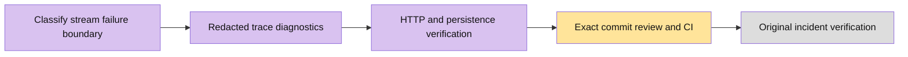

# Research stream diagnostics — issue #5239

The reported SSE `RESEARCH_WORKFLOW_UNAVAILABLE` has no verified original exception or deployment SHA. This change improves diagnosis and corrects misleading UI wording; it does not establish or fix the original incident's root cause.

Runtime failures record the HTTP trace ID, command identity, execution phase and bounded safe exception classifications. They omit exception messages, stacks, provider bodies and research content. Existing error codes, persistence and recovery behavior remain unchanged. Diagnostic recorder failures cannot replace the runtime error.

Validation on 2026-10-03:
- Research unit suite: 10 files, 240 tests passed, including nine diagnostic cases covering state read, authorization, claim, steer, execution, final persistence, recorder failure and unsafe/cyclic causes.
- Real PostgreSQL and authenticated HTTP runtime suite: 47 tests passed. Three injected failure paths correlate response `x-trace-id` to diagnostic events and retain persisted sources/checkpoints.
- Research UI suite: 19 tests passed, including neutral workflow failure wording and existing recovery behavior.
- `git diff --check`: passed.

The HTTP suite used isolated synthetic sessions and controlled providers. No report command was sent to the affected user's session. Earlier browser evidence for the original four fixes lives on local validation branch `codex/research-four-validation-ci`; it does not verify this new incident's failure path in a browser.

