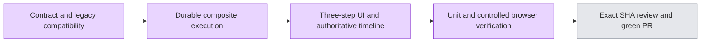

# Research three-step workflow (#5349)

The visible flow is 确认研究内容 → 研究计划 → 生成报告. The existing five-node runtime remains the durable authority. New prepare_plan and generate_report commands execute inside one claimed operation, retain checkpoints, and require explicit retry after failure. Legacy routes and optional executionGoal remain backward compatible. No interview/survey/transcription changes.

Validation (actual exit 0): API research pure 15 files/406 tests; web scoped regression 37 files/357 tests; API typecheck/lint; web typecheck and scoped lint; init.sh quick baseline; diff-check. Regression assertions cover claim/idempotency, full-scope search failures, checkpoint retries, report quality gates, late SSE/version isolation, compound plan terminal polling, and cross-session chapter-editor state.

Browser evidence uses actual Chrome and production web/runtime code with a controlled HTTP fixture. Memory store, auth, model output, search and source reads are synthetic; this is **not** PG/real-auth/provider or report quality/performance acceptance. Verified submit→editable plan→report; desktop/390px navigation; completed report refresh does not issue another command or model call (commands 2/model 17 unchanged); legacy link read does not replay; search failure blocks completion; explicit retry completes; regeneration clears old chapter/synthesis completion; pause→refresh→explicit resume completes. The synthetic fixture is not evaluated for user-requested report language/title fidelity. No live-provider latency claim is made.

Local screenshot/log archive: /Users/shenyangjun/.codex/evidence-archives/research-5349-20261005. Existing list-crash issue #5347 remains separate; restored page is not proof of deployment/cache root cause. No merge or deployment performed.
